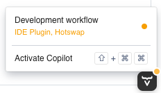
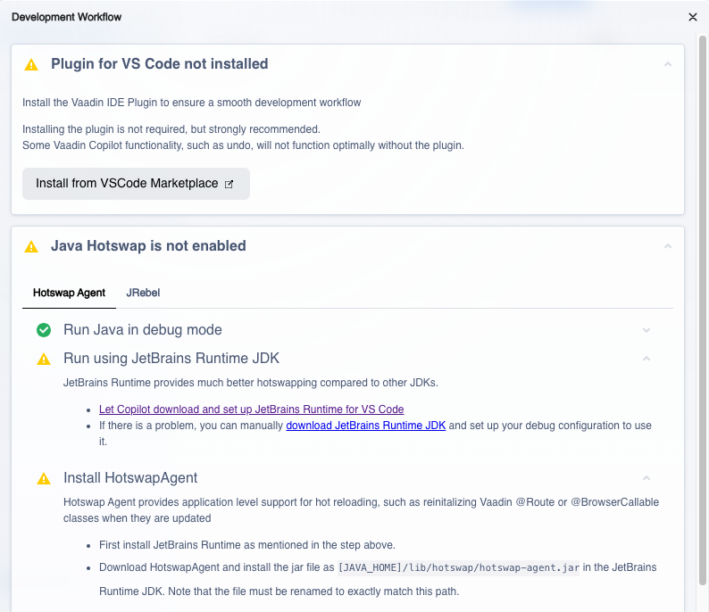
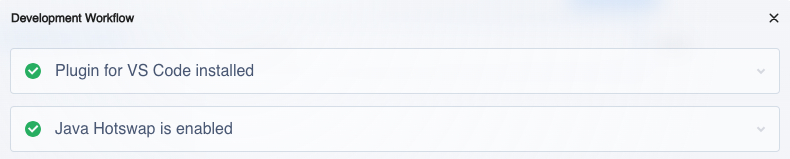

= Visual Studio Code

You can run and debug your Vaadin application in Visual Studio Code as you would any other Java application. Open the main `Application` class. Then select either *Run Java* or *Debug Java* in the upper-right corner indicated by a red circle in this screenshot:

image::images/vscode-run.png[Run Java button in VS Code]

The application starts up and you'll be able to access it at http://localhost:8080. Hot deploy of the frontend files is enabled automatically. However, to enable Java hotswap, you have to take some additional actions.

== Enabling Hotswap Using Vaadin Copilot

The easiest way of enabling hotswap is to use Vaadin Copilot. Start your application, open it in a browser and move your mouse pointer over the *Copilot* button at the bottom-right corner:

[IMPORTANT]
The Copilot button is only available when the application is running in development mode. It is not available in <<../build#,production mode>>.
 
Now click *Development workflow*. Your browser should look something like this:

Copilot guides you through the steps needed to optimize your development workflow. This includes installing the Visual Studio Code extension and setting up hotswap.

When you have completed all the steps, you can verify that everything is working. Start your application with hotswap enabled, and open it in a browser. Then select menu:Copilot[Development workflow] again. All the checkmarks should be green:

== Enabling Hotswap Manually

To manually enable hotswap support for a Vaadin application in Visual Studio Code, complete the following steps:

1. Install JetBrains Runtime (JBR)
2. Install HotswapAgent into JBR
3. Configure VS Code to launch your application with JBR and HotswapAgent

===  Install JetBrains Runtime

Download the latest _JetBrains Runtime with JCEF_ for your platform from the https://github.com/JetBrains/JetBrainsRuntime/releases[JetBrainsRuntime GitHub Releases] page. Choose a variant appropriate for your system (e.g., osx-aarch64, linux-x64, windows-x64):

* On macOS, use the `.pkg` installer, which installs JBR under:
`/Library/Java/JavaVirtualMachines/jbr_jcef-[version and platform]/Contents/Home`
* On Windows and Linux, download and extract the `.zip` or `.tar.gz` archive to a suitable location.

[NOTE]
The extracted directory contains a custom JVM with executables like `java` and `javac` inside the `bin/` folder. This is the JVM you'll use to run your application.

===  Install HotswapAgent

Download HotswapAgent (version 1.4.2 or later) from the https://github.com/HotswapProjects/HotswapAgent/releases[HotswapAgent GitHub Releases] page. Install it like this:

1. Create a subdirectory inside the JetBrains Runtime folder: `[JBR]/lib/hotswap/`
2. Rename the downloaded `.jar` file to `hotswap-agent.jar` and place it in that directory: `[JBR]/lib/hotswap/hotswap-agent.jar`

.More info
[NOTE]
Visit https://hotswapagent.org/[hotswapagent.org] for details about supported features and integrations.

=== Launch Configuration

Create a `.vscode/launch.json` file in the root of your Java project with the following contents:

[source,json]
----
{
    "version": "0.2.0",
    "configurations": [
        {
            "type": "java",
            "name": "Application",
            "request": "launch",
            "mainClass": "com.example.application.Application", // <1>
            "projectName": "my-application", // <2>
            "javaExec": "/path/to/jetbrains-runtime/bin/java", // <3>
            "vmArgs": "-XX:+AllowEnhancedClassRedefinition -XX:+ClassUnloading -XX:HotswapAgent=fatjar"
        }
    ]
}
----
<1> Replace with the fully-qualified name of your main class.
<2> Replace with your project's name.
<3> Replace with the path to your JetBrains Runtime `java` executable.

With the launch configuration in place, you can now start the application from the *Run and Debug* tab in Visual Studio Code. Open the application in a browser and verify that everything is working through menu:Copilot[Development Workflow].
