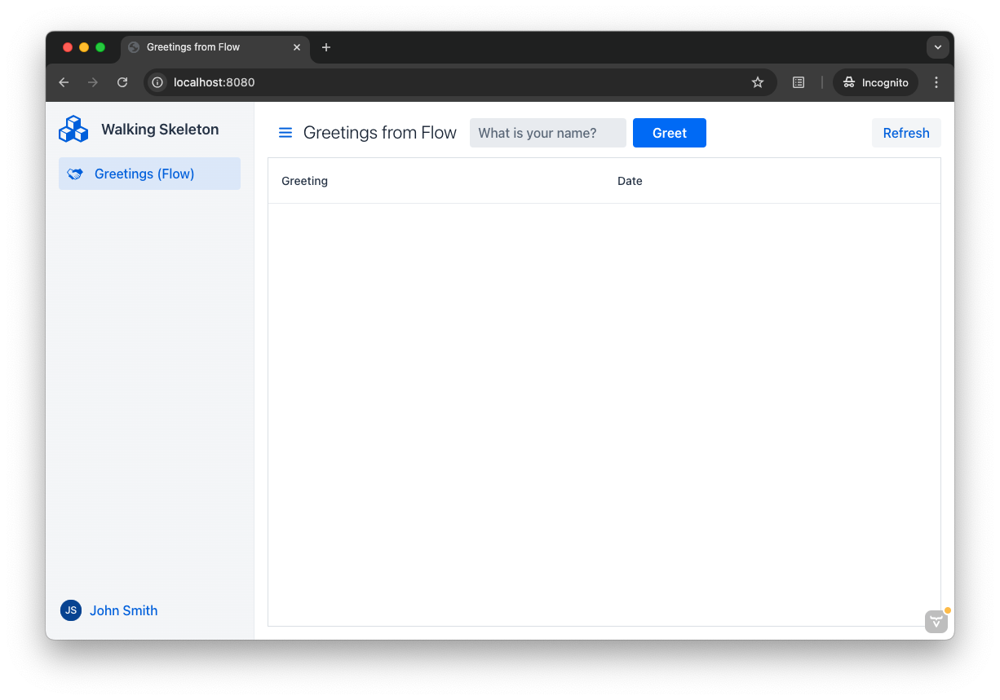

// TODO Replace with link to start.vaadin.com as soon as you can generate a skeleton from there.
:skeleton-generator-url: https://v-herd.eu/walking-skeleton-generator/

= Start a Project

The easiest way of starting a new Vaadin project is to generate a *walking skeleton* at link:https://start.vaadin.com[start.vaadin.com].

A walking skeleton is a minimal application that includes a fully-functional end-to-end workflow. All major building blocks are included, allowing you to run the application, but it does not yet perform any meaningful tasks. You then build your application by "adding muscles to the bones".

You'll get a <<walk-through#,walk-through>> of the Vaadin walking skeleton later.

== Generate a Skeleton

{skeleton-generator-url}[Open Skeleton Generator, role="button primary water"]

The generator asks you for some basic information, like the Maven `groupId` and `artifactId`, and the base Java package. The fields are pre-filled with sensible defaults, so you don't have to change anything unless you want to.

It also allows you to choose whether to use *Flow* or *React* for the user interface. Pick Flow if you want to implement your user interface in Java, and React if you want to implement it in React and TypeScript. Don't worry if you are unsure which one to pick. You can change it later.

Click the [guibutton]*Download Project* button to download a zip-file with your new project.

== Try It

Once you have downloaded your new project, unzip it into a directory of your choice. Then start the application by running the following command:

[source,terminal]
----
./mvnw spring-boot:run
----

It takes some time for the application to start for the first time, depending on how many dependencies Maven and npm have to download. When everything is ready, you can access the application at: http://localhost:8080

It should look like this:

Enter a name into the field and click the [guibutton]*Greet* button. The greeting shows up in the grid. Now enter the word `fail` and click the button. This triggers an exception that gets handled by the error handler, and pops up an error notification.

Stop the application by pressing Ctrl-C.
