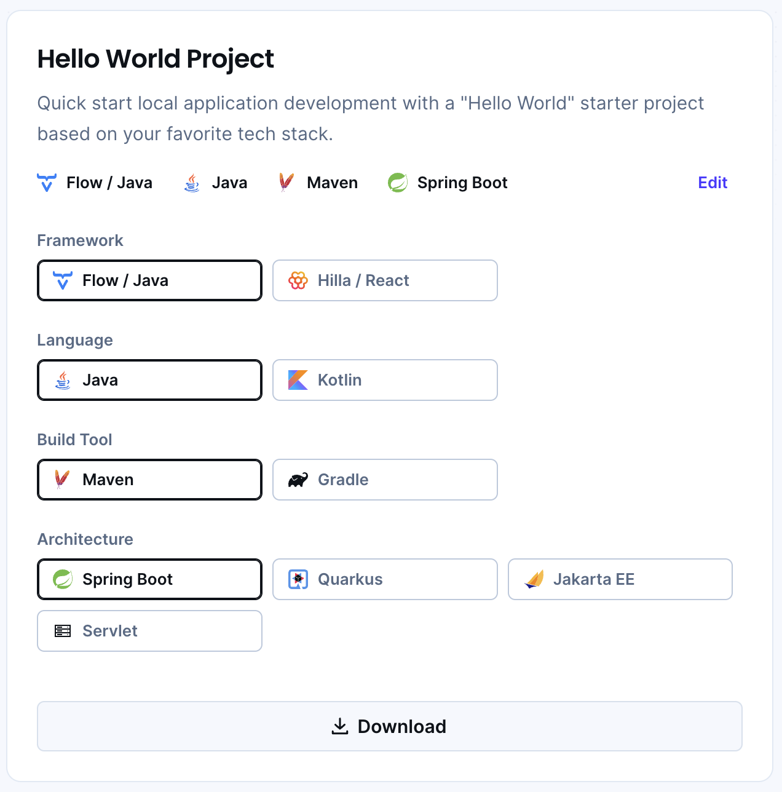

= Alternative Ways of Starting a Vaadin Project

Although the <<..#,Walking Skeleton Generator>> is the recommended way to start new Vaadin projects, there are other options available. This page explores alternative methods for setting up a Vaadin project.

== Non-Spring Boot Starters

Projects created via https://start.vaadin.com[Vaadin Start] are based on Spring Boot. However, if you prefer a different technology stack, you can also find _Hello World_ starter templates for other frameworks on the site.

.Hello World Starters

[IMPORTANT]
Some guides, such as <<{articles}/getting-started#,Getting Started>> and <<{articles}/building-apps#,Building Apps>>, may not fully apply to projects that are not based on Spring Boot and Maven.

== Other Ways to Start a Project

section_outline::[]
