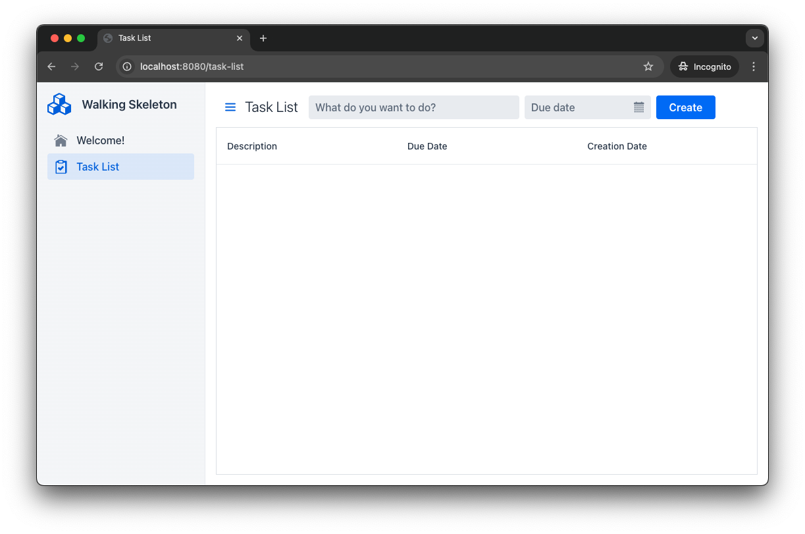

:skeleton-generator-url: https://start.vaadin.com/
:skeleton-generator-name: Vaadin Start

= Start a Project

The easiest way of starting a new Vaadin project is to generate a *walking skeleton* at link:{skeleton-generator-url}[{skeleton-generator-name}].

A walking skeleton is a minimal application that demonstrates how all the building blocks interact -- from the UI to the database. It contains three types of elements: *production-ready features*, *demonstration examples that should be removed once understood*, and *empty placeholders*. Its purpose is to validate the architecture early while providing implementation patterns to follow. 

You build your application by keeping the production-ready features, studying and replacing the demonstration examples, and filling in the placeholders with your actual implementations.

[TIP]
Many of the <</building-apps#,Building Apps>> guides contain mini-tutorials that start with a walking skeleton and then guide you through adding features to it.

You'll get a <<../walk-through#,walk-through>> of the Vaadin walking skeleton later.

== Generate a Skeleton

{skeleton-generator-url}[Open {skeleton-generator-name}, role="button primary water"]

The generator asks for some basic information, like the Maven `groupId` and `artifactId`. These fields are pre-filled, so you only need to change them if desired.

Next, choose between *Flow* and *Hilla* for your user interface:

* *Flow* if you prefer implementing the UI in Java.
* *Hilla* if you prefer React and TypeScript.

You can mix Flow and Hilla within the same application. However, most projects typically use only one. The choice depends on the team's skill set and the project's functional requirements.

[TIP]
To create an empty project, leave both options unchecked.

Click the [guibutton]*Download* button to download a zip-file with your new project.

== Try It

After downloading your new project, unzip it into a directory of your choice.

=== Start the Application

Open a terminal in the project directory and run the following command:

[.example]
--
.Terminal
[source,terminal,subs="+attributes"]
----
<source-info group="macOS / Linux"></source-info>
./mvnw
----

.PowerShell
[source,terminal,subs="+attributes"]
----
<source-info group="Windows"></source-info>
mvnw
----
--

The first startup may take a while as Maven and npm download the required dependencies. Once initialization is complete, the application will be available at: http://localhost:8080

.Are you behind a proxy?
[TIP]
Vaadin uses Node.js to download the frontend toolchain during the build. If you are behind a proxy, you may need to configure Node to use that. See the <<{articles}/flow/configuration/development-mode/node-js#proxy-settings-for-downloading-frontend-toolchain,Flow Reference>> guide for details.

[role="since:com.vaadin:vaadin@V24.8"]
=== Log In

The skeleton includes a default security configuration. When you open the application in your browser, you'll see the *development-mode login screen*, which displays a list of sample users and their credentials.

Choose one of the users and log in. You'll be taken to the main view, which should look like this:

=== Interact with the Application

To test basic functionality:

1.	Enter a task description in the text field.
2.	Select a due date.
3.	Click the [guibutton]*Create* button.

The new task appears in the grid below.

Next, try entering the word `fail` into the description field and click [guibutton]*Create* again. This simulates an error, which is caught by the built-in error handler and results in a visible error notification.

=== Stop the Application

To shut down the application, press Ctrl+C in the terminal.
