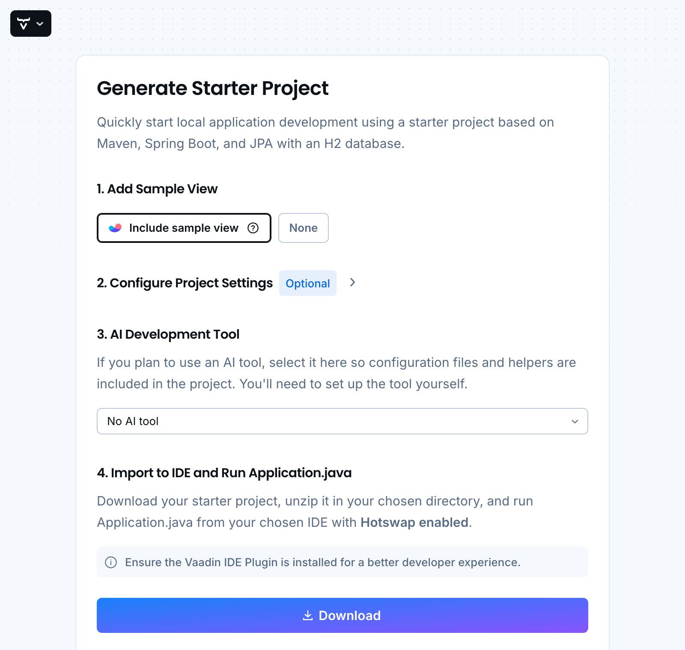

= Create a Project with Vaadin Start

The recommended way to start a Vaadin project is by using https://start.vaadin.com[Vaadin Start], which generates a ready-to-run Spring Boot and Maven based project:

[.device]

link:https://start.vaadin.com/[Open Vaadin Start, role="button primary water"]   

You can choose to include a sample view or create an empty project.

By expanding the *Configure Project Settings* section, you can customize the project settings:

* Select Vaadin version
* Select Java version
* Specify Maven group ID and artifact ID

When you click the [guibutton]*Download* button, a ZIP file containing the generated project is downloaded to your computer. You can then extract the ZIP file and <</getting-started/dev-environment/import#,open the project in your favorite IDE>>.
