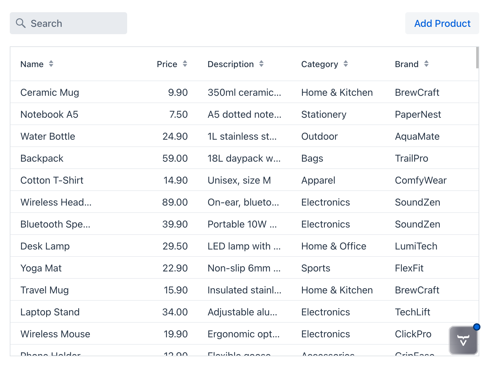
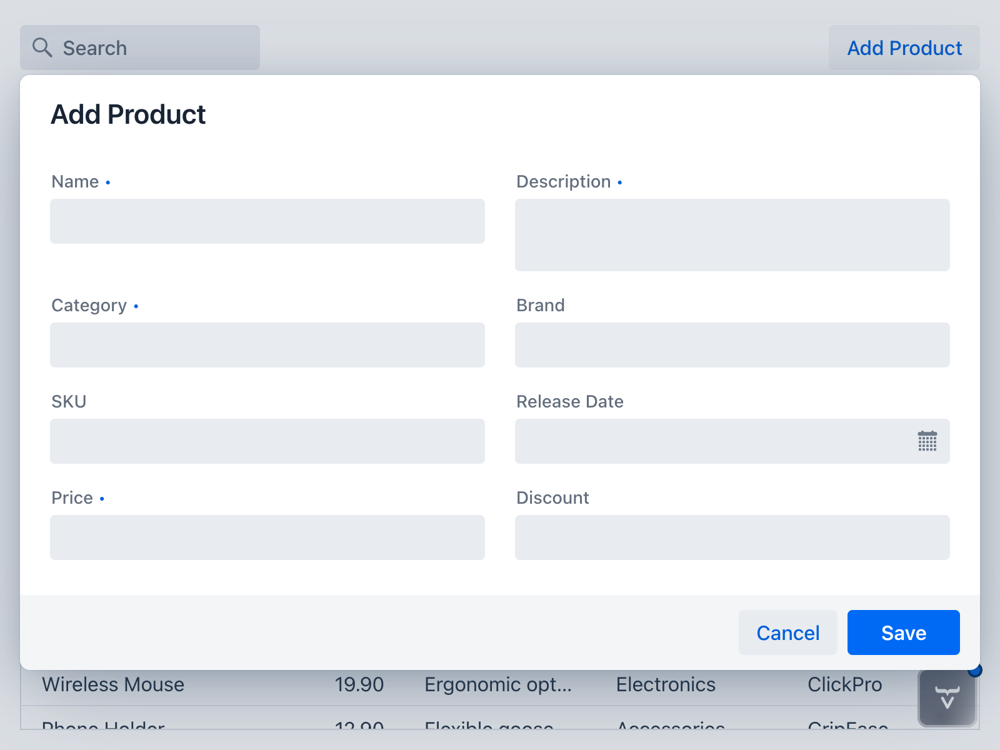

= Add Products

In the previous steps, you built a drawer for editing the details of the currently selected item in the product catalog. However, there was no way of adding new items. You'll be addressing this in this step. However, instead of using the drawer again, you'll be making a dialog.

.Dialog or Drawer?
[TIP]
====
Editing an item is inherently contextual; it only makes sense when there _is_ a selected item. Because of this, the drawer is explicitly tied to the selection in the UI. 

Creating a new item is _not_ tied to any existing selection. A dialog communicates that distinction clearly: it represents a new, temporary interaction that is independent of the current view state. By separating creation into a dialog, the UI makes it obvious that the user is not editing something that already exists, but defining something new.
====

You'll start by creating the dialog and adding a button for opening it to the product catalog view. You'll then add the necessary logic to insert new products into the database, refresh the grid, and handle any errors that may occur. Finally, you'll make some improvements to the user experience.

== Make an Add Product Dialog

You'll now create a <</components/dialog#,Dialog>> for adding new products to the catalog. A dialog in Vaadin extends the `Dialog` class. It has a header, a footer, and a content area, and it can be opened and closed.

You'll reuse the `ProductForm` from the earlier steps and display that in the content are. You'll add two buttons to the footer: a [guibutton]*Save* button for inserting the new product, and a [guibutton]*Cancel* button for closing the dialog without saving.

Create a new `AddProductDialog` class like this:

.AddProductDialog.java
[source,java]
----
package com.example.product;

import com.vaadin.flow.component.button.Button;
import com.vaadin.flow.component.button.ButtonVariant;
import com.vaadin.flow.component.dialog.Dialog;

class AddProductDialog extends Dialog {

    private final ProductForm form;

    AddProductDialog() {
        form = new ProductForm();
        var saveButton = new Button("Save");
        saveButton.addThemeVariants(ButtonVariant.LUMO_PRIMARY);
        var cancelButton = new Button("Cancel");

        setHeaderTitle("Add Product"); // <1>
        add(form); // <2>
        getFooter().add(cancelButton, saveButton); // <3>
    }
}
----
<1> The header contains a title.
<2> The content area contains the product form itself.
<3> The footer contains Cancel and Save buttons.

Whenever you build any user interface element in Vaadin, you want to see what it looks like as quickly as possible. To see what the `AddProductDialog` looks like, you have to open it somewhere in your application. You'll do that next.

== Show the Dialog

Next, you'll add an [guibutton]*Add Product* button to the product catalog view. The button should show up on the same row as the search field, but in the top-right corner of the screen. To do this, you have to do two things:

1. Create a new `Button` that opens `AddProductDialog` when clicked.
2. Move the search field into a new toolbar, and also add the button to it.

Change the code of `ProductCatalogView` as follows:

.ProductCatalogView.java
[source,java]
----
package com.example.product;

// tag::snippet[]
import com.vaadin.flow.component.button.Button;
// end::snippet[]
import com.vaadin.flow.component.grid.ColumnTextAlign;
import com.vaadin.flow.component.grid.Grid;
import com.vaadin.flow.component.icon.VaadinIcon;
import com.vaadin.flow.component.notification.Notification;
import com.vaadin.flow.component.notification.NotificationVariant;
import com.vaadin.flow.component.orderedlayout.HorizontalLayout;
import com.vaadin.flow.component.orderedlayout.VerticalLayout;
import com.vaadin.flow.component.textfield.TextField;
import com.vaadin.flow.data.value.ValueChangeMode;
import com.vaadin.flow.router.PageTitle;
import com.vaadin.flow.router.Route;
import org.springframework.dao.OptimisticLockingFailureException;

@Route("")
@PageTitle("Product Catalog")
class ProductCatalogView extends HorizontalLayout {

    ProductCatalogView(ProductCatalogItemRepository repository,
                       ProductDetailsRepository productDetailsRepository) {
        // Create components
        var searchField = new TextField();
        searchField.setPlaceholder("Search");
        searchField.setPrefixComponent(VaadinIcon.SEARCH.create());
        searchField.setValueChangeMode(ValueChangeMode.LAZY);

        var grid = new Grid<ProductCatalogItem>();
        grid.addColumn(ProductCatalogItem::name).setHeader("Name")
                .setSortProperty(ProductCatalogItem.SORT_PROPERTY_NAME);
        grid.addColumn(ProductCatalogItem::price).setHeader("Price")
                .setTextAlign(ColumnTextAlign.END)
                .setSortProperty(ProductCatalogItem.SORT_PROPERTY_PRICE);
        grid.addColumn(ProductCatalogItem::description).setHeader("Description")
                .setSortProperty(ProductCatalogItem.SORT_PROPERTY_DESCRIPTION);
        grid.addColumn(ProductCatalogItem::category).setHeader("Category")
                .setSortProperty(ProductCatalogItem.SORT_PROPERTY_CATEGORY);
        grid.addColumn(ProductCatalogItem::brand).setHeader("Brand")
                .setSortProperty(ProductCatalogItem.SORT_PROPERTY_BRAND);
        grid.setItemsPageable(pageable -> repository
                .findByNameContainingIgnoreCase(searchField.getValue(), pageable)
                .getContent()
        );

        var drawer = new ProductFormDrawer(productDetails -> {
            var saved = productDetailsRepository.save(productDetails);
            grid.getDataProvider().refreshAll();
            return saved;
        }, this::handleException);

        searchField.addValueChangeListener(e ->
                grid.getDataProvider().refreshAll());

        grid.addSelectionListener(e -> {
            var productDetails = e.getFirstSelectedItem()
                    .flatMap(item -> productDetailsRepository.findById(item.productId()))
                    .orElse(null);
            drawer.setProductDetails(productDetails);
        });

// tag::snippet[]
        var addButton = new Button("Add Product", e -> new AddProductDialog().open()); // <1>
// end::snippet[]

        // Layout view
        setSizeFull();
        setSpacing(false);

// tag::snippet[]
        var toolbar = new HorizontalLayout(); // <2>
        toolbar.setWidthFull(); // <3>
        toolbar.addToStart(searchField); // <4>
        toolbar.addToEnd(addButton); // <5>

        var listLayout = new VerticalLayout(toolbar, grid);
// end::snippet[]
        listLayout.setSizeFull();
        grid.setSizeFull();

        add(listLayout, drawer);
        setFlexShrink(0, drawer);
    }

    private void handleException(RuntimeException exception) {
        if (exception instanceof OptimisticLockingFailureException) {
            var notification = new Notification(
                "Another user has edited the same product. Please refresh and try again.");
            notification.setPosition(Notification.Position.MIDDLE);
            notification.addThemeVariants(NotificationVariant.LUMO_WARNING);
            notification.setDuration(3000);
            notification.open();
        } else {
            // Delegate to Vaadin's default error handler
            throw exception;
        }
    }
}
----
<1> Open the dialog by calling the `open()` method.
<2> The toolbar is a horizontal layout.
<3> Make the toolbar take the full width of the view. By default, it only expands to fit the components within it.
<4> Add the search field to the start of the toolbar, making it show up in the top-left corner of the screen.
<5> Add the button to the end of the toolbar, making it show up in the top-right corner of the screen.

The product catalog view should now look like this:

[.device]

Click the button to open the dialog. It should look like this:

[.device]

You'll notice the form looks different than the drawer. This is because the <</components/form-layout#,Form Layout>> component is responsive out-of-the-box and automatically determines the number of columns based on various parameters, such as available horizontal space. 

Close the dialog by pressing kbd:[Esc] or clicking outside the dialog. You'll add functionality to the dialog buttons next.

== Implement Dialog Buttons

TODO Continue here on Tuesday Dec 16

.AddProductDialog.java
[source,java]
----
package com.example.product;

import com.vaadin.flow.component.button.Button;
import com.vaadin.flow.component.button.ButtonVariant;
import com.vaadin.flow.component.dialog.Dialog;

class AddProductDialog extends Dialog {

    private final ProductForm form;
    private final SaveCallback saveCallback;
    private final ErrorCallback errorCallback;

    AddProductDialog(SaveCallback saveCallback, ErrorCallback errorCallback) {
        this.saveCallback = saveCallback;
        this.errorCallback = errorCallback;

        form = new ProductForm();
        var saveButton = new Button("Save", e -> save());
        saveButton.addThemeVariants(ButtonVariant.LUMO_PRIMARY);
        var cancelButton = new Button("Cancel", e -> close());

        setHeaderTitle("Add Product");
        add(form);
        getFooter().add(cancelButton, saveButton);
    }

    private void save() {
        form.getFormDataObject().ifPresent(product -> {
            try {
                saveCallback.save(product);
                close();
            } catch (RuntimeException e) {
                errorCallback.handleException(e);
            }
        });
    }

    @FunctionalInterface
    interface SaveCallback {
        void save(ProductDetails productDetails);
    }

    @FunctionalInterface
    interface ErrorCallback {
        void handleException(RuntimeException e);
    }
}
----

== Improve the User Experience

== Next Steps

TODO