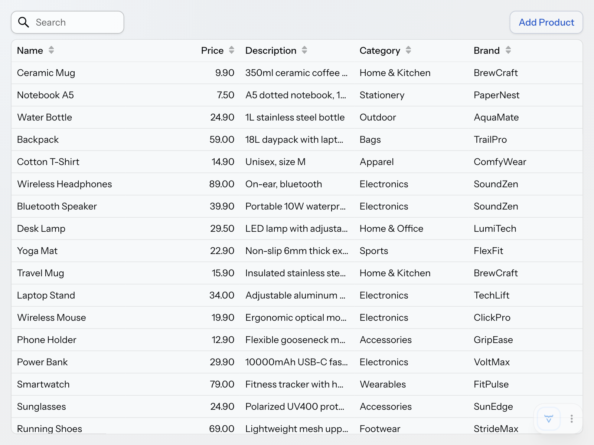
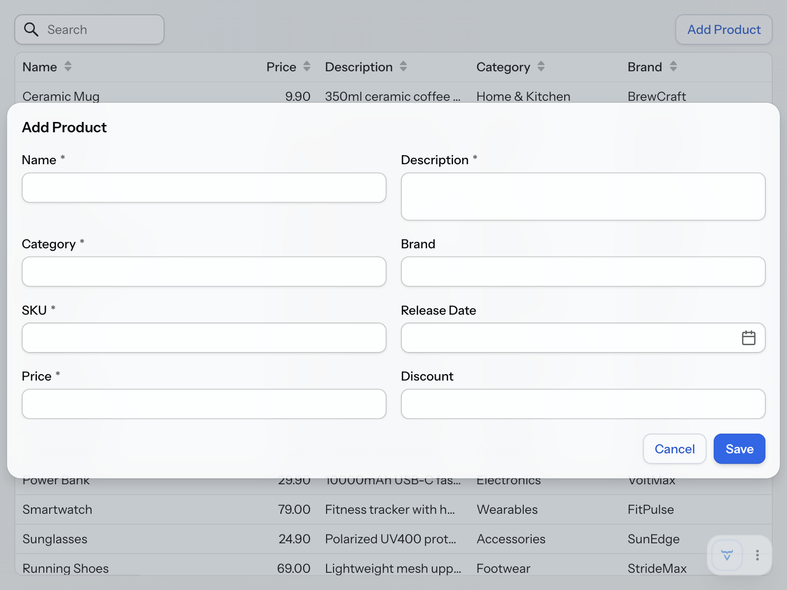

= Add Products
:toclevels: 2

In the previous steps, you built a drawer for editing the details of the currently selected item in the product catalog. However, there was no way of adding new items. You'll be addressing this in this step. However, instead of using the drawer again, you'll be making a dialog.

.Dialog or Drawer?
[TIP]
====
Editing an item is inherently contextual; it only makes sense when there _is_ a selected item. Because of this, the drawer is explicitly tied to the selection in the UI.

Creating a new item is _not_ tied to any existing selection. A dialog communicates that distinction clearly: it represents a new, temporary interaction that is independent of the current view state. By separating creation into a dialog, the UI makes it obvious that the user is not editing something that already exists, but defining something new.
====

You'll start by creating the dialog and adding a button for opening it to the product catalog view. You'll then add the necessary logic to insert new products into the database, refresh the grid, and handle any errors that may occur. Finally, you'll make some improvements to the user experience.

== Make an Add Product Dialog

You'll now create a <</components/dialog#,Dialog>> for adding new products to the catalog. A dialog in Vaadin extends the `Dialog` class. It has a header, a footer, and a content area, and it can be opened and closed.

You'll reuse the `ProductForm` from the earlier steps and display that in the content area. You'll add two buttons to the footer: a [guibutton]*Save* button for inserting the new product, and a [guibutton]*Cancel* button for closing the dialog without saving.

Create a new `AddProductDialog` class like this:

.AddProductDialog.java
[source,java]
----
package com.example.product;

import com.vaadin.flow.component.button.Button;
import com.vaadin.flow.component.button.ButtonVariant;
import com.vaadin.flow.component.dialog.Dialog;

class AddProductDialog extends Dialog {

    private final ProductForm form;

    AddProductDialog() {
        // Create components
        form = new ProductForm();
        var saveButton = new Button("Save");
        saveButton.addThemeVariants(ButtonVariant.PRIMARY);
        var cancelButton = new Button("Cancel");

        // Layout dialog
        setHeaderTitle("Add Product"); // <1>
        add(form); // <2>
        getFooter().add(cancelButton, saveButton); // <3>
    }
}
----
<1> The header contains a title.
<2> The content area contains the product form itself.
<3> The footer contains Cancel and Save buttons.

Whenever you build any user interface element in Vaadin, you want to see what it looks like as quickly as possible. To see what the `AddProductDialog` looks like, you have to open it somewhere in your application. You'll do that next.

== Show the Dialog

To add a new product, the user should click an [guibutton]*Add Product* button in the product catalog view. The button should show up on the same row as the search field, but in the top-right corner of the screen. To implement this, you have to do two things:

1. Create a new `Button` that opens `AddProductDialog` when clicked.
2. Move the search field into a new toolbar, and also add the button to it.

Change the code of `ProductCatalogView` as follows:

.ProductCatalogView.java
[source,java]
----
package com.example.product;

// tag::snippet[]
import com.vaadin.flow.component.button.Button;
// end::snippet[]
import com.vaadin.flow.component.grid.ColumnTextAlign;
import com.vaadin.flow.component.grid.Grid;
import com.vaadin.flow.component.icon.VaadinIcon;
import com.vaadin.flow.component.masterdetaillayout.MasterDetailLayout;
import com.vaadin.flow.component.notification.Notification;
import com.vaadin.flow.component.notification.NotificationVariant;
import com.vaadin.flow.component.orderedlayout.HorizontalLayout;
import com.vaadin.flow.component.orderedlayout.VerticalLayout;
import com.vaadin.flow.component.textfield.TextField;
import com.vaadin.flow.data.value.ValueChangeMode;
import com.vaadin.flow.router.PageTitle;
import com.vaadin.flow.router.Route;
import org.springframework.dao.OptimisticLockingFailureException;

@Route("")
@PageTitle("Product Catalog")
class ProductCatalogView extends MasterDetailLayout {

    ProductCatalogView(ProductCatalogService service) {
        // Create components
        var searchField = new TextField();
        searchField.setPlaceholder("Search");
        searchField.setPrefixComponent(VaadinIcon.SEARCH.create());
        searchField.setValueChangeMode(ValueChangeMode.LAZY);

        var grid = new Grid<ProductCatalogItem>();
        grid.addColumn(ProductCatalogItem::name)
            .setHeader("Name")
            .setSortProperty(ProductCatalogItem.SORT_PROPERTY_NAME);
        grid.addColumn(ProductCatalogItem::price)
            .setHeader("Price")
            .setTextAlign(ColumnTextAlign.END)
            .setSortProperty(ProductCatalogItem.SORT_PROPERTY_PRICE);
        grid.addColumn(ProductCatalogItem::description)
            .setHeader("Description")
            .setSortProperty(ProductCatalogItem.SORT_PROPERTY_DESCRIPTION);
        grid.addColumn(ProductCatalogItem::category)
            .setHeader("Category")
            .setSortProperty(ProductCatalogItem.SORT_PROPERTY_CATEGORY);
        grid.addColumn(ProductCatalogItem::brand)
            .setHeader("Brand")
            .setSortProperty(ProductCatalogItem.SORT_PROPERTY_BRAND);
        grid.setItemsPageable(pageable -> service
            .findItems(searchField.getValue(), pageable)
        );

        var drawer = new ProductFormDrawer(productDetails -> {
            var saved = service.save(productDetails);
            grid.getDataProvider().refreshAll();
            return saved;
        }, this::handleException);

        searchField.addValueChangeListener(e ->
                grid.getDataProvider().refreshAll());

        grid.addSelectionListener(e -> {
            var productDetails = e.getFirstSelectedItem()
                .flatMap(item -> service.findDetailsById(item.productId()));
            productDetails.ifPresent(drawer::setProductDetails);
            setDetail(productDetails.isPresent() ? drawer : null);
        });
        addBackdropClickListener(e -> grid.deselectAll());
        addDetailEscapePressListener(e -> grid.deselectAll());

// tag::snippet[]
        var addButton = new Button("Add Product",
            e -> new AddProductDialog().open()); // <1>
// end::snippet[]

        // Layout view
        setSizeFull();
        setDetailSize("300px");
        setExpandMaster(true);

// tag::snippet[]
        var toolbar = new HorizontalLayout(); // <2>
        toolbar.setWidthFull(); // <3>
        toolbar.addToStart(searchField); // <4>
        toolbar.addToEnd(addButton); // <5>

        var listLayout = new VerticalLayout(toolbar, grid);
// end::snippet[]
        listLayout.setSizeFull();
        grid.setSizeFull();

        setMaster(listLayout);
    }

    private void handleException(RuntimeException exception) {
        if (exception instanceof OptimisticLockingFailureException) {
            var notification = new Notification(
                "Another user has edited the same product. "
                + "Please refresh and try again.");
            notification.setPosition(Notification.Position.MIDDLE);
            notification.addThemeVariants(NotificationVariant.WARNING);
            notification.setDuration(3000);
            notification.open();
        } else {
            // Delegate to Vaadin's default error handler
            throw exception;
        }
    }
}
----
<1> Open the dialog by calling the `open()` method.
<2> The toolbar is a horizontal layout.
<3> Make the toolbar take the full width of the view. By default, it only expands to fit the components within it.
<4> Add the search field to the start of the toolbar, making it show up in the top-left corner of the screen.
<5> Add the button to the end of the toolbar, making it show up in the top-right corner of the screen.

The product catalog view should now look like this:

[.device]

Click the button to open the dialog. It should look like this:

[.device]

You'll notice the form looks different than the drawer. This is because the <</components/form-layout#,Form Layout>> component is responsive out-of-the-box and automatically determines the number of columns based on various parameters, such as available horizontal space.

Close the dialog by pressing kbd:[Esc] or clicking outside the dialog. You'll add functionality to the dialog buttons next.

== Implement Dialog Buttons

The [guibutton]*Cancel* button is trivial to implement: it should close the dialog when clicked. You do this by calling the `close()` method in the button's click listener.

The [guibutton]*Save* button is more interesting: it should validate the form, insert the product into the catalog, refresh the grid, and close the dialog. You'll use the same callback based design pattern that you used in `ProductFormDrawer`. This keeps the coding style consistent and also allows you to reuse some logic from `ProductCatalogView`.

Update `AddProductDialog` as follows:

.AddProductDialog.java
[source,java]
----
package com.example.product;

import com.vaadin.flow.component.button.Button;
import com.vaadin.flow.component.button.ButtonVariant;
import com.vaadin.flow.component.dialog.Dialog;

class AddProductDialog extends Dialog {

// tag::snippet[]
    @FunctionalInterface
    interface SaveCallback {
        void save(ProductDetails productDetails); // <1>
    }

    @FunctionalInterface
    interface ErrorCallback {
        void handleException(RuntimeException e);
    }
    private final SaveCallback saveCallback;
    private final ErrorCallback errorCallback;
// end::snippet[]
    private final ProductForm form;

// tag::snippet[]
    AddProductDialog(SaveCallback saveCallback, ErrorCallback errorCallback) {
        this.saveCallback = saveCallback;
        this.errorCallback = errorCallback;
// end::snippet[]

        // Create components
        form = new ProductForm();
// tag::snippet[]
        form.setFormDataObject(new ProductDetails()); // <2>
        var saveButton = new Button("Save", e -> save());
// end::snippet[]
        saveButton.addThemeVariants(ButtonVariant.PRIMARY);
// tag::snippet[]
        var cancelButton = new Button("Cancel", e -> close());
// end::snippet[]

        // Layout dialog
        setHeaderTitle("Add Product");
        add(form);
        getFooter().add(cancelButton, saveButton);
    }

// tag::snippet[]
    private void save() { // <3>
        form.getFormDataObject().ifPresent(productDetails -> {
            try {
                saveCallback.save(productDetails);
                close();
            } catch (RuntimeException e) {
                errorCallback.handleException(e);
            }
        });
    }
// end::snippet[]
}
----
<1> This save callback does not need to return an object as the dialog will be closed on success.
<2> Create a new, empty form data object for each dialog instance.
<3> This is almost the same implementation as in `ProductFormDrawer`, but instead of re-populating the form with a new FDO it closes the dialog.

Next, implement the callbacks in `ProductCatalogView`:

.ProductCatalogView.java
[source,java]
----
package com.example.product;

import com.vaadin.flow.component.button.Button;
import com.vaadin.flow.component.grid.ColumnTextAlign;
import com.vaadin.flow.component.grid.Grid;
import com.vaadin.flow.component.icon.VaadinIcon;
import com.vaadin.flow.component.masterdetaillayout.MasterDetailLayout;
import com.vaadin.flow.component.notification.Notification;
import com.vaadin.flow.component.notification.NotificationVariant;
import com.vaadin.flow.component.orderedlayout.HorizontalLayout;
import com.vaadin.flow.component.orderedlayout.VerticalLayout;
import com.vaadin.flow.component.textfield.TextField;
import com.vaadin.flow.data.value.ValueChangeMode;
import com.vaadin.flow.router.PageTitle;
import com.vaadin.flow.router.Route;
import org.springframework.dao.OptimisticLockingFailureException;

@Route("")
@PageTitle("Product Catalog")
class ProductCatalogView extends MasterDetailLayout {

    ProductCatalogView(ProductCatalogService service) {
        // Create components
        var searchField = new TextField();
        searchField.setPlaceholder("Search");
        searchField.setPrefixComponent(VaadinIcon.SEARCH.create());
        searchField.setValueChangeMode(ValueChangeMode.LAZY);

        var grid = new Grid<ProductCatalogItem>();
        grid.addColumn(ProductCatalogItem::name)
            .setHeader("Name")
            .setSortProperty(ProductCatalogItem.SORT_PROPERTY_NAME);
        grid.addColumn(ProductCatalogItem::price)
            .setHeader("Price")
            .setTextAlign(ColumnTextAlign.END)
            .setSortProperty(ProductCatalogItem.SORT_PROPERTY_PRICE);
        grid.addColumn(ProductCatalogItem::description)
            .setHeader("Description")
            .setSortProperty(ProductCatalogItem.SORT_PROPERTY_DESCRIPTION);
        grid.addColumn(ProductCatalogItem::category)
            .setHeader("Category")
            .setSortProperty(ProductCatalogItem.SORT_PROPERTY_CATEGORY);
        grid.addColumn(ProductCatalogItem::brand)
            .setHeader("Brand")
            .setSortProperty(ProductCatalogItem.SORT_PROPERTY_BRAND);
        grid.setItemsPageable(pageable -> service
            .findItems(searchField.getValue(), pageable)
        );

        var drawer = new ProductFormDrawer(productDetails -> {
            var saved = service.save(productDetails);
            grid.getDataProvider().refreshAll();
            return saved;
        }, this::handleException);

        searchField.addValueChangeListener(e ->
                grid.getDataProvider().refreshAll());

        grid.addSelectionListener(e -> {
            var productDetails = e.getFirstSelectedItem()
                .flatMap(item -> service.findDetailsById(item.productId()));
            productDetails.ifPresent(drawer::setProductDetails);
            setDetail(productDetails.isPresent() ? drawer : null);
        });
        addBackdropClickListener(e -> grid.deselectAll());
        addDetailEscapePressListener(e -> grid.deselectAll());

// tag::snippet[]
        var addButton = new Button("Add Product", e ->
            new AddProductDialog(
                productDetails -> {
                    service.save(productDetails); // <1>
                    grid.getDataProvider().refreshAll(); // <2>
                },
                this::handleException // <3>
            ).open()
        );
// end::snippet[]

        // Layout view
        setSizeFull();
        setDetailSize("300px");
        setExpandMaster(true);

        var toolbar = new HorizontalLayout();
        toolbar.setWidthFull();
        toolbar.addToStart(searchField);
        toolbar.addToEnd(addButton);

        var listLayout = new VerticalLayout(toolbar, grid);
        listLayout.setSizeFull();
        grid.setSizeFull();

        setMaster(listLayout);
    }

    private void handleException(RuntimeException exception) {
        if (exception instanceof OptimisticLockingFailureException) {
            var notification = new Notification(
                "Another user has edited the same product. "
                + "Please refresh and try again.");
            notification.setPosition(Notification.Position.MIDDLE);
            notification.addThemeVariants(NotificationVariant.WARNING);
            notification.setDuration(3000);
            notification.open();
        } else {
            // Delegate to Vaadin's default error handler
            throw exception;
        }
    }
}
----
<1> Call the service to validate the product and insert it into the database.
<2> Refresh the grid so that the new product shows up.
<3> Re-use the `handleException()` method for error handling.

You should now be able to add new products to the database, and they should show up in the grid.

== Improve the User Experience

When you implemented edit support in the previous tutorial step, you stumbled upon and fixed some user experience issues. You'll now fix two more issues.

You may have noticed that every new item is added to the bottom of the grid unless it has been explicitly sorted by a particular column. This is because the grid is sorted by ID by default. You have to scroll down to see whether the item was actually added. This creates unnecessary confusion for the user and could be improved.

Next, try to insert a product with the following Stock Keeping Unit (SKU): `NBK-A5-DOT`

The dialog should remain open and in the console output, you should see the following error:

 org.h2.jdbc.JdbcSQLIntegrityConstraintViolationException: Unique index or primary key violation: "PUBLIC.CONSTRAINT_F2 INDEX PUBLIC.CONSTRAINT_INDEX_F ON PUBLIC.PRODUCTS(SKU NULLS FIRST) VALUES ( /* 2 */ 'NBK-A5-DOT' )";

This is another example of a recoverable error triggered by a user action, and should be addressed.

=== Select Added Item

To make the experience less confusing for users, you'll select the newly added item after refreshing the product catalog grid. However, because the grid contains objects of type `ProductCatalogItem`, and the form uses `ProductDetails`, you have to find the corresponding item to select it.

To do this, you first have to add a new `findById` method to `ProductCatalogItemRepository`:

.ProductCatalogItemRepository.java
[source,java]
----
package com.example.product;

import org.springframework.data.domain.Pageable;
import org.springframework.data.domain.Slice;
import org.springframework.data.repository.PagingAndSortingRepository;

// tag::snippet[]
import java.util.Optional;
// end::snippet[]

interface ProductCatalogItemRepository
    extends PagingAndSortingRepository<ProductCatalogItem, Long> {

// tag::snippet[]
    Optional<ProductCatalogItem> findById(Long id);
// end::snippet[]
    Slice<ProductCatalogItem> findByNameContainingIgnoreCase(String name,
        Pageable pageable);
}
----

Spring Data automatically implements the method for you.

Then make the method available to the view by adding a `findItemById` method to `ProductCatalogService`:

.ProductCatalogService.java
[source,java]
----
package com.example.product;

import jakarta.validation.Valid;
import org.springframework.data.domain.Pageable;
import org.springframework.stereotype.Service;
import org.springframework.transaction.annotation.Transactional;
import org.springframework.validation.annotation.Validated;

import java.util.List;
import java.util.Optional;

@Service
@Validated
@Transactional(readOnly = true)
class ProductCatalogService {

    private final ProductCatalogItemRepository productCatalogItemRepository;
    private final ProductDetailsRepository productDetailsRepository;

    public ProductCatalogService(
            ProductCatalogItemRepository productCatalogItemRepository,
            ProductDetailsRepository productDetailsRepository) {
        this.productCatalogItemRepository = productCatalogItemRepository;
        this.productDetailsRepository = productDetailsRepository;
    }

    public List<ProductCatalogItem> findItems(String searchTerm,
            Pageable pageable) {
        return productCatalogItemRepository
            .findByNameContainingIgnoreCase(searchTerm, pageable).getContent();
    }

    public Optional<ProductDetails> findDetailsById(Long id) {
        return productDetailsRepository.findById(id);
    }

// tag::snippet[]
    public Optional<ProductCatalogItem> findItemById(Long id) {
        return productCatalogItemRepository.findById(id);
    }
// end::snippet[]

    @Transactional
    public ProductDetails save(@Valid ProductDetails productDetails) {
        return productDetailsRepository.save(productDetails);
    }
}
----

Next, call the method to retrieve the `ProductCatalogItem` after having inserted a new `ProductDetails`. Modify the save callback in `ProductCatalogView` as follows:

.ProductCatalogView.java
[source,java]
----
package com.example.product;

import com.vaadin.flow.component.button.Button;
import com.vaadin.flow.component.grid.ColumnTextAlign;
import com.vaadin.flow.component.grid.Grid;
import com.vaadin.flow.component.icon.VaadinIcon;
import com.vaadin.flow.component.masterdetaillayout.MasterDetailLayout;
import com.vaadin.flow.component.notification.Notification;
import com.vaadin.flow.component.notification.NotificationVariant;
import com.vaadin.flow.component.orderedlayout.HorizontalLayout;
import com.vaadin.flow.component.orderedlayout.VerticalLayout;
import com.vaadin.flow.component.textfield.TextField;
import com.vaadin.flow.data.value.ValueChangeMode;
import com.vaadin.flow.router.PageTitle;
import com.vaadin.flow.router.Route;
import org.springframework.dao.OptimisticLockingFailureException;

@Route("")
@PageTitle("Product Catalog")
class ProductCatalogView extends MasterDetailLayout {

    ProductCatalogView(ProductCatalogService service) {
        // Create components
        var searchField = new TextField();
        searchField.setPlaceholder("Search");
        searchField.setPrefixComponent(VaadinIcon.SEARCH.create());
        searchField.setValueChangeMode(ValueChangeMode.LAZY);

        var grid = new Grid<ProductCatalogItem>();
        grid.addColumn(ProductCatalogItem::name)
            .setHeader("Name")
            .setSortProperty(ProductCatalogItem.SORT_PROPERTY_NAME);
        grid.addColumn(ProductCatalogItem::price)
            .setHeader("Price")
            .setTextAlign(ColumnTextAlign.END)
            .setSortProperty(ProductCatalogItem.SORT_PROPERTY_PRICE);
        grid.addColumn(ProductCatalogItem::description)
            .setHeader("Description")
            .setSortProperty(ProductCatalogItem.SORT_PROPERTY_DESCRIPTION);
        grid.addColumn(ProductCatalogItem::category)
            .setHeader("Category")
            .setSortProperty(ProductCatalogItem.SORT_PROPERTY_CATEGORY);
        grid.addColumn(ProductCatalogItem::brand)
            .setHeader("Brand")
            .setSortProperty(ProductCatalogItem.SORT_PROPERTY_BRAND);
        grid.setItemsPageable(pageable -> service
            .findItems(searchField.getValue(), pageable)
        );

        var drawer = new ProductFormDrawer(productDetails -> {
            var saved = service.save(productDetails);
            grid.getDataProvider().refreshAll();
            return saved;
        }, this::handleException);

        searchField.addValueChangeListener(e ->
                grid.getDataProvider().refreshAll());

        grid.addSelectionListener(e -> {
            var productDetails = e.getFirstSelectedItem()
                .flatMap(item -> service.findDetailsById(item.productId()));
            productDetails.ifPresent(drawer::setProductDetails);
            setDetail(productDetails.isPresent() ? drawer : null);
        });
        addBackdropClickListener(e -> grid.deselectAll());
        addDetailEscapePressListener(e -> grid.deselectAll());

        var addButton = new Button("Add Product", e ->
            new AddProductDialog(
                productDetails -> {
// tag::snippet[]
                    var saved = service.save(productDetails);
                    grid.getDataProvider().refreshAll();
                    service.findItemById(saved.getProductId())
                           .ifPresent(grid::select);
// end::snippet[]
                },
                this::handleException
            ).open()
        );

        // Layout view
        setSizeFull();
        setDetailSize("300px");
        setExpandMaster(true);

        var toolbar = new HorizontalLayout();
        toolbar.setWidthFull();
        toolbar.addToStart(searchField);
        toolbar.addToEnd(addButton);

        var listLayout = new VerticalLayout(toolbar, grid);
        listLayout.setSizeFull();
        grid.setSizeFull();

        setMaster(listLayout);
    }

    private void handleException(RuntimeException exception) {
        if (exception instanceof OptimisticLockingFailureException) {
            var notification = new Notification(
                "Another user has edited the same product. "
                + "Please refresh and try again.");
            notification.setPosition(Notification.Position.MIDDLE);
            notification.addThemeVariants(NotificationVariant.WARNING);
            notification.setDuration(3000);
            notification.open();
        } else {
            // Delegate to Vaadin's default error handler
            throw exception;
        }
    }
}
----

Now when you add a new product, it should automatically be selected and show up in the drawer.

=== Handle Constraint Violation

Next, you'll handle the duplicate SKU. Spring translates database errors into its own exception hierarchy, and reports a violation of a unique constraint as a `DuplicateKeyException`. Since `sku` is the only unique column in the `PRODUCTS` table apart from the generated ID, a `DuplicateKeyException` from saving a product means that the SKU is already in use.

Catch `DuplicateKeyException` rather than its superclass, `DataIntegrityViolationException`. The superclass also covers other violations, such as a negative price, and reporting those as a duplicate SKU would confuse the user. Since the service validates the input, such violations shouldn't reach the database. If one does, it's a bug, and belongs in Vaadin's default error handler.

Update the `handleException()` method in `ProductCatalogView` as follows:

.ProductCatalogView.java
[source,java]
----
package com.example.product;

import com.vaadin.flow.component.button.Button;
import com.vaadin.flow.component.grid.ColumnTextAlign;
import com.vaadin.flow.component.grid.Grid;
import com.vaadin.flow.component.icon.VaadinIcon;
import com.vaadin.flow.component.masterdetaillayout.MasterDetailLayout;
import com.vaadin.flow.component.notification.Notification;
import com.vaadin.flow.component.notification.NotificationVariant;
import com.vaadin.flow.component.orderedlayout.HorizontalLayout;
import com.vaadin.flow.component.orderedlayout.VerticalLayout;
import com.vaadin.flow.component.textfield.TextField;
import com.vaadin.flow.data.value.ValueChangeMode;
import com.vaadin.flow.router.PageTitle;
import com.vaadin.flow.router.Route;
// tag::snippet[]
import org.springframework.dao.DuplicateKeyException;
// end::snippet[]
import org.springframework.dao.OptimisticLockingFailureException;

@Route("")
@PageTitle("Product Catalog")
class ProductCatalogView extends MasterDetailLayout {

    ProductCatalogView(ProductCatalogService service) {
        // Create components
        var searchField = new TextField();
        searchField.setPlaceholder("Search");
        searchField.setPrefixComponent(VaadinIcon.SEARCH.create());
        searchField.setValueChangeMode(ValueChangeMode.LAZY);

        var grid = new Grid<ProductCatalogItem>();
        grid.addColumn(ProductCatalogItem::name)
            .setHeader("Name")
            .setSortProperty(ProductCatalogItem.SORT_PROPERTY_NAME);
        grid.addColumn(ProductCatalogItem::price)
            .setHeader("Price")
            .setTextAlign(ColumnTextAlign.END)
            .setSortProperty(ProductCatalogItem.SORT_PROPERTY_PRICE);
        grid.addColumn(ProductCatalogItem::description)
            .setHeader("Description")
            .setSortProperty(ProductCatalogItem.SORT_PROPERTY_DESCRIPTION);
        grid.addColumn(ProductCatalogItem::category)
            .setHeader("Category")
            .setSortProperty(ProductCatalogItem.SORT_PROPERTY_CATEGORY);
        grid.addColumn(ProductCatalogItem::brand)
            .setHeader("Brand")
            .setSortProperty(ProductCatalogItem.SORT_PROPERTY_BRAND);
        grid.setItemsPageable(pageable -> service
            .findItems(searchField.getValue(), pageable)
        );

        var drawer = new ProductFormDrawer(productDetails -> {
            var saved = service.save(productDetails);
            grid.getDataProvider().refreshAll();
            return saved;
        }, this::handleException);

        searchField.addValueChangeListener(e ->
                grid.getDataProvider().refreshAll());

        grid.addSelectionListener(e -> {
            var productDetails = e.getFirstSelectedItem()
                .flatMap(item -> service.findDetailsById(item.productId()));
            productDetails.ifPresent(drawer::setProductDetails);
            setDetail(productDetails.isPresent() ? drawer : null);
        });
        addBackdropClickListener(e -> grid.deselectAll());
        addDetailEscapePressListener(e -> grid.deselectAll());

        var addButton = new Button("Add Product", e ->
            new AddProductDialog(
                productDetails -> {
                    var saved = service.save(productDetails);
                    grid.getDataProvider().refreshAll();
                    service.findItemById(saved.getProductId())
                           .ifPresent(grid::select);
                },
                this::handleException
            ).open()
        );

        // Layout view
        setSizeFull();
        setDetailSize("300px");
        setExpandMaster(true);

        var toolbar = new HorizontalLayout();
        toolbar.setWidthFull();
        toolbar.addToStart(searchField);
        toolbar.addToEnd(addButton);

        var listLayout = new VerticalLayout(toolbar, grid);
        listLayout.setSizeFull();
        grid.setSizeFull();

        setMaster(listLayout);
    }

    private void handleException(RuntimeException exception) {
        if (exception instanceof OptimisticLockingFailureException) {
            var notification = new Notification(
                "Another user has edited the same product. "
                + "Please refresh and try again.");
            notification.setPosition(Notification.Position.MIDDLE);
            notification.addThemeVariants(NotificationVariant.WARNING);
            notification.setDuration(3000);
            notification.open();
// tag::snippet[]
        } else if (exception instanceof DuplicateKeyException) {
            var notification = new Notification(
                "The SKU is already in use. Please enter another one.");
            notification.setPosition(Notification.Position.MIDDLE);
            notification.addThemeVariants(NotificationVariant.WARNING);
            notification.setDuration(3000);
            notification.open();
// end::snippet[]
        } else {
            // Delegate to Vaadin's default error handler
            throw exception;
        }
    }
}
----

Now try to create a new item with the SKU `NBK-A5-DOT`. You should receive a notification asking you to enter another SKU. Enter another one and click save. This should have worked, right? But it didn't. Instead you ended up with a different notification:

 Another user has edited the same product. Please refresh and try again.

How is this possible? How can another user have edited a product that you haven't even inserted yet?

You have now discovered a mismatch between how Spring Data and Vaadin assume data objects should be used. These mismatches are prone to happen whenever you're dealing with mutable data objects, like `ProductDetails` in this case.

Here's what happened:

1. You clicked [guibutton]*Save* with a duplicate SKU.
2. Spring Data attempted to insert the product and set its version number to 1.
3. The database rejected the insert due to the duplicate SKU, and the transaction rolled back.
4. *However, the `ProductDetails` object in memory was not rolled back* - it still has version=1.
5. You changed the SKU and clicked [guibutton]*Save* again.
6. Spring Data saw that the version was already set and assumed this was an _existing_ entity that needed updating, not a new one.
7. The update failed because no such row exists in the database -- hence the optimistic locking error.

If this had been a REST API, the `ProductDetails` object would always be a new instance and this would not be a problem. Since you're reusing the object, you have to work around this problem. You can do this in different ways, but the user interface shouldn't need to know about any of them. It's a persistence detail, and the view already saves products through `ProductCatalogService`. That makes the service the right place for the workaround.

=== Work Around the Version Bug

The easiest ways to work around this bug are the following:

1. Set the version to `null` before saving an item that doesn't yet have an ID.
2. Make a copy of the object and pass the copy to the repository, then return it if successful.

Making a copy is more elegant because it ensures the original object remains unchanged until the transaction commits successfully. This follows a principle of keeping data objects immutable during uncertain operations. Also, you have already designed your UI callbacks to support backends that return new instances of data objects after saving them.

This bug is a cost of using the entity as the FDO. A separate FDO would avoid it as well, because the form would never hold the object that Spring Data changes. Copying the entity before saving gives the same protection without a second class, which is enough while the form and the table match one-to-one.

Start by adding two constructors to `ProductDetails` - a _default constructor_ for creating new instances, and a _copy constructor_ for creating copies:

.ProductDetails.java
[source,java]
----
package com.example.product;

import jakarta.validation.constraints.DecimalMax;
import jakarta.validation.constraints.DecimalMin;
import jakarta.validation.constraints.NotBlank;
import jakarta.validation.constraints.NotNull;
import jakarta.validation.constraints.PositiveOrZero;
import jakarta.validation.constraints.Size;
import org.springframework.data.annotation.Id;
import org.springframework.data.annotation.Version;
import org.springframework.data.relational.core.mapping.Table;

import java.math.BigDecimal;
import java.time.LocalDate;

@Table("PRODUCTS")
class ProductDetails {

    @Id
    private Long productId;
    @Version
    private Long version;
    @NotBlank @Size(max = 100)
    private String name;
    @NotBlank @Size(max = 500)
    private String description;
    @NotBlank @Size(max = 100)
    private String category;
    @Size(max = 100)
    private String brand;
    @NotBlank @Size(max = 50)
    private String sku;
    private LocalDate releaseDate;
    @NotNull @PositiveOrZero
    private BigDecimal price;
    @DecimalMin("0") @DecimalMax("100")
    private BigDecimal discount;

// tag::snippet[]
    public ProductDetails() {
    }

    public ProductDetails(ProductDetails original) {
        this.productId = original.productId;
        this.version = original.version;
        this.name = original.name;
        this.description = original.description;
        this.category = original.category;
        this.brand = original.brand;
        this.sku = original.sku;
        this.releaseDate = original.releaseDate;
        this.price = original.price;
        this.discount = original.discount;
    }
// end::snippet[]

    public Long getProductId() {
        return productId;
    }

    public Long getVersion() {
        return version;
    }

    public String getName() {
        return name;
    }

    public void setName(String name) {
        this.name = name;
    }

    public String getDescription() {
        return description;
    }

    public void setDescription(String description) {
        this.description = description;
    }

    public String getCategory() {
        return category;
    }

    public void setCategory(String category) {
        this.category = category;
    }

    public String getBrand() {
        return brand;
    }

    public void setBrand(String brand) {
        this.brand = brand;
    }

    public String getSku() {
        return sku;
    }

    public void setSku(String sku) {
        this.sku = sku;
    }

    public LocalDate getReleaseDate() {
        return releaseDate;
    }

    public void setReleaseDate(LocalDate releaseDate) {
        this.releaseDate = releaseDate;
    }

    public BigDecimal getPrice() {
        return price;
    }

    public void setPrice(BigDecimal price) {
        this.price = price;
    }

    public BigDecimal getDiscount() {
        return discount;
    }

    public void setDiscount(BigDecimal discount) {
        this.discount = discount;
    }
}
----

Next, update the `ProductCatalogService` so that it passes a copy of `ProductDetails` to the repository:

.ProductCatalogService.java
[source,java]
----
package com.example.product;

import jakarta.validation.Valid;
import org.springframework.data.domain.Pageable;
import org.springframework.stereotype.Service;
import org.springframework.transaction.annotation.Transactional;
import org.springframework.validation.annotation.Validated;

import java.util.List;
import java.util.Optional;

@Service
@Validated
@Transactional(readOnly = true)
class ProductCatalogService {

    private final ProductCatalogItemRepository productCatalogItemRepository;
    private final ProductDetailsRepository productDetailsRepository;

    public ProductCatalogService(
            ProductCatalogItemRepository productCatalogItemRepository,
            ProductDetailsRepository productDetailsRepository) {
        this.productCatalogItemRepository = productCatalogItemRepository;
        this.productDetailsRepository = productDetailsRepository;
    }

    public List<ProductCatalogItem> findItems(String searchTerm,
            Pageable pageable) {
        return productCatalogItemRepository
            .findByNameContainingIgnoreCase(searchTerm, pageable).getContent();
    }

    public Optional<ProductDetails> findDetailsById(Long id) {
        return productDetailsRepository.findById(id);
    }

    public Optional<ProductCatalogItem> findItemById(Long id) {
        return productCatalogItemRepository.findById(id);
    }

    @Transactional
    public ProductDetails save(@Valid ProductDetails productDetails) {
// tag::snippet[]
        return productDetailsRepository.save(new ProductDetails(productDetails));
// end::snippet[]
    }
}
----

Now try to insert a product item with an existing SKU again. You should receive the error notification, as expected. Then change the SKU to a unique one and save the item. Everything should work as expected.

== Complete Code for This Step

If your application doesn't behave as described, compare your files with these listings. They show every class in the application as it should look at the end of this step.

.ProductCatalogView.java
[%collapsible]
====
[source,java]
----
package com.example.product;

import com.vaadin.flow.component.button.Button;
import com.vaadin.flow.component.grid.ColumnTextAlign;
import com.vaadin.flow.component.grid.Grid;
import com.vaadin.flow.component.icon.VaadinIcon;
import com.vaadin.flow.component.masterdetaillayout.MasterDetailLayout;
import com.vaadin.flow.component.notification.Notification;
import com.vaadin.flow.component.notification.NotificationVariant;
import com.vaadin.flow.component.orderedlayout.HorizontalLayout;
import com.vaadin.flow.component.orderedlayout.VerticalLayout;
import com.vaadin.flow.component.textfield.TextField;
import com.vaadin.flow.data.value.ValueChangeMode;
import com.vaadin.flow.router.PageTitle;
import com.vaadin.flow.router.Route;
import org.springframework.dao.DuplicateKeyException;
import org.springframework.dao.OptimisticLockingFailureException;

@Route("")
@PageTitle("Product Catalog")
class ProductCatalogView extends MasterDetailLayout {

    ProductCatalogView(ProductCatalogService service) {
        // Create components
        var searchField = new TextField();
        searchField.setPlaceholder("Search");
        searchField.setPrefixComponent(VaadinIcon.SEARCH.create());
        searchField.setValueChangeMode(ValueChangeMode.LAZY);

        var grid = new Grid<ProductCatalogItem>();
        grid.addColumn(ProductCatalogItem::name)
            .setHeader("Name")
            .setSortProperty(ProductCatalogItem.SORT_PROPERTY_NAME);
        grid.addColumn(ProductCatalogItem::price)
            .setHeader("Price")
            .setTextAlign(ColumnTextAlign.END)
            .setSortProperty(ProductCatalogItem.SORT_PROPERTY_PRICE);
        grid.addColumn(ProductCatalogItem::description)
            .setHeader("Description")
            .setSortProperty(ProductCatalogItem.SORT_PROPERTY_DESCRIPTION);
        grid.addColumn(ProductCatalogItem::category)
            .setHeader("Category")
            .setSortProperty(ProductCatalogItem.SORT_PROPERTY_CATEGORY);
        grid.addColumn(ProductCatalogItem::brand)
            .setHeader("Brand")
            .setSortProperty(ProductCatalogItem.SORT_PROPERTY_BRAND);
        grid.setItemsPageable(pageable -> service
            .findItems(searchField.getValue(), pageable)
        );

        var drawer = new ProductFormDrawer(productDetails -> {
            var saved = service.save(productDetails);
            grid.getDataProvider().refreshAll();
            return saved;
        }, this::handleException);

        searchField.addValueChangeListener(e ->
                grid.getDataProvider().refreshAll());

        grid.addSelectionListener(e -> {
            var productDetails = e.getFirstSelectedItem()
                .flatMap(item -> service.findDetailsById(item.productId()));
            productDetails.ifPresent(drawer::setProductDetails);
            setDetail(productDetails.isPresent() ? drawer : null);
        });
        addBackdropClickListener(e -> grid.deselectAll());
        addDetailEscapePressListener(e -> grid.deselectAll());

        var addButton = new Button("Add Product", e ->
                new AddProductDialog(
                        productDetails -> {
                            var saved = service.save(productDetails);
                            grid.getDataProvider().refreshAll();
                            service.findItemById(saved.getProductId())
                                   .ifPresent(grid::select);
                        },
                        this::handleException
                ).open()
        );

        // Layout view
        setSizeFull();
        setDetailSize("300px");
        setExpandMaster(true);

        var toolbar = new HorizontalLayout();
        toolbar.setWidthFull();
        toolbar.addToStart(searchField);
        toolbar.addToEnd(addButton);

        var listLayout = new VerticalLayout(toolbar, grid);
        listLayout.setSizeFull();
        grid.setSizeFull();

        setMaster(listLayout);
    }

    private void handleException(RuntimeException exception) {
        if (exception instanceof OptimisticLockingFailureException) {
            var notification = new Notification(
                "Another user has edited the same product. "
                + "Please refresh and try again.");
            notification.setPosition(Notification.Position.MIDDLE);
            notification.addThemeVariants(NotificationVariant.WARNING);
            notification.setDuration(3000);
            notification.open();
        } else if (exception instanceof DuplicateKeyException) {
            var notification = new Notification(
                "The SKU is already in use. Please enter another one.");
            notification.setPosition(Notification.Position.MIDDLE);
            notification.addThemeVariants(NotificationVariant.WARNING);
            notification.setDuration(3000);
            notification.open();
        } else {
            // Delegate to Vaadin's default error handler
            throw exception;
        }
    }
}
----
====

.ProductCatalogItem.java
[%collapsible]
====
[source,java]
----
package com.example.product;

import org.springframework.data.annotation.Id;
import org.springframework.data.relational.core.mapping.Table;

import java.math.BigDecimal;
import java.util.Objects;

@Table("PRODUCTS")
record ProductCatalogItem(
        @Id long productId,
        String name,
        String description,
        String category,
        String brand,
        BigDecimal price
) {
    static final String SORT_PROPERTY_NAME = "name";
    static final String SORT_PROPERTY_PRICE = "price";
    static final String SORT_PROPERTY_DESCRIPTION = "description";
    static final String SORT_PROPERTY_CATEGORY = "category";
    static final String SORT_PROPERTY_BRAND = "brand";

    @Override
    public boolean equals(Object o) {
        if (o == null || getClass() != o.getClass()) return false;
        ProductCatalogItem that = (ProductCatalogItem) o;
        return productId == that.productId;
    }

    @Override
    public int hashCode() {
        return Objects.hashCode(productId);
    }
}
----
====

.ProductCatalogItemRepository.java
[%collapsible]
====
[source,java]
----
package com.example.product;

import org.springframework.data.domain.Pageable;
import org.springframework.data.domain.Slice;
import org.springframework.data.repository.PagingAndSortingRepository;

import java.util.Optional;

interface ProductCatalogItemRepository
    extends PagingAndSortingRepository<ProductCatalogItem, Long> {

    Optional<ProductCatalogItem> findById(Long id);
    Slice<ProductCatalogItem> findByNameContainingIgnoreCase(String name,
        Pageable pageable);
}
----
====

.ProductCatalogService.java
[%collapsible]
====
[source,java]
----
package com.example.product;

import jakarta.validation.Valid;
import org.springframework.data.domain.Pageable;
import org.springframework.stereotype.Service;
import org.springframework.transaction.annotation.Transactional;
import org.springframework.validation.annotation.Validated;

import java.util.List;
import java.util.Optional;

@Service
@Validated
@Transactional(readOnly = true)
class ProductCatalogService {

    private final ProductCatalogItemRepository productCatalogItemRepository;
    private final ProductDetailsRepository productDetailsRepository;

    public ProductCatalogService(
            ProductCatalogItemRepository productCatalogItemRepository,
            ProductDetailsRepository productDetailsRepository) {
        this.productCatalogItemRepository = productCatalogItemRepository;
        this.productDetailsRepository = productDetailsRepository;
    }

    public List<ProductCatalogItem> findItems(String searchTerm,
            Pageable pageable) {
        return productCatalogItemRepository
            .findByNameContainingIgnoreCase(searchTerm, pageable).getContent();
    }

    public Optional<ProductDetails> findDetailsById(Long id) {
        return productDetailsRepository.findById(id);
    }

    public Optional<ProductCatalogItem> findItemById(Long id) {
        return productCatalogItemRepository.findById(id);
    }

    @Transactional
    public ProductDetails save(@Valid ProductDetails productDetails) {
        return productDetailsRepository.save(new ProductDetails(productDetails));
    }
}
----
====

.ProductDetails.java
[%collapsible]
====
[source,java]
----
package com.example.product;

import jakarta.validation.constraints.DecimalMax;
import jakarta.validation.constraints.DecimalMin;
import jakarta.validation.constraints.NotBlank;
import jakarta.validation.constraints.NotNull;
import jakarta.validation.constraints.PositiveOrZero;
import jakarta.validation.constraints.Size;
import org.springframework.data.annotation.Id;
import org.springframework.data.annotation.Version;
import org.springframework.data.relational.core.mapping.Table;

import java.math.BigDecimal;
import java.time.LocalDate;

@Table("PRODUCTS")
class ProductDetails {

    @Id
    private Long productId;
    @Version
    private Long version;
    @NotBlank @Size(max = 100)
    private String name;
    @NotBlank @Size(max = 500)
    private String description;
    @NotBlank @Size(max = 100)
    private String category;
    @Size(max = 100)
    private String brand;
    @NotBlank @Size(max = 50)
    private String sku;
    private LocalDate releaseDate;
    @NotNull @PositiveOrZero
    private BigDecimal price;
    @DecimalMin("0") @DecimalMax("100")
    private BigDecimal discount;

    public ProductDetails() {
    }

    public ProductDetails(ProductDetails original) {
        this.productId = original.productId;
        this.version = original.version;
        this.name = original.name;
        this.description = original.description;
        this.category = original.category;
        this.brand = original.brand;
        this.sku = original.sku;
        this.releaseDate = original.releaseDate;
        this.price = original.price;
        this.discount = original.discount;
    }

    public Long getProductId() {
        return productId;
    }

    public Long getVersion() {
        return version;
    }

    public String getName() {
        return name;
    }

    public void setName(String name) {
        this.name = name;
    }

    public String getDescription() {
        return description;
    }

    public void setDescription(String description) {
        this.description = description;
    }

    public String getCategory() {
        return category;
    }

    public void setCategory(String category) {
        this.category = category;
    }

    public String getBrand() {
        return brand;
    }

    public void setBrand(String brand) {
        this.brand = brand;
    }

    public String getSku() {
        return sku;
    }

    public void setSku(String sku) {
        this.sku = sku;
    }

    public LocalDate getReleaseDate() {
        return releaseDate;
    }

    public void setReleaseDate(LocalDate releaseDate) {
        this.releaseDate = releaseDate;
    }

    public BigDecimal getPrice() {
        return price;
    }

    public void setPrice(BigDecimal price) {
        this.price = price;
    }

    public BigDecimal getDiscount() {
        return discount;
    }

    public void setDiscount(BigDecimal discount) {
        this.discount = discount;
    }
}
----
====

.ProductDetailsRepository.java
[%collapsible]
====
[source,java]
----
package com.example.product;

import org.springframework.data.repository.CrudRepository;

interface ProductDetailsRepository
    extends CrudRepository<ProductDetails, Long> {
}
----
====

.ProductForm.java
[%collapsible]
====
[source,java]
----
package com.example.product;

import com.vaadin.flow.component.Composite;
import com.vaadin.flow.component.datepicker.DatePicker;
import com.vaadin.flow.component.formlayout.FormLayout;
import com.vaadin.flow.component.html.Span;
import com.vaadin.flow.component.textfield.BigDecimalField;
import com.vaadin.flow.component.textfield.TextArea;
import com.vaadin.flow.component.textfield.TextField;
import com.vaadin.flow.data.binder.Binder;
import com.vaadin.flow.data.validator.BigDecimalRangeValidator;
import org.jspecify.annotations.Nullable;

import java.math.BigDecimal;
import java.util.Optional;

class ProductForm extends Composite<FormLayout>  {

    private final Binder<ProductDetails> binder;

    ProductForm() {
        // Create components
        var nameField = new TextField("Name");
        nameField.setMaxLength(100);
        var descriptionField = new TextArea("Description");
        descriptionField.setMaxLength(500);
        var categoryField = new TextField("Category");
        categoryField.setMaxLength(100);
        var brandField = new TextField("Brand");
        brandField.setMaxLength(100);
        var skuField = new TextField("SKU");
        skuField.setMaxLength(50);
        var releaseDateField = new DatePicker("Release Date");
        var priceField = new BigDecimalField("Price");
        var discountField = new BigDecimalField("Discount");
        discountField.setSuffixComponent(new Span("%"));

        // Layout form
        var layout = getContent();
        layout.add(nameField);
        layout.add(descriptionField);
        layout.add(categoryField);
        layout.add(brandField);
        layout.add(skuField);
        layout.add(releaseDateField);
        layout.add(priceField);
        layout.add(discountField);

        // Bind fields
        binder = new Binder<>();
        binder.forField(nameField)
              .asRequired("Enter name")
              .bind(ProductDetails::getName,
                    ProductDetails::setName);
        binder.forField(descriptionField)
              .asRequired("Enter description")
              .bind(ProductDetails::getDescription,
                    ProductDetails::setDescription);
        binder.forField(categoryField)
              .asRequired("Enter category")
              .bind(ProductDetails::getCategory,
                    ProductDetails::setCategory);
        binder.forField(brandField)
              .bind(ProductDetails::getBrand,
                    ProductDetails::setBrand);
        binder.forField(skuField)
              .asRequired("Enter SKU")
              .bind(ProductDetails::getSku,
                    ProductDetails::setSku);
        binder.forField(releaseDateField)
              .bind(ProductDetails::getReleaseDate,
                    ProductDetails::setReleaseDate);
        binder.forField(priceField)
              .asRequired("Enter price")
              .withValidator(new BigDecimalRangeValidator(
                  "Enter a price of 0 or more", BigDecimal.ZERO, null))
              .bind(ProductDetails::getPrice,
                    ProductDetails::setPrice);
        binder.forField(discountField)
              .withValidator(new BigDecimalRangeValidator(
                  "Enter a discount between 0 and 100",
                  BigDecimal.ZERO, BigDecimal.valueOf(100)))
              .bind(ProductDetails::getDiscount,
                    ProductDetails::setDiscount);
    }

    public void setFormDataObject(@Nullable ProductDetails productDetails) {
        binder.setBean(productDetails);
    }

    public Optional<ProductDetails> getFormDataObject() {
        if (binder.getBean() == null) {
            throw new IllegalStateException("No form data object");
        }
        if (binder.validate().isOk()) {
            return Optional.of(binder.getBean());
        } else {
            return Optional.empty();
        }
    }
}
----
====

.ProductFormDrawer.java
[%collapsible]
====
[source,java]
----
package com.example.product;

import com.vaadin.flow.component.Composite;
import com.vaadin.flow.component.button.Button;
import com.vaadin.flow.component.button.ButtonVariant;
import com.vaadin.flow.component.html.H2;
import com.vaadin.flow.component.orderedlayout.Scroller;
import com.vaadin.flow.component.orderedlayout.VerticalLayout;

class ProductFormDrawer extends Composite<VerticalLayout> {

    @FunctionalInterface
    interface SaveCallback {
        ProductDetails save(ProductDetails productDetails);
    }

    @FunctionalInterface
    interface ErrorCallback {
        void handleException(RuntimeException e);
    }

    private final SaveCallback saveCallback;
    private final ErrorCallback errorCallback;
    private final ProductForm form;

    ProductFormDrawer(SaveCallback saveCallback, ErrorCallback errorCallback) {
        this.saveCallback = saveCallback;
        this.errorCallback = errorCallback;

        var header = new H2("Product Details");
        form = new ProductForm();

        var saveButton = new Button("Save", e -> save());
        saveButton.addThemeVariants(ButtonVariant.PRIMARY);

        var layout = getContent();
        layout.add(header);
        layout.add(new Scroller(form));
        layout.add(saveButton);
        layout.setHeightFull();
    }

    public void setProductDetails(ProductDetails productDetails) {
        form.setFormDataObject(productDetails);
    }

    private void save() {
        form.getFormDataObject().ifPresent(productDetails -> {
            try {
                var saved = saveCallback.save(productDetails);
                form.setFormDataObject(saved);
            } catch (RuntimeException e) {
                errorCallback.handleException(e);
            }
        });
    }
}
----
====

.AddProductDialog.java
[%collapsible]
====
[source,java]
----
package com.example.product;

import com.vaadin.flow.component.button.Button;
import com.vaadin.flow.component.button.ButtonVariant;
import com.vaadin.flow.component.dialog.Dialog;

class AddProductDialog extends Dialog {

    @FunctionalInterface
    interface SaveCallback {
        void save(ProductDetails productDetails);
    }

    @FunctionalInterface
    interface ErrorCallback {
        void handleException(RuntimeException e);
    }
    private final SaveCallback saveCallback;
    private final ErrorCallback errorCallback;
    private final ProductForm form;

    AddProductDialog(SaveCallback saveCallback, ErrorCallback errorCallback) {
        this.saveCallback = saveCallback;
        this.errorCallback = errorCallback;

        // Create components
        form = new ProductForm();
        form.setFormDataObject(new ProductDetails());
        var saveButton = new Button("Save", e -> save());
        saveButton.addThemeVariants(ButtonVariant.PRIMARY);
        var cancelButton = new Button("Cancel", e -> close());

        // Layout dialog
        setHeaderTitle("Add Product");
        add(form);
        getFooter().add(cancelButton, saveButton);
    }

    private void save() {
        form.getFormDataObject().ifPresent(productDetails -> {
            try {
                saveCallback.save(productDetails);
                close();
            } catch (RuntimeException e) {
                errorCallback.handleException(e);
            }
        });
    }
}
----
====

== Next Steps

You have now built a fully functional Vaadin application with the following features:

- Paginated data loading
- Sorting and filtering
- Forms and validation
- Editing and inserting

You have also refactored and improved the structure of the code as new features and bugs have emerged. Although this example application is quite simple, the patterns you have learned are just as useful in larger, real-world business applications.

Next, you'll implement support for deep linking. Proceed to the <<deep-link#,Add Deep Linking>> step to continue the tutorial.

link:{articles}/getting-started/tutorial/deep-link[Next: Add Deep Linking, role="button primary water", id="docs-tutorial-add-data-next-cta"]
