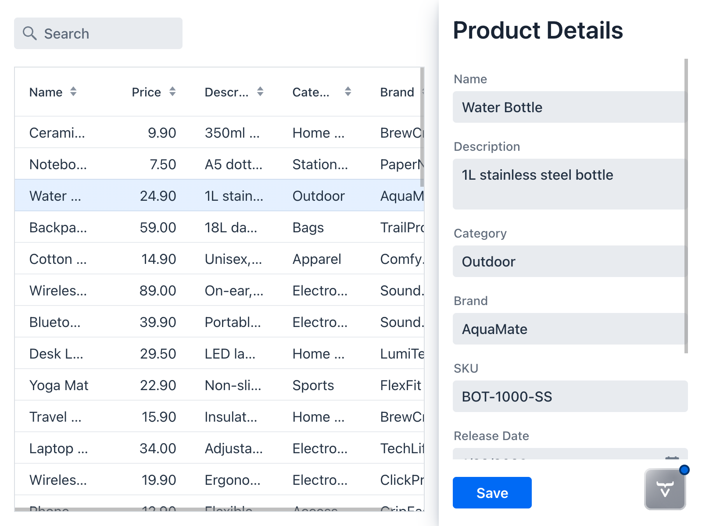
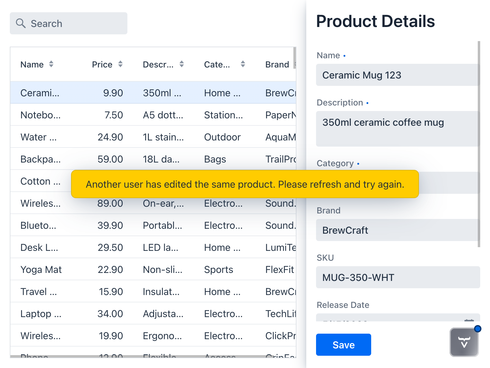

= Edit Product Details
:toclevels: 2

In the previous step, you implemented a drawer and a form for viewing product details in the product catalog. 

In this step, you'll continue working with the drawer and form to make it possible for users to edit and save products. You'll also address some user experience issues discovered along the way.

.More Information Available
[TIP]
This step is based on the <</building-apps/forms-data/add-form#,Add a Form>> guide. Read the guide if you want more detailed information about working with forms in Vaadin.

== Make the Form Editable

In the last step, you made the product form read only by design, as it was only used for viewing data. Now you'll make it editable. This involves two things:

1. Remove the `binder.setReadOnly(true)` method call.
2. Implement a `getFormDataObject()` that validates the form and returns the Form Data Object (FDO).

Change the code of `ProductForm` as follows:

.ProductForm.java
[source,java]
----
package com.example.product;

import com.vaadin.flow.component.Composite;
import com.vaadin.flow.component.datepicker.DatePicker;
import com.vaadin.flow.component.formlayout.FormLayout;
import com.vaadin.flow.component.textfield.BigDecimalField;
import com.vaadin.flow.component.textfield.TextArea;
import com.vaadin.flow.component.textfield.TextField;
import com.vaadin.flow.data.binder.Binder;
import org.jspecify.annotations.Nullable;

// tag::snippet[]
import java.util.Optional;
// end::snippet[]

class ProductForm extends Composite<FormLayout>  {

    private final Binder<ProductDetails> binder;

    ProductForm() {
        // Create components
        var nameField = new TextField("Name");
        var descriptionField = new TextArea("Description");
        var categoryField = new TextField("Category");
        var brandField = new TextField("Brand");
        var skuField = new TextField("SKU");
        var releaseDateField = new DatePicker("Release Date");
        var priceField = new BigDecimalField("Price");
        var discountField = new BigDecimalField("Discount");

        // Layout form
        var layout = getContent();
        layout.add(nameField);
        layout.add(descriptionField);
        layout.add(categoryField);
        layout.add(brandField);
        layout.add(skuField);
        layout.add(releaseDateField);
        layout.add(priceField);
        layout.add(discountField);

        // Bind fields
        binder = new Binder<>();
        binder.forField(nameField)
              .bind(ProductDetails::getName, 
                    ProductDetails::setName);
        binder.forField(descriptionField)
              .bind(ProductDetails::getDescription, 
                    ProductDetails::setDescription);
        binder.forField(categoryField)
              .bind(ProductDetails::getCategory, 
                    ProductDetails::setCategory);
        binder.forField(brandField)
              .bind(ProductDetails::getBrand, 
                    ProductDetails::setBrand);
        binder.forField(skuField)
              .bind(ProductDetails::getSku, 
                    ProductDetails::setSku);
        binder.forField(releaseDateField)
              .bind(ProductDetails::getReleaseDate, 
                    ProductDetails::setReleaseDate);
        binder.forField(priceField)
              .bind(ProductDetails::getPrice, 
                    ProductDetails::setPrice);
        binder.forField(discountField)
              .bind(ProductDetails::getDiscount, 
                    ProductDetails::setDiscount);
// tag::snippet[]
        // Remove the call to binder.setReadOnly(true);
// end::snippet[]
    }

    public void setFormDataObject(@Nullable ProductDetails productDetails) {
        binder.setBean(productDetails);
    }

// tag::snippet[]
    public Optional<ProductDetails> getFormDataObject() {
        if (binder.getBean() == null) {
            throw new IllegalStateException("No form data object");
        }
        if (binder.validate().isOk()) {
            return Optional.of(binder.getBean()); // <1>
        } else {
            return Optional.empty(); // <2>
        }
    }
// end::snippet[]
}
----
<1> Return the FDO if the form is valid.
<2> Return an empty `Optional` if there are validation errors.

The form can now both read and write `ProductDetails` FDOs.

== Add Save Support to the Product Form Drawer

Next, you have to add save support to the product form drawer. This involves adding a save button and doing something when the user clicks the button.

Since the drawer already doesn't know where the `ProductDetails` is coming from, it shouldn't know how to save it either. Therefore, you'll create a callback object that gets called whenever the user clicks the save button. This delegates the responsibility of actually saving the product details to the class that creates the drawer.

Update `ProductFormDrawer` as follows:

.ProductFormDrawer.java
[source,java]
----
package com.example.product;

import com.vaadin.flow.component.Composite;
// tag::snippet[]
import com.vaadin.flow.component.button.Button;
import com.vaadin.flow.component.button.ButtonVariant;
// end::snippet[]
import com.vaadin.flow.component.html.H2;
import com.vaadin.flow.component.orderedlayout.Scroller;
import com.vaadin.flow.component.orderedlayout.VerticalLayout;
import com.vaadin.flow.theme.lumo.LumoUtility;
import org.jspecify.annotations.Nullable;

class ProductFormDrawer extends Composite<VerticalLayout> {

// tag::snippet[]
    @FunctionalInterface
    interface SaveCallback { // <1>
        ProductDetails save(ProductDetails productDetails);
    }

    private final SaveCallback saveCallback;
// end::snippet[]
    private final ProductForm form;

// tag::snippet[]
    ProductFormDrawer(SaveCallback saveCallback) {
        this.saveCallback = saveCallback;
// end::snippet[]

        var header = new H2("Product Details");
        form = new ProductForm();

// tag::snippet[]
        var saveButton = new Button("Save", e -> save()); // <2>
        saveButton.addThemeVariants(ButtonVariant.LUMO_PRIMARY);
// end::snippet[]

        var layout = getContent();
        layout.add(header);
        layout.add(new Scroller(form));
// tag::snippet[]
        layout.add(saveButton); // <3>
// end::snippet[]
        layout.setWidth("300px");
        addClassName(LumoUtility.BoxShadow.MEDIUM);
    }

    public void setProductDetails(@Nullable ProductDetails productDetails) {
        form.setFormDataObject(productDetails);
    }

// tag::snippet[]
    private void save() {
        form.getFormDataObject().ifPresent(productDetails -> {
            var saved = saveCallback.save(productDetails); // <4>
            form.setFormDataObject(saved); // <5>
        });
    }
// end::snippet[]
}
----
<1> Create a functional interface for the save callback. That makes the code easier to read.
<2> Create a save button and call the `save()` method when the user clicks it.
<3> Add the save button below the form.
<4> Call the save callback to save the FDO.
<5> Update the form with a fresh FDO returned by the callback.

.Why does the Save Callback return an object?
[IMPORTANT]
====
Backends often modify the data object during saving, for example by updating a version number (<</building-apps/forms-data/consistency/optimistic-locking#,optimistic locking>>) or a last-modified timestamp.

If the backend updates the same object instance, the callback can simply return that instance. If the backend performs the update elsewhere (such as in the database), it typically returns a new, updated instance instead.

By always returning the object, the callback supports both cases without special handling.
====

At this point, the code no longer compiles. This is because you have changed the signature of the constructor of `ProductFormDrawer`. You'll fix this next.

== Implement the Save Callback

Now update `ProductCatalogView` to pass a save callback to the drawer. The callback will use the repository to persist changes, and then refresh the grid:

.ProductCatalogView.java
[source,java]
----
package com.example.product;

import com.vaadin.flow.component.grid.ColumnTextAlign;
import com.vaadin.flow.component.grid.Grid;
import com.vaadin.flow.component.icon.VaadinIcon;
import com.vaadin.flow.component.orderedlayout.HorizontalLayout;
import com.vaadin.flow.component.orderedlayout.VerticalLayout;
import com.vaadin.flow.component.textfield.TextField;
import com.vaadin.flow.data.value.ValueChangeMode;
import com.vaadin.flow.router.PageTitle;
import com.vaadin.flow.router.Route;

@Route("")
@PageTitle("Product Catalog")
class ProductCatalogView extends HorizontalLayout {

    ProductCatalogView(ProductCatalogItemRepository repository,
                       ProductDetailsRepository productDetailsRepository) {
        // Create components
        var searchField = new TextField();
        searchField.setPlaceholder("Search");
        searchField.setPrefixComponent(VaadinIcon.SEARCH.create());
        searchField.setValueChangeMode(ValueChangeMode.LAZY);

        var grid = new Grid<ProductCatalogItem>();
        grid.addColumn(ProductCatalogItem::name)
            .setHeader("Name")
            .setSortProperty(ProductCatalogItem.SORT_PROPERTY_NAME);
        grid.addColumn(ProductCatalogItem::price)
            .setHeader("Price")
            .setTextAlign(ColumnTextAlign.END)
            .setSortProperty(ProductCatalogItem.SORT_PROPERTY_PRICE);
        grid.addColumn(ProductCatalogItem::description)
            .setHeader("Description")
            .setSortProperty(ProductCatalogItem.SORT_PROPERTY_DESCRIPTION);
        grid.addColumn(ProductCatalogItem::category)
            .setHeader("Category")
            .setSortProperty(ProductCatalogItem.SORT_PROPERTY_CATEGORY);
        grid.addColumn(ProductCatalogItem::brand)
            .setHeader("Brand")
            .setSortProperty(ProductCatalogItem.SORT_PROPERTY_BRAND);
        grid.setItemsPageable(pageable -> repository
            .findByNameContainingIgnoreCase(searchField.getValue(), 
                pageable)
            .getContent()
        );

// tag::snippet[]
        var drawer = new ProductFormDrawer(productDetails -> {
            var saved = productDetailsRepository.save(productDetails); // <1>
            grid.getDataProvider().refreshAll(); // <2>
            return saved; // <3>
        });
// end::snippet[]

        searchField.addValueChangeListener(e ->
                grid.getDataProvider().refreshAll());

        grid.addSelectionListener(e -> {
            var productDetails = e.getFirstSelectedItem()
                .flatMap(item -> productDetailsRepository
                    .findById(item.productId()))
                .orElse(null);
            drawer.setProductDetails(productDetails);
        });

        // Layout view
        setSizeFull();
        setSpacing(false);

        var listLayout = new VerticalLayout(searchField, grid);
        listLayout.setSizeFull();
        grid.setSizeFull();

        add(listLayout, drawer);
        setFlexShrink(0, drawer);
    }
}
----
<1> Call the repository to save the changes to the database.
<2> Refresh the grid so that the changes show up there as well.
<3> Return the updated product details so that the drawer can update the form.

The view should now look like this:

[.device]

You should now be able to select a product, make some changes to it and save them by clicking the [guibutton]*Save* button. The changes should show up in the grid.

== Improve the User Experience

Now clear the selection in the grid, and then click the [guibutton]*Save* button on the empty form. You should see a stack trace in the console output, caused by this error:

 java.lang.IllegalStateException: No form data object

Next, select another product, make a small change to it and save it. The grid should lose its selection even though the product remains open in the form.

Now clear the Price field and save the item again. You should see this error in the console output:

 org.h2.jdbc.JdbcSQLIntegrityConstraintViolationException: NULL not allowed for column "PRICE";

Finally, open the product catalog view in two separate browser windows. Select the same product in both browser windows. Make a change in one of them and save it. This operation should work as expected. Then make a change to the same product in the other window and save it. *Nothing should happen.* In the console output, you should see an error:

 Unexpected error: Optimistic lock exception on saving entity of type com.example.product.ProductDetails

[NOTE]
This is because Spring Data uses <</building-apps/forms-data/consistency/optimistic-locking#,optimistic locking>> to detect conflicts when multiple users try to update the same data. You enabled this with the `@Version` annotation in the `ProductDetails` class.

You have now identified several issues that make the application harder to use:

1. The drawer behaves strangely when no item is selected.
2. Grid selection is not preserved between updates.
3. Required fields are not marked nor validated in the UI.
4. Errors are not reported to the user; they only show up in the console output.

You'll now fix them one by one.

=== Hide Empty Drawer

The drawer has no purpose if there is no selection. Therefore, you should hide it by default and only show it when there are details to show.

Open `ProductFormDrawer` and make the following changes:

.ProductFormDrawer.java
[source,java]
----
package com.example.product;

import com.vaadin.flow.component.Composite;
import com.vaadin.flow.component.button.Button;
import com.vaadin.flow.component.button.ButtonVariant;
import com.vaadin.flow.component.html.H2;
import com.vaadin.flow.component.orderedlayout.Scroller;
import com.vaadin.flow.component.orderedlayout.VerticalLayout;
import com.vaadin.flow.theme.lumo.LumoUtility;
import org.jspecify.annotations.Nullable;

class ProductFormDrawer extends Composite<VerticalLayout> {

    @FunctionalInterface
    interface SaveCallback {
        ProductDetails save(ProductDetails productDetails);
    }

    private final SaveCallback saveCallback;
    private final ProductForm form;

    ProductFormDrawer(SaveCallback saveCallback) {
        this.saveCallback = saveCallback;

        var header = new H2("Product Details");
        form = new ProductForm();

        var saveButton = new Button("Save", e -> save());
        saveButton.addThemeVariants(ButtonVariant.LUMO_PRIMARY);

        var layout = getContent();
        layout.add(header);
        layout.add(new Scroller(form));
        layout.add(saveButton);
        layout.setWidth("300px");
        addClassName(LumoUtility.BoxShadow.MEDIUM);
// tag::snippet[]
        setVisible(false); // <1>
// end::snippet[]
    }

    public void setProductDetails(@Nullable ProductDetails productDetails) {
        form.setFormDataObject(productDetails);
// tag::snippet[]
        setVisible(productDetails != null); // <2>
// end::snippet[]
    }

    private void save() {
        form.getFormDataObject().ifPresent(productDetails -> {
            var saved = saveCallback.save(productDetails);
            form.setFormDataObject(saved);
        });
    }
}
----
<1> When the drawer is first created, it is empty by design and so should be hidden.
<2> Show the drawer only when it contains product details.

Now try the application. The drawer should only show up when you have selected a product in the grid.

=== Preserve Grid Selection

Grid selection is currently lost after saving because the grid relies on object equality when re-selecting items after a refresh. Since `ProductCatalogItem` is a record, all of its components are included in `equals()` by default.

When the grid reloads data, it receives updated items from the database. These updated instances are therefore never equal to the previously selected ones, causing the selection to be cleared.

To fix this, override `equals()` and `hashCode()` in `ProductCatalogItem` so that equality is based only on the item ID:

.ProductCatalogItem.java
[source,java]
----
package com.example.product;

import org.springframework.data.annotation.Id;
import org.springframework.data.relational.core.mapping.Table;

import java.math.BigDecimal;
// tag::snippet[]
import java.util.Objects;
// end::snippet[]

@Table("PRODUCTS")
record ProductCatalogItem(
        @Id long productId,
        String name,
        String description,
        String category,
        String brand,
        BigDecimal price
) {
    static final String SORT_PROPERTY_NAME = "name";
    static final String SORT_PROPERTY_PRICE = "price";
    static final String SORT_PROPERTY_DESCRIPTION = "description";
    static final String SORT_PROPERTY_CATEGORY = "category";
    static final String SORT_PROPERTY_BRAND = "brand";

// tag::snippet[]
    @Override
    public boolean equals(Object o) {
        if (o == null || getClass() != o.getClass()) return false;
        ProductCatalogItem that = (ProductCatalogItem) o;
        return productId == that.productId;
    }

    @Override
    public int hashCode() {
        return Objects.hashCode(productId);
    }
// end::snippet[]
}
----

If you now try the application, you should notice that the grid preserves the selection between saves.

=== Mark Fields as Required

If you look at the `src/main/resources/schema.sql` file, you'll notice the `products` table contains several columns marked as `NOT NULL`. However, the product form does not enforce this at all at the moment. To fix this, you need to mark the corresponding form fields as required.

Make the following changes to `ProductForm`:

.ProductForm.java
[source,java]
----
package com.example.product;

import com.vaadin.flow.component.Composite;
import com.vaadin.flow.component.datepicker.DatePicker;
import com.vaadin.flow.component.formlayout.FormLayout;
import com.vaadin.flow.component.textfield.BigDecimalField;
import com.vaadin.flow.component.textfield.TextArea;
import com.vaadin.flow.component.textfield.TextField;
import com.vaadin.flow.data.binder.Binder;
import org.jspecify.annotations.Nullable;

import java.util.Optional;

class ProductForm extends Composite<FormLayout>  {

    private final Binder<ProductDetails> binder;

    ProductForm() {
        // Create components
        var nameField = new TextField("Name");
        var descriptionField = new TextArea("Description");
        var categoryField = new TextField("Category");
        var brandField = new TextField("Brand");
        var skuField = new TextField("SKU");
        var releaseDateField = new DatePicker("Release Date");
        var priceField = new BigDecimalField("Price");
        var discountField = new BigDecimalField("Discount");

        // Layout form
        var layout = getContent();
        layout.add(nameField);
        layout.add(descriptionField);
        layout.add(categoryField);
        layout.add(brandField);
        layout.add(skuField);
        layout.add(releaseDateField);
        layout.add(priceField);
        layout.add(discountField);

        // Bind fields
        binder = new Binder<>();
        binder.forField(nameField)
// tag::snippet[]        
              .asRequired("Enter name")
// end::snippet[]
              .bind(ProductDetails::getName, 
                    ProductDetails::setName);
        binder.forField(descriptionField)
// tag::snippet[]        
              .asRequired("Enter description")
// end::snippet[]
              .bind(ProductDetails::getDescription, 
                    ProductDetails::setDescription);
        binder.forField(categoryField)
// tag::snippet[]        
              .asRequired("Enter category")
// end::snippet[]
              .bind(ProductDetails::getCategory, 
                    ProductDetails::setCategory);
        binder.forField(brandField)
              .bind(ProductDetails::getBrand, 
                    ProductDetails::setBrand);
        binder.forField(skuField)
// tag::snippet[]        
              .asRequired("Enter SKU")
// end::snippet[]
              .bind(ProductDetails::getSku, 
                    ProductDetails::setSku);
        binder.forField(releaseDateField)
              .bind(ProductDetails::getReleaseDate, 
                    ProductDetails::setReleaseDate);
        binder.forField(priceField)
// tag::snippet[]        
              .asRequired("Enter price")
// end::snippet[]
              .bind(ProductDetails::getPrice, 
                    ProductDetails::setPrice);
        binder.forField(discountField)
              .bind(ProductDetails::getDiscount, 
                    ProductDetails::setDiscount);
    }

    public void setFormDataObject(@Nullable ProductDetails productDetails) {
        binder.setBean(productDetails);
    }

    public Optional<ProductDetails> getFormDataObject() {
        if (binder.getBean() == null) {
            throw new IllegalStateException("No form data object");
        }
        if (binder.validate().isOk()) {
            return Optional.of(binder.getBean());
        } else {
            return Optional.empty();
        }
    }
}
----

Each required field should now have a required field indicator. You should also see an error message if you clear any of the fields.

=== Handle Errors

At the moment, `ProductFormDrawer` does not consider that the save callback can throw an exception. Therefore, any exceptions thrown by the callback are handled by Vaadin's default error handler. 

By default, Vaadin logs all exceptions but does not show any errors to the user. This is good from a security perspective, as it prevents accidental leaks of sensitive technical data to potential attackers. From the user's perspective, it is confusing as the application appears to do nothing.

To fix this, you need to update `ProductFormDrawer` so that it handles exceptions thrown by the save callback. But what kind of error message should it display?

When you design error handling in the UI, you need to distinguish between errors that were triggered by user actions and errors that were caused by something else. You also need to distinguish between errors that the user can recover from, and errors that the user cannot affect in any way.

An optimistic locking error is a good example of a recoverable error that is triggered by a user action. These errors require a clear error message informing the user what went wrong, and what they should do to fix the situation. However, the type of the exception thrown in this case depends on how the save callback is implemented and `ProductFormDrawer` should not need to worry about this.

To fix this, you can delegate the error handling to another callback, like this:

.ProductFormDrawer.java
[source,java]
----
package com.example.product;

import com.vaadin.flow.component.Composite;
import com.vaadin.flow.component.button.Button;
import com.vaadin.flow.component.button.ButtonVariant;
import com.vaadin.flow.component.html.H2;
import com.vaadin.flow.component.orderedlayout.Scroller;
import com.vaadin.flow.component.orderedlayout.VerticalLayout;
import com.vaadin.flow.theme.lumo.LumoUtility;
import org.jspecify.annotations.Nullable;

class ProductFormDrawer extends Composite<VerticalLayout> {

    @FunctionalInterface
    interface SaveCallback {
        ProductDetails save(ProductDetails productDetails);
    }

// tag::snippet[]
    @FunctionalInterface
    interface ErrorCallback {
        void handleException(RuntimeException e);
    }
// end::snippet[]

    private final SaveCallback saveCallback;
// tag::snippet[]
    private final ErrorCallback errorCallback;
// end::snippet[]
    private final ProductForm form;

// tag::snippet[]
    ProductFormDrawer(SaveCallback saveCallback, ErrorCallback errorCallback) {
// end::snippet[]
        this.saveCallback = saveCallback;
// tag::snippet[]
        this.errorCallback = errorCallback;
// end::snippet[]

        var header = new H2("Product Details");
        form = new ProductForm();

        var saveButton = new Button("Save", e -> save());
        saveButton.addThemeVariants(ButtonVariant.LUMO_PRIMARY);

        var layout = getContent();
        layout.add(header);
        layout.add(new Scroller(form));
        layout.add(saveButton);
        layout.setWidth("300px");
        addClassName(LumoUtility.BoxShadow.MEDIUM);
        setVisible(false);
    }

    public void setProductDetails(@Nullable ProductDetails productDetails) {
        form.setFormDataObject(productDetails);
        setVisible(productDetails != null);
    }

    private void save() {
        form.getFormDataObject().ifPresent(productDetails -> {
// tag::snippet[]
            try {
                var saved = saveCallback.save(productDetails);
                form.setFormDataObject(saved);
            } catch (RuntimeException e) {
                errorCallback.handleException(e);
            }
// end::snippet[]
        });
    }
}
----

Next, implement the error handler in `ProductCatalogView` like this:

.ProductCatalogView.java
[source,java]
----
package com.example.product;

import com.vaadin.flow.component.grid.ColumnTextAlign;
import com.vaadin.flow.component.grid.Grid;
import com.vaadin.flow.component.icon.VaadinIcon;
// tag::snippet[]
import com.vaadin.flow.component.notification.Notification;
import com.vaadin.flow.component.notification.NotificationVariant;
// end::snippet[]
import com.vaadin.flow.component.orderedlayout.HorizontalLayout;
import com.vaadin.flow.component.orderedlayout.VerticalLayout;
import com.vaadin.flow.component.textfield.TextField;
import com.vaadin.flow.data.value.ValueChangeMode;
import com.vaadin.flow.router.PageTitle;
import com.vaadin.flow.router.Route;
// tag::snippet[]
import org.springframework.dao.OptimisticLockingFailureException;
// end::snippet[]

@Route("")
@PageTitle("Product Catalog")
class ProductCatalogView extends HorizontalLayout {

    ProductCatalogView(ProductCatalogItemRepository repository,
                       ProductDetailsRepository productDetailsRepository) {
        // Create components
        var searchField = new TextField();
        searchField.setPlaceholder("Search");
        searchField.setPrefixComponent(VaadinIcon.SEARCH.create());
        searchField.setValueChangeMode(ValueChangeMode.LAZY);

        var grid = new Grid<ProductCatalogItem>();
        grid.addColumn(ProductCatalogItem::name)
            .setHeader("Name")
            .setSortProperty(ProductCatalogItem.SORT_PROPERTY_NAME);
        grid.addColumn(ProductCatalogItem::price)
            .setHeader("Price")
            .setTextAlign(ColumnTextAlign.END)
            .setSortProperty(ProductCatalogItem.SORT_PROPERTY_PRICE);
        grid.addColumn(ProductCatalogItem::description)
            .setHeader("Description")
            .setSortProperty(ProductCatalogItem.SORT_PROPERTY_DESCRIPTION);
        grid.addColumn(ProductCatalogItem::category)
            .setHeader("Category")
            .setSortProperty(ProductCatalogItem.SORT_PROPERTY_CATEGORY);
        grid.addColumn(ProductCatalogItem::brand)
            .setHeader("Brand")
            .setSortProperty(ProductCatalogItem.SORT_PROPERTY_BRAND);
        grid.setItemsPageable(pageable -> repository
            .findByNameContainingIgnoreCase(searchField.getValue(), 
                pageable)
            .getContent()
        );

        var drawer = new ProductFormDrawer(productDetails -> {
            var saved = productDetailsRepository.save(productDetails);
            grid.getDataProvider().refreshAll();
            return saved;
// tag::snippet[]
        }, this::handleException); // <1>
// end::snippet[]

        searchField.addValueChangeListener(e ->
                grid.getDataProvider().refreshAll());

        grid.addSelectionListener(e -> {
            var productDetails = e.getFirstSelectedItem()
                .flatMap(item -> productDetailsRepository
                    .findById(item.productId()))
                .orElse(null);
            drawer.setProductDetails(productDetails);
        });

        // Layout view
        setSizeFull();
        setSpacing(false);

        var listLayout = new VerticalLayout(searchField, grid);
        listLayout.setSizeFull();
        grid.setSizeFull();

        add(listLayout, drawer);
        setFlexShrink(0, drawer);
    }

// tag::snippet[]
    private void handleException(RuntimeException exception) {
        if (exception instanceof OptimisticLockingFailureException) {
            var notification = new Notification(
                "Another user has edited the same product. "
                + "Please refresh and try again.");
            notification.setPosition(Notification.Position.MIDDLE); // <2>
            notification.addThemeVariants(NotificationVariant.LUMO_WARNING); // <3>
            notification.setDuration(3000); // <4>
            notification.open();
        } else {
            // Delegate to Vaadin's default error handler
            throw exception;
        }
    }
// end::snippet[]
}
----
<1> Implement the error handler as its own method.
<2> Show the notification in the middle of the screen.
<3> Make the notification yellow.
<4> Automatically hide the notification after 3000 ms.

Now, whenever a user triggers an optimistic locking error, a notification should pop up:

[.device]

== Next Steps

You have now turned the read-only product form drawer into a fully functional edit form, complete with validation and error handling. You have also improved the user experience of the application. 

Next, you'll implement support for adding new products to the catalog. Proceed to the <<add-data#,Add Products>> step to continue the tutorial.