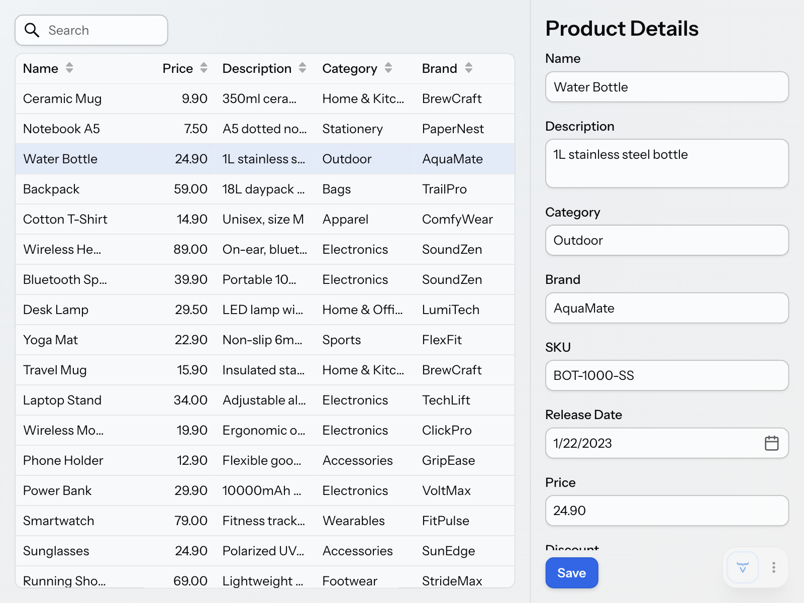
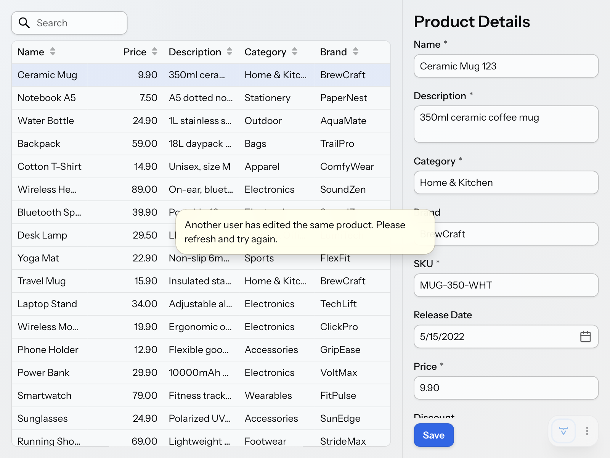

= Edit Product Details
:toclevels: 2

In the previous step, you implemented a drawer and a form for viewing product details in the product catalog.

In this step, you'll continue working with the drawer and form to make it possible for users to edit and save products. Because the view now starts changing data, you'll add an application service that validates the data before storing it. You'll also address some user experience issues discovered along the way.

.More Information Available
[TIP]
This step is based on the <</building-apps/forms-data/add-form#,Add a Form>> guide. Read the guide if you want more detailed information about working with forms in Vaadin.

== Make the Form Editable

In the last step, you made the product form read only by design, as it was only used for viewing data. Now you'll make it editable. This involves two things:

1. Remove the `binder.setReadOnly(true)` method call.
2. Implement a `getFormDataObject()` that validates the form and returns the Form Data Object (FDO).

Change the code of `ProductForm` as follows:

.ProductForm.java
[source,java]
----
package com.example.product;

import com.vaadin.flow.component.Composite;
import com.vaadin.flow.component.datepicker.DatePicker;
import com.vaadin.flow.component.formlayout.FormLayout;
import com.vaadin.flow.component.textfield.BigDecimalField;
import com.vaadin.flow.component.textfield.TextArea;
import com.vaadin.flow.component.textfield.TextField;
import com.vaadin.flow.data.binder.Binder;
import org.jspecify.annotations.Nullable;

// tag::snippet[]
import java.util.Optional;
// end::snippet[]

class ProductForm extends Composite<FormLayout>  {

    private final Binder<ProductDetails> binder;

    ProductForm() {
        // Create components
        var nameField = new TextField("Name");
        var descriptionField = new TextArea("Description");
        var categoryField = new TextField("Category");
        var brandField = new TextField("Brand");
        var skuField = new TextField("SKU");
        var releaseDateField = new DatePicker("Release Date");
        var priceField = new BigDecimalField("Price");
        var discountField = new BigDecimalField("Discount");

        // Layout form
        var layout = getContent();
        layout.add(nameField);
        layout.add(descriptionField);
        layout.add(categoryField);
        layout.add(brandField);
        layout.add(skuField);
        layout.add(releaseDateField);
        layout.add(priceField);
        layout.add(discountField);

        // Bind fields
        binder = new Binder<>();
        binder.forField(nameField)
              .bind(ProductDetails::getName,
                    ProductDetails::setName);
        binder.forField(descriptionField)
              .bind(ProductDetails::getDescription,
                    ProductDetails::setDescription);
        binder.forField(categoryField)
              .bind(ProductDetails::getCategory,
                    ProductDetails::setCategory);
        binder.forField(brandField)
              .bind(ProductDetails::getBrand,
                    ProductDetails::setBrand);
        binder.forField(skuField)
              .bind(ProductDetails::getSku,
                    ProductDetails::setSku);
        binder.forField(releaseDateField)
              .bind(ProductDetails::getReleaseDate,
                    ProductDetails::setReleaseDate);
        binder.forField(priceField)
              .bind(ProductDetails::getPrice,
                    ProductDetails::setPrice);
        binder.forField(discountField)
              .bind(ProductDetails::getDiscount,
                    ProductDetails::setDiscount);
// tag::snippet[]
        // Remove the call to binder.setReadOnly(true);
// end::snippet[]
    }

    public void setFormDataObject(@Nullable ProductDetails productDetails) {
        binder.setBean(productDetails);
    }

// tag::snippet[]
    public Optional<ProductDetails> getFormDataObject() {
        if (binder.getBean() == null) {
            throw new IllegalStateException("No form data object");
        }
        if (binder.validate().isOk()) {
            return Optional.of(binder.getBean()); // <1>
        } else {
            return Optional.empty(); // <2>
        }
    }
// end::snippet[]
}
----
<1> Return the FDO if the form is valid.
<2> Return an empty `Optional` if there are validation errors.

The form can now both read and write `ProductDetails` FDOs.

== Add an Application Service

So far, `ProductCatalogView` has called the repositories directly. That has been fine, because the view has only read data, and has passed its parameters, such as the search term, straight to the repositories. See <</building-apps/business-logic/add-service#calling-repositories-from-views,Calling Repositories from Views>> for when a view can do this.

Saving changes is different. The data comes from the user, and it has to be valid before it's stored. Later in this step, you'll make the form validate its input, but the code that stores the data shouldn't trust every caller to have done so. When a view starts changing data, it's time to introduce an <</building-apps/business-logic/add-service#,application service>>. The service sits between the view and the repositories, and validates the input before storing it.

You'll use Jakarta Bean Validation to declare and check the rules. Start by adding the following dependency inside the `<dependencies>` section of `pom.xml`:

[source,xml]
----
<dependency>
    <groupId>org.springframework.boot</groupId>
    <artifactId>spring-boot-starter-validation</artifactId>
</dependency>
----

Then refresh the project in your IDE.

Next, declare the validation rules by adding constraint annotations to the fields of `ProductDetails`. The rules match the constraints of the `products` table in `schema.sql`:

.ProductDetails.java
[source,java]
----
package com.example.product;

// tag::snippet[]
import jakarta.validation.constraints.DecimalMax;
import jakarta.validation.constraints.DecimalMin;
import jakarta.validation.constraints.NotBlank;
import jakarta.validation.constraints.NotNull;
import jakarta.validation.constraints.PositiveOrZero;
import jakarta.validation.constraints.Size;
// end::snippet[]
import org.springframework.data.annotation.Id;
import org.springframework.data.annotation.Version;
import org.springframework.data.relational.core.mapping.Table;

import java.math.BigDecimal;
import java.time.LocalDate;

@Table("PRODUCTS")
class ProductDetails {

    @Id
    private Long productId;
    @Version
    private Long version;
// tag::snippet[]
    @NotBlank @Size(max = 100) // <1>
    private String name;
    @NotBlank @Size(max = 500)
    private String description;
    @NotBlank @Size(max = 100)
    private String category;
    @Size(max = 100) // <2>
    private String brand;
    @NotBlank @Size(max = 50)
    private String sku;
    private LocalDate releaseDate;
    @NotNull @PositiveOrZero // <3>
    private BigDecimal price;
    @DecimalMin("0") @DecimalMax("100") // <4>
    private BigDecimal discount;
// end::snippet[]

    public Long getProductId() {
        return productId;
    }

    public Long getVersion() {
        return version;
    }

    public String getName() {
        return name;
    }

    public void setName(String name) {
        this.name = name;
    }

    public String getDescription() {
        return description;
    }

    public void setDescription(String description) {
        this.description = description;
    }

    public String getCategory() {
        return category;
    }

    public void setCategory(String category) {
        this.category = category;
    }

    public String getBrand() {
        return brand;
    }

    public void setBrand(String brand) {
        this.brand = brand;
    }

    public String getSku() {
        return sku;
    }

    public void setSku(String sku) {
        this.sku = sku;
    }

    public LocalDate getReleaseDate() {
        return releaseDate;
    }

    public void setReleaseDate(LocalDate releaseDate) {
        this.releaseDate = releaseDate;
    }

    public BigDecimal getPrice() {
        return price;
    }

    public void setPrice(BigDecimal price) {
        this.price = price;
    }

    public BigDecimal getDiscount() {
        return discount;
    }

    public void setDiscount(BigDecimal discount) {
        this.discount = discount;
    }
}
----
<1> The name is required, and the database column holds at most 100 characters. `@NotBlank` also rejects names that contain only whitespace.
<2> The brand is optional, but it can't be longer than the database column.
<3> The price is required, and it can't be negative.
<4> The discount is a percentage between 0 and 100.

The annotations only declare the rules. Something has to check them, and that's the job of the service. Create a new class named `ProductCatalogService` in the `com.example.product` package:

.ProductCatalogService.java
[source,java]
----
package com.example.product;

import jakarta.validation.Valid;
import org.springframework.data.domain.Pageable;
import org.springframework.stereotype.Service;
import org.springframework.transaction.annotation.Transactional;
import org.springframework.validation.annotation.Validated;

import java.util.List;
import java.util.Optional;

@Service
@Validated // <1>
@Transactional(readOnly = true) // <2>
class ProductCatalogService {

    private final ProductCatalogItemRepository productCatalogItemRepository;
    private final ProductDetailsRepository productDetailsRepository;

    public ProductCatalogService(
            ProductCatalogItemRepository productCatalogItemRepository,
            ProductDetailsRepository productDetailsRepository) {
        this.productCatalogItemRepository = productCatalogItemRepository;
        this.productDetailsRepository = productDetailsRepository;
    }

    public List<ProductCatalogItem> findItems(String searchTerm,
            Pageable pageable) {
        return productCatalogItemRepository
            .findByNameContainingIgnoreCase(searchTerm, pageable).getContent();
    }

    public Optional<ProductDetails> findDetailsById(Long id) {
        return productDetailsRepository.findById(id);
    }

    @Transactional // <3>
    public ProductDetails save(@Valid ProductDetails productDetails) { // <4>
        return productDetailsRepository.save(productDetails);
    }
}
----
<1> `@Validated` makes Spring validate the method parameters that are annotated with `@Valid`.
<2> All methods run inside read-only transactions by default.
<3> Overrides the class-level annotation, since this method writes data.
<4> Spring validates `productDetails` before the method runs. If it breaks any of the rules, Spring throws a `ConstraintViolationException`, and nothing is saved.

The service is now responsible for validating the input and for the transactions, as described in the <</building-apps/business-logic/add-service#,Add a Service>> guide.

Only `save()` does any real work. The other two methods delegate to the repositories, and that's fine. Once the view changes data, all its data access should go through the service, which makes the service the single way into the product catalog. For example, if you later protect the service with <</building-apps/security/protect-services#,method security>>, the protection covers everything the view does. You'll switch the view over to the service when you implement saving, later in this step.

== Add Save Support to the Product Form Drawer

Next, you have to add save support to the product form drawer. This involves adding a save button and doing something when the user clicks the button.

Since the drawer already doesn't know where the `ProductDetails` is coming from, it shouldn't know how to save it either. Therefore, you'll create a callback object that gets called whenever the user clicks the save button. This delegates the responsibility of actually saving the product details to the class that creates the drawer.

Update `ProductFormDrawer` as follows:

.ProductFormDrawer.java
[source,java]
----
package com.example.product;

import com.vaadin.flow.component.Composite;
// tag::snippet[]
import com.vaadin.flow.component.button.Button;
import com.vaadin.flow.component.button.ButtonVariant;
// end::snippet[]
import com.vaadin.flow.component.html.H2;
import com.vaadin.flow.component.orderedlayout.Scroller;
import com.vaadin.flow.component.orderedlayout.VerticalLayout;
import org.jspecify.annotations.Nullable;

class ProductFormDrawer extends Composite<VerticalLayout> {

// tag::snippet[]
    @FunctionalInterface
    interface SaveCallback { // <1>
        ProductDetails save(ProductDetails productDetails);
    }

    private final SaveCallback saveCallback;
// end::snippet[]
    private final ProductForm form;

// tag::snippet[]
    ProductFormDrawer(SaveCallback saveCallback) {
        this.saveCallback = saveCallback;
// end::snippet[]

        var header = new H2("Product Details");
        form = new ProductForm();

// tag::snippet[]
        var saveButton = new Button("Save", e -> save()); // <2>
        saveButton.addThemeVariants(ButtonVariant.PRIMARY);
// end::snippet[]

        var layout = getContent();
        layout.add(header);
        layout.add(new Scroller(form));
// tag::snippet[]
        layout.add(saveButton); // <3>
// end::snippet[]
        layout.setWidth("300px");
        getStyle().setBorderLeft("1px solid var(--vaadin-border-color-secondary)");
    }

    public void setProductDetails(@Nullable ProductDetails productDetails) {
        form.setFormDataObject(productDetails);
    }

// tag::snippet[]
    private void save() {
        form.getFormDataObject().ifPresent(productDetails -> {
            var saved = saveCallback.save(productDetails); // <4>
            form.setFormDataObject(saved); // <5>
        });
    }
// end::snippet[]
}
----
<1> Create a functional interface for the save callback. That makes the code easier to read.
<2> Create a save button and call the `save()` method when the user clicks it.
<3> Add the save button below the form.
<4> Call the save callback to save the FDO.
<5> Update the form with a fresh FDO returned by the callback.

.Why does the Save Callback return an object?
[IMPORTANT]
====
Backends often modify the data object during saving, for example by updating a version number (<</building-apps/forms-data/consistency/optimistic-locking#,optimistic locking>>) or a last-modified timestamp.

If the backend updates the same object instance, the callback can simply return that instance. If the backend performs the update elsewhere (such as in the database), it typically returns a new, updated instance instead.

By always returning the object, the callback supports both cases without special handling.
====

At this point, the code no longer compiles. This is because you have changed the signature of the constructor of `ProductFormDrawer`. You'll fix this next.

== Implement the Save Callback

Now update `ProductCatalogView` to use the service instead of the repositories, and pass a save callback to the drawer. The callback calls the service to validate and save the changes, and then refreshes the grid:

.ProductCatalogView.java
[source,java]
----
package com.example.product;

import com.vaadin.flow.component.grid.ColumnTextAlign;
import com.vaadin.flow.component.grid.Grid;
import com.vaadin.flow.component.icon.VaadinIcon;
import com.vaadin.flow.component.orderedlayout.HorizontalLayout;
import com.vaadin.flow.component.orderedlayout.VerticalLayout;
import com.vaadin.flow.component.textfield.TextField;
import com.vaadin.flow.data.value.ValueChangeMode;
import com.vaadin.flow.router.PageTitle;
import com.vaadin.flow.router.Route;

@Route("")
@PageTitle("Product Catalog")
class ProductCatalogView extends HorizontalLayout {

// tag::snippet[]
    ProductCatalogView(ProductCatalogService service) { // <1>
// end::snippet[]
        // Create components
        var searchField = new TextField();
        searchField.setPlaceholder("Search");
        searchField.setPrefixComponent(VaadinIcon.SEARCH.create());
        searchField.setValueChangeMode(ValueChangeMode.LAZY);

        var grid = new Grid<ProductCatalogItem>();
        grid.addColumn(ProductCatalogItem::name)
            .setHeader("Name")
            .setSortProperty(ProductCatalogItem.SORT_PROPERTY_NAME);
        grid.addColumn(ProductCatalogItem::price)
            .setHeader("Price")
            .setTextAlign(ColumnTextAlign.END)
            .setSortProperty(ProductCatalogItem.SORT_PROPERTY_PRICE);
        grid.addColumn(ProductCatalogItem::description)
            .setHeader("Description")
            .setSortProperty(ProductCatalogItem.SORT_PROPERTY_DESCRIPTION);
        grid.addColumn(ProductCatalogItem::category)
            .setHeader("Category")
            .setSortProperty(ProductCatalogItem.SORT_PROPERTY_CATEGORY);
        grid.addColumn(ProductCatalogItem::brand)
            .setHeader("Brand")
            .setSortProperty(ProductCatalogItem.SORT_PROPERTY_BRAND);
// tag::snippet[]
        grid.setItemsPageable(pageable -> service
            .findItems(searchField.getValue(), pageable) // <2>
        );
// end::snippet[]

// tag::snippet[]
        var drawer = new ProductFormDrawer(productDetails -> {
            var saved = service.save(productDetails); // <3>
            grid.getDataProvider().refreshAll(); // <4>
            return saved; // <5>
        });
// end::snippet[]

        searchField.addValueChangeListener(e ->
                grid.getDataProvider().refreshAll());

        grid.addSelectionListener(e -> {
            var productDetails = e.getFirstSelectedItem()
// tag::snippet[]
                .flatMap(item -> service.findDetailsById(item.productId())) // <6>
// end::snippet[]
                .orElse(null);
            drawer.setProductDetails(productDetails);
        });

        // Layout view
        setSizeFull();
        setSpacing(false);

        var listLayout = new VerticalLayout(searchField, grid);
        listLayout.setSizeFull();
        listLayout.setMinWidth("0");
        grid.setSizeFull();

        add(listLayout, drawer);
        setFlexShrink(0, drawer);
    }
}
----
<1> Inject the service instead of the repositories.
<2> Fetch the items for the grid through the service.
<3> Call the service to validate the changes and save them to the database.
<4> Refresh the grid so that the changes show up there as well.
<5> Return the updated product details so that the drawer can update the form.
<6> Fetch the product details through the service.

Restart the application, since you have added a dependency and changed the data model. The view should now look like this:

[.device]

You should now be able to select a product, make some changes to it and save them by clicking the [guibutton]*Save* button. The changes should show up in the grid.

== Improve the User Experience

Now clear the selection in the grid, and then click the [guibutton]*Save* button on the empty form. You should see a stack trace in the console output, caused by this error:

 java.lang.IllegalStateException: No form data object

Next, select another product, make a small change to it and save it. The grid should lose its selection even though the product remains open in the form.

Now clear the Price field and save the item again. Nothing happens in the browser, but you should see this error in the console output:

 jakarta.validation.ConstraintViolationException: save.productDetails.price: must not be null

The service rejected the product before it reached the database, which is what it's there for. However, the user gets no feedback at all.

Finally, open the product catalog view in two separate browser windows. Select the same product in both browser windows. Make a change in one of them and save it. This operation should work as expected. Then make a change to the same product in the other window and save it. *Nothing should happen.* In the console output, you should see an error:

 Unexpected error: Optimistic lock exception on saving entity of type com.example.product.ProductDetails

[NOTE]
This is because Spring Data uses <</building-apps/forms-data/consistency/optimistic-locking#,optimistic locking>> to detect conflicts when multiple users try to update the same data. You enabled this with the `@Version` annotation in the `ProductDetails` class.

You have now identified several issues that make the application harder to use:

1. The drawer behaves strangely when no item is selected.
2. Grid selection is not preserved between updates.
3. The form doesn't validate its input. Only the service does, and the user can't see why saving failed.
4. Errors are not reported to the user; they only show up in the console output.

You'll now fix them one by one.

=== Hide Empty Drawer

The drawer has no purpose if there is no selection. Therefore, you should hide it by default and only show it when there are details to show.

Open `ProductFormDrawer` and make the following changes:

.ProductFormDrawer.java
[source,java]
----
package com.example.product;

import com.vaadin.flow.component.Composite;
import com.vaadin.flow.component.button.Button;
import com.vaadin.flow.component.button.ButtonVariant;
import com.vaadin.flow.component.html.H2;
import com.vaadin.flow.component.orderedlayout.Scroller;
import com.vaadin.flow.component.orderedlayout.VerticalLayout;
import org.jspecify.annotations.Nullable;

class ProductFormDrawer extends Composite<VerticalLayout> {

    @FunctionalInterface
    interface SaveCallback {
        ProductDetails save(ProductDetails productDetails);
    }

    private final SaveCallback saveCallback;
    private final ProductForm form;

    ProductFormDrawer(SaveCallback saveCallback) {
        this.saveCallback = saveCallback;

        var header = new H2("Product Details");
        form = new ProductForm();

        var saveButton = new Button("Save", e -> save());
        saveButton.addThemeVariants(ButtonVariant.PRIMARY);

        var layout = getContent();
        layout.add(header);
        layout.add(new Scroller(form));
        layout.add(saveButton);
        layout.setWidth("300px");
        getStyle().setBorderLeft("1px solid var(--vaadin-border-color-secondary)");
// tag::snippet[]
        setVisible(false); // <1>
// end::snippet[]
    }

    public void setProductDetails(@Nullable ProductDetails productDetails) {
        form.setFormDataObject(productDetails);
// tag::snippet[]
        setVisible(productDetails != null); // <2>
// end::snippet[]
    }

    private void save() {
        form.getFormDataObject().ifPresent(productDetails -> {
            var saved = saveCallback.save(productDetails);
            form.setFormDataObject(saved);
        });
    }
}
----
<1> When the drawer is first created, it is empty by design and so should be hidden.
<2> Show the drawer only when it contains product details.

Now try the application. The drawer should only show up when you have selected a product in the grid.

=== Preserve Grid Selection

Grid selection is currently lost after saving because the grid relies on object equality when re-selecting items after a refresh. Since `ProductCatalogItem` is a record, all of its components are included in `equals()` by default.

When the grid reloads data, it receives updated items from the database. These updated instances are therefore never equal to the previously selected ones, causing the selection to be cleared.

To fix this, override `equals()` and `hashCode()` in `ProductCatalogItem` so that equality is based only on the item ID:

.ProductCatalogItem.java
[source,java]
----
package com.example.product;

import org.springframework.data.annotation.Id;
import org.springframework.data.relational.core.mapping.Table;

import java.math.BigDecimal;
// tag::snippet[]
import java.util.Objects;
// end::snippet[]

@Table("PRODUCTS")
record ProductCatalogItem(
        @Id long productId,
        String name,
        String description,
        String category,
        String brand,
        BigDecimal price
) {
    static final String SORT_PROPERTY_NAME = "name";
    static final String SORT_PROPERTY_PRICE = "price";
    static final String SORT_PROPERTY_DESCRIPTION = "description";
    static final String SORT_PROPERTY_CATEGORY = "category";
    static final String SORT_PROPERTY_BRAND = "brand";

// tag::snippet[]
    @Override
    public boolean equals(Object o) {
        if (o == null || getClass() != o.getClass()) return false;
        ProductCatalogItem that = (ProductCatalogItem) o;
        return productId == that.productId;
    }

    @Override
    public int hashCode() {
        return Objects.hashCode(productId);
    }
// end::snippet[]
}
----

If you now try the application, you should notice that the grid preserves the selection between saves.

=== Validate the Form

The service now rejects invalid products, but that's a safety net, not a user experience. Users should see what's wrong next to the field they need to fix, before the data even reaches the service. The form should therefore check the same rules as the service: required fields, maximum lengths, and number ranges.

Make the following changes to `ProductForm`:

.ProductForm.java
[source,java]
----
package com.example.product;

import com.vaadin.flow.component.Composite;
import com.vaadin.flow.component.datepicker.DatePicker;
import com.vaadin.flow.component.formlayout.FormLayout;
// tag::snippet[]
import com.vaadin.flow.component.html.Span;
// end::snippet[]
import com.vaadin.flow.component.textfield.BigDecimalField;
import com.vaadin.flow.component.textfield.TextArea;
import com.vaadin.flow.component.textfield.TextField;
import com.vaadin.flow.data.binder.Binder;
// tag::snippet[]
import com.vaadin.flow.data.validator.BigDecimalRangeValidator;
// end::snippet[]
import org.jspecify.annotations.Nullable;

// tag::snippet[]
import java.math.BigDecimal;
// end::snippet[]
import java.util.Optional;

class ProductForm extends Composite<FormLayout>  {

    private final Binder<ProductDetails> binder;

    ProductForm() {
        // Create components
        var nameField = new TextField("Name");
// tag::snippet[]
        nameField.setMaxLength(100); // <1>
// end::snippet[]
        var descriptionField = new TextArea("Description");
// tag::snippet[]
        descriptionField.setMaxLength(500);
// end::snippet[]
        var categoryField = new TextField("Category");
// tag::snippet[]
        categoryField.setMaxLength(100);
// end::snippet[]
        var brandField = new TextField("Brand");
// tag::snippet[]
        brandField.setMaxLength(100);
// end::snippet[]
        var skuField = new TextField("SKU");
// tag::snippet[]
        skuField.setMaxLength(50);
// end::snippet[]
        var releaseDateField = new DatePicker("Release Date");
        var priceField = new BigDecimalField("Price");
        var discountField = new BigDecimalField("Discount");
// tag::snippet[]
        discountField.setSuffixComponent(new Span("%")); // <2>
// end::snippet[]

        // Layout form
        var layout = getContent();
        layout.add(nameField);
        layout.add(descriptionField);
        layout.add(categoryField);
        layout.add(brandField);
        layout.add(skuField);
        layout.add(releaseDateField);
        layout.add(priceField);
        layout.add(discountField);

        // Bind fields
        binder = new Binder<>();
        binder.forField(nameField)
// tag::snippet[]
              .asRequired("Enter name") // <3>
// end::snippet[]
              .bind(ProductDetails::getName,
                    ProductDetails::setName);
        binder.forField(descriptionField)
// tag::snippet[]
              .asRequired("Enter description")
// end::snippet[]
              .bind(ProductDetails::getDescription,
                    ProductDetails::setDescription);
        binder.forField(categoryField)
// tag::snippet[]
              .asRequired("Enter category")
// end::snippet[]
              .bind(ProductDetails::getCategory,
                    ProductDetails::setCategory);
        binder.forField(brandField)
              .bind(ProductDetails::getBrand,
                    ProductDetails::setBrand);
        binder.forField(skuField)
// tag::snippet[]
              .asRequired("Enter SKU")
// end::snippet[]
              .bind(ProductDetails::getSku,
                    ProductDetails::setSku);
        binder.forField(releaseDateField)
              .bind(ProductDetails::getReleaseDate,
                    ProductDetails::setReleaseDate);
        binder.forField(priceField)
// tag::snippet[]
              .asRequired("Enter price")
              .withValidator(new BigDecimalRangeValidator(
                  "Enter a price of 0 or more", BigDecimal.ZERO, null)) // <4>
// end::snippet[]
              .bind(ProductDetails::getPrice,
                    ProductDetails::setPrice);
        binder.forField(discountField)
// tag::snippet[]
              .withValidator(new BigDecimalRangeValidator(
                  "Enter a discount between 0 and 100",
                  BigDecimal.ZERO, BigDecimal.valueOf(100))) // <5>
// end::snippet[]
              .bind(ProductDetails::getDiscount,
                    ProductDetails::setDiscount);
    }

    public void setFormDataObject(@Nullable ProductDetails productDetails) {
        binder.setBean(productDetails);
    }

    public Optional<ProductDetails> getFormDataObject() {
        if (binder.getBean() == null) {
            throw new IllegalStateException("No form data object");
        }
        if (binder.validate().isOk()) {
            return Optional.of(binder.getBean());
        } else {
            return Optional.empty();
        }
    }
}
----
<1> `setMaxLength()` keeps the user from entering more characters than the database column holds. The field also checks the length on the server, and the binder includes that check when it validates the form.
<2> Show a percent sign after the discount, so that the user knows it's a percentage.
<3> `asRequired()` marks the field as required, and shows the error message if the user leaves it empty.
<4> The price can't be negative. A `null` maximum means that there is no upper limit.
<5> The discount must be between 0 and 100. The user can still leave it empty.

Each required field should now have a required indicator. Try clearing the Price field, entering a negative price, or entering a discount of 150. The form shows an error message next to the field, and doesn't call the service until you fix it.

The rules now exist in two places: as annotations on `ProductDetails`, and as validators in the form. This is deliberate. The form validates to help the user, and the service validates to protect the data, since it can't trust every caller to have validated the input. If you change a rule, change it in both places. See the <</building-apps/forms-data/consistency/validation#,Validation>> guide for more about validation in the application layer.

You may wonder why the form doesn't read the annotations instead. Vaadin has a `BeanValidationBinder` that does this, but it only applies the annotations to fields that you bind by property name, such as `bind("name")`. This tutorial binds fields with method references instead, so that the compiler checks that the properties exist.

=== Handle Errors

At the moment, `ProductFormDrawer` does not consider that the save callback can throw an exception. Therefore, any exceptions thrown by the callback are handled by Vaadin's default error handler.

By default, Vaadin logs all exceptions but does not show any errors to the user. This is good from a security perspective, as it prevents accidental leaks of sensitive technical data to potential attackers. From the user's perspective, it is confusing as the application appears to do nothing.

To fix this, you need to update `ProductFormDrawer` so that it handles exceptions thrown by the save callback. But what kind of error message should it display?

When you design error handling in the UI, you need to distinguish between errors that were triggered by user actions and errors that were caused by something else. You also need to distinguish between errors that the user can recover from, and errors that the user cannot affect in any way.

An optimistic locking error is a good example of a recoverable error that is triggered by a user action. These errors require a clear error message informing the user what went wrong, and what they should do to fix the situation. However, the type of the exception thrown in this case depends on how the save callback is implemented and `ProductFormDrawer` should not need to worry about this.

To fix this, you can delegate the error handling to another callback, like this:

.ProductFormDrawer.java
[source,java]
----
package com.example.product;

import com.vaadin.flow.component.Composite;
import com.vaadin.flow.component.button.Button;
import com.vaadin.flow.component.button.ButtonVariant;
import com.vaadin.flow.component.html.H2;
import com.vaadin.flow.component.orderedlayout.Scroller;
import com.vaadin.flow.component.orderedlayout.VerticalLayout;
import org.jspecify.annotations.Nullable;

class ProductFormDrawer extends Composite<VerticalLayout> {

    @FunctionalInterface
    interface SaveCallback {
        ProductDetails save(ProductDetails productDetails);
    }

// tag::snippet[]
    @FunctionalInterface
    interface ErrorCallback {
        void handleException(RuntimeException e);
    }
// end::snippet[]

    private final SaveCallback saveCallback;
// tag::snippet[]
    private final ErrorCallback errorCallback;
// end::snippet[]
    private final ProductForm form;

// tag::snippet[]
    ProductFormDrawer(SaveCallback saveCallback, ErrorCallback errorCallback) {
// end::snippet[]
        this.saveCallback = saveCallback;
// tag::snippet[]
        this.errorCallback = errorCallback;
// end::snippet[]

        var header = new H2("Product Details");
        form = new ProductForm();

        var saveButton = new Button("Save", e -> save());
        saveButton.addThemeVariants(ButtonVariant.PRIMARY);

        var layout = getContent();
        layout.add(header);
        layout.add(new Scroller(form));
        layout.add(saveButton);
        layout.setWidth("300px");
        getStyle().setBorderLeft("1px solid var(--vaadin-border-color-secondary)");
        setVisible(false);
    }

    public void setProductDetails(@Nullable ProductDetails productDetails) {
        form.setFormDataObject(productDetails);
        setVisible(productDetails != null);
    }

    private void save() {
        form.getFormDataObject().ifPresent(productDetails -> {
// tag::snippet[]
            try {
                var saved = saveCallback.save(productDetails);
                form.setFormDataObject(saved);
            } catch (RuntimeException e) {
                errorCallback.handleException(e);
            }
// end::snippet[]
        });
    }
}
----

Next, implement the error handler in `ProductCatalogView` like this:

.ProductCatalogView.java
[source,java]
----
package com.example.product;

import com.vaadin.flow.component.grid.ColumnTextAlign;
import com.vaadin.flow.component.grid.Grid;
import com.vaadin.flow.component.icon.VaadinIcon;
// tag::snippet[]
import com.vaadin.flow.component.notification.Notification;
import com.vaadin.flow.component.notification.NotificationVariant;
// end::snippet[]
import com.vaadin.flow.component.orderedlayout.HorizontalLayout;
import com.vaadin.flow.component.orderedlayout.VerticalLayout;
import com.vaadin.flow.component.textfield.TextField;
import com.vaadin.flow.data.value.ValueChangeMode;
import com.vaadin.flow.router.PageTitle;
import com.vaadin.flow.router.Route;
// tag::snippet[]
import org.springframework.dao.OptimisticLockingFailureException;
// end::snippet[]

@Route("")
@PageTitle("Product Catalog")
class ProductCatalogView extends HorizontalLayout {

    ProductCatalogView(ProductCatalogService service) {
        // Create components
        var searchField = new TextField();
        searchField.setPlaceholder("Search");
        searchField.setPrefixComponent(VaadinIcon.SEARCH.create());
        searchField.setValueChangeMode(ValueChangeMode.LAZY);

        var grid = new Grid<ProductCatalogItem>();
        grid.addColumn(ProductCatalogItem::name)
            .setHeader("Name")
            .setSortProperty(ProductCatalogItem.SORT_PROPERTY_NAME);
        grid.addColumn(ProductCatalogItem::price)
            .setHeader("Price")
            .setTextAlign(ColumnTextAlign.END)
            .setSortProperty(ProductCatalogItem.SORT_PROPERTY_PRICE);
        grid.addColumn(ProductCatalogItem::description)
            .setHeader("Description")
            .setSortProperty(ProductCatalogItem.SORT_PROPERTY_DESCRIPTION);
        grid.addColumn(ProductCatalogItem::category)
            .setHeader("Category")
            .setSortProperty(ProductCatalogItem.SORT_PROPERTY_CATEGORY);
        grid.addColumn(ProductCatalogItem::brand)
            .setHeader("Brand")
            .setSortProperty(ProductCatalogItem.SORT_PROPERTY_BRAND);
        grid.setItemsPageable(pageable -> service
            .findItems(searchField.getValue(), pageable)
        );

        var drawer = new ProductFormDrawer(productDetails -> {
            var saved = service.save(productDetails);
            grid.getDataProvider().refreshAll();
            return saved;
// tag::snippet[]
        }, this::handleException); // <1>
// end::snippet[]

        searchField.addValueChangeListener(e ->
                grid.getDataProvider().refreshAll());

        grid.addSelectionListener(e -> {
            var productDetails = e.getFirstSelectedItem()
                .flatMap(item -> service.findDetailsById(item.productId()))
                .orElse(null);
            drawer.setProductDetails(productDetails);
        });

        // Layout view
        setSizeFull();
        setSpacing(false);

        var listLayout = new VerticalLayout(searchField, grid);
        listLayout.setSizeFull();
        listLayout.setMinWidth("0");
        grid.setSizeFull();

        add(listLayout, drawer);
        setFlexShrink(0, drawer);
    }

// tag::snippet[]
    private void handleException(RuntimeException exception) {
        if (exception instanceof OptimisticLockingFailureException) {
            var notification = new Notification(
                "Another user has edited the same product. "
                + "Please refresh and try again.");
            notification.setPosition(Notification.Position.MIDDLE); // <2>
            notification.addThemeVariants(NotificationVariant.WARNING); // <3>
            notification.setDuration(3000); // <4>
            notification.open();
        } else {
            // Delegate to Vaadin's default error handler
            throw exception;
        }
    }
// end::snippet[]
}
----
<1> Implement the error handler as its own method.
<2> Show the notification in the middle of the screen.
<3> Make the notification yellow.
<4> Automatically hide the notification after 3000 ms.

Now, whenever a user triggers an optimistic locking error, a notification should pop up:

[.device]

All other exceptions still go to Vaadin's default error handler. This includes a `ConstraintViolationException` from the service. Since the form checks the same rules as the service, such an exception means that the form let invalid data through. That's a bug in the application, not something the user can fix.

== Complete Code for This Step

If your application doesn't behave as described, compare your files with these listings. They show every class in the application as it should look at the end of this step.

.ProductCatalogView.java
[%collapsible]
====
[source,java]
----
package com.example.product;

import com.vaadin.flow.component.grid.ColumnTextAlign;
import com.vaadin.flow.component.grid.Grid;
import com.vaadin.flow.component.icon.VaadinIcon;
import com.vaadin.flow.component.notification.Notification;
import com.vaadin.flow.component.notification.NotificationVariant;
import com.vaadin.flow.component.orderedlayout.HorizontalLayout;
import com.vaadin.flow.component.orderedlayout.VerticalLayout;
import com.vaadin.flow.component.textfield.TextField;
import com.vaadin.flow.data.value.ValueChangeMode;
import com.vaadin.flow.router.PageTitle;
import com.vaadin.flow.router.Route;
import org.springframework.dao.OptimisticLockingFailureException;

@Route("")
@PageTitle("Product Catalog")
class ProductCatalogView extends HorizontalLayout {

    ProductCatalogView(ProductCatalogService service) {
        // Create components
        var searchField = new TextField();
        searchField.setPlaceholder("Search");
        searchField.setPrefixComponent(VaadinIcon.SEARCH.create());
        searchField.setValueChangeMode(ValueChangeMode.LAZY);

        var grid = new Grid<ProductCatalogItem>();
        grid.addColumn(ProductCatalogItem::name)
            .setHeader("Name")
            .setSortProperty(ProductCatalogItem.SORT_PROPERTY_NAME);
        grid.addColumn(ProductCatalogItem::price)
            .setHeader("Price")
            .setTextAlign(ColumnTextAlign.END)
            .setSortProperty(ProductCatalogItem.SORT_PROPERTY_PRICE);
        grid.addColumn(ProductCatalogItem::description)
            .setHeader("Description")
            .setSortProperty(ProductCatalogItem.SORT_PROPERTY_DESCRIPTION);
        grid.addColumn(ProductCatalogItem::category)
            .setHeader("Category")
            .setSortProperty(ProductCatalogItem.SORT_PROPERTY_CATEGORY);
        grid.addColumn(ProductCatalogItem::brand)
            .setHeader("Brand")
            .setSortProperty(ProductCatalogItem.SORT_PROPERTY_BRAND);
        grid.setItemsPageable(pageable -> service
            .findItems(searchField.getValue(), pageable)
        );

        var drawer = new ProductFormDrawer(productDetails -> {
            var saved = service.save(productDetails);
            grid.getDataProvider().refreshAll();
            return saved;
        }, this::handleException);

        searchField.addValueChangeListener(e ->
                grid.getDataProvider().refreshAll());

        grid.addSelectionListener(e -> {
            var productDetails = e.getFirstSelectedItem()
                .flatMap(item -> service.findDetailsById(item.productId()))
                .orElse(null);
            drawer.setProductDetails(productDetails);
        });

        // Layout view
        setSizeFull();
        setSpacing(false);

        var listLayout = new VerticalLayout(searchField, grid);
        listLayout.setSizeFull();
        listLayout.setMinWidth("0");
        grid.setSizeFull();

        add(listLayout, drawer);
        setFlexShrink(0, drawer);
    }

    private void handleException(RuntimeException exception) {
        if (exception instanceof OptimisticLockingFailureException) {
            var notification = new Notification(
                "Another user has edited the same product. "
                + "Please refresh and try again.");
            notification.setPosition(Notification.Position.MIDDLE);
            notification.addThemeVariants(NotificationVariant.WARNING);
            notification.setDuration(3000);
            notification.open();
        } else {
            // Delegate to Vaadin's default error handler
            throw exception;
        }
    }
}
----
====

.ProductCatalogItem.java
[%collapsible]
====
[source,java]
----
package com.example.product;

import org.springframework.data.annotation.Id;
import org.springframework.data.relational.core.mapping.Table;

import java.math.BigDecimal;
import java.util.Objects;

@Table("PRODUCTS")
record ProductCatalogItem(
        @Id long productId,
        String name,
        String description,
        String category,
        String brand,
        BigDecimal price
) {
    static final String SORT_PROPERTY_NAME = "name";
    static final String SORT_PROPERTY_PRICE = "price";
    static final String SORT_PROPERTY_DESCRIPTION = "description";
    static final String SORT_PROPERTY_CATEGORY = "category";
    static final String SORT_PROPERTY_BRAND = "brand";

    @Override
    public boolean equals(Object o) {
        if (o == null || getClass() != o.getClass()) return false;
        ProductCatalogItem that = (ProductCatalogItem) o;
        return productId == that.productId;
    }

    @Override
    public int hashCode() {
        return Objects.hashCode(productId);
    }
}
----
====

.ProductCatalogItemRepository.java
[%collapsible]
====
[source,java]
----
package com.example.product;

import org.springframework.data.domain.Pageable;
import org.springframework.data.domain.Slice;

import org.springframework.data.repository.PagingAndSortingRepository;

interface ProductCatalogItemRepository
    extends PagingAndSortingRepository<ProductCatalogItem, Long> {

    Slice<ProductCatalogItem> findByNameContainingIgnoreCase(String name,
        Pageable pageable);
}
----
====

.ProductCatalogService.java
[%collapsible]
====
[source,java]
----
package com.example.product;

import jakarta.validation.Valid;
import org.springframework.data.domain.Pageable;
import org.springframework.stereotype.Service;
import org.springframework.transaction.annotation.Transactional;
import org.springframework.validation.annotation.Validated;

import java.util.List;
import java.util.Optional;

@Service
@Validated
@Transactional(readOnly = true)
class ProductCatalogService {

    private final ProductCatalogItemRepository productCatalogItemRepository;
    private final ProductDetailsRepository productDetailsRepository;

    public ProductCatalogService(
            ProductCatalogItemRepository productCatalogItemRepository,
            ProductDetailsRepository productDetailsRepository) {
        this.productCatalogItemRepository = productCatalogItemRepository;
        this.productDetailsRepository = productDetailsRepository;
    }

    public List<ProductCatalogItem> findItems(String searchTerm,
            Pageable pageable) {
        return productCatalogItemRepository
            .findByNameContainingIgnoreCase(searchTerm, pageable).getContent();
    }

    public Optional<ProductDetails> findDetailsById(Long id) {
        return productDetailsRepository.findById(id);
    }

    @Transactional
    public ProductDetails save(@Valid ProductDetails productDetails) {
        return productDetailsRepository.save(productDetails);
    }
}
----
====

.ProductDetails.java
[%collapsible]
====
[source,java]
----
package com.example.product;

import jakarta.validation.constraints.DecimalMax;
import jakarta.validation.constraints.DecimalMin;
import jakarta.validation.constraints.NotBlank;
import jakarta.validation.constraints.NotNull;
import jakarta.validation.constraints.PositiveOrZero;
import jakarta.validation.constraints.Size;
import org.springframework.data.annotation.Id;
import org.springframework.data.annotation.Version;
import org.springframework.data.relational.core.mapping.Table;

import java.math.BigDecimal;
import java.time.LocalDate;

@Table("PRODUCTS")
class ProductDetails {

    @Id
    private Long productId;
    @Version
    private Long version;
    @NotBlank @Size(max = 100)
    private String name;
    @NotBlank @Size(max = 500)
    private String description;
    @NotBlank @Size(max = 100)
    private String category;
    @Size(max = 100)
    private String brand;
    @NotBlank @Size(max = 50)
    private String sku;
    private LocalDate releaseDate;
    @NotNull @PositiveOrZero
    private BigDecimal price;
    @DecimalMin("0") @DecimalMax("100")
    private BigDecimal discount;

    public Long getProductId() {
        return productId;
    }

    public Long getVersion() {
        return version;
    }

    public String getName() {
        return name;
    }

    public void setName(String name) {
        this.name = name;
    }

    public String getDescription() {
        return description;
    }

    public void setDescription(String description) {
        this.description = description;
    }

    public String getCategory() {
        return category;
    }

    public void setCategory(String category) {
        this.category = category;
    }

    public String getBrand() {
        return brand;
    }

    public void setBrand(String brand) {
        this.brand = brand;
    }

    public String getSku() {
        return sku;
    }

    public void setSku(String sku) {
        this.sku = sku;
    }

    public LocalDate getReleaseDate() {
        return releaseDate;
    }

    public void setReleaseDate(LocalDate releaseDate) {
        this.releaseDate = releaseDate;
    }

    public BigDecimal getPrice() {
        return price;
    }

    public void setPrice(BigDecimal price) {
        this.price = price;
    }

    public BigDecimal getDiscount() {
        return discount;
    }

    public void setDiscount(BigDecimal discount) {
        this.discount = discount;
    }
}
----
====

.ProductDetailsRepository.java
[%collapsible]
====
[source,java]
----
package com.example.product;

import org.springframework.data.repository.CrudRepository;

interface ProductDetailsRepository
    extends CrudRepository<ProductDetails, Long> {
}
----
====

.ProductForm.java
[%collapsible]
====
[source,java]
----
package com.example.product;

import com.vaadin.flow.component.Composite;
import com.vaadin.flow.component.datepicker.DatePicker;
import com.vaadin.flow.component.formlayout.FormLayout;
import com.vaadin.flow.component.html.Span;
import com.vaadin.flow.component.textfield.BigDecimalField;
import com.vaadin.flow.component.textfield.TextArea;
import com.vaadin.flow.component.textfield.TextField;
import com.vaadin.flow.data.binder.Binder;
import com.vaadin.flow.data.validator.BigDecimalRangeValidator;
import org.jspecify.annotations.Nullable;

import java.math.BigDecimal;
import java.util.Optional;

class ProductForm extends Composite<FormLayout>  {

    private final Binder<ProductDetails> binder;

    ProductForm() {
        // Create components
        var nameField = new TextField("Name");
        nameField.setMaxLength(100);
        var descriptionField = new TextArea("Description");
        descriptionField.setMaxLength(500);
        var categoryField = new TextField("Category");
        categoryField.setMaxLength(100);
        var brandField = new TextField("Brand");
        brandField.setMaxLength(100);
        var skuField = new TextField("SKU");
        skuField.setMaxLength(50);
        var releaseDateField = new DatePicker("Release Date");
        var priceField = new BigDecimalField("Price");
        var discountField = new BigDecimalField("Discount");
        discountField.setSuffixComponent(new Span("%"));

        // Layout form
        var layout = getContent();
        layout.add(nameField);
        layout.add(descriptionField);
        layout.add(categoryField);
        layout.add(brandField);
        layout.add(skuField);
        layout.add(releaseDateField);
        layout.add(priceField);
        layout.add(discountField);

        // Bind fields
        binder = new Binder<>();
        binder.forField(nameField)
              .asRequired("Enter name")
              .bind(ProductDetails::getName,
                    ProductDetails::setName);
        binder.forField(descriptionField)
              .asRequired("Enter description")
              .bind(ProductDetails::getDescription,
                    ProductDetails::setDescription);
        binder.forField(categoryField)
              .asRequired("Enter category")
              .bind(ProductDetails::getCategory,
                    ProductDetails::setCategory);
        binder.forField(brandField)
              .bind(ProductDetails::getBrand,
                    ProductDetails::setBrand);
        binder.forField(skuField)
              .asRequired("Enter SKU")
              .bind(ProductDetails::getSku,
                    ProductDetails::setSku);
        binder.forField(releaseDateField)
              .bind(ProductDetails::getReleaseDate,
                    ProductDetails::setReleaseDate);
        binder.forField(priceField)
              .asRequired("Enter price")
              .withValidator(new BigDecimalRangeValidator(
                  "Enter a price of 0 or more", BigDecimal.ZERO, null))
              .bind(ProductDetails::getPrice,
                    ProductDetails::setPrice);
        binder.forField(discountField)
              .withValidator(new BigDecimalRangeValidator(
                  "Enter a discount between 0 and 100",
                  BigDecimal.ZERO, BigDecimal.valueOf(100)))
              .bind(ProductDetails::getDiscount,
                    ProductDetails::setDiscount);
    }

    public void setFormDataObject(@Nullable ProductDetails productDetails) {
        binder.setBean(productDetails);
    }

    public Optional<ProductDetails> getFormDataObject() {
        if (binder.getBean() == null) {
            throw new IllegalStateException("No form data object");
        }
        if (binder.validate().isOk()) {
            return Optional.of(binder.getBean());
        } else {
            return Optional.empty();
        }
    }
}
----
====

.ProductFormDrawer.java
[%collapsible]
====
[source,java]
----
package com.example.product;

import com.vaadin.flow.component.Composite;
import com.vaadin.flow.component.button.Button;
import com.vaadin.flow.component.button.ButtonVariant;
import com.vaadin.flow.component.html.H2;
import com.vaadin.flow.component.orderedlayout.Scroller;
import com.vaadin.flow.component.orderedlayout.VerticalLayout;
import org.jspecify.annotations.Nullable;

class ProductFormDrawer extends Composite<VerticalLayout> {

    @FunctionalInterface
    interface SaveCallback {
        ProductDetails save(ProductDetails productDetails);
    }

    @FunctionalInterface
    interface ErrorCallback {
        void handleException(RuntimeException e);
    }

    private final SaveCallback saveCallback;
    private final ErrorCallback errorCallback;
    private final ProductForm form;

    ProductFormDrawer(SaveCallback saveCallback, ErrorCallback errorCallback) {
        this.saveCallback = saveCallback;
        this.errorCallback = errorCallback;

        var header = new H2("Product Details");
        form = new ProductForm();

        var saveButton = new Button("Save", e -> save());
        saveButton.addThemeVariants(ButtonVariant.PRIMARY);

        var layout = getContent();
        layout.add(header);
        layout.add(new Scroller(form));
        layout.add(saveButton);
        layout.setWidth("300px");
        getStyle().setBorderLeft("1px solid var(--vaadin-border-color-secondary)");
        setVisible(false);
    }

    public void setProductDetails(@Nullable ProductDetails productDetails) {
        form.setFormDataObject(productDetails);
        setVisible(productDetails != null);
    }

    private void save() {
        form.getFormDataObject().ifPresent(productDetails -> {
            try {
                var saved = saveCallback.save(productDetails);
                form.setFormDataObject(saved);
            } catch (RuntimeException e) {
                errorCallback.handleException(e);
            }
        });
    }
}
----
====

== Next Steps

You have now turned the read-only product form drawer into a fully functional edit form, complete with validation and error handling. You have also added an application service that validates the data before storing it, and improved the user experience of the application.

Next, you'll implement support for adding new products to the catalog. Proceed to the <<add-data#,Add Products>> step to continue the tutorial.

link:{articles}/getting-started/tutorial/add-data[Next: Add Products, role="button primary water", id="docs-tutorial-edit-details-next-cta"]
