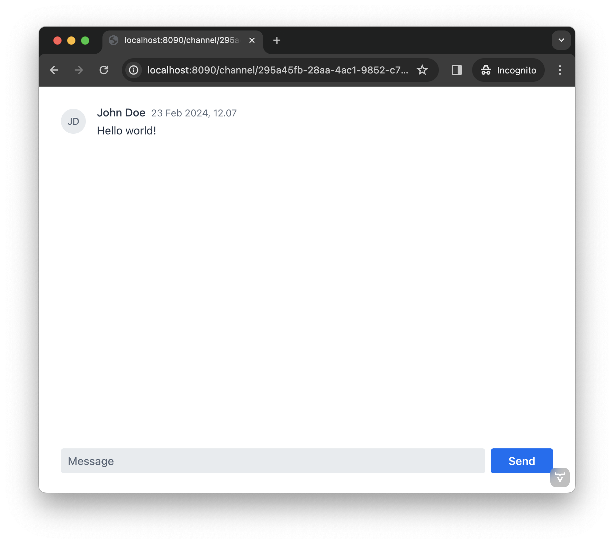

= [since:com.vaadin:vaadin@V24.4]#First View#

The first step in the exercises for this tutorial is to create a view. A view is an application's user interface page, or rather a composite of text, images, interactive components, and other elements the user may view and with which the user may interact.  Examples of this might be an interactive, dynamic web page or the screen of a desktop application.

This first view, though, should specifically allow the user to receive and post messages in a given channel. For the purposes here, it'll contain the following three user interface components:

- List of messages in the channel;
- Input field for writing new messages; and
- Button for sending new messages to the channel.

Furthermore, the view needs access to the ID of the channel, which is passed as a URL parameter (e.g., `/channel/<channelId>`). It will also need an instance of [classname]`ChatService`, injected through constructor injection.

To understand better what you're working towards, once finished, the view should look like this:

This may seem very plain and lacking in luster. However, for learning purposes, it's best to start with a simple goal so you may focus on the essential elements and steps in the process of creating a view and an application. You'll develop this initial view as you go through this tutorial.

== Routing in Flow

You can make any Vaadin component a routing target by adding a `@Route("<path>")` annotation. 

// RUSSELL: a minor explanation of "routing" would be good.  Also, where or to what would this be added?  SEE Hilla first-view paragraph starting at line 26.

You can pass parameters into any Vaadin route. There are various ways of doing this, but the easiest is to implement the [interfacename]`HasUrlParameter` interface. This interface defines a single URL parameter that is appended to the path of the route. The type of the parameter can be `Long`, `Integer`, `String`, or `Boolean`.

You can find more information about routing in the <<{articles}/flow/routing#,Routing>> page of the Flow documentation.

Incidentally, adding `@Route("<path>")` annotation also makes it possible to inject Spring beans into the component through constructor parameter injection. However, the component won't become a Spring bean itself. The component cannot be injected into other Spring beans, and its lifecycle is still managed by Vaadin -- not by Spring.

// RUSSELL: I know we're assuming Java developer experience, but I'd like to have explanations of beans, managed beans, and Spring.

== Create the Channel View

To create the channel view, create a class named, [classname]`ChannelView` in the [packagename]`com.example.application.ui.views.channel` package. You would do that like this: 

// RUSSELL: Where would this go specifically? It could just be a comment like "in your development environment."

.`ChannelView.java`
[source, java]
----
package com.example.application.ui.views.channel;

import com.example.application.chat.ChatService;
import com.vaadin.flow.component.messages.MessageList;
import com.vaadin.flow.component.orderedlayout.VerticalLayout;
import com.vaadin.flow.router.BeforeEvent;
import com.vaadin.flow.router.HasUrlParameter;
import com.vaadin.flow.router.Route;

@Route(value = "channel") // <1>
public class ChannelView extends VerticalLayout // <2>
        implements HasUrlParameter<String> { // <3>

    private final ChatService chatService;
    private final MessageList messageList;

    public ChannelView(ChatService chatService) { // <4>
        this.chatService = chatService;
    }

    @Override
    public void setParameter(BeforeEvent event, String channelId) { // <5>
    }
}
----
<1> This line makes the view accessible from the `/channel` path.
<2> `VerticalLayout` is one of the built-in layouts in Vaadin that vertically organizes components on top of each other.
<3> This says that the view accepts a single URL parameter of the type, `String` -- the channel ID.
<4> The `ChatService` is injected by Spring.
<5> This method is provided by the `HasUrlParameter` interface. It will be called whenever the URL parameter is changed.

Now that you've created the channel view, you'll next need to set up the user interface. Update the constructor like this:

// RUSSELL: What is the constructor, or rather, where is it? Is it contained in the examples above? Which one? above minimized.  expand now.

[source,java]
----
public ChannelView(ChatService chatService) {
    this.chatService = chatService;
    setSizeFull(); // <1>

    messageList = new MessageList(); // <2>
    messageList.setSizeFull();
    add(messageList);

    var messageInput = new MessageInput(); // <3>
    messageInput.setWidthFull();
    add(messageInput);
}
----
<1> This makes the view fill the entire screen by setting both its width and height to 100%.
<2> `MessageList` is a built-in component for displaying messages from different users.
<3> `MessageInput` is a built-in component for entering and sending messages.

== Get Channel ID

You'll need the channel ID for posting and for receiving messages. You can get the channel ID from the [methodname]`setParameter` method. You should verify that it's valid with [classname]`ChatService`. Then you'd store it in a private field to use later.

Regarding this last point, start by declaring a private field that'll contain the channel ID. You can do that like so:

// RUSSELL: Again, where does this go?  Maybe a simple screenshot would resolve my "where" questions.

[source,java]
----
private String channelId;
----

Then, implement the [methodname]`setParameter` method like this:

[source,java]
----
@Override
public void setParameter(BeforeEvent event, String channelId) {
    if (chatService.channel(channelId).isEmpty()) {
        throw new IllegalArgumentException("Invalid channel ID"); // <1>
    }
    this.channelId = channelId;
}
----
<1> In a future iteration, you'll navigate away from this view if the channel ID is invalid. For now, throwing an exception as shown here is enough.

== Post a Message

You now have almost everything you need to start posting messages to a channel. You'll need to add a listener, though, to the [classname]`MessageInput` component that gets called whenever the user sends a message. Then you'll call the [methodname]`postMessage` method of [classname]`ChatService`.

// RUSSELL: It may be a bit too much, but a phrase or short sentence saying what's a listener would be nice. A listener is an event handler or observer. It's an object that gets called when an event occurs -- see "var messageInput = new MessageInput(event -> sendMessage(event.getValue()));" below.

It's a good practice to put the user interface logic in private methods rather than inside event listeners. Therefore, start by creating this method:

[source,java]
----
private void sendMessage(String message) {
    if (!message.isBlank()) {
        chatService.postMessage(channelId, message);
    }
}
----

Next, inside the constructor of [classname]`ChannelView`, add a [classname]`SubmitEvent` listener to the [classname]`MessageInput` component. You can do this by either calling the [methodname]`addSubmitListener` method, or by passing the listener as a constructor parameter, like this:

[source,java]
----
var messageInput = new MessageInput(event -> sendMessage(event.getValue()));
----

// RUSSELL: Maybe comment on what's going on in this line more. See above note.

== Server Push in Flow

Since messages can be received at any time, you'll use server push to update the user interface. When server push is enabled, Vaadin will use a websocket connection to push updates to the browser. In order to enable server push, you have to add the `@Push` annotation to your application shell class.

The application shell class is an application that implements the [interfacename]`AppShellConfigurator` interface. In Spring Boot applications, the main [classname]`Application` class is often used for this. 

Now open `com.example.application.Application` and change it accordingly:

.`Application.java`
[source,java]
----
package com.example.application;

import com.vaadin.flow.component.page.AppShellConfigurator;
import com.vaadin.flow.component.page.Push;
import org.springframework.boot.SpringApplication;
import org.springframework.boot.autoconfigure.SpringBootApplication;
import org.springframework.context.annotation.Bean;

import java.time.Clock;

@SpringBootApplication
@Push // <1>
public class Application implements AppShellConfigurator { // <2>

    @Bean
    public Clock clock() {
        return Clock.systemUTC();
    }

    public static void main(String[] args) {
        SpringApplication.run(Application.class, args);
    }

}
----
<1> This is where the `@Push` annotation is added.
<2> This line implements the [interfacename]`AppShellConfigurator` interface.

// RUSSELL: This next paragraph could be split into two and some explanations could be added.

Once you've enabled server push, you can trigger it in various ways. The easiest is to use the `UI.access()` method, which can be called from any thread. The method takes a lambda or a function pointer as its parameter and will run it at the next suitable moment. 

Vaadin will make sure the session is properly locked while the user interface is being updated. Once the method has returned, Vaadin will automatically push the updates to the browser.

You can find more information about server push in the <<{articles}/flow/advanced/server-push#,Flow documentation>>.

== Receive Messages

Returning to the [classname]`ChannelView`, you need to make some additions. In order to receive messages from the server, you'll have to do a few things:

1. Subscribe to a [classname]`Flux` returned by the [methodname]`liveMessages` method of [classname]`ChatService`;
2. Update the [classname]`MessageList` component using server push whenever new messages arrive; and
3. Unsubscribe when leaving the view to avoid memory leaks.

Since you'll want to keep the messages you've already received, you'll have to start by creating a new field that will contain them:

[source,java]
----
private final List<Message> receivedMessages = new ArrayList<>();
----

The list contains objects of type, `Message`. You have to convert them, though, to [classname]`MessageListItem` before you can add them to the [classname]`MessageList` component:

// RUSSELL: a screenshot of where this belong in the code would be useful.  Or maybe you could have the final code could be shown at the end with markers (i.e., <1>) where each snippet goes.  See start code (within public class ChannelView)

[source,java]
----
private MessageListItem createMessageListItem(Message message) {
    var item = new MessageListItem(
        message.message(), 
        message.timestamp(), 
        message.author()
    );
    return item;
}
----

Next, create the method that gets called whenever new messages arrive:

[source,java]
----
private void receiveMessages(List<Message> incoming) { // <1>
    getUI().ifPresent(ui -> ui.access(() -> { // <2>
        receivedMessages.addAll(incoming);
        messageList.setItems(receivedMessages.stream()
            .map(this::createMessageListItem)
            .toList()); // <3>
    }));
}
----
<1> The server is providing messages in batches rather than one at a time. This is to improve performance in cases where a plenty of messages are being received in a short amount of time.
<2> You have to use [methodname]`UI.access()` whenever you update a Vaadin user interface from a thread other than the HTTP request thread. The method will make sure the session is locked properly during the update, and it'll push the changes to the browser once finished.
<3> There's currently no way of adding individual items to a [classname]`MessageList`. You have to re-create all of them.

// RUSSELL: What are we doing next?  Why are we doing this?  How does this tie into the other steps or where we're heading.  I feel like we're just blindly adding stuff that I'm not always sure where and why. you're subscribing to receive messages, a flux objective which in turn is a stream.

Next, create the method that subscribes to the service:

[source,java]
----
private Disposable subscribe() {
    var subscription = chatService
            .liveMessages(channelId)
            .subscribe(this::receiveMessages); // <1>
    return subscription; // <2>
}
----
<1> Whenever the [classname]`Flux` emits a new batch of messages, the [methodname]`receiveMessages()` method is called.
<2> You need a reference to the subscription to be able to cancel it when you don't need it any longer.

Finally, you have actually to call the newly created [methodname]`subscribe()` method. However, you only want to receive messages while the view is visible to the user. You can use component lifecycle callbacks to achieve this.

You can think of a Flow user interface as a tree of components. All components get notified when they are added to this tree (attached) or removed from it (detached). A component can execute code when this happens by overriding the [methodname]`onAttach(..)` and [methodname]`onDetach(..)` methods provided by the [classname]`Component` class, which is the abstract base class for all components. 

In addition to overriding [methodname]`onAttach(..)` and [methodname]`onDetach(..)`, you can use the methods [methodname]`addAttachListener(..)` and [methodname]`addDetachListener(..)` to register listeners that will get notified whenever a component is attached or detached.

When you want to register a listener with an object that will outlive the view itself, you should do this when the view is attached and unregister it when the view is detached. If you forget to unregister, you might end up with a memory leak that will slow your application down and eventually crash it.

Next, override the [methodname]`onAttach` method. Inside it, call the subscribe method and also register a detach listener that cancels the subscription:

[source,java]
----
@Override
protected void onAttach(AttachEvent attachEvent) {
    var subscription = subscribe(); // <1>
    addDetachListener(event -> subscription.dispose()); // <2>
}
----
<1> When the view is attached to a UI and becomes visible, this says to subscribe to the backend service.
<2> Whenever the view is detached from the UI, this line says to cancel the subscription.

You can find more information about component lifecycle callbacks in the <<{articles}/flow/create-ui/lifecycle-callback#,Life Cycle Callback>> page of the Flow documentation. For more information about what a `Flux` is, see the https://projectreactor.io/docs/core/release/reference/[Project Reactor reference documentation].

== Try It!

Assuming you followed along closely with the explanations and descriptions above, and you added the text as instructed to your development environment, you're ready to try the channel view. Start the application by running `./mvnw spring-boot:run` 

// PETTER: commented out the exercises. To me, in a tutorial, the exercises would be writing the code itself, not trying out the application.

//[discrete]
//==== Exercise 1

The application will generate some channels for you during startup. Each channel gets a UUID as its ID. Check the log for the URLs, they should look something like `\http://localhost:8080/channel/28ca4624-81b6-48bd-8090-82efa26cfd02`.

//[discrete]
//==== Exercise 2

Now, open your browser with one of the URLs. You should see an interface for entering text. Send some messages. They should appear in the list.

//[discrete]
//==== Exercise 3

Open another browser window using the same URL and send some more messages from there. Those should appear in the list of both windows.

