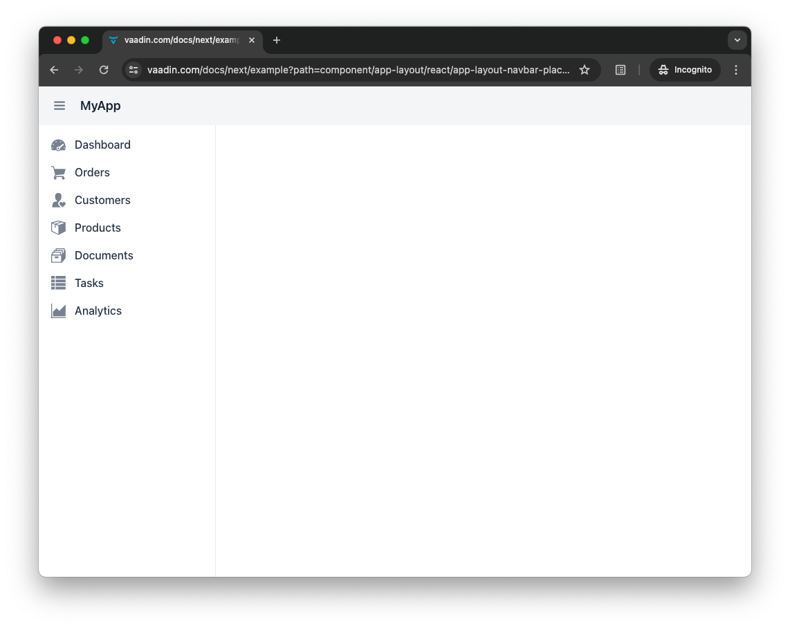
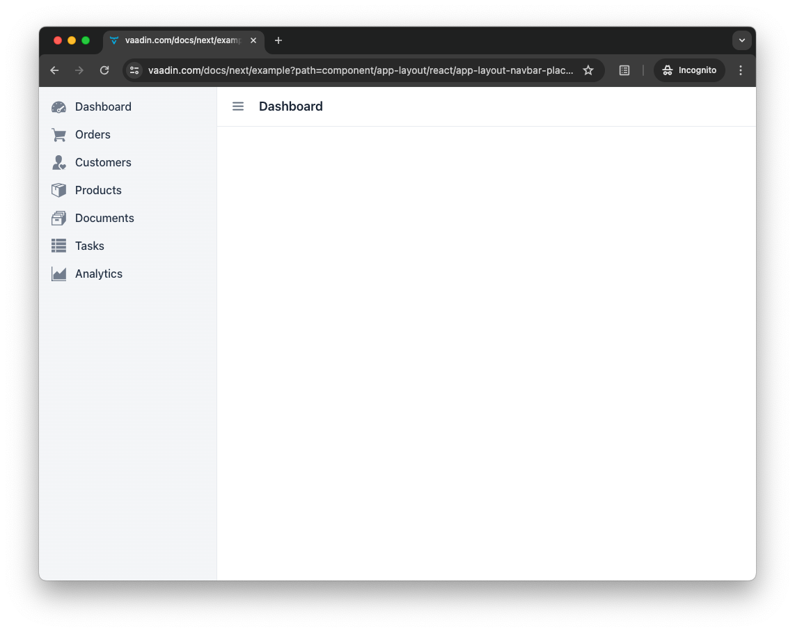

= [since:com.vaadin:vaadin@V24.4]#Add a Layout#

Unless an application consists of a single view, you'll probably want a reusable layout, with a header or a navigation bar. Since the chat application you've been developing in this tutorial, at this point consists of two views, this page will go through the process of building such a layout. If you haven't gone through the previous steps, please do so before proceeding here.

You'll create a main layout consisting of three user interface components: a header with the name of the current view; a side bar that contains the name of the application and a link to the lobby view; and a menu toggle button for showing and hiding the side bar.

When you're finished, the layout should look like this:

image::images/layout.png[A web application with a listing of chat channels and a visible side bar.]

As you can see, this looks a little nicer. With the addition of the sidebar, you also have room to develop many more possibilities for the application.

== Application Layout

It's quite common for business applications to have a layout like the one shown in the screenshot above. Because of that, Vaadin provides one out-of-the-box: it's called, [classname]`AppLayout`. The application layout splits the user interface into three parts: a horizontal naviation bar, called the _navbar_; a collapsible navigation drawer, called the _drawer_; and a content area, where the actual view is rendered.

The navbar can be placed at the top of the screen, or next to the drawer. When placed at the top, the navbar is typically used as the application header.

When placed next to the drawer, it's typically used as the view header. This is the mode you'll use in this tutorial.

This layout is progressive: it'll adapt to the screen size.

You can find more information about the application layout in the <<{articles}/components/app-layout#,AppLayout>> page of the Flow documentation.

=== Create the Layout

To create the layout for the view, start with a class named, [classname]`MainLayout` in the [packagename]`com.example.application.ui` package. So far in this tutorial, you've initialized directly all of the components in the constructor. This time, try splitting the user interface into smaller parts and initialize each part in its own private method. You can do that like this:

.`MainLayout.java`
[source,java]
----
package com.example.application.ui;

import com.vaadin.flow.component.applayout.AppLayout;
import com.vaadin.flow.component.html.H2;

public class MainLayout extends AppLayout { // <1>

    private H2 viewTitle;

    public MainLayout() {
        setPrimarySection(Section.DRAWER); // <2>
        addNavbarContent();
        addDrawerContent();
    }

    private void addNavbarContent() {
    }

    private void addDrawerContent() {
    }
}
----
<1> This uses the [classname]`AppLayout` class by extending it.
<2> This makes the drawer fill the entire height of the screen, moving the header (i.e., navbar) to the side of it.

==== Define the Navigation Bar

Next, you'll implement the empty methods. Start by initializing the navbar content like this:

[source,java]
----
private void addNavbarContent() {
    var toggle = new DrawerToggle(); // <1>
    toggle.setAriaLabel("Menu toggle"); // <2>
    toggle.setTooltipText("Menu toggle"); // <3>

    viewTitle = new H2();
    viewTitle.addClassNames(LumoUtility.FontSize.LARGE, LumoUtility.Margin.NONE, 
        LumoUtility.Flex.GROW); // <4>

    var header = new Header(toggle, viewTitle); // <5>
    header.addClassNames(LumoUtility.AlignItems.CENTER, LumoUtility.Display.FLEX, 
        LumoUtility.Padding.End.MEDIUM, LumoUtility.Width.FULL);

    addToNavbar(false, header); // <6>
}
----
<1> [classname]`DrawerToggle` is a built-in component for showing and hiding the drawer. Adding it to the layout is enough. You don't need to write any code for this.
<2> Setting the `aria-label` for components without captions is important for accessibility.
<3> The tooltip text will display when the mouse pointer hovers over the toggle button.
<4> This is the first time in this tutorial that CSS styling is specified. Styling will be covered later in more detail.
<5> [classname]`Header` is the Vaadin component representing the `<header>` HTML element.
<6> This setting may seem odd. The boolean flag set to `false` says to keep the header at the top even on mobile devices. Setting it to `true` would cause the header to move to the bottom of the screen on mobile devices.

==== Define the Drawer

The next task is to initialize the drawer content. You would do that like this:

[source,java]
----
private void addDrawerContent() {
    var appName = new Span("Vaadin Chat"); // <1>
    appName.addClassNames(LumoUtility.AlignItems.CENTER, LumoUtility.Display.FLEX, 
            LumoUtility.FontSize.LARGE, LumoUtility.FontWeight.SEMIBOLD, 
            LumoUtility.Height.XLARGE, LumoUtility.Padding.Horizontal.MEDIUM);

    addToDrawer(appName, new Scroller(createSideNav())); // <2>
}

private SideNav createSideNav() {
    SideNav nav = new SideNav(); // <3>

    nav.addItem(new SideNavItem("Lobby", LobbyView.class, 
        VaadinIcon.BUILDING.create())); // <4>

    return nav;
}
----
<1> [classname]`Span` is the Vaadin component representing the `` HTML element.
<2> The [classname]`SideNav` is wrapped inside a [classname]`Scroller` component to make sure it scrolls in case it does not fit on the screen.
<3> [classname]`SideNav` is a side navigation menu component with support for flat and hierarchical navigation items.
<4> The side navigation menu will contain a single item that navigates the user to the lobby view.

You can find more information about side navigation in the <<{articles}/components/side-nav#,Flow documentation>>.

== Get View Title

You created a component in the navbar -- `viewTitle` -- that'll contain the title of the current view. Now you need to get the title from somewhere. There is no standard way of doing this in Vaadin, but in this tutorial, use the page title as the view title.

In a Vaadin Flow application, the page title can be either static or dynamic. A static page title is set using the `@PageTitle` annotation. A dynamic page title is set by implementing the [interfacename]`HasDynamicTitle` interface, which is provided by Vaadin.

To make the page title visible, you have to implement a method that retrieves the title. And you have to update the user interface when the layout content changes.

Start with retrieving the title by adding this method:

[source,java]
----
private String getCurrentPageTitle() {
    if (getContent() == null) {
        return "";
    } else if (getContent() instanceof HasDynamicTitle titleHolder) {
        return titleHolder.getPageTitle();
    } else {
        var title = getContent().getClass().getAnnotation(PageTitle.class);
        return title == null ? "" : title.value();
    }
}
----

Next, update the user interface when the content changes by overriding the [methodname]`afterNavigation()` method:

[source,java]
----
@Override
protected void afterNavigation() {
    super.afterNavigation();
    viewTitle.setText(getCurrentPageTitle());
}
----

The `super` implementation contains some code. Remember to call it.

== Add Layout to Lobby View

If you'd try runninng the application at this point, the layout wouldn't be visible anywhere. This is because you have to define which layout to use for each individual route. This is done by adding a `layout` parameter to the `@Route` annotation.

To do that for [classname]`LobbyView`, add something like this:

[source,java]
----
@Route(value = "", layout = MainLayout.class)
@PageTitle("Lobby")
public class LobbyView extends VerticalLayout {
    // ...
}
----

The `layout` parameter has been set to [classname]`MainLayout`.

The view already had a static page title, so this's all you need to do for now.

== Add Layout & View Title to Channel View

Next, you need to add the layout to [classname]`ChannelView`. You also need to add a title, but for this view, the title will be the name of the channel. This means that the view has to implement the [interface]`HasDynamicTitle` interface.

Here's how that might look:

[source,java]
----
@Route(value = "channel", layout = MainLayout.class) // <1>
public class ChannelView extends VerticalLayout 
    implements HasUrlParameter<String>, HasDynamicTitle { // <2>

    private String channelName; // <3>
    
    // ... 

    @Override
    public String getPageTitle() {
        return channelName;
    }
}
----
<1> The `layout` parameter is set here to [classname]`MainLayout`.
<2> The view implements the [interfacename]`HasDynamicTitle` interface.
<3> A new string field, `channelName` will contain the name of the current channel.

The channel name is included in the [classname]`Channel` object that's returned by [classname]`ChatService`. To get that name, you need to make a change to the [methodname]`setParameter` method:

[source,java]
----
@Override
public void setParameter(BeforeEvent event, String channelId) {
    chatService.channel(channelId).ifPresentOrElse(
            channel -> this.channelName = channel.name(), // <1>
            () -> event.forwardTo(LobbyView.class) // <2>
    );
    this.channelId = channelId;
}
----
<1> This line says that if the channel ID is valid, store the name in the `channelName` field.
<2> Whereas, this says that if it was invalid, navigate back to the lobby view.

Vaadin will handle calling `setParameter` on the view before the main layout calls `getPageTitle`.

== Try It!

The new layout is now ready for you to try it. Open your browser at http://localhost:8080/ (start the application if it is not already running). You should see a list of channels rendered in the new main layout, with the title visible in the navbar.

Click the toggle button a couple of times. The drawer should hide and open accordingly. Then resize the browser window. The drawer should automatically hide itself when the screen becomes too small.

Now navigate to a channel by clicking on one. The channel name should appear in the navigation bar.
