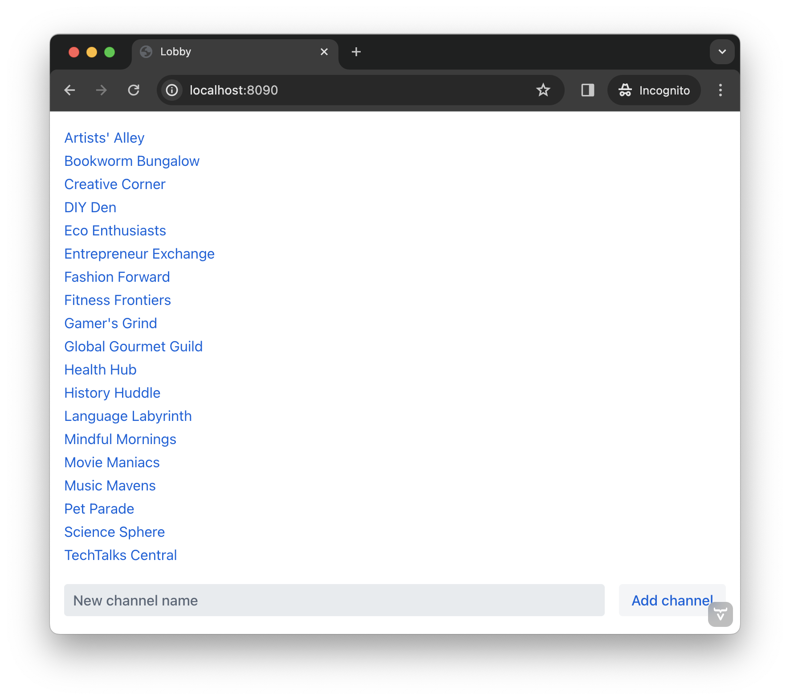

= Second View

To be able to use a chat channel in the example developed in this tutorial, users have to know the channel's UUID. This isn't very user friendly. To remedy this, this page explains how to build a second view that will allow users to see a list of available channels from which to select. 

Once finished, the view will contain some necessary user interface components and should look like this:

Notice there's a list of channels from which to choose. The user would click on a channel in the list. At the bottom there's also an input field for entering the name of a new channel, and a button for creating it. Making these choices do something, triggering actions from them is covered later in the tutorial page.

== Create Lobby View

The first step is to set up the interface which presents the list of channels to the user. To do this, create a class named [classname]`LobbyView` in the `com.example.application.ui.views.lobby` package. That code will look like this:

// RUSSELL: Can the previous sentence(s) mention importing dependencies or something, maybe descriptions of the two chunks of code?

.`LobbyView.java`
[source,java]
----
package com.example.application.ui.views.lobby;

import com.example.application.chat.Channel;
import com.example.application.chat.ChatService;
import com.vaadin.flow.component.button.Button;
import com.vaadin.flow.component.orderedlayout.VerticalLayout;
import com.vaadin.flow.component.textfield.TextField;
import com.vaadin.flow.component.virtuallist.VirtualList;
import com.vaadin.flow.router.PageTitle;
import com.vaadin.flow.router.Route;

@Route(value = "") // <1>
@PageTitle("Lobby") // <2>
public class LobbyView extends VerticalLayout {

    private final ChatService chatService;
    private final VirtualList<Channel> channels;
    private final TextField channelNameField;
    private final Button addChannelButton;

    public LobbyView(ChatService chatService) {
    }
}
----
<1> Since the value for `@Route` is empty, this will be the default view of the application, accessible at `http://localhost:8080/`.
<2> The page title for the view is set with the `@PageTitle` annotation (i.e., _Lobby_ here).

Next, you need to set up the user interface. You'd do this by updating the constructor to use `VirtualList`, the Vaadin component that renders items inside a scrollable container, allowing you to control how an item is rendered. Here's how that code might look:

// RUSSELL: This is pointing back to the constructor, can we be more specific as to where this is in the code we have already?

[source,java]
----
public LobbyView(ChatService chatService) {
    this.chatService = chatService;
    setSizeFull();

    channels = new VirtualList<>();
    add(channels);
    expand(channels); // <1>

    channelNameField = new TextField();
    channelNameField.setPlaceholder("New channel name"); // <2>

    addChannelButton = new Button("Add channel");
    addChannelButton.setDisableOnClick(true); // <3>

    var toolbar = new HorizontalLayout(channelNameField, addChannelButton); // <4>
    toolbar.setWidthFull();
    toolbar.expand(channelNameField);
    add(toolbar);
}
----
<1> `expand()` instructs the `VerticalLayout` to expand the size of the channels list to use all available space.
<2> The placeholder text is visible to the user inside the text field when it's empty.
<3> To prevent the user from triggering the button action more than once, the button disables itself after the first click.
<4> `HorizontalLayout` is one of the built-in layouts of Vaadin that displaying components horizontally next to each other.

The user interface is now in place, but it doesn't do anything yet. If the user clicks on anything, nothing happens. The next tasks are to implement two operations: fetching the channels from the `ChatService`; and adding a new channel to the `ChatService`.

=== Fetch a Channel

To fetch whatever channel the user selects, you'll need a method for fetching channels. Incidentally, it's good practice to put the user interface logic inside its own methods. Add the following:

// RUSSELL: Where does this go?

[source,java]
----
private void refreshChannels() {
    channels.setItems(chatService.channels());
}
----

This method should be called when `LobbyView` is attached to the UI. To have the application do this, add this bit:

[source,java]
----
@Override
protected void onAttach(AttachEvent attachEvent) {
    refreshChannels();
}
----

// How does this actually fetch a selected channel?  Which function or whatever says something like, on click go there?

The application is now prepared to fetch a channel when instructed to do so. Next, you'll need to allow the user to add a new channel.

=== Add New Channel

The next task in preparing the view for user interaction is to add a method for adding a new channel.  

// RUSSELL: A short sentence saying what the user is doing here would be helpful, in addition to the details that follow.

[source,java]
----
private void addChannel() {
    try {
        var nameOfNewChannel = channelNameField.getValue(); // <1>
        if (!nameOfNewChannel.isBlank()) {
            chatService.createChannel(nameOfNewChannel);
            channelNameField.clear(); // <2>
            refreshChannels(); // <3>
        }
    } finally {
        addChannelButton.setEnabled(true); // <4>
    }
}
----
<1> If the field is empty, its value will be an empty string, not `null`.
<2> This clears the name field if the channel was created successfully, so that another channel can be created if the user wants.
<3> The easiest way to get the new channel to display in the list is to refresh the entire list. This function does that.
<4> This re-enables the button so that it's ready for another channel to be added.

Now that the method for adding a new channel is ready, you'll need to call it when the `addChannelButton` (i.e., the _Add New Channel_ button) is clicked by the user. You'd do that like this:

[source,java]
----
addChannelButton = new Button("Add channel", event -> addChannel());
----

At this point the application will show a list of channels, but it won't look very nice. For every [classname]`Channel` in the list, you would see only its string representation: something like, `Channel[id=5dcca1da-5416-4d17-8825-727196105eb7, name=Artists' Alley, lastMessage=null]`. This is because you haven't defined yet a renderer for the `VirtualList`.

The simplest renderer is a link that when clicked takes the user to the corresponding [classname]`ChannelView`. To that end, create one by adding the following private method:

[source,java]
----
private Component createChannelComponent(Channel channel) {
    return new RouterLink(channel.name(), ChannelView.class, channel.id());
}
----
This will create a link with the channel's name. When clicked, it will naviagate to the channel view and pass the channel's ID as a URL parameter.

Finally, you enable the renderer by adding this line to the [classname]`LobbyView` constructor, just after `channels` has been created:

[source,java]
----
channels.setRenderer(new ComponentRenderer<>(this::createChannelComponent));
----

== Handle Invalid Channels

As mentioned earlier, this channel view will throw an exception if it receives an invalid channel ID. That's a good starting point. However, a better way is to redirect the user to the lobby view, allowing them to select a channel that exists.

Open `ChannelView` in your IDE and change the [methodname]`setParameter` method as follows:

// RUSSELL: Previously I asked the the user be told where code goes. This lead in sentence does that.  The tutorial needs more of that.

[source,java]
----
@Override
public void setParameter(BeforeEvent event, String channelId) {
    if (chatService.channel(channelId).isEmpty()) {
        event.forwardTo(LobbyView.class); // <1>
    } else {
        this.channelId = channelId;
    }
}
----
<1> This forwards the user to the lobby view. It also changes the URL, accordingly.

== Try It!

You're now ready to try the lobby view. Start the application by running `./mvnw spring-boot:run`

[discrete]
==== Exercise 1

Open your browser at `http://localhost:8080/`. You should see a list of channels. Click on one of them. You should be navigated to the corresponding channel view. You put that in place in the section of this tutorial on fetching channels.

[discrete]
==== Exercise 2

Go back to the lobby view and this time enter text in the input box at the bottom, giving a new channel and click the button to add it. Then go back to the opening display and see if you see it in the list of channels.

[discrete]
==== Exercise 3

Try one more time. Navigate to a non-existent channel by entering this URL in the browser address field: `http://localhost:8080/channel/doesnotexist`. You should be sent to the lobby view again. That's because of the `event.forwardTo()` added in the last section above.

++++

++++
