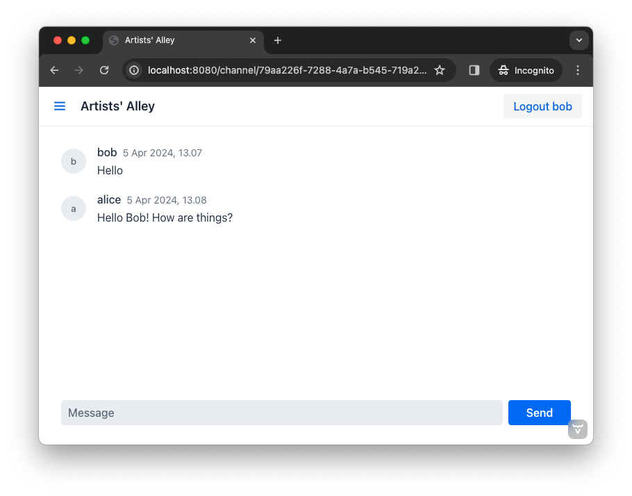
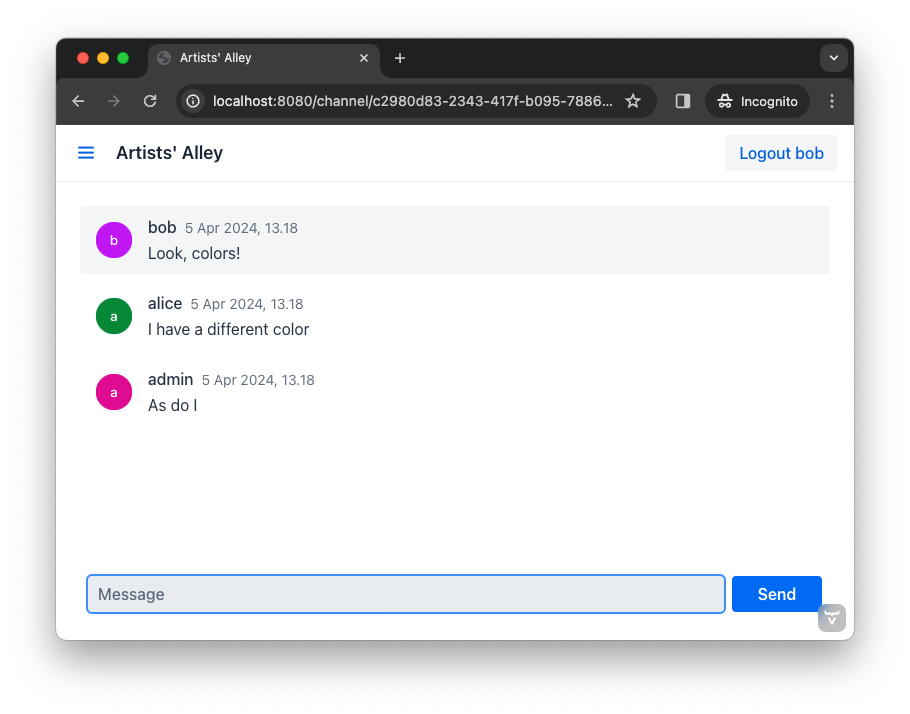
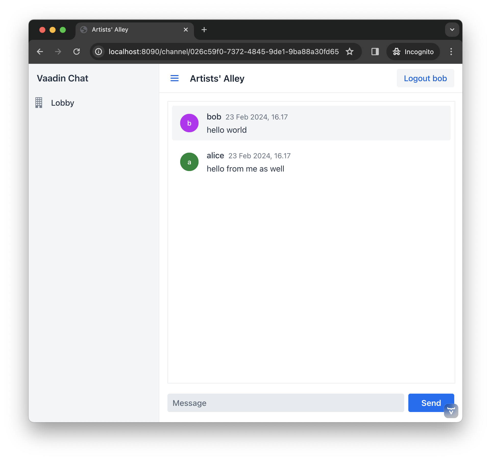
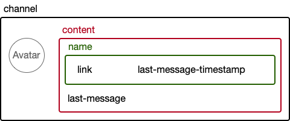
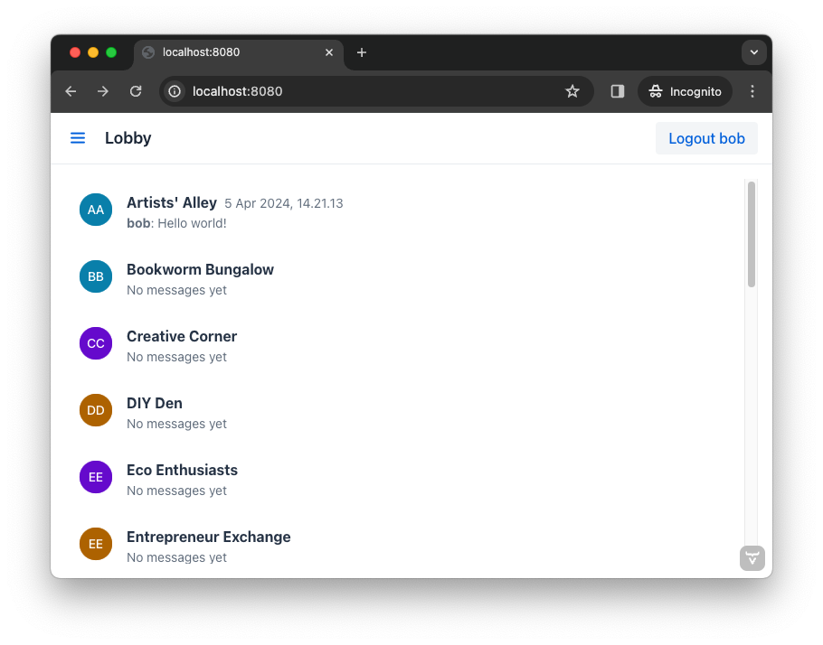

= [since:com.vaadin:vaadin@V24.4]#Styling#

The chat application developed in this tutorial is now fully functional. However, it still looks a bit rough. In this part of the tutorial, you'll tweak the look and feel of the application, add some styling.

// RUSSELL:  Add comment about CSS and link to CSS tutorial or info.

== Styling in Flow

You may not realize it, but so far in this tutorial, you've been using a theme called Lumo. This is the default theme in Vaadin applications. It provides several utility CSS classes that can be added to your components and HTML elements to style them, easily. In Java, these utility classes are available in the [classname]`LumoUtility` class (from the [packagename]`com.vaadin.flow.theme.lumo` package). Each utility class applies a particular style to the element, such as background color, borders, fonts, sizing, and spacing.

However, some cases can't be handled with utility classes alone. One such case would be when you need to use a different selector than just a classname. Another case would be a complex layout where semantic CSS makes more sense than using several utility classes.

In both of these cases, you have to create a new theme, either to enable the Lumo utility classes or to hold your custom CSS. Applications generated with https://start.vaadin.com[start.vaadin.com] already have this configured. In this tutorial, though, you'll learn how to do it yourself.

You can find more information about styling in the <<{articles}/styling#,Styling>> page of the Vaadin documentation.

== Create a Theme

To start, make a new directory: [directoryname]`src/main/frontend/themes/chat-theme`. Inside this directory, create an empty file [filename]`styles.css`. You'll add custom styles and `@import` lines to this file later in this tutorial. Vaadin will automatically import the Lumo theme and apply your styles on top of the Lumo styles, allowing you to override them.

Next, you should create a theme configuration file called, [filename]`theme.json` in the same directory as [filename]`styles.css`. You'll use this file to configure various theme-related features. For now, use it to enable the Lumo utility classes. Do this by copy-pasting the following code into the file:

.`theme.json`
[source,json]
----
{
    "lumoImports" : [ "typography", "color", "sizing", "spacing", "utility" ]
}
----

If you left out this file, the `typography`, `color`, `sizing`, and `spacing` modules would have been loaded by default.

Finally, you need to configure your application to use the new theme. You do this by adding the [annotationname]`@Theme` annotation to your application shell class or in this case, the [classname]`Application` class. In your IDE, locate the [packagename]`com.example.application` package and open the [classname]`Application` class. Then add the [annotationname]`@Theme` annotation (from the [packagename]`com.vaadin.flow.theme` package) like this:

.`Application.java`
[source,java]
----
@SpringBootApplication
@Push
// tag::snippet[]
@Theme("chat-theme") // <1>
// end::snippet[]
public class Application implements AppShellConfigurator {
    ...
}
----
<1> The name of your new theme is `chat-theme` and it matches the name of the directory in [directoryname]`src/main/frontend/themes`.

The next time your application starts, Vaadin will automatically load your new theme.

== Highlight User's Messages

With your new theme in place, it is time to go back to the channel view. In your IDE, locate the [packagename]`com.example.application.views.channel` package and open the [classname]`ChannelView` class.

So far, all of the messages in [classname]`ChannelView` have been displayed in the same way regardless of who wrote them, as seen in this screenshot:

To change this so that all messages sent by the current user look different, you first need to get a hold of the current user's username. You can retrieve this from the [classname]`AuthenticationContext` class (from the [packagename]`com.vaadin.flow.spring.security` package).

Inside the [classname]`ChannelView`, declare a new [classname]`String` field that will contain the current user's username. Next, inject an instance of [classname]`AuthenticationContext` into the constructor and use it to retrieve the principal name, which in this case is the same as the current user's username. Finally, store this in the field. In code, it looks like this:

[source,java]
----
// tag::snippet[]
private final String currentUserName; // <1>
// end::snippet[]
...
public ChannelView(ChatService chatService,
// tag::snippet[]
        AuthenticationContext authenticationContext) { // <2>
    this.currentUserName = authenticationContext.getPrincipalName().orElseThrow(); // <3>
// end::snippet[]
    ...
}
----
<1> This is the field that will contain the current user's username. It is marked as `final` since it will never change once [classname]`ChannelView` has been created.
<2> This injects the [classname]`AuthenticationContext` as a constructor parameter.
<3> This retrieves the principal name and stores it in the field. If there is no principal name, it is okay to throw an exception as it should not be possible to reach the channel view without logging in in the first place.

Now when you know the identity of the current user, you can put it to good use. To distinguish messages from the current user, use a Lumo utility CSS class to add a darker background to all messages sent by that person. Also, add a small margin and a round border around them.

Still in the [classname]`ChannelView` class, look up the [methodname]`createMessageListItem()` method and change it to look like this:

[source,java]
----
private MessageListItem createMessageListItem(Message message) {
    var item = new MessageListItem(
        message.message(),
        message.timestamp(),
        message.author()
    );
    // tag::snippet[]
    item.addClassNames(LumoUtility.Margin.SMALL, LumoUtility.BorderRadius.MEDIUM); // <1>
    if (message.author().equals(currentUserName)) {
        item.addClassNames(LumoUtility.Background.CONTRAST_5); // <2>
    }
    // end::snippet[]
    return item;
}
----
<1> Add a small margin and a medium border radius to the [classname]`MessageListItem` (just to make it look nicer).
<2> Add a darker background to all message items that have been written by the current user.

// RUSSELL: Need comments about sections of this code. What are we doing and why?

If you restart the application, open a channel and send some messages, the view will look like this:

image::images/author-highlighted.png[A web application with a listing of chat messages and an input field for posting new messages.]

The message list is now nicer looking, but you can make it even better!

== Color Avatars

Using avatars in the message list can make it easier to distinguish messages from different authors. Since the avatars are all gray and only contain the initial letter of the username, they haven't been very useful. The best solution would be to actually show pictures of the users. However, since that information isn't available, give the avatars different colors.

[classname]`MessageListItem` has a property called, [propertyname]`userColorIndex`. It can take a value between 0 and 6. Each value corresponds to a different color of the user's avatar. Set a color index based on the [methodname]`hashCode()` of the message author. You can use a modulo operation to turn the hash into an integer between 0 and 6:

[source,java]
----
private MessageListItem createMessageListItem(Message message) {
    var item = new MessageListItem(
        message.message(),
        message.timestamp(),
        message.author()
    );
    // tag::snippet[]
    item.setUserColorIndex(Math.abs(message.author().hashCode() % 7)); // <1>
    // end::snippet[]
    item.addClassNames(LumoUtility.Margin.SMALL, LumoUtility.BorderRadius.MEDIUM);
    if (message.author().equals(currentUserName)) {
        item.addClassNames(LumoUtility.Background.CONTRAST_5);
    }
    return item;
}
----
<1> The hash code can be negative, so you have to use [methodname]`Math.abs()` to get the absolute value after applying the modulo operation.

If you restart the application, open a channel and send some messages, the view will look like this:

Notice how each user's avatar, their initials are in a different color circle to distinguish them from each other. This will be particularly useful for clarity when there are a few users chatting and they've posted several messages each. The colors also brighten the overall impression of the view.

== Tweak Message List

If you look at the channel view, it has some extra whitespace around both the message list and the message input. This looks a bit strange and should be changed.

By default, the [classname]`MessageInput` component has a medium padding. To remove this default, you should add the following lines to the [filename]`styles.css` file (in the [directoryname]`src/main/frontend/themes/chat-theme` directory):

[source,css]
----
vaadin-message-input {
    padding: 0; /* <1> */
    overflow: visible; /* <2> */
}
----
<1> This removes the padding from the [classname]`MessageInput` component.
<2> When focused, the text field inside the [classname]`MessageInput` component has a blue border called a focus ring. When the padding is removed, the focus ring does not entirely fit inside the component anymore and is clipped. By changing the `overflow` property to `visible`, the focus ring becomes fully visible again.

Next, you should add a border to the message list. The easiest way to do this is to use a Lumo utility class. Open the [classname]`ChannelView` class, lookup the line in the constructor that creates a new instance of [classname]`MessageList` and add the following line:

[source,java]
----
...
messageList = new MessageList();
// tag::snippet[]
messageList.addClassNames(LumoUtility.Border.ALL); // <1>
// end::snippet[]
messageList.setSizeFull();
add(messageList);
...
----
<1> This adds a thin border to all sides of the message list component.

If you restart the application, open a channel and send some messages, the view will look like this:

The channel view is starting to look good. Now you're going to turn your attention to the lobby view.

== Expand Channel Information

At this point, the lobby shows only a list of channels. However, if you look at the [classname]`Channel` objects returned by [classname]`ChatService`, you can see that the last message posted to the channel is also provided, including its author, timestamp and the message text. To show all channel information in a tidy way, construct the following custom layout:

The graphic outlines visually how the layout should look: The `channel` div contains the channel's avatar and an inner div, called `content`. The `content` div contains another div, called `name`, and a truncated version of the last message posted to the channel, if any. And the `name` div contains a link to the channel and the timestamp of the last message posted to the channel, if any.

Making a layout like this in HTML is quite easy, but Flow also makes it possible to do it completely in Java. You could even style it using Lumo utility classes, but that would clutter the code. Therefore, in this tutorial, you'll build the layout in Java, but do the styling in CSS.

In your IDE, open the [classname]`LobbyView` class and locate the [methodname]`createChannelComponent()` method. Then change it like this:

[source,java]
----
private Component createChannelComponent(Channel channel) {
    // tag::snippet[]
    var channelComponent = new Div(); // <1>
    channelComponent.addClassNames("channel");

    var avatar = new Avatar(channel.name());
    avatar.setColorIndex(Math.abs(channel.id().hashCode() % 7)); // <2>
    channelComponent.add(avatar);

    var contentDiv = new Div();
    contentDiv.addClassNames("content");
    channelComponent.add(contentDiv); // <3>

    var channelName = new Div();
    channelName.addClassNames("name");
    contentDiv.add(channelName);

    var channelLink = new RouterLink(channel.name(), ChannelView.class, channel.id()); // <4>
    channelName.add(channelLink);

    if (channel.lastMessage() != null) {
        var lastMessageTimestamp = new Span(formatInstant(channel.lastMessage().timestamp(), getLocale())); // <5>
        lastMessageTimestamp.addClassNames("last-message-timestamp");
        channelName.add(lastMessageTimestamp);
    }

    var lastMessage = new Span();
    lastMessage.addClassNames("last-message");
    contentDiv.add(lastMessage);
    if (channel.lastMessage() != null) {
        var author = new Span(channel.lastMessage().author());
        author.addClassNames("author");
        lastMessage.add(author, new Text(": " + truncateMessage(channel.lastMessage().message()))); // <6>
    } else {
        lastMessage.setText("No messages yet");
    }
    return channelComponent;
    // end::snippet[]
}
----
<1> This is how you create new `
` elements in Java.
<2> This is the same trick you used in the channel view to color the avatars.
<3> This is how you add a `
` into another `
`. It is important to have good names for your variables. Otherwise, you can easily get confused and accidentally add components to the wrong element.
<4> Originally, the method only returned this [classname]`RouterLink`. Now it is embedded inside a more complex layout.
<5> The [methodname]`formatInstant()` method doesn't exist yet. You'll add it shortly.
<6> The [methodname]`truncateMessage()` method also doesn't exist yet. You'll add it shortly.

If you try to compile the code now, it won't work. This is because the [methodname]`formatInstant()` and [methodname]`truncateMessage()` methods are missing. You're going to add them next.

Add the [methodname]`formatInstant()` method to the [classname]`LobbyView` class first:

[source,java]
----
private String formatInstant(Instant instant, Locale locale) {
    return DateTimeFormatter.ofLocalizedDateTime(FormatStyle.MEDIUM)
            .withLocale(locale)
            .format(ZonedDateTime.ofInstant(instant, ZoneId.systemDefault()));
}
----

Since this is the only place in the application that needs to format [classname]`Instant` objects, you can keep the method directly in the [classname]`LobbyView` class. In applications that require instant formatting in multiple places, you'd put this method inside a class of its own.

Next, add the [methodname]`truncateMessage()` method directly after the [methodname]`formatInstant()` method:

[source,java]
----
private String truncateMessage(String msg) {
    return msg.length() > 50 ? msg.substring(0, 50) + "..." : msg;
}
----

Again, in applications that require string truncation in multiple places, you'd put this method inside a class of its own.

With the Java code in place, it's time for the CSS styles. Create a new file called [filename]`channel-list.css` in the [directoryname]`src/main/frontend/themes/chat-theme` directory. Copy the following styles into it:

.`channel-list.css`
[source,css]
----
.channel-list .channel {
    display: flex;
    gap: var(--lumo-space-m);
    padding: var(--lumo-space-m);
    border-radius: var(--lumo-border-radius-m);
}

.channel-list .channel .content {
    display: flex;
    flex-direction: column;
    flex: auto;
    line-height: var(--lumo-line-height-xs);
    gap: var(--lumo-space-xs);
}

.channel-list .channel .name {
    display: flex;
    align-items: baseline;
    justify-content: start;
    gap: var(--lumo-space-s);
}

.channel-list .channel .name a {
    font-size: var(--lumo-font-size-m);
    font-weight: bold;
    color: var(--lumo-body-text-color);
}

.channel-list .channel .name .last-message-timestamp {
    font-size: var(--lumo-font-size-s);
    color: var(--lumo-secondary-text-color);
}

.channel-list .channel .last-message {
    font-size: var(--lumo-font-size-s);
    color: var(--lumo-secondary-text-color);
}

.channel-list .channel .last-message .author {
    font-weight: bold;
}

.channel-list .channel:hover {
    background-color: var(--lumo-contrast-5pct);
}
----

Next, import the the CSS file into the theme by adding this line to the very top of [filename]`styles.css`:

[source,css]
----
@import "channel-list.css";
----

// RUSSELL: maybe explain this a little bit.
// PETTER: how much? if you know CSS, you know what it does. if you don't know CSS, you'd have to learn that first.

== Tweak Channel List

Just as you tweaked the message list, make a couple of small additions to improve the channel list to be consistent with the rest of the application. Right now, the lobby view looks like this:

It is definitely usable, but that scrollbar on the right-hand side looks like it is in the wrong place. One way of fixing this is to add a border, and some padding between the border and the channels. The easiest way to do this is by using Lumo utility classes.

In your IDE, open the [classname]`LobbyView` class and locate the line that adds the CSS class name `channel-list` to the [fieldname]`channels` object. Then add these two additional CSS classes:

[source,java]
----
...
channels = new VirtualList<>();
channels.addClassNames(
// tag::snippet[]
    LumoUtility.Border.ALL, // <1>
    LumoUtility.Padding.SMALL, // <2>
// end::snippet[]
    "channel-list"
);
...
----
<1> This adds a thin border to all sides of the channels list.
<2> This adds a small padding between the channels and the border.

// RUSSELL: Explain this code in summary.

The lobby view should look like this:

image::images/styled-lobby-view.png[A web application with a listing of chat channels and an input field and button for creating new channels.]

The lobby view is looking much more professional, like a real-world application.
