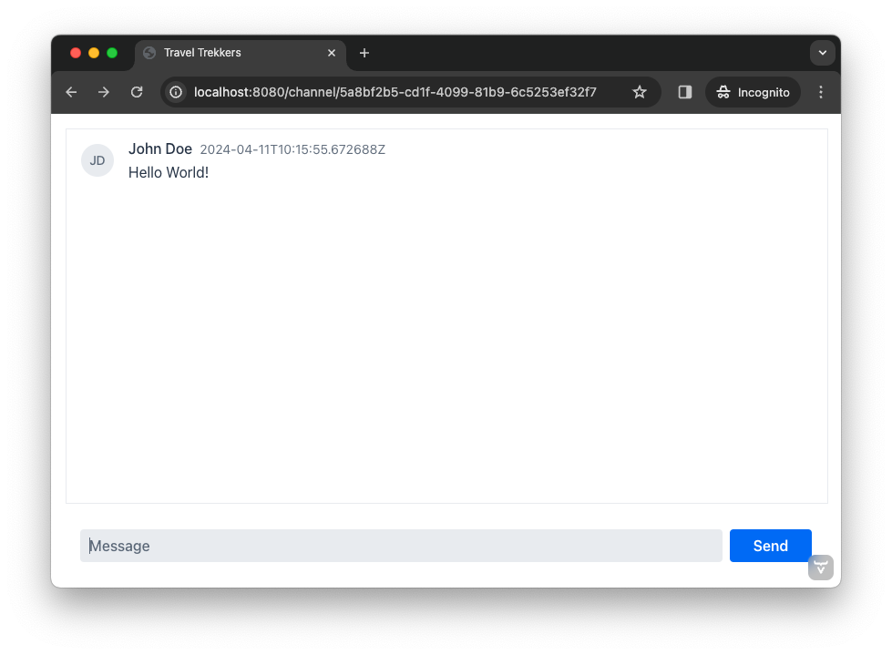
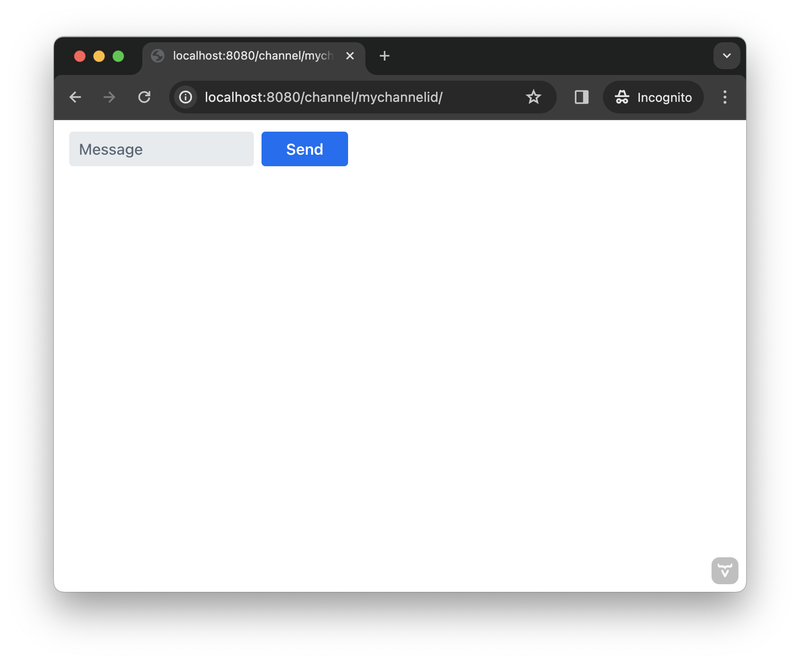
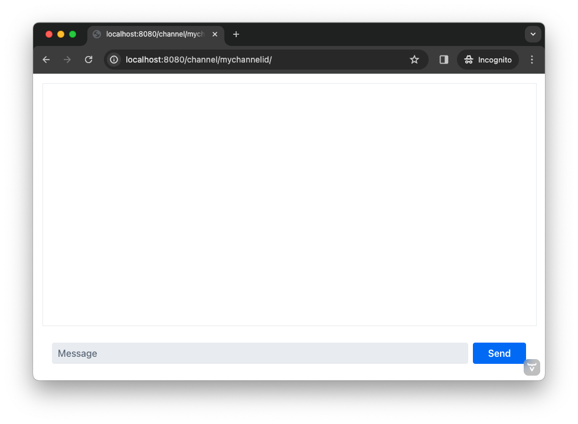

= [since:com.vaadin:vaadin@V24.4]#First View#

The first step in the exercises for this tutorial is to create a view. A view is an application's user interface page, or rather a composite of text, images, interactive components, and other elements the user may view and with which the user may interact. Examples of this might be an interactive, dynamic web page or the screen of a desktop application.

This first view, though, should specifically allow the user to receive and post messages in a given channel. For the purposes here, it'll contain the following three user interface components:

- List of messages in the channel;
- Input field for writing new messages; and
- Button for sending new messages to the channel.

Furthermore, the view needs access to the ID of the channel, which is passed as a URL parameter (e.g., `/channel/<channelId>`). It will also need an instance of [classname]`ChatService`, injected through constructor injection.

To understand better what you're working towards, once finished, the view should look like this:

This may seem very plain and lacking in luster. However, for learning purposes, it's best to start with a simple goal so you may focus on the essential elements and steps in the process of creating a view and an application. You'll develop this initial view as you go through this tutorial.

== Routing in Hilla

Routing is a central concept to all Vaadin application. Simply put, routing is the mapping of views to different URL paths. When you navigate to a different view inside the application, the URL path changes. The path can contain path parameters whose values can be read by the view in order to e.g. load data from the server. For example, a view could be mapped to the path `/channel/<channelId>`, where `<channelId>` is a path parameter. The URLs http://localhost:8080/channel/1234 and http://localhost:8080/channel/5678 would both go to the same view, but `channelId` would have the value of `1234` in the former case and `5678` in the latter.

The easiest way of setting up routing in a Hilla app is to use the file system based router (FS-router). The Vaadin build system analyzes the file structure of your project and configures the underlying https://reactrouter.com/en/main[React Router] for you. If you are running the application in development mode, this happens continuously as you add and remove files to the file system.

Start the application in development mode by opening a terminal window and running the following command:

[source,terminal]
----
$ ./mvnw spring-boot:run
----

After the application has started, you should see that a new directory has been generated for your: [directoryname]`src/main/frontend`. This is where all frontend files in a Vaadin application are stored. However, since you have not yet created any frontend files, the application is currently running in Flow-only mode. Since you are now building a Hilla app, you need to stop the application by pressing Ctrl+C in the terminal window. Once you have created the first frontend view and start the application again, Vaadin will automatically set up FS-router for you.

Fore more information about routing in Hilla, see the <<{articles}/hilla/guides/routing#,Hilla documentation>>.

== Create the Channel View

When using FS-router, Vaadin analyzes the contents of the [directoryname]`src/main/frontend/views` directory. The channel view is going to be mapped to the `/channel/<channelId>` path, where `channelId` is a required path parameter. This corresponds to the following file structure in your project:

[source]
----
- src/main/frontend/views <1>
  - channel <2>
    - {channelId} <3>
      - @index.tsx <4>
----
<1> This is the root directory for all views when using FS-router.
<2> This corresponds to the `/channel` path.
<3> The single curly brackets denote a required path parameter that in this case is called `channelId`.
<4> This file contains a React view that will be rendered when the user navigates to `/channel/<channelId>`.

In your IDE, create the file and copy-paste the following contents into it:

.@index.tsx
[source,tsx]
----
import { useParams } from 'react-router-dom';

export default function ChannelView() {
    const { channelId } = useParams()

    return <>Channel: {channelId}</>
}
----

Next, go to your terminal window and start the application by running the following command:

[source,terminal]
----
$ ./mvnw spring-boot:run
----

You can now navigate to http://localhost:8080/channel/mychannelid and you should see the text "Channel: mychannelid" in the browser window. If you change the URL to e.g. http://localhost:8080/channel/12345, the text should change to "Channel: 12345".

If you have enough space on your monitor, or if you have two monitors, bring up the browser window and the IDE next to each other. You are now going to start making the channel view into something that resembles the screenshot in the beginning of this article. Since you are running the application in development mode, the browser will automatically update itself as you edit the code in the IDE.

In your IDE, replace the contents of [filename]`@index.tsx` with the following:

.@index.tsx
[source,tsx]
----
import { useParams } from 'react-router-dom';
import { MessageInput } from '@vaadin/react-components/MessageInput';
import { MessageList } from '@vaadin/react-components/MessageList';
import { VerticalLayout } from '@vaadin/react-components/VerticalLayout';

export default function ChannelView() {
    const { channelId } = useParams()

    return <VerticalLayout> {/* <1> */}
        <MessageList/> {/* <2> */}
        <MessageInput/> {/* <3> */}
    </VerticalLayout>
}
----
<1> `VerticalLayout` is a Vaadin component that lays out other components vertically.
<2> `MessageList` is a Vaadin component that shows a list of messages.
<3> `MessageInput` is a Vaadin component that allows a user to enter a message and send it.

Your browser should now look like this:

== Style the Channel View

The screenshot above does not look like the screenshot in the beginning of this article. This is because all the components have their default sizes:

* The vertical layout's width is 100% and its height is determined by the size of its children.
* The message list is empty, which gives it a height of zero, effectively rendering it invisible.
* The message input is just big enough to show the text field and button inside it.

You have to add CSS styles to change the sizes of the components. There are different ways of doing this, but in this case, you are going to use CSS utility classes provided by the Vaadin Lumo theme.

These utility classes are not enabled by default. To enable them, you have to create a new theme for the application. Applications created by the https://start.vaadin.com[starter] already have a theme, but in this tutorial, you are going to create it manually for the sake of learning.

To start, make a new directory: [directoryname]`src/main/frontend/themes/chat-theme`. Inside this directory, create an empty file [filename]`styles.css`. You'll add custom styles to this file later in this tutorial. Vaadin will automatically import the Lumo theme and apply your styles on top of the Lumo styles, allowing you to override them.

Next, you should create a theme configuration file called [filename]`theme.json` in the same directory as [filename]`styles.css`. You'll use this file to configure various theme-related features. For now, use it to enable the Lumo utility classes. Do this by copy-pasting the following code into the file:

.`theme.json`
[source,json]
----
{
    "lumoImports" : [ "typography", "color", "sizing", "spacing", "utility" ]
}
----

If you left out this file, the `typography`, `color`, `sizing`, and `spacing` modules would have been loaded by default.

Finally, you need to configure your application to use the new theme. You do this by adding the [annotationname]`@Theme` annotation to your application shell class or in this case, the [classname]`com.example.application.Application` class:

.`Application.java`
[source,java]
----
package com.example.application;
...
// tag::snippet[]
import com.vaadin.flow.theme.Theme;
// end::snippet[]

@SpringBootApplication
// tag::snippet[]
@Theme("chat-theme")
// end::snippet[]
public class Application implements AppShellConfigurator {
    ...
}
----

After this little detour, you are now ready to continue working on the channel view. Switch to [filename]`src/main/frontend/views/channel/{channelId}/@index.tsx` in your IDE.

The first thing you are going to do is to make the layout fill the entire screen. The width is already 100% by default, so you need to set the height to 100% as well. You can use the CSS class `h-full` for this. You are also going to configure the layout to add some <<{articles}/components/vertical-layout#spacing,spacing>> around its children and  <<{articles}/components/vertical-layout#padding,padding>> around the layout itself. The layout has built-in themes - `spacing` and `padding` - that you can apply using the `theme` attribute, like this:

.@index.tsx
[source,tsx]
----
...
export default function ChannelView() {
    ...
    return <VerticalLayout theme="padding spacing" className="h-full">
        <MessageList/>
        <MessageInput/>
    </VerticalLayout>
}
----

Next, you are going to make the message list take up all the available space in the layout and also add a border to it. There are CSS utility classes for this as well: `h-full`, `w-full` (for setting the width to 100%) and `border` (for adding a solid border):

.@index.tsx
[source,tsx]
----
...
export default function ChannelView() {
    ...
    return <VerticalLayout theme="padding spacing" className="h-full">
        <MessageList className="h-full w-full border"/>
        <MessageInput/>
    </VerticalLayout>
}
----

Finally, you are going to make the message input take up the full width of the screen:

.@index.tsx
[source,tsx]
----
...
export default function ChannelView() {
    ...
    return <VerticalLayout theme="padding spacing" className="h-full">
        <MessageList className="h-full w-full border"/>
        <MessageInput className="w-full"/>
    </VerticalLayout>
}
----

Your browser should now look like this:

== Make the Chat Service Browser Callable

At this point, the application looks okay but it does not do anything. You are now going to connect the view to the Java application layer, or more specifically to [classname]`ChatService`, which is located in the [packagename]`com.example.application.chat` package. One of the major benefits of Hilla is that you do not have to create REST controllers for your application services. Instead, you add the [annotationname]`@BrowserCallable` annotation to the services you want to call from the user interface. Vaadin generates the necessary REST endpoints dynamically and also TypeScript clients for interacting with the endpoints through a strongly typed API.

Start by opening the [classname]`com.example.application.chat.ChatService` class in your IDE. Then add the [annotationname]`@BrowserCallable` annotation to the class, like this:

.ChatService.java
[source,java]
----
package com.example.application.chat;
...
// tag::snippet[]
import com.vaadin.hilla.BrowserCallable;
// end::snippet[]

@Service
// tag::snippet[]
@BrowserCallable
// end::snippet[]
public class ChatService {
    ...
}
----

Because Hilla endpoints are protected by default, and you have not added security yet, you also need to add the [annotationname]`@AnonymousAllowed` annotation to the class so that you can test it:

.ChatService.java
[source,java]
----
package com.example.application.chat;
...
// tag::snippet[]
import com.vaadin.flow.server.auth.AnonymousAllowed;
// end::snippet[]

@Service
@BrowserCallable
// tag::snippet[]
@AnonymousAllowed
// end::snippet[]
public class ChatService {
    ...
}
----

== Fetch Channel Information

So far, the application treats the channel ID as just a string. You are going to verify that this string is actually a valid channel ID and redirect the user to the channel list (which you will create later in this tutorial) if not. [classname]`ChatService` has a method called [methodname]`channel()` that takes the channel ID as a parameter. If the channel exists, the method returns a [classname]`Channel` object with information about the channel (such as its name). If the channel does not exist, the method returns an empty [classname]`Optional`.

If you look at the [directoryname]`src/main/frontend/generated` directory, you will find a file called [filename]`ChatService.ts`. This file exports an asynchronous function called [functionname]`channel()` that takes a string - the channel ID - as a parameter and returns either a [classname]`Channel` object or `undefined`. When called from the browser, Vaadin will call the [methodname]`ChatService.channel()` method on the server, serialize the result and return it.

You are going to call this method and store the result inside a *signal*. For now, you can think of a signal as a variable that can be observed. If the result is `undefined` (meaning the channel ID was invalid), you are going to navigate to the `/` path. At the moment, there is no route configured for that path, but you will create one later. To keep the code readable, you are going to do all this inside an asynchronous TypeScript function called [functionname]`updateChannel()`, like this:

// TODO add link to Signals documentation

.@index.tsx
[source,tsx]
----
import { useNavigate, useParams } from 'react-router-dom';
import { useSignal } from '@vaadin/hilla-react-signals';
import { MessageInput } from '@vaadin/react-components/MessageInput';
import { MessageList } from '@vaadin/react-components/MessageList';
import { VerticalLayout } from '@vaadin/react-components/VerticalLayout';
import Channel from 'Frontend/generated/com/example/application/chat/Channel';
import { ChatService } from 'Frontend/generated/endpoints';

export default function ChannelView() {
    const { channelId } = useParams()
    // tag::snippet[]
    const channel = useSignal<Channel | undefined>(undefined) // <1>
    const navigate = useNavigate() // <2>

    async function updateChannel() {
        channel.value = channelId ? await ChatService.channel(channelId) : undefined // <3>
        if (!channel.value) {
            navigate('/') // <4>
        } else {
            document.title = channel.value.name // <5>
        }
    }
    // end::snippet[]

    return <VerticalLayout theme="padding spacing" className="h-full">
        <MessageList className="h-full w-full border"/>
        <MessageInput className="w-full"/>
    </VerticalLayout>
}
----
<1> This line declares the signal that will contain the channel, or `undefined` if there is none.
<2> This line declares the React hook that you will use to navigate away from the channel view.
<3> This line calls [classname]`ChatService` if the [variablename]`channelId` parameter has a value.
<4> This line navigates to `/` if the channel did not exist.
<5> This line updates the document title to the name of the channel if it did exist.

Next, you want to call this function whenever the [variablename]`channelId` parameter changes. To do this, you use a React effect:

.@index.tsx
[source,tsx]
----
import { useEffect } from 'react';
import { useNavigate, useParams } from 'react-router-dom';
import { useSignal } from '@vaadin/hilla-react-signals';
import { MessageInput } from '@vaadin/react-components/MessageInput';
import { MessageList } from '@vaadin/react-components/MessageList';
import { VerticalLayout } from '@vaadin/react-components/VerticalLayout';
import Channel from 'Frontend/generated/com/example/application/chat/Channel';
import { ChatService } from 'Frontend/generated/endpoints';

export default function ChannelView() {
    const { channelId } = useParams()
    const channel = useSignal<Channel | undefined>(undefined)
    const navigate = useNavigate()

    async function updateChannel() {
        channel.value = channelId ? await ChatService.channel(channelId) : undefined
        if (!channel.value) {
            navigate('/')
        } else {
            document.title = channel.value.name
        }
    }

    // tag::snippet[]
    useEffect(() => {
        updateChannel().catch(console.error) // <1>
    }, [channelId])
    // end::snippet[]

    return <VerticalLayout theme="padding spacing" className="h-full">
        <MessageList className="h-full w-full border"/>
        <MessageInput className="w-full"/>
    </VerticalLayout>
}
----
<1> Because the effect is synchronous and the [functionname]`updateChannel()` function is asynchronous, the function has to be called like this. For now, any errors will be printed to the console.

If you now look at the browser, you won't see the channel view anymore. Instead, you'll see an autogenerated page stating that no views could be found. This is because `mychannelid` isn't a valid channel ID and you have been redirected to `/`, which does not exist yet. In other words: the code is working!

When the application started, it generated a bunch of channels. Each channel has its own randomly generated Universally Unique Identifier (UUID). This means that every time the application starts, you get new channels and new UUIDs. Fortunately, the application prints the URL of each channel to the application log, which is also printed in the terminal you used to start the application. Go to the terminal, scroll up and look for messages that look like this:

[source]
----
2024-04-03T16:14:59.956+03:00  INFO 34476 --- [  restartedMain] c.example.application.chat.ChatService   : Created channel: Mindful Mornings (http://localhost:8080/channel/d11606b1-0e51-43e9-a404-5fee5dac08bb)
----

If the application has generated too much output, you may have to restart it. Once you have found the log entries, open one of the URLs in your browser. You should now see the channel view again, and the name of the channel should be visible on the browser tab.

== Post a Message

You are now ready to write the code that posts messages to the channel. You are going to create an asynchronous TypeScript function called [functionname]`postMessage()`, that takes the message as a parameter. This function will call [classname]`ChatService` to actually post the message. If an error occurs, it will pop up a `Notification`, which is a Vaadin component that shows a message on the screen.

Add the function to the channel view, like this:

.@index.tsx
[source,tsx]
----
...
import { Notification } from '@vaadin/react-components/Notification';

export default function ChannelView() {
    ...
    async function updateChannel() {
        ...
    }

    // tag::snippet[]
    async function postMessage(message: string) {
        if (!channel.value) { // <1>
            throw new Error('No channel to post to')
        }
        try {
            await ChatService.postMessage(channel.value.id, message) // <2>
        } catch (_) {
            Notification.show('Failed to send the message. Please try again later.', { // <3>
                theme: 'error',
                position: 'bottom-end'
            })
        }
    }
    // end::snippet[]
    ...
}
----
<1> The [methodname]`ChatService.postMessage()` method requires a channel ID and if there is none, there is no point in calling the method in the first place.
<2> This line calls [classname]`ChatService`.
<3> This line shows an error notification if the message could not be sent.

Next, you want to call this function when the user clicks the send button. The message input component fires a [classname]`SubmitEvent` that you can handle through the [propertyname]`onSubmit` property. You can get the message text itself through [propertyname]`event.detail.value`. Add the event handler like this:

.@index.tsx
[source,tsx]
----
...
export default function ChannelView() {
    ...
    return <VerticalLayout theme="padding spacing" className="h-full">
        <MessageList className="h-full w-full border"/>
        <MessageInput className="w-full" onSubmit={e => postMessage(e.detail.value)}/>
    </VerticalLayout>
}
----

If you now try to send a message, you will see an error in the server log that looks like this:

----
2024-04-03T16:48:11.803+03:00 ERROR 44614 --- [io-8080-exec-13] c.example.application.chat.ChatService   : Error posting message to channel 2058465e-c964-4231-aeff-b3b1ba47f9ff: FAIL_ZERO_SUBSCRIBER
----

This is because there is nobody that could receive the message. You are going to fix this next!

== Receive Messages

On the server side, [classname]`ChatService` has a method called [methodname]`liveMessages()` that returns a [classname]`Flux`. A [classname]`Flux` is a reactive stream that can emit zero or more elements, in this case messages. Hilla makes this stream available on the browser side as well.

The first thing you need to do is create a signal that holds the messages that you have received, like this:

.@index.tsx
[source,tsx]
----
...
import Message from 'Frontend/generated/com/example/application/chat/Message';

export default function ChannelView() {
    const { channelId } = useParams()
    const channel = useSignal<Channel | undefined>(undefined)
    // tag::snippet[]
    const messages = useSignal<Message[]>([]) // <1>
    // end::snippet[]
    ...
}
----
<1> If no messages have been received, the signal value is an empty array.

Second, you need to update the message list so that the messages are rendered. Because the `MessageList` component expects items of its own type, you'll have to map the messages in the signal like this:

.@index.tsx
[source,tsx]
----
...
export default function ChannelView() {
    ...
    return <VerticalLayout theme="padding spacing" className="h-full">
        {/* tag::snippet[] */}
        <MessageList className="h-full w-full border" items={messages.value.map(message => ({
            text: message.message,
            userName: message.author,
            time: message.timestamp
        }))}/>
        {/* end::snippet[] */}
        <MessageInput className="w-full" onSubmit={e => postMessage(e.detail.value)}/>
    </VerticalLayout>
}
----

Now, whenever the [variablename]`messages` signal is updated, the user interface will also get updated.

Now you are ready to subscribe to the live messages stream. When you subscribe, you pass in a function that will get called whenever a message arrives from the server. This will happen until the network connection is broken or your explicitly unsubscribe. To prevent memory leaks and other unwanted behavior, it is important to manage the subscription correctly, and that's what you are going to do next.

When you subscribe, you will get a [classname]`Subscription` object that you can use to unsubscribe. Create a new signal for storing it:

.@index.tsx
[source,tsx]
----
...
import { Subscription } from '@vaadin/hilla-frontend';

export default function ChannelView() {
    const { channelId } = useParams()
    const channel = useSignal<Channel | undefined>(undefined)
    const messages = useSignal<Message[]>([])
    // tag::snippet[]
    const subscription = useSignal<Subscription<Message[]> | undefined>(undefined) // <1>
    // end::snippet[]
    ...
}
----
<1> If you have no active subscription, the signal value is `undefined`.

Next, create the function that unsubscribes from the stream. You start with this function because it is needed when you write the subscribe function. Add the following function to the [functionname]`ChannelView()`, after the [functionname]`postMessage()` function:

.@index.tsx
[source,tsx]
----
...
export default function ChannelView() {
    ...
    async function postMessage(message: string) {
        ...
    }

    // tag::snippet[]
    function unsubscribe() {
        if (subscription.value) {
            console.log("Unsubscribing")
            subscription.value.cancel() // <1>
            subscription.value = undefined // <2>
        }
    }
    // end::snippet[]

    useEffect(() => {
        ...
    }, [channelId])
    ...
}
----
<1> Cancel the subscription if it is defined.
<2> Replace the stale [classname]`Subscription` object with `undefined` to indicate that there is no active subscription.

Next, create the function that subscribes to the message stream:

.@index.tsx
[source,tsx]
----
...
export default function ChannelView() {
    ...
    function unsubscribe() {
        ...
    }

    // tag::snippet[]
    function subscribe() {
        unsubscribe() // <1>
        if (channel.value) {
            console.log("Subscribing to", channel.value.id)
            subscription.value = ChatService.liveMessages(channel.value.id) // <2>
                .onNext(incoming => messages.value = [...messages.value, ...incoming]) // <3>
                .onError(() => console.error("Error in subscription")) // <4>
        }
    }
    // end::snippet[]

    useEffect(() => {
        ...
    }, [channelId])
    ...
}
----
<1> You can only have one active subscription at a time. This line will make sure to cancel any existing subscription before creating a new one.
<2> This line updates the [variablename]`subscription` signal to indicate that there is an active subscription.
<3> This line appends the newly arrived messages to the array of messages already stored in the [variablename]`messages` signal.
<4> This line logs any errors in the console.

Finally, you need to call the [functionname]`subscribe()` function to start receiving messages. Do this by amending the effect you used to update the channel, like this:

.@index.tsx
[source,tsx]
----
...
export default function ChannelView() {
    ...
    // tag::snippet[]
    useEffect(() => {
        updateChannel().then(subscribe).catch(console.error) // <1>
        return unsubscribe // <2>
    }, [channelId])
    // end::snippet[]
    ...
}
----
<1> This line calls the [functionname]`subscribe()` function after the [functionname]`updateChannel()` function has successfully completed.
<2> This line instructs React to call the [functionname]`unsubscribe()` function whenever the `ChannelView` component is unmounted.

If you know switch over to your browser and send some messages, they should show up in the message list.
