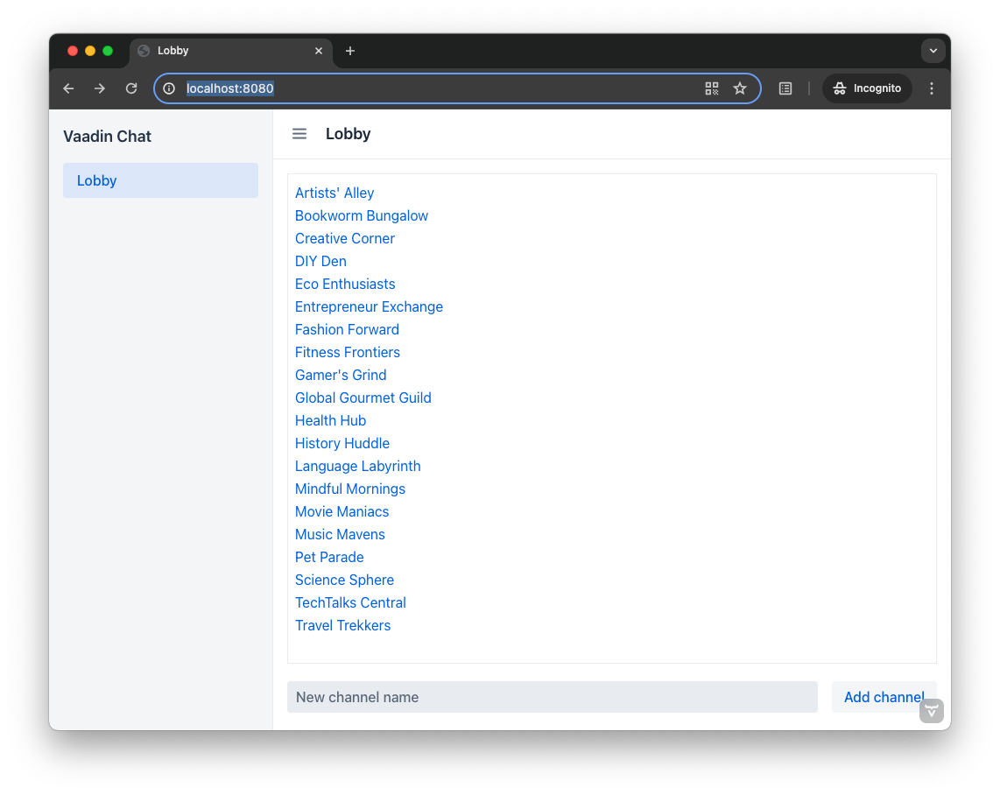
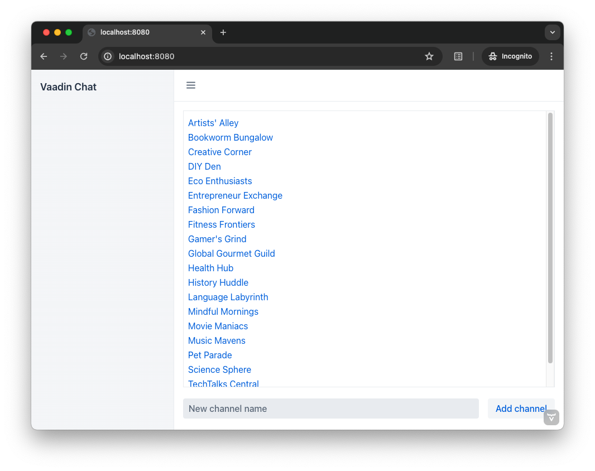
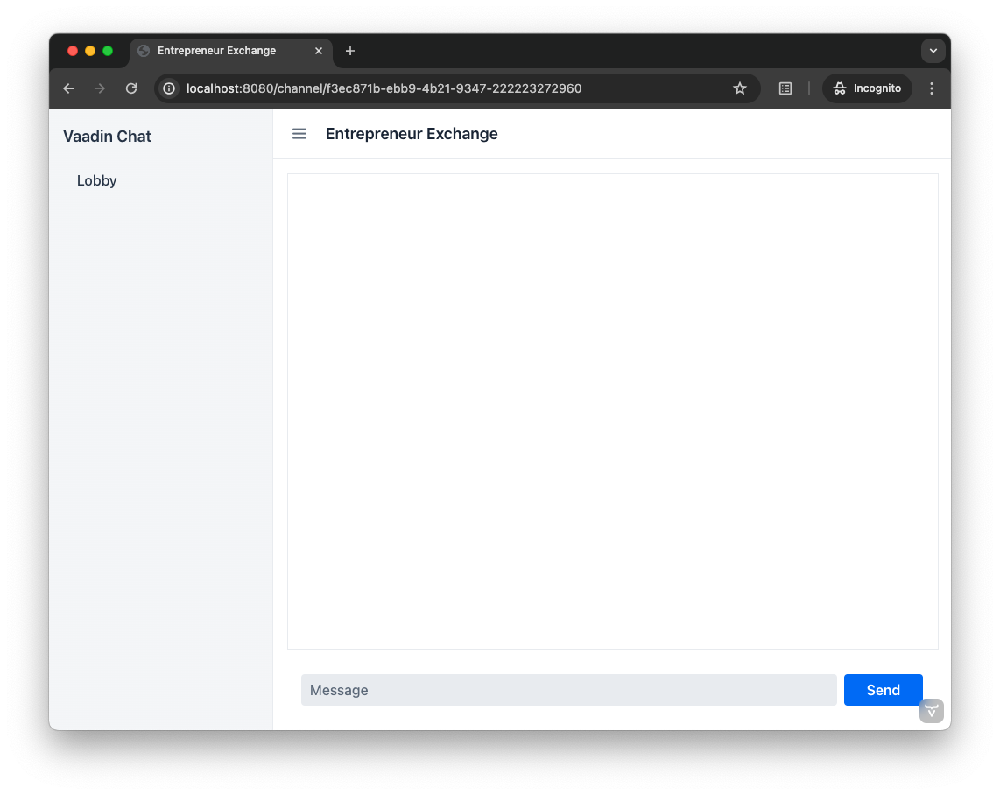

= [since:com.vaadin:vaadin@V24.4]#Add a Layout#

Unless an application consists of a single view, you'll probably want a reusable layout, with a header or a navigation bar. Since the chat application you've been developing in this tutorial, at this point consists of two views, this page will go through the process of building such a layout. If you haven't gone through the previous steps, please do so before proceeding here.

You'll create a main layout consisting of three user interface components: a header with the name of the current view; a side bar that contains the name of the application and a link to the lobby view; and a menu toggle button for showing and hiding the side bar.

When you're finished, the layout should look like this:

As you can see, this looks a little nicer. With the addition of the sidebar, you also have room to develop many more possibilities for the application.

== Application Layout

It's quite common for business applications to have a layout like the one shown in the screenshot above. Because of that, Vaadin provides one out-of-the-box: it's called, [classname]`AppLayout`. The application layout splits the user interface into three parts: a horizontal naviation bar, called the _navbar_; a collapsible navigation drawer, called the _drawer_; and a content area, where the actual view is rendered.

The navbar can be placed at the top of the screen, or next to the drawer. When placed at the top, the navbar is typically used as the application header.

image:../images/applayout-top.png[]

When placed next to the drawer, it's typically used as the view header. This is the mode you'll use in this tutorial.

image:../images/applayout-side.png[]

This layout is progressive: it'll adapt to the screen size.

You can find more information about the application layout in the <<{articles}/components/app-layout#,AppLayout>> page of the Components documentation.

=== Create the Layout

To create a layout for the views, start with a file named [filename]`@layout.tsx` in the [directoryname]`src/main/frontend/views` directory. Then copy-paste the following code into it:

.@layout.tsx
[source,tsx]
----
import { AppLayout, DrawerToggle, Tooltip } from "@vaadin/react-components";
import { Suspense } from "react";
import { Outlet } from "react-router-dom";

export default function MainLayout() {
    return (
        <AppLayout primarySection="drawer">
            

                <header className="flex flex-col gap-m">
                    Vaadin Chat 
                </header>
            

            <DrawerToggle aria-label="Menu toggle" slot="navbar"> {/* <1> */}
                <Tooltip slot="tooltip" text="Menu toggle"/>
            </DrawerToggle>
            <Suspense fallback={
Loading....
}> {/* <2> */}
                <Outlet/> {/* <3> */}
            </Suspense>
        </AppLayout>
    )
}
----
<1> The `DrawerToggle` component automatically toggles (shows and hides) the drawer without you having to write any code.
<2> The text "Loading..." will be visible while the view is loading. You can replace it with a fancier component if you like.
<3> The views will be rendered by this `Outlet`.

With the application running, navigate to http://localhost:8080 (or refresh the page if you already have it open in your browser). You should now see an empty navbar and an empty drawer:

If you click on the menu toggle, the drawer slides out and in. If you make the window narrower, the drawer will automatically hide itself.

=== Define the Drawer

You are now going to add navigation items to the drawer. By clicking on these items, the user can navigate to different views. There is a component called `SideNav` that has been especially designed for this, so you are going to use that. When it comes to adding items, you have two options: add the items manually or use Hilla to get a list of items. In this tutorial, you are going to use the latter.

Start by updating the imports at the top of the [filename]`@layout.tsx` file as follows:

.@layout.tsx
[source,tsx]
----
import { createMenuItems } from "@vaadin/hilla-file-router/runtime.js";
import { AppLayout, DrawerToggle, Icon, SideNav, SideNavItem, Tooltip } from "@vaadin/react-components";
import { Suspense } from "react";
import { Outlet, useLocation, useNavigate } from "react-router-dom";
...
----

The side navigation component has been designed to work with multiple different routers. For it to work properly with React Router - the one you are using - it needs to know two things: how to navigate to a new route and what the current route is. For this, you need two React hooks: `useNavigate` and `useLocation`. Add them to the top of the `MainLayout` function, like this:

.@layout.tsx
[source,tsx]
----
...
export default function MainLayout() {
    const navigate = useNavigate()
    const location = useLocation()
    ...
}
----

Finally, you are ready to add the side navigation. Add the `SideNav` to the drawer, like this:

.@layout.tsx
[source,tsx]
----
...
export default function MainLayout() {
    ...
    return (
        <AppLayout primarySection="drawer">
            

                <header className="flex flex-col gap-m">
                    Vaadin Chat 
// tag::snippet[]
                    <SideNav onNavigate={({ path }) => navigate(path!)} location={location}> {/* <1> */}
                    {createMenuItems().map(({ to, title, icon }) => ( {/* <2> */}
                        <SideNavItem path={to} key={to}>
                            {icon ? <Icon src={icon} slot="prefix"></Icon> : <></>} {/* <3> */}
                            {title}
                        </SideNavItem>
                    ))}
                </SideNav>                
// end::snippet[]
                </header>
            

        </AppLayout>
    )
}
----
<1> This line plugs the React router into the side navigation.
<2> [functionname]`createMenuItems` is a function provided by Hilla that returns a list of views that the user can navigate to.
<3> Not all views have icons, so you have to support that.

You can find more information about the side navigation in the <<{articles}/components/side-nav#,SideNav>> page of the Components documentation.

=== Add View Title

At the start of this page, you learned that the navbar is going to be used for the view title in this tutorial. You are now going to add that. You could get the view title from Hilla, but that would only work for view titles that are static (i.e. they never change once declared). In this tutorial, the channel view uses dynamic titles that change dependning on which channel ID you have passed in as a URL parameter.

To handle this situation, you have to declare a signal that will contain the current view title. Add the following to [filename]`@layout.tsx`:

.@layout.tsx
[source,tsx]
----
...
import { effect, signal } from "@vaadin/hilla-react-signals";

export const pageTitle = signal<string>(""); // <1>
effect(() => {
    document.title = pageTitle.value // <2>
})

export defualt function MainLayout() {
    ...
}
----
<1> The signal is exported so that other views can import it.
<2> Whenever the page title is changed, the document title is also updated.

Next, add it to the navbar, like this:

.@layout.tsx
[source,tsx]
----
...
export default function MainLayout() {
    ...
    return (
        <AppLayout primarySection="drawer">
            ...
            <DrawerToggle aria-label="Menu toggle" slot="navbar">
                <Tooltip slot="tooltip" text="Menu toggle"/>
            </DrawerToggle>
            <h2 className="text-l m-0 flex-grow" slot="navbar">{pageTitle.value}</h2>
            ...
        </AppLayout>
    )
}
----

Finally, you need to update the lobby and channel views to set their page titles. Start with the lobby view. Open [filename]`views/@index.tsx` and add the following:

.views/@index.tsx
[source,tsx]
----
...
import { pageTitle } from "./@layout";

export default function LobbyView() {
    pageTitle.value = "Lobby"
    ...
}
----

Then, do the same with the channel view. Open [filename]`views/channel/{channelId}/@index.tsx` and add the following:

.views/channel/{channelId}/@index.tsx
[source,tsx]
----
...
// tag::snippet[]
import { pageTitle } from "Frontend/views/@layout";
// end::snippet[]

export default function ChannelView() {
    ...
    async function updateChannel() {
        channel.value = channelId ? await ChatService.channel(channelId) : undefined
        if (!channel.value) {
            navigate("/")
        } else {
// tag::snippet[]
            pageTitle.value = channel.value.name // <1>
// end::snippet[]
        }
    }
    ...
}
----
<1> In the previous version, this line set [propertyname]`document.title` to the channel name. Now when that is handled by the layout, it is enough to set the value of the [variablename]`pageTitle` signal to the channel name.

The lobby view should now look like this:

Pick a channel. The channel name should show up both in the navbar and as the title of the tab in your browser:

If you navigate back to the lobby, both the navbar and the tab should say "Lobby" again.
