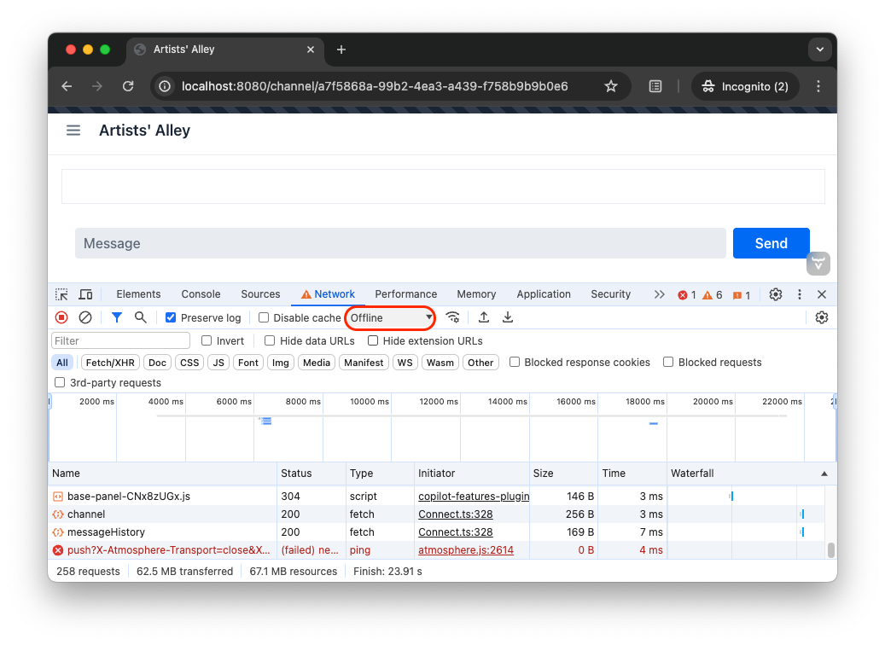

# [since:com.vaadin:vaadin@V24.4]#Handle Connection Issues#

There are many situations where the connection between the browser and the server is lost. Maybe the laptop went to sleep mode, maybe the phone switched from wifi to mobile, maybe there was a network connectivity issue somewhere on the way, maybe the server went down, maybe a new version of the app was deployed, etc.

In a <<../flow#,Flow>> application, Vaadin takes care of the connection issues for you. If the connection between the browser and the server is lost, the user interface becomes unavailable until the connection has been restored. After that, the user can continue to work or has to login again, depending on the cause and duration of the connection issue.

In a Hilla/React application, things are different. Since the user interface is running inside the browser, it remains running even if the connection is lost. This means that you, as a developer, must prepare for and handle the connection issues. In the chat application you have been building, there are two situations that you need to detect and handle: when the live stream breaks and when an error occurs while calling a server method (like posting a message or creating a channel).

## Detect Issue

Under the hood, the live stream is a websocket connection established for you by Vaadin. Unfortunately, at the moment, Vaadin does not provide a good API for detecing and handling disconnects and reconnects. Fortunately, there is a workaround that you can apply.

In your IDE, create a new directory [directoryname]`src/main/frontend/util` and inside it, a new file called [filename]`ConnectionUtil.ts`. Then copy-paste the following code into it:

.ConnectionUtil.ts
[source,ts]
----
import {signal} from "@vaadin/hilla-react-signals";
import connectClient from "Frontend/generated/connect-client.default";
import {State} from "@vaadin/hilla-frontend";

export const connectionActive = signal(connectClient.fluxConnection.state == State.ACTIVE); // <1>

connectClient.fluxConnection.addEventListener('state-changed', (event: CustomEvent<{ active: boolean }>) => { // <2>
    connectionActive.value = event.detail.active;
});
----
<1> This line declares and exports a signal that will contain `true` whenever the connection is active and `false` otherwise.
<2> This event listener updates the signal whenever the state of the Vaadin websocket connection changes.

You can now use this signal in other parts of the application to get notified when the connection goes down and comes back. You're going to do this next.

## Re-subscribe to Live Stream

In the channel view, you have already declared a function [functionname]`subscribe()` that gets called inside a React effect whenever the [variablename]`channelId` parameter is changed. Now, you also want to call this function whenever the connection state changes from `false` to `true`. Open In your IDE, open [filename]`views/channel/{channelId}/@index.tsx` and make the following changes:

.views/channel/{channelId}/@index.tsx
[source,tsx]
----
...
// tag::snippet[]
import { connectionActive } from "Frontend/util/ConnectionUtil"; // <1>
// end::snippet[]

...
export default function ChannelView() {
    ...
// tag::snippet[]
    useEffect(() => {
        if (connectionActive.value) { // <2>
            updateChannel().then(subscribe).catch(console.error)
        }
        return unsubscribe
    }, [channelId, connectionActive.value]) // <3>
// end::snippet[]
    ...
}
----
<1> This line imports the signal so that you can observe it and react to changes.
<2> Only try to call the server if there is an active connection.
<3> This line triggers the effect whenever the [variablename]`channelId` or the [variablename]`connectionActive` changes.

You can now try out the new functionality, but in order to do that, you need to know how to simulate a connection outage using your browser development tools. In Chrome, you can find this by opening the development tools, going to the *Network* tab and switching from *No throttling* to *Offline*:

While online, open any channel and post some messages. Then go offline. Try to post another message. You should see a red error message that you already implemented in the <<first-view#,first step>> of this tutorial. Go online again and post a message. The message should show up normally.

## Re-fetch Message History

The chat application will now reconnect to the server when the browser comes back online. But what about any messages received while the browser was offline? Because of the way you implemented fetching the <<message-history#,message history>>, you have actually already covered this part! Whenever you go back online, you call the [functionname]`subscribe()` function and that function fetches the message history. However, there is one small improvement that you can do.

Recall that you are only keeping the 20 last messages. Refetching the entire message history is not a big deal in this case. But what if you kept a lot more messages than that? Woudln't it be better to only fetch the messages that arrived while the browser was offline? Because this tutorial - simple as it may be - is teaching you to write real-world applications, you're going to do just that.

The Chat Service already has support the functionality you want: if you pass in the ID of the last message you have seen, you will only get the messages that have been posted _after_ that message. All you need to do is to get this parameter and pass it on to the server. Look up the [functionname]`subscribe()` function and make the following changes:

[source,tsx]
----
...
export default function ChannelView() {
    ...
    function subscribe() {
        unsubscribe()
        if (channel.value) {
            console.log("Subscribing to channel", channel.value.id)
            subscription.value = ChatService.liveMessages(channel.value.id)
                .onNext(receiveMessages)
                .onError(() => console.error("Error in subscription"))
// tag::snippet[]
            const lastSeenMessage = messages.value.at(-1) // <1>
            ChatService.messageHistory(channel.value.id, HISTORY_SIZE, lastSeenMessage?.messageId) // <2>
                .then(receiveMessages)
// end::snippet[]
        }
    }
    ...
}
----
<1> The last seen message is the last message in the [variablename]`messages` array. If the array is empty, the last seen message is `undefined`.
<2> Pass the ID of the last seen message to the Chat Service.

You can now try out the new functionality. In order to do that, you need to open the same channel in two different browsers. If you are using Chrome, you can open the channel in a normal window and in an incognito window. Post some messages in one of the windows. They should show up in both. Next, turn one of the windows offline. Move over to the online window and send some messages. They should show up in the online window but not in the offline window. Now go back to the offline window and go online. All the messages should now show up again.
