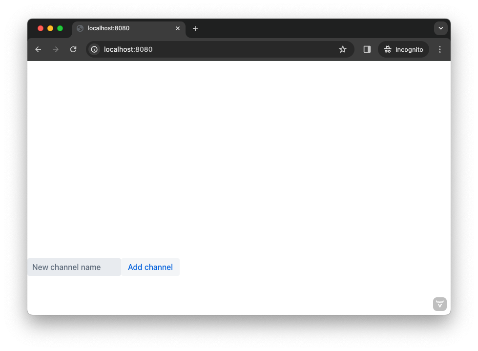
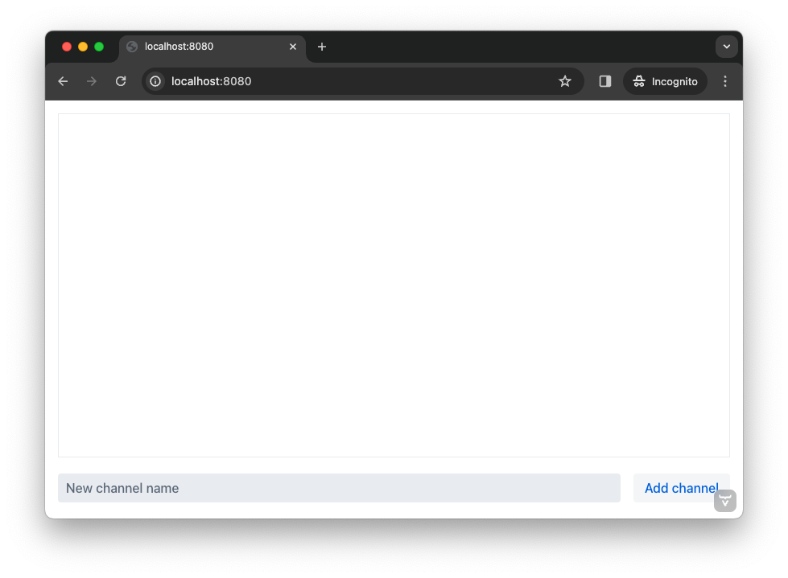
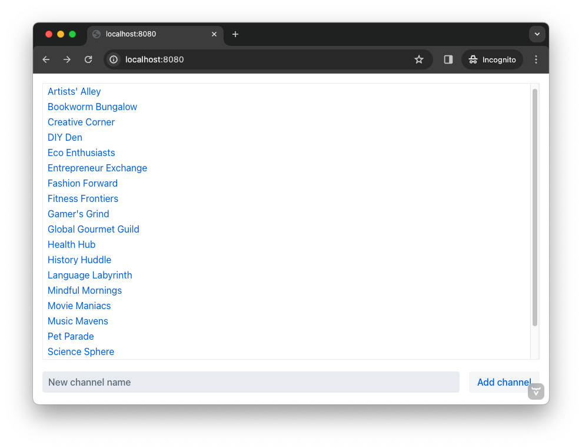

= [since:com.vaadin:vaadin@V24.4]#Second View#

To be able to use a chat channel in the example developed in this tutorial, users have to know the channel's UUID. This isn't very user-friendly. To remedy this, this page explains how to build a second view that allows users to see a list of available channels from which to select.

Once finished, the view will contain some necessary user interface components and should look like this:

*INSERT SCREENSHOT*

Notice there's a list of channels from which to choose. The user would click on a channel in the list. At the bottom, there's also an input field for entering the name of a new channel and a button for creating it. Making these choices do something, and triggering actions from them is covered later in the tutorial page.

== Create Lobby View

Recall from the first view, that if a user tried to access a channel that doesn't exist, they would be redirected to a view mapped to the `/` path. That view is the lobby view that you're about to create. In your IDE, locate the [directoryname]`src/main/frontend/views` directory. Then, create a file called [filename]`@index.tsx` inside it and copy and paste the following contents into it:

.@index.tsx
[source,tsx]
----
import { Button } from "@vaadin/react-components/Button"
import { HorizontalLayout } from "@vaadin/react-components/HorizontalLayout"
import { TextField } from "@vaadin/react-components/TextField"
import { VerticalLayout } from "@vaadin/react-components/VerticalLayout";
import { VirtualList } from "@vaadin/react-components/VirtualList";

export default function LobbyView() {
    return <VerticalLayout>
        <VirtualList> {/* <1> */}
        </VirtualList>
        <HorizontalLayout>
            <TextField placeholder="New channel name"/> {/* <2> */}
            <Button>Add channel</Button> {/* <3> */}
        </HorizontalLayout>
    </VerticalLayout>
}
----
<1> `VirtualList` is a Vaadin component that allows you to render a long list of items inside a scrollable container. Each item is rendered on the fly as the user scrolls.
<2> `TextField` is a Vaadin component for entering text.
<3> `Button` is a Vaadin component for, well, a button.

If you now navigate to http://localhost:8080/ in your browser, the view looks like this:

The view looks broken. You are going to fix this next, by using the CSS utility classes from the Lumo theme (you also used them to style the channel view). Update the lobby view like this:

.@index.tsx
[source,tsx]
----
...
export default function LobbyView() {
    // tag::snippet[]
    return <VerticalLayout className="h-full" theme="padding spacing">
        <VirtualList className="flex-grow border p-s">
    {/* end::snippet[] */}
        </VirtualList>
    {/* tag::snippet[] */}
        <HorizontalLayout className="w-full" theme="spacing">
            <TextField placeholder="New channel name" className="flex-grow"/>
    {/* end::snippet[] */}
            <Button>Add channel</Button>
        </HorizontalLayout>
    </VerticalLayout>
}
----

Your browser should now look like this:

=== Fetch the Channels

With the user interface in place, it is now time to populate it with some data. The Java class [classname]`ChatService` (from the [packagename]`com.example.application.chat` package) contains a method called [methodname]`channels()` that returns a list of [classname]`Channel` objects. Earlier in this tutorial, you made this class browser callable. This means that Vaadin has already created the necessary TypeScript code for you to call it directly from the browser.

The first thing you need to do is to create a signal that holds the channels. Furthermore, you should make the virtual list use this channel as its data source. Add the following to your [filename]`src/main/frontend/views/@index.tsx` file:

.@index.tsx
[source,tsx]
----
...
// tag::snippet[]
import { useSignal } from "@vaadin/hilla-react-signals";
import Channel from "Frontend/generated/com/example/application/chat/Channel";
// end::snippet[]

export default function LobbyView() {
    // tag::snippet[]
    const channels = useSignal<Channel[]>([]) // <1>
    // end::snippet[]

    return <VerticalLayout className="h-full" theme="padding spacing">
    {/* tag::snippet[] */}
        <VirtualList className="flex-grow border p-s" items={channels.value}>
    {/* end::snippet[] */}
        </VirtualList>
        <HorizontalLayout className="w-full" theme="spacing">
            <TextField placeholder="New channel name" className="flex-grow"/>
            <Button>Add channel</Button>
        </HorizontalLayout>
    </VerticalLayout>
}
----
<1> If no channels have been retrieved, the signal value is an empty array

Next, you are going to create the function that fetches the channels from the server and stores them in the signal:

.@index.tsx
[source,tsx]
----
...
// tag::snippet[]
import { ChatService } from "Frontend/generated/endpoints";
// end::snippet[]

export default function LobbyView() {
    const channels = useSignal<Channel[]>([])

// tag::snippet[]
    function refreshChannels() {
        ChatService.channels()
            .then(result => channels.value = result) // <1>
            .catch(console.error) // <2>
    }
// end::snippet[]
    ...
}
----
<1> This line stores the channel list in the [variablename]`channels` signal if the server call is successful.
<2> This line logs any errors to the console.

Finally, you need to call this function inside a React effect, like this:

.@index.tsx
[source,tsx]
----
import { useEffect } from "react";

export default function LobbyView() {
    ...
    function refreshChannels() {
        ChatService.channels().then(result => channels.value = result).catch(console.error)
    }

// tag::snippet[]
    useEffect(() => {
        refreshChannels()
    }, [])
// end::snippet[]
    ...
}
----

If you now look at the browser, the list does not contain any channels at all. The reason for this is that you have not yet specified a renderer for the virtual list to use when it renders items. The renderer is a function that takes an object as the input parameter and returns a React node. One property of this input object is the [propertyname]`item` property, which refers to the item being rendered - or in this case, the channel being rendered.

You are now going to add a simple renderer to the virtual list. It will render a simple link for every channel in the list. When the user clicks a link, the browser navigates to the corresponding channel view. Change the lobby view like this:

.@index.tsx
[source,tsx]
----
...
import { Link } from "react-router-dom";

export default function LobbyView() {
    ...
    return <VerticalLayout className="h-full" theme="padding spacing">
{/* tag::snippet[] */}
        <VirtualList className="flex-grow border p-s" items={channels.value}>
            {({item}) => { // <1>
                return <Link to={"/channel/" + item.id}>{item.name}</Link> // <2>
            }}
        </VirtualList>
{/* end::snippet[] */}
}
----
<1> This line extracts the [propertyname]`item` property from the input object, ignoring everything else.
<2> This line renders a `Link` for each channel in the list.

If you now look at the browser, it should look like this:

Try clicking on any of the channels. You should be taken to the corresponding channel view!

=== Add New Channel

Your next task is to implement support for creating your own channels. You could do this directly inside the `LobbyView` component. However, as creating a channel is a concern of its own, it is better to move this functionality to its own component. This will also make things easier later in the tutorial when you start to add security to the application.

In your IDE, create a new file called [filename]`_AddChannelComponent.tsx` in the [directoryname]`src/main/frontend/views` directory. The leading underscore instructs the FS router not to treat the file as a view.

Next, inside the [filename]`src/main/frontend/views/@index.tsx` file, locate the horizontal layout that contains the text field for entering a new channel name, and the button for adding a channel. Cut and paste that layout into the [filename]`_AddChannelComponent.tsx` and add the missing imports, like this:

._AddChannelComponent.tsx
[source,tsx]
----
import { Button } from "@vaadin/react-components/Button"
import { HorizontalLayout } from "@vaadin/react-components/HorizontalLayout"
import { TextField } from "@vaadin/react-components/TextField"

export default function AddChannelComponent() {
    return <HorizontalLayout className="w-full" theme="spacing">
        <TextField placeholder="New channel name" className="flex-grow"/>
        <Button>Add channel</Button>
    </HorizontalLayout>
}
----

Finally, add the newly created `AddChannelComponent` to the `LobbyView`, like this:

.@index.tsx
[source,tsx]
----
...
// tag::snippet[]
import AddChannelComponent from "./_AddChannelComponent";
// end::snippet[]

export default function LobbyView() {
    ...
    return <VerticalLayout className="h-full" theme="padding spacing">
        <VirtualList className="flex-grow border p-s" items={channels.value}>
            {({item}) => {
                return <Link to={"/channel/" + item.id}>{item.name}</Link>
            }}
        </VirtualList>
{/* tag::snippet[] */}
        <AddChannelComponent/> {/* <1> */}
{/* end::snippet[] */}
    </VerticalLayout>
}
----
<1> Instead of a layout, there is now a single component here.

The [classname]`ChatService` has a method called [methodname]`createChannel()`. It takes the new channel name as a single parameter and returns a [classname]`Channel` object for the newly created channel. When the user clicks the add button, you should call this method and then update the channel list so that thew new channel becomes visible.

In order to do this, you need to add the following to the `AddChannelComponent`:

* A signal that contains the name of the new channel
* A function that calls [functionname]`createChannel()` when the button is clicked
* A callback function that `LobbyView` can use to update its channel list when a new channel has been created

In your IDE, make the following additions to [filename]`_AddChannelComponent.tsx`:

._AddChannelComponent.tsx
[source,tsx]
----
...
// tag::snippet[]
import Channel from "Frontend/generated/com/example/application/chat/Channel"

export type AddChannelComponentProps = {
    onChannelCreated?: (channel: Channel) => void // <1>
}

export default function AddChannelComponent(props: AddChannelComponentProps) {
    const newChannelName = useSignal<string>("") // <2>

    function addChannel() { // <3>
    }
// end::snippet[]

    return <HorizontalLayout className="w-full" theme="spacing">
{/* tag::snippet[] */}
        <TextField
            value={newChannelName.value} {/* <4> */}
            onChange={(e) => newChannelName.value = e.target.value}  {/* <5> */}
            placeholder="New channel name"
            className="flex-grow"/>
        <Button onClick={addChannel}>Add channel</Button> {/* <6> */}
{/* end::snippet[] */}
    </HorizontalLayout>
}
----
<1> This line defines the callback function that will inform `LobbyView` when a new channel has been created.
<2> This line defines the signal that contains the value of the text field.
<3> This line defines the function that will be executed when the button is clicked.
<4> This line updates the text field value whenever the signal changes.
<5> This line updates the signal value whenever the text field changes.
<6> This line calls the [functionname]`addChannel()` function when the button is clicked.

Next, you are going to implement the [functionname]`addChannel()` function:

._AddChannelComponent.tsx
[source,tsx]
----
...
export default function AddChannelComponent(props: AddChannelComponentProps) {
    ...
    function addChannel() {
        if (newChannelName.value) { // <1>
            ChatService.createChannel(newChannelName.value) // <2>
                .then(created => {
                    newChannelName.value = "" // <3>
                    if (props.onChannelCreated) {
                        props.onChannelCreated(created) // <4>
                    }
                })
                .catch(console.error)
        }
    }
    ...
}
----
<1> This line makes sure you can't create channels if the text field is empty.
<2> This line calls the [classname]`ChatService` on the server.
<3> This line resets the text field after the channel has been created.
<4> This line calls the callback if present, passing in the newly created channel.

Finally, you are going to create the callback that updates the list of channels when a new channel has been created. Switch over to [filename]`@index.tsx`, create a [functionname]`handleChannelCreated()` function and plug it into `AddChannelComponent`, like this:

.@index.tsx
[source,tsx]
----
...
export default function LobbyView() {
    const channels = useSignal<Channel[]>([])

    function refreshChannels() {
        ...
    }

// tag::snippet[]
    function handleChannelCreated(created: Channel) {
        channels.value = [...channels.value, created] // <1>
    }
// end::snippet[]

    useEffect(() => {
        refreshChannels()
    }, [])

    return <VerticalLayout className="h-full" theme="padding spacing">
        <VirtualList className="flex-grow border p-s" items={channels.value}>
            {({item}) => {
                return <Link to={"/channel/" + item.id}>{item.name}</Link>
            }}
        </VirtualList>
{/* tag::snippet[] */}
        <AddChannelComponent onChannelCreated={handleChannelCreated}/>
{/* end::snippet[] */}
    </VerticalLayout>
}
----
<1> This line appends the created channel to the already existing array of channels.

You can now try the new feature. In your browser, navigate to the lobby view (http://localhost:8080), enter a channel name and click _Add channel_. The new channel should show up at the bottom of the channel list.

Next, click the channel you just created. You should be taken to the channel view, where you can post messages to it.
