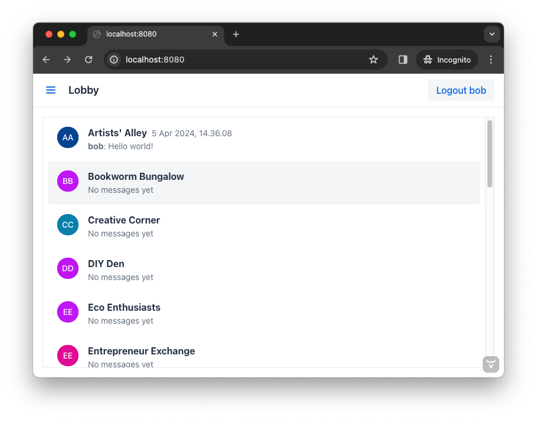

= [since:com.vaadin:vaadin@V24.4]#Vaadin Tutorial#

.Work in progress
[IMPORTANT]
This tutorial is still being written. Its content is already useful, but some parts are missing.

This tutorial demonstrates how to develop applications in Vaadin Flow and Hilla: you can read and work through both, or focus on the one you prefer based on your needs and background. Since it's written for newcomers to Vaadin Flow and Hilla, it might be worthwhile to go through both.

For those who choose only the Flow part of this tutorial, it's assumed that the reader has some Java experience, if not necessarily experience with developing Java web applications. Along those lines, it's also assumed that the reader has a basic understanding of how to develop applications using the https://spring.io/projects/spring-boot[Spring Boot] open-source Java framework. This includes understanding Spring beans, dependency injection, the application context and scopes.

For understanding and getting the most from the Hilla part of this tutorial, in addition to the skills and experience expected for understanding the Flow section, the reader should also have basic skills in https://react.dev:[React], the open-source front-end JavaScript library for building user interfaces.

== Learning Tasks & Concepts

In this tutorial, which is spread over several pages here, you'll build a simple application and deploy it. The same application will be developed in both Flow and Hilla. For each, it'll be a chat application, using the same backend -- demonstrating the similarities and differences. The results will look and behave the same, but will be implemented differently, from a different development prospective.

The finished application will look like what you see in this screenshot:

// Remember to update this section as the tutorial is expanded with more views (such as CRUD)

== Prerequisites

This tutorial uses Java 21. Vaadin works with Java 17, but to be able to use the latest features of the latest Java LTS (long term support) release, you'll use version 21.

As for tools, you'll use a web browser, Maven, and a Java IDE of your choice (e.g., IntelliJ, VS Code).

== Key Concepts

Several concepts key for Vaadin will be explored and highlighted in this tutorial: views, routing, layout, server push, backend integration, and security.

View::
A view is an application's user interface page, or rather a composite of text, images, interactive components, and other elements the user may view and with which the user may interact. It typically fills up an entire browser tab, or a big portion of it.

Routing::
This is the mapping of views to different URL paths. Navigating to a different view inside an application changes the URL path -- which can contain path parameters.

Layout::
A web application often has elements that are visible regardless of which view is currently active, such as an application header and a navigation menu. These elements are added to a layout. A layout also controls where the view is rendered inside it.

Server Push::
In a web application, the browser sends a request to the server and the server responds. Server push is a mechanism in which the server can push data to the browser without first getting a request.

Security::
Measures taken to protect the application from unauthorized use, including authentication and authorization of users.
