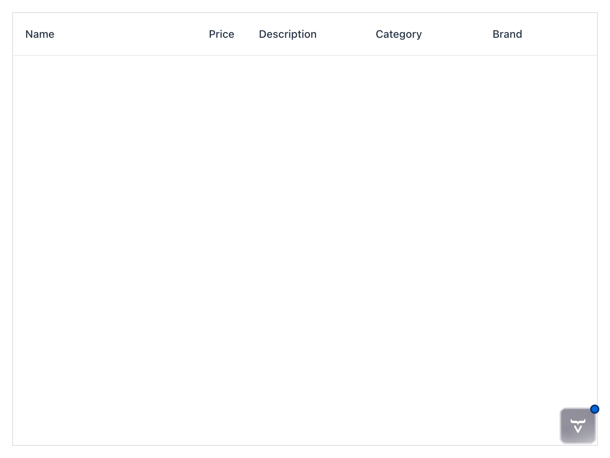
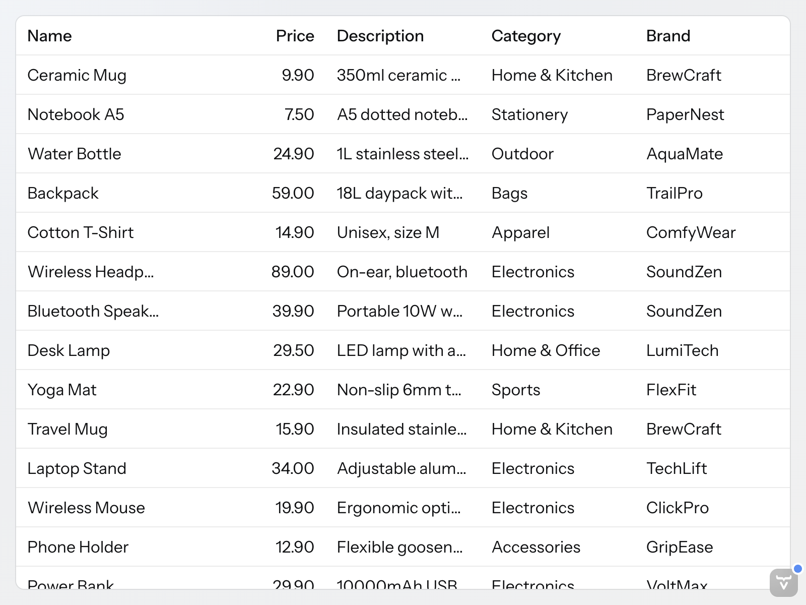

= Build Your First Data List View

Your first task is to build a product catalog view that displays a list of products from the database. You'll create a new Vaadin view class and set up a grid component to show the product data.

You'll take only the *minimal steps needed to get the view up and running*. Later in the tutorial, you'll enhance the view with additional features and functionality, and also refactor the code to improve its structure.

.Restart or Hotswap?
[TIP]
If you run the application with hotswap enabled, changes to the UI should show up automatically in the browser. However, if you change the data model or repository interfaces, you'll need to restart the application to see the changes.

== Create the View Class

You'll be <</building-apps/architecture/packages#package-by-feature,packaging your code by feature>> in this tutorial. Start by making a new package `com.example.product`. Inside that package, create a new Java class named `ProductCatalogView` that extends `VerticalLayout`. Annotate the class with `@Route("")` to make it the main view of the application:

.ProductCatalogView.java
[source,java]
----
package com.example.product;

import com.vaadin.flow.component.orderedlayout.VerticalLayout;
import com.vaadin.flow.router.PageTitle;
import com.vaadin.flow.router.Route;

@Route("")
@PageTitle("Product Catalog") // <1>
class ProductCatalogView extends VerticalLayout { // <2>

    ProductCatalogView() {
        // The view implementation will go here
    }
}
----
<1> The view will have the page title "Product Catalog", which appears in the browser tab.
<2> The class has package visibility as you won't need to access it from other packages.

Now run the application, and navigate to http://localhost:8080. You should see an empty page with the title "Product Catalog".

== Create a Data Transfer Object

You'll need a data transfer object (DTO) to represent the product data in the view. Create a new record named `ProductCatalogItem` in the same package as the view. 

Since you'll be using Spring Data to fetch the data, the record fields must match the column names in the `PRODUCTS` table of the database. You also need to annotate the record with `@Table` and the ID field with `@Id` so that Spring Data can map the database rows to instances of the record:

.ProductCatalogItem.java
[source,java]
----
package com.example.product;

import org.springframework.data.annotation.Id;
import org.springframework.data.relational.core.mapping.Table;

import java.math.BigDecimal;

@Table("PRODUCTS")
record ProductCatalogItem( // <1>
    @Id long productId, 
    String name, 
    String description, 
    String category, 
    String brand, 
    BigDecimal price
) {
}
----
<1> The record has package visibility as you won't need to access it from other packages.

== Add a Grid Component

To display the product data, you'll use a <</components/grid#,Grid>> component. In the constructor of the `ProductCatalogView` class, create a new `Grid` instance and configure it to display the columns you want. 

When building views with Vaadin, you typically create and layout the UI components in separate sections of the constructor for better readability. Here's how to set up the grid in the `ProductCatalogView` class:

.ProductCatalogView.java
[source,java]
----
package com.example.product;

// tag::snippet[]
import com.vaadin.flow.component.grid.ColumnTextAlign;
import com.vaadin.flow.component.grid.Grid;
// end::snippet[]
import com.vaadin.flow.component.orderedlayout.VerticalLayout;
import com.vaadin.flow.router.PageTitle;
import com.vaadin.flow.router.Route;

@Route("")
@PageTitle("Product Catalog")
class ProductCatalogView extends VerticalLayout {

    ProductCatalogView() {
// tag::snippet[]
        // Create components
        var grid = new Grid<ProductCatalogItem>();
        grid.addColumn(ProductCatalogItem::name).setHeader("Name"); // <1>
        grid.addColumn(ProductCatalogItem::price).setHeader("Price")
            .setTextAlign(ColumnTextAlign.END);
        grid.addColumn(ProductCatalogItem::description).setHeader("Description");
        grid.addColumn(ProductCatalogItem::category).setHeader("Category");
        grid.addColumn(ProductCatalogItem::brand).setHeader("Brand");

        // Layout view
        setSizeFull(); // <2>
        grid.setSizeFull(); // <3>
        add(grid); // <4>
// end::snippet[]
    }
}
----
<1> Use method references to define how the columns get their values from the `ProductCatalogItem` record.
<2> Make the view take the full size of the browser window.
<3> Make the grid take the full size of the view.
<4> Add the grid to the view layout.

The view should now look like this:

[.device]

== Create a Repository Interface

To fetch the product data from the database, you'll use a Spring Data repository. Create a new interface named `ProductCatalogItemRepository` in the same package as the view and DTO:

.ProductCatalogItemRepository.java
[source,java]
----
package com.example.product;

import org.springframework.data.repository.PagingAndSortingRepository;

interface ProductCatalogItemRepository // <1>
    extends PagingAndSortingRepository<ProductCatalogItem, Long> { // <2>
}
----
<1> The interface has package visibility as you won't need to access it from other packages.
<2> The `PagingAndSortingRepository` interface provides methods for pagination and sorting, which you'll use later in the tutorial.

Spring Data provides the implementation of the repository interface at runtime, so you don't need to write any code for it.

== Add Data to the Grid

Finally, you'll fetch the product data from the database and set it as the items of the grid. To do this, inject the `ProductCatalogItemRepository` into the constructor of the `ProductCatalogView` class and use it to retrieve all products.

In production applications, you should never perform unbounded queries that can return a large number of items. Since Grid has built-in support for pagination, you'll use that to fetch only the items needed for the current page:

.ProductCatalogView.java
[source,java]
----
package com.example.product;

import com.vaadin.flow.component.grid.ColumnTextAlign;
import com.vaadin.flow.component.grid.Grid;
import com.vaadin.flow.component.orderedlayout.VerticalLayout;
import com.vaadin.flow.router.PageTitle;
import com.vaadin.flow.router.Route;

@Route("")
@PageTitle("Product Catalog")
class ProductCatalogView extends VerticalLayout {

// tag::snippet[]
    ProductCatalogView(ProductCatalogItemRepository repository) { // <1>
// end::snippet[]
        // Create components
        var grid = new Grid<ProductCatalogItem>();
        grid.addColumn(ProductCatalogItem::name).setHeader("Name");
        grid.addColumn(ProductCatalogItem::price).setHeader("Price")
            .setTextAlign(ColumnTextAlign.END);
        grid.addColumn(ProductCatalogItem::description).setHeader("Description");
        grid.addColumn(ProductCatalogItem::category).setHeader("Category");
        grid.addColumn(ProductCatalogItem::brand).setHeader("Brand");
// tag::snippet[]
        grid.setItemsPageable(pageable -> repository
            .findAll(pageable)
            .getContent()
        ); // <2>
// end::snippet[]

        // Layout view
        setSizeFull();
        grid.setSizeFull();
        add(grid);
    }
}
----
<1> Use constructor injection to get the repository instance.
<2> Use the `setItemsPageable` method of the grid to fetch only the items needed for the current page.

Now, when you run the application and navigate to http://localhost:8080, you should see the product catalog populated with data from the database:

[.device]

If you scroll the grid, it looks like all items are loaded at once. Under the hood, only the visible items are fetched from the database. For more information about paginated grids, see <</building-apps/forms-data/add-grid/paginated-data#,Add a Paginated Grid>> guide.

== Next Steps

Congratulations! You've built your first Vaadin view that displays data from a database. In the next part of the tutorial, you'll enhance the product catalog view with sorting and filtering capabilities. Proceed to the <<sort-filter#,Sort and Filter the Product Catalog>> step to continue the tutorial.