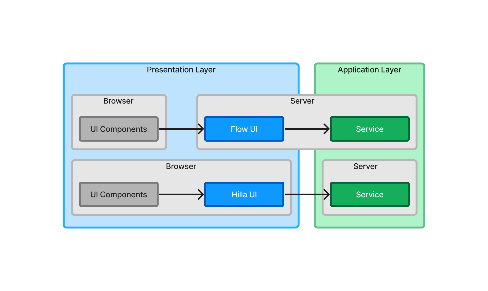
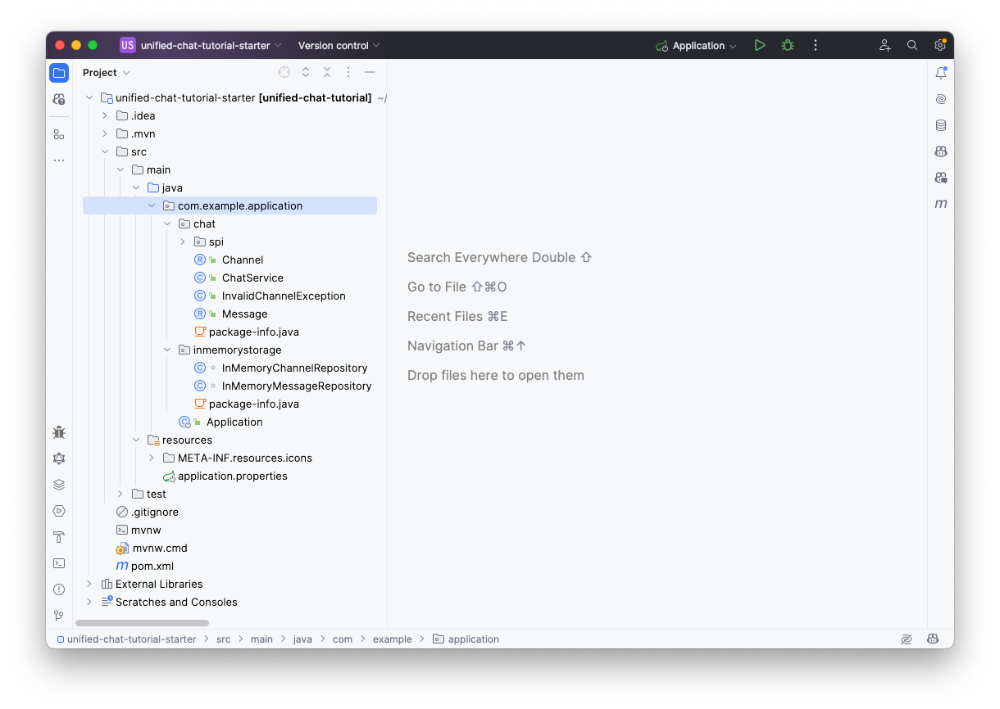
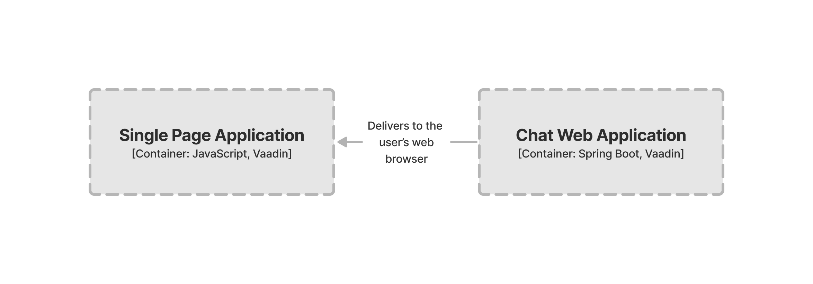
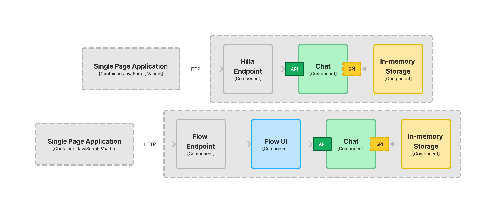

= [since:com.vaadin:vaadin@V24.4]#Project Setup#

In this tutorial, you can choose to implement the user interface of the chat application using either Java and Flow, or TypeScript, React and Hilla. In traditional web applications, you often see the concepts, _frontend_ and _backend_. Frontend code runs in the browser; backend code runs on the server. The frontend is often synonymous with the user interface, whereas the backend is everything else: business logic, application services, REST APIs, etc.

In a Vaadin application, things are a little different. Flow allows you to write user interfaces using Java only. That means a big part of your user interface is actually running on the server -- the backend. There's also a frontend runtime, but you don't have to touch it unless you want.

Hilla follows the more traditional approach in which the user interface runs solely in the browser. The following graphic illustrates this differece:

In a Vaadin application, it may be clearer to think in terms of _presentation layer_ and _application layer_, rather than frontend and backend. These terms are _conceptual layers_ that define where a piece of code belongs conceptually rather than physically. They also don't have anything to do with layered architectures.

In a Flow application, the presentation layer has parts that run in the browser and parts that run on the server. In a Hilla application, the presentation layer runs only in the browser. The application layer is the same for both. It's possible to combine Hilla and Flow in the same application. This is called a _hybrid application_, but it's outside the scope of this tutorial.

== Download the Starter

In this tutorial, the focus is on the presentation layer, only. Therefore, a starter project with a complete application layer has been created for you. It's a Maven-project compressed as a zip-file that you can https://github.com/vaadin/tutorial/releases/download/v24.4/unified-chat-tutorial-starter.zip[download from GitHub].

Once you have downloaded it, uncompress it and open it in your Java IDE. In IntelliJ IDEA, the project looks like this:

In order to understand the structure of this project, in the following section you'll have a quick look at the underlying architecture of the application.

== Architecture

Software architecture can be diagrammed in many different ways. A simple and intuitive way is the https://c4model.com[C4 model].

C4 takes its inspiration from digital maps with multiple levels. The highest level has the least amount of details. Zooming in on a level takes you to the next level that reveals more details, etc. The name _C4_ represents four levels: _Context_, _Container_, _Component_, and _Code_.

The highest level, the context shows how the software system fits into its surroundings. If you zoom in on the system, you get to the second level, which shows the containers that make up the system.

A container is an application or a data store. If you zoom in on a container, you get to the third level, which shows the components that make up the container.

A component is a grouping of related functionality encapsulated behind a well-defined interface. If you zoom in on a component, you get to the fourth and last level, which shows the code that implements the component.

The C4 model doesn't require you to use all four levels. The application you are going to build during this tutorial is quite simple. You can jump straight to the container diagram, which looks like this:

[.fill.white]

The application consists of two containers: the user's web browser; and a Spring Boot web application. Regardless of whether you build the user interface with Hilla or Flow, the containers remain the same. However, if you zoom in on them, you'll see the components are slightly different. The web application container looks like this:

[.fill.white]

The application layer consists of two system components: _Chat_; and _In-memory Storage_. The chat component exposes an Application Programming Interface (API) for the user interface to call, and a Service Provider Interface (SPI) for storing and retrieving messages. This makes it possible to plug in different storage mechanisms without changing the chat component itself. In this tutorial, all chat messages are stored in memory. However, you could easily plug in another component that instead stores the messages in, for example, a relational database. This way of splitting systems into smaller components with clearly defined interfaces (i.e., APIs and SPIs) is a good praxis when building Vaadin applications and can be applied to both the application layer and the presentation layer.

If you implement the user interface with Hilla and React, Vaadin generates a TypeScript client that you can use to call the Chat API directly from the browser. You don't need to worry about REST controllers; Vaadin takes care of that, automatically.

If you implement the user interface with Flow, you need to build a new system component, the Flow UI. This is a component that uses the Chat API directly inside the Java Virtual Machine (JVM). It doesn't expose a public API for other components to use. Instead, Vaadin takes care of the rendering of the user interface in the browser, and the communication between the browser and the server.

A word of caution: When you build user interfaces, you construct them from components (e.g., buttons, text fields, grids, etc.). You can also have containers in your user interface, such as layouts containing other components. Especially when using both types of components and containers in the same setting, it may be a good idea to use prefixes to avoid confusion: UI containers and components related to the user interface, and system containers and components for the software architecture.

// TODO Add link to architecture page once it is ready

== Project Structure

With the architecture in mind, take another look at the project structure in your IDE:

The chat component resides in the [packagename]`com.example.application.chat` package. Its API consists of all of the public classes and public methods in this package. One of them is [classname]`ChatService`, which is a class you will be interacting with the most from the user interface. The [packagename]`spi` subpackage contains interfaces, and any classes needed by them, that a service provider component should implement.

The in-memory storage component resides in the [packagename]`com.example.application.inmemorystorage` package. Since it has no public API, all of its classes are package-private.

Finally, there is a Spring Boot application class, [classname]`com.example.application.Application`. This class sets up the Spring application context, which wires the components together.

You would typically find the rest of the files in a Spring Boot application built with Maven.

== Pick Your Technology

You're now ready to get started. If you want to learn how to build the chat user interface in Java using Flow, go to the <<flow#,Flow section>> of this tutorial.

If you want to learn how to build the chat user interface in TypeScript using Hilla and React, go to the <<hilla#,Hilla section>> of this tutorial.

If you want to learn both, go through this tutorial twice.
