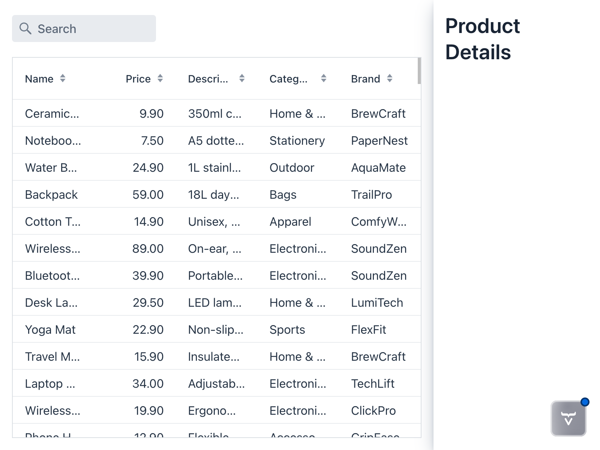
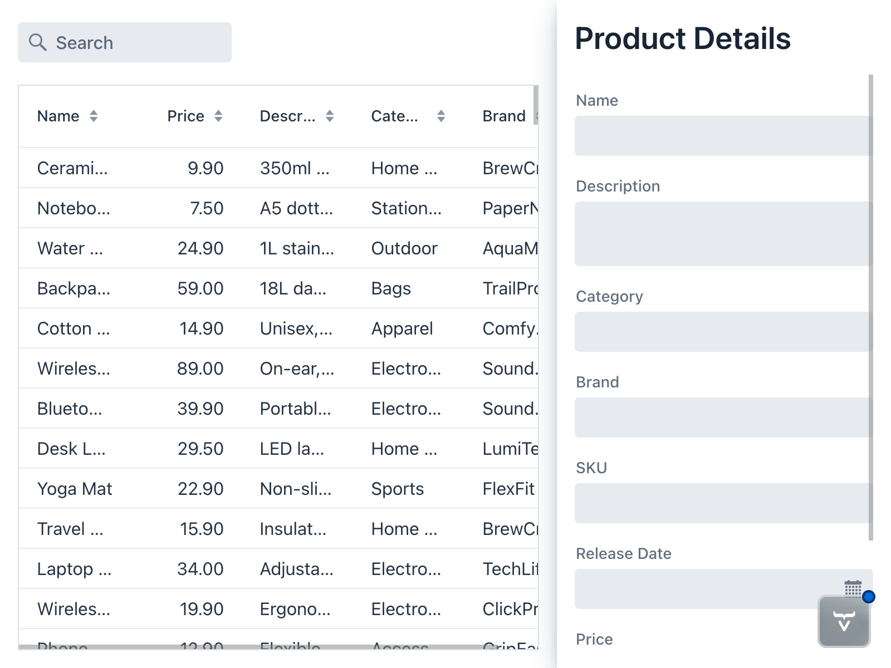
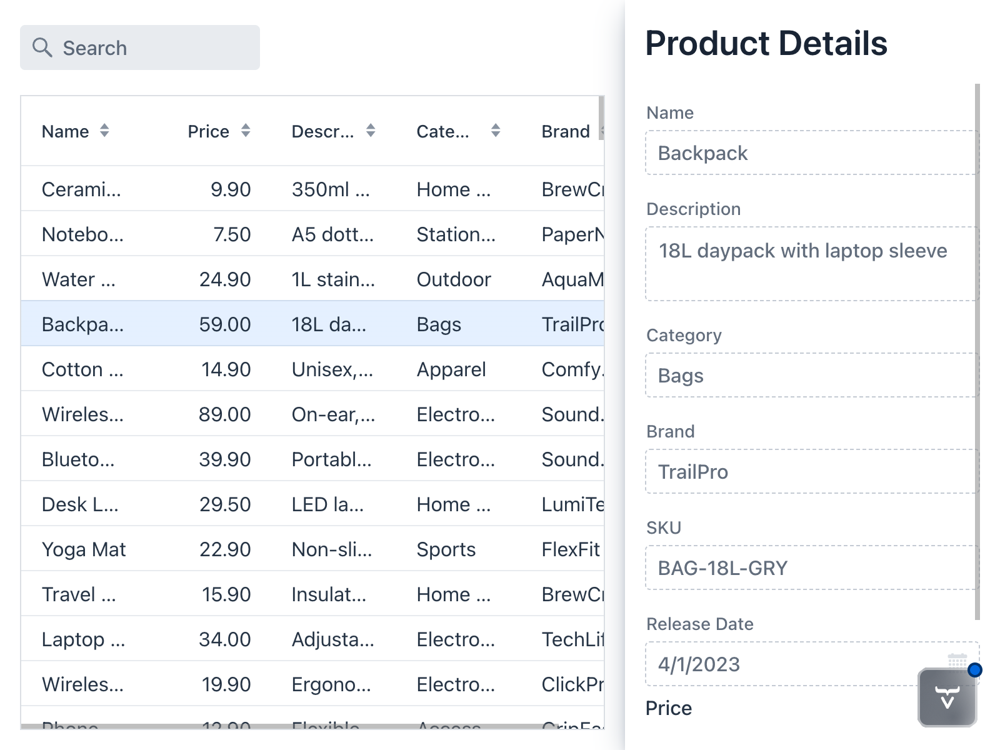

= Show Product Details

In the previous step, you implemented sorting and filtering in the product catalog. However, the database contains more information about each product than what is visible in the grid.

In this step, you'll create a drawer and a form for showing the product details. You'll then add a Form Data Object (FDO) and bind it to the form. Finally, you'll fetch the FDO and populate the form whenever the user selects an item in the product catalog grid.

.More Information Available
[TIP]
This step is based on the <<building-apps/forms-data/add-form#,Add a Form>> guide. Read the guide if you want more detailed information about working with forms in Vaadin.

== Add a Product Form Drawer

You'll display the product details in a drawer next to the grid. Start by creating the drawer component - `ProductFormDrawer` - in the `com.example.product` package:

.ProductFormDrawer.java
[source,java]
----
package com.example.product;

import com.vaadin.flow.component.Composite;
import com.vaadin.flow.component.html.H2;
import com.vaadin.flow.component.orderedlayout.VerticalLayout;
import com.vaadin.flow.theme.lumo.LumoUtility;

class ProductFormDrawer extends Composite<VerticalLayout> { // <1>

    ProductFormDrawer() {
        var header = new H2("Product Details");

        var layout = getContent(); // <2>
        layout.add(header);

        setWidth("300px"); // <3>
        addClassName(LumoUtility.BoxShadow.MEDIUM); // <4>
    }
}
----
<1> Create a <</flow/component-internals/basic#composite-components,composite component>> that encapsulates a `VerticalLayout`.
<2> The `getContent()` method returns the encapsulated layout.
<3> Set a fixed width for the drawer.
<4> Add a box shadow for better visual separation.

Next, add the drawer to the `ProductCatalogView`, effectively turning it into a master-detail view. This requires two steps:

1. Change the layout of the `ProductCatalogView` to use a `HorizontalLayout` instead of a `VerticalLayout`.
2. Add an instance of the `ProductFormDrawer` to the `ProductCatalogView`.

Change the code of the `ProductCatalogView` as follows:

.ProductCatalogView.java
[source,java]
----
package com.example.product;

import com.vaadin.flow.component.grid.ColumnTextAlign;
import com.vaadin.flow.component.grid.Grid;
import com.vaadin.flow.component.icon.VaadinIcon;
// tag::snippet[]
import com.vaadin.flow.component.orderedlayout.HorizontalLayout;
// end::snippet[]
import com.vaadin.flow.component.orderedlayout.VerticalLayout;
import com.vaadin.flow.component.textfield.TextField;
import com.vaadin.flow.data.value.ValueChangeMode;
import com.vaadin.flow.router.PageTitle;
import com.vaadin.flow.router.Route;

@Route("")
@PageTitle("Product Catalog")
class ProductCatalogView extends HorizontalLayout {

    ProductCatalogView(ProductCatalogItemRepository repository) {
        // Create components
        var searchField = new TextField();
        searchField.setPlaceholder("Search");
        searchField.setPrefixComponent(VaadinIcon.SEARCH.create());
        searchField.setValueChangeMode(ValueChangeMode.LAZY);

        var grid = new Grid<ProductCatalogItem>();
        grid.addColumn(ProductCatalogItem::name).setHeader("Name")
                .setSortProperty(ProductCatalogItem.SORT_PROPERTY_NAME);
        grid.addColumn(ProductCatalogItem::price).setHeader("Price")
                .setTextAlign(ColumnTextAlign.END)
                .setSortProperty(ProductCatalogItem.SORT_PROPERTY_PRICE);
        grid.addColumn(ProductCatalogItem::description).setHeader("Description")
                .setSortProperty(ProductCatalogItem.SORT_PROPERTY_DESCRIPTION);
        grid.addColumn(ProductCatalogItem::category).setHeader("Category")
                .setSortProperty(ProductCatalogItem.SORT_PROPERTY_CATEGORY);
        grid.addColumn(ProductCatalogItem::brand).setHeader("Brand")
                .setSortProperty(ProductCatalogItem.SORT_PROPERTY_BRAND);
        grid.setItemsPageable(pageable -> repository
                .findByNameContainingIgnoreCase(searchField.getValue(), pageable)
                .getContent()
        );

        // tag::snippet[]
        var drawer = new ProductFormDrawer();
        // end::snippet[]

        searchField.addValueChangeListener(e ->
                grid.getDataProvider().refreshAll());

        // Layout view
        // tag::snippet[]
        setSizeFull();
        setSpacing(false);

        var listLayout = new VerticalLayout(searchField, grid); // <1>
        listLayout.setSizeFull();
        grid.setSizeFull();

        add(listLayout, drawer); // <2>
        // end::snippet[]
    }
}
----
<1> Wrap the search field and grid in a `VerticalLayout` to create the list part of the master-detail view.
<2> Add both the list layout and the drawer to the view.

The view should now look like this:

[.device]

If you inspect the page with your browser's developer tools, you'll see that the drawer is not actually 300px wide. This is because `HorizontalLayout` uses a CSS https://developer.mozilla.org/en-US/docs/Web/CSS/Guides/Flexible_box_layout[flexbox] layout under the hood. By default, items in a flexbox container shrink to fit the container when there isn't enough space. In this case, the grid takes up all the available space. 

To fix this, you'll set the `flex-shrink` CSS property of the drawer to `0` so that it doesn't shrink. Vaadin has a Java API for that. After adding the drawer to the view, call the `setFlexShrink()` method like this:

.ProductCatalogView.java
[source,java]
----
package com.example.product;

import com.vaadin.flow.component.grid.ColumnTextAlign;
import com.vaadin.flow.component.grid.Grid;
import com.vaadin.flow.component.icon.VaadinIcon;
import com.vaadin.flow.component.orderedlayout.HorizontalLayout;
import com.vaadin.flow.component.orderedlayout.VerticalLayout;
import com.vaadin.flow.component.textfield.TextField;
import com.vaadin.flow.data.value.ValueChangeMode;
import com.vaadin.flow.router.PageTitle;
import com.vaadin.flow.router.Route;

@Route("")
@PageTitle("Product Catalog")
class ProductCatalogView extends HorizontalLayout {

    ProductCatalogView(ProductCatalogItemRepository repository) {
        // Create components
        var searchField = new TextField();
        searchField.setPlaceholder("Search");
        searchField.setPrefixComponent(VaadinIcon.SEARCH.create());
        searchField.setValueChangeMode(ValueChangeMode.LAZY);

        var grid = new Grid<ProductCatalogItem>();
        grid.addColumn(ProductCatalogItem::name).setHeader("Name")
                .setSortProperty(ProductCatalogItem.SORT_PROPERTY_NAME);
        grid.addColumn(ProductCatalogItem::price).setHeader("Price")
                .setTextAlign(ColumnTextAlign.END)
                .setSortProperty(ProductCatalogItem.SORT_PROPERTY_PRICE);
        grid.addColumn(ProductCatalogItem::description).setHeader("Description")
                .setSortProperty(ProductCatalogItem.SORT_PROPERTY_DESCRIPTION);
        grid.addColumn(ProductCatalogItem::category).setHeader("Category")
                .setSortProperty(ProductCatalogItem.SORT_PROPERTY_CATEGORY);
        grid.addColumn(ProductCatalogItem::brand).setHeader("Brand")
                .setSortProperty(ProductCatalogItem.SORT_PROPERTY_BRAND);
        grid.setItemsPageable(pageable -> repository
                .findByNameContainingIgnoreCase(searchField.getValue(), pageable)
                .getContent()
        );

        var drawer = new ProductFormDrawer();

        searchField.addValueChangeListener(e ->
                grid.getDataProvider().refreshAll());

        // Layout view
        setSizeFull();
        setSpacing(false);

        var listLayout = new VerticalLayout(searchField, grid); // <1>
        listLayout.setSizeFull();
        grid.setSizeFull();

        add(listLayout, drawer);
        // tag::snippet[]
        setFlexShrink(0, drawer);
        // end::snippet[]
    }
}
----

If you inspect the page again, you'll see that the drawer is now 300px wide as expected.

== Create a Product Form

Now that you have the drawer in place, it's time to add a form to display the product details. Create a new class called `ProductForm` in the `com.example.product` package:

.ProductForm.java
[source,java]
----
package com.example.product;

import com.vaadin.flow.component.Composite;
import com.vaadin.flow.component.datepicker.DatePicker;
import com.vaadin.flow.component.formlayout.FormLayout;
import com.vaadin.flow.component.textfield.BigDecimalField;
import com.vaadin.flow.component.textfield.TextArea;
import com.vaadin.flow.component.textfield.TextField;

class ProductForm extends Composite<FormLayout>  {

    ProductForm() {
        // Create components
        var nameField = new TextField("Name");
        var descriptionField = new TextArea("Description");
        var categoryField = new TextField("Category");
        var brandField = new TextField("Brand");
        var skuField = new TextField("SKU");
        var releaseDateField = new DatePicker("Release Date");
        var priceField = new BigDecimalField("Price");
        var discountField = new BigDecimalField("Discount");

        // Layout form
        var layout = getContent();
        layout.add(nameField);
        layout.add(descriptionField);
        layout.add(categoryField);
        layout.add(brandField);
        layout.add(skuField);
        layout.add(releaseDateField);
        layout.add(priceField);
        layout.add(discountField);
    }
}
----

Then add it to the drawer:

[source,java]
----
package com.example.product;

import com.vaadin.flow.component.Composite;
import com.vaadin.flow.component.html.H2;
// tag::snippet[]
import com.vaadin.flow.component.orderedlayout.Scroller;
// end::snippet[]
import com.vaadin.flow.component.orderedlayout.VerticalLayout;
import com.vaadin.flow.theme.lumo.LumoUtility;

class ProductFormDrawer extends Composite<VerticalLayout> {

    ProductFormDrawer() {
        var header = new H2("Product Details");
        // tag::snippet[]
        var form = new ProductForm();
        // end::snippet[]

        var layout = getContent();
        layout.add(header);
        // tag::snippet[]
        layout.add(new Scroller(form)); // <1>
        // end::snippet[]
        layout.setWidth("300px");
        addClassName(LumoUtility.BoxShadow.MEDIUM);
    }
}
----
<1> The `Scroller` component makes the form scrollable in case it doesn't fit in the drawer.

The view should now look like this:

[.device]

== Create a Form Data Object

If you compare the form fields with the grid, you'll notice that the form has more fields than the grid displays. That means you can't use `ProductCatalogItem` for the form data. Instead, you need to create a new <</building-apps/forms-data/add-form/fields-and-binding#,Form Data Object>> (FDO).

Since you'll also be using this FDO to edit products, you should make it a mutable <</building-apps/forms-data/add-form/fields-and-binding#javabean-fdos,JavaBean>> and not a record. Create a new `ProductDetails` class like this:

.ProductDetails.java
[source,java]
----
package com.example.product;

import org.springframework.data.annotation.Id;
import org.springframework.data.annotation.Version;
import org.springframework.data.relational.core.mapping.Table;

import java.math.BigDecimal;
import java.time.LocalDate;

@Table("PRODUCTS")
class ProductDetails {

    @Id
    private Long productId; // <1>
    @Version
    private Long version; // <2>
    private String name;
    private String description;
    private String category;
    private String brand;
    private String sku;
    private LocalDate releaseDate;
    private BigDecimal price;
    private BigDecimal discount;

    public String getName() {
        return name;
    }

    public void setName(String name) {
        this.name = name;
    }

    public String getDescription() {
        return description;
    }

    public void setDescription(String description) {
        this.description = description;
    }

    public String getCategory() {
        return category;
    }

    public void setCategory(String category) {
        this.category = category;
    }

    public String getBrand() {
        return brand;
    }

    public void setBrand(String brand) {
        this.brand = brand;
    }

    public String getSku() {
        return sku;
    }

    public void setSku(String sku) {
        this.sku = sku;
    }

    public LocalDate getReleaseDate() {
        return releaseDate;
    }

    public void setReleaseDate(LocalDate releaseDate) {
        this.releaseDate = releaseDate;
    }

    public BigDecimal getPrice() {
        return price;
    }

    public void setPrice(BigDecimal price) {
        this.price = price;
    }

    public BigDecimal getDiscount() {
        return discount;
    }

    public void setDiscount(BigDecimal discount) {
        this.discount = discount;
    }
}
----
<1> You don't need a getter for this property as Spring Data accesses the field directly.
<2> This field is used for optimistic locking. You'll use it later when implementing editing.

== Bind the Form and the FDO

Next, you have to <</building-apps/forms-data/add-form/fields-and-binding#binding-to-a-bean,bind the form and the FDO>> so that the data shows up in the correct fields. For this, you'll use a `Binder`. Change the `ProductForm` as follows:

.ProductForm.java
[source,java]
----
package com.example.product;

import com.vaadin.flow.component.Composite;
import com.vaadin.flow.component.datepicker.DatePicker;
import com.vaadin.flow.component.formlayout.FormLayout;
import com.vaadin.flow.component.textfield.BigDecimalField;
import com.vaadin.flow.component.textfield.TextArea;
import com.vaadin.flow.component.textfield.TextField;
// tag::snippet[]
import com.vaadin.flow.data.binder.Binder;
import org.jspecify.annotations.Nullable; // <1>
// end::snippet[]

class ProductForm extends Composite<FormLayout>  {

// tag::snippet[]
    private final Binder<ProductDetails> binder;
// end::snippet[]

    ProductForm() {
        // Create components
        var nameField = new TextField("Name");
        var descriptionField = new TextArea("Description");
        var categoryField = new TextField("Category");
        var brandField = new TextField("Brand");
        var skuField = new TextField("SKU");
        var releaseDateField = new DatePicker("Release Date");
        var priceField = new BigDecimalField("Price");
        var discountField = new BigDecimalField("Discount");

        // Layout form
        var layout = getContent();
        layout.add(nameField);
        layout.add(descriptionField);
        layout.add(categoryField);
        layout.add(brandField);
        layout.add(skuField);
        layout.add(releaseDateField);
        layout.add(priceField);
        layout.add(discountField);

// tag::snippet[]
        // Bind fields
        binder = new Binder<>();
        binder.forField(nameField)
                .bind(ProductDetails::getName, ProductDetails::setName); // <2>
        binder.forField(descriptionField)
                .bind(ProductDetails::getDescription, ProductDetails::setDescription);
        binder.forField(categoryField)
                .bind(ProductDetails::getCategory, ProductDetails::setCategory);
        binder.forField(brandField)
                .bind(ProductDetails::getBrand, ProductDetails::setBrand);
        binder.forField(skuField)
                .bind(ProductDetails::getSku, ProductDetails::setSku);
        binder.forField(releaseDateField)
                .bind(ProductDetails::getReleaseDate, ProductDetails::setReleaseDate);
        binder.forField(priceField)
                .bind(ProductDetails::getPrice, ProductDetails::setPrice);
        binder.forField(discountField)
                .bind(ProductDetails::getDiscount, ProductDetails::setDiscount);
        binder.setReadOnly(true); // <3>
// end::snippet[]
    }

// tag::snippet[]
    public void setFormDataObject(@Nullable ProductDetails productDetails) { // <4>
        binder.setBean(productDetails); // <5>
    }
// end::snippet[]
}
----
<1> It's a good idea, although not required, to use JSpecify's `@Nullable` annotation to mark parameters that can be `null`.
<2> Every field in `ProductForm` is bound to the corresponding JavaBean property in `ProductDetails`.
<3> Make all fields read-only as you're only using the form to view data for now.
<4> Passing `null` clears the form.
<5> You're using the `Binder` in _write-through_ mode. See the <</building-apps/forms-data/add-form/fields-and-binding#buffered-vs-write-through,Fields & Bindings>> guide for details.

== Create a Repository Interface

To fetch the product details from the database, you'll again use a Spring Data repository. Create a new interface named `ProductDetailsRepository`:

.ProductDetailsRepository.java
[source,java]
----
package com.example.product;

import org.springframework.data.repository.CrudRepository;

interface ProductDetailsRepository extends CrudRepository<ProductDetails, Long> {
}
----

As for `ProductCatalogItemRepository`, Spring Data provides the implementation of the interface.

== Populate the Form

You now have all the building blocks needed to show product details in the drawer. Start by adding an API to `ProductFormDrawer` for setting a `ProductDetails`:

.ProductFormDrawer.java
[source,java]
----
package com.example.product;

import com.vaadin.flow.component.Composite;
import com.vaadin.flow.component.html.H2;
import com.vaadin.flow.component.orderedlayout.Scroller;
import com.vaadin.flow.component.orderedlayout.VerticalLayout;
import com.vaadin.flow.theme.lumo.LumoUtility;
// tag::snippet[]
import org.jspecify.annotations.Nullable;
// end::snippet[]

class ProductFormDrawer extends Composite<VerticalLayout> {

// tag::snippet[]
    private final ProductForm form;
// end::snippet[]

    ProductFormDrawer() {
        var header = new H2("Product Details");
// tag::snippet[]
        form = new ProductForm(); // <1>
// end::snippet[]

        var layout = getContent();
        layout.add(header);
        layout.add(new Scroller(form));
        layout.setWidth("300px");
        addClassName(LumoUtility.BoxShadow.MEDIUM);
    }

// tag::snippet[]
    public void setProductDetails(@Nullable ProductDetails productDetails) {
        form.setFormDataObject(productDetails);
    }
// end::snippet[]
}
----
<1> Because you're calling a method on the form from `setProductDetails()` below, the form can no longer be a local variable.

Next, you'll add a selection listener to the product grid. Whenever a user selects an item, you'll fetch the details from the `ProductDetailsRepository` and show it in the drawer. If no item is selected, you'll clear the drawer.

Update `ProductCatalogView` as follows:

.ProductCatalogView.java
[source,java]
----
package com.example.product;

import com.vaadin.flow.component.grid.ColumnTextAlign;
import com.vaadin.flow.component.grid.Grid;
import com.vaadin.flow.component.icon.VaadinIcon;
import com.vaadin.flow.component.orderedlayout.HorizontalLayout;
import com.vaadin.flow.component.orderedlayout.VerticalLayout;
import com.vaadin.flow.component.textfield.TextField;
import com.vaadin.flow.data.value.ValueChangeMode;
import com.vaadin.flow.router.PageTitle;
import com.vaadin.flow.router.Route;

@Route("")
@PageTitle("Product Catalog")
class ProductCatalogView extends HorizontalLayout {

    ProductCatalogView(ProductCatalogItemRepository repository,
// tag::snippet[]
                       ProductDetailsRepository productDetailsRepository) { // <1>
// end::snippet[]                        
        // Create components
        var searchField = new TextField();
        searchField.setPlaceholder("Search");
        searchField.setPrefixComponent(VaadinIcon.SEARCH.create());
        searchField.setValueChangeMode(ValueChangeMode.LAZY);

        var grid = new Grid<ProductCatalogItem>();
        grid.addColumn(ProductCatalogItem::name).setHeader("Name")
                .setSortProperty(ProductCatalogItem.SORT_PROPERTY_NAME);
        grid.addColumn(ProductCatalogItem::price).setHeader("Price")
                .setTextAlign(ColumnTextAlign.END)
                .setSortProperty(ProductCatalogItem.SORT_PROPERTY_PRICE);
        grid.addColumn(ProductCatalogItem::description).setHeader("Description")
                .setSortProperty(ProductCatalogItem.SORT_PROPERTY_DESCRIPTION);
        grid.addColumn(ProductCatalogItem::category).setHeader("Category")
                .setSortProperty(ProductCatalogItem.SORT_PROPERTY_CATEGORY);
        grid.addColumn(ProductCatalogItem::brand).setHeader("Brand")
                .setSortProperty(ProductCatalogItem.SORT_PROPERTY_BRAND);
        grid.setItemsPageable(pageable -> repository
                .findByNameContainingIgnoreCase(searchField.getValue(), pageable)
                .getContent()
        );

        var drawer = new ProductFormDrawer();

        searchField.addValueChangeListener(e ->
                grid.getDataProvider().refreshAll());

        // tag::snippet[]
        grid.addSelectionListener(e -> {
            var productDetails = e.getFirstSelectedItem() // <2>
                    .flatMap(item -> productDetailsRepository.findById(item.productId())) // <3>
                    .orElse(null); // <4>
            drawer.setProductDetails(productDetails); // <5>
        });
        // end::snippet[]

        // Layout view
        setSizeFull();
        setSpacing(false);

        var listLayout = new VerticalLayout(searchField, grid);
        listLayout.setSizeFull();
        grid.setSizeFull();

        add(listLayout, drawer);
        setFlexShrink(0, drawer);
    }
}
----
<1> Inject `ProductDetailsRepository` so that you can call it from the selection listener.
<2> `getFirstSelectedItem()` return an `Optional` that contains the selected item if there is one. The name comes from the fact that Grid supports selecting multiple items if you configure it to.
<3> `findById()` also returns an `Optional` that contains the details if found in the database.
<4> Return `null` if the selection is empty, or the product details can't be found in the database.
<5> Populate the drawer. If `productDetails` is `null`, the form is cleared.

The view should now look like this:

[.device]

If you select items in the grid, their details show up in the drawer. If you clear the selection, the form is also cleared.

== Next Steps

You have now implemented a simple master-detail view in Vaadin. In the next step, you'll add support for editing and saving product details. Proceed to the <<edit-details#,Edit Product Details>> step to continue the tutorial.
