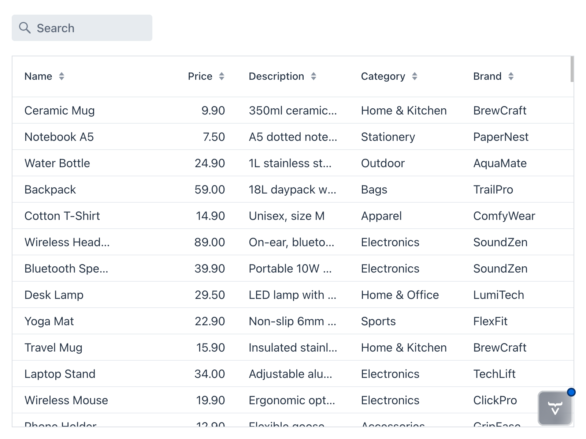

= Sort and Filter the Product Catalog

In the previous step, you created a basic product catalog view that displays a list of products from the database. Since product catalogs can grow large, it's essential to give users the ability to sort and filter the products to find what they're looking for quickly.

In this step, you'll start by making the grid sortable. You'll then add a search field for filtering the products based on their name.

== Make the Grid Sortable

The Grid component supports sorting out of the box, but it has to be enabled explicitly on the columns. How you do this depends on whether you're using <</building-apps/forms-data/add-grid/static-data#,in-memory data>> or a <</building-apps/forms-data/add-grid/paginated-data#,paginated data>> provider that fetches data from a backend.

In this tutorial, you're using a paginated data provider, which means the actual sorting takes place in the database. This in turn means that the data provider needs to know which column to sort by, and in which direction. You do this by
using the `setSortProperty` method on the `Grid.Column` instance.

Change the constructor of `ProductCatalogView` as follows to make all columns sortable:

.ProductCatalogView.java
[source,java]
----
package com.example.product;

import com.vaadin.flow.component.grid.ColumnTextAlign;
import com.vaadin.flow.component.grid.Grid;
import com.vaadin.flow.component.orderedlayout.VerticalLayout;
import com.vaadin.flow.router.PageTitle;
import com.vaadin.flow.router.Route;

@Route("")
@PageTitle("Product Catalog")
class ProductCatalogView extends VerticalLayout {

    ProductCatalogView(ProductCatalogItemRepository repository) {
        // Create components
        var grid = new Grid<ProductCatalogItem>();
        grid.addColumn(ProductCatalogItem::name)
            .setHeader("Name")
// tag::snippet[]
            .setSortProperty("name"); // <1>
// end::snippet[]
        grid.addColumn(ProductCatalogItem::price)
            .setHeader("Price")
            .setTextAlign(ColumnTextAlign.END)
// tag::snippet[]
            .setSortProperty("price");
// end::snippet[]
        grid.addColumn(ProductCatalogItem::description)
            .setHeader("Description")
// tag::snippet[]
            .setSortProperty("description");
// end::snippet[]
        grid.addColumn(ProductCatalogItem::category)
            .setHeader("Category")
// tag::snippet[]
            .setSortProperty("category");
// end::snippet[]
        grid.addColumn(ProductCatalogItem::brand)
            .setHeader("Brand")
// tag::snippet[]
            .setSortProperty("brand");
// end::snippet[]
        grid.setItemsPageable(pageable -> repository
            .findAll(pageable)
            .getContent()
        );

        // Layout view
        setSizeFull();
        grid.setSizeFull();
        add(grid);
    }
}
----
<1> This instructs the data provider to sort by the `name` column in the database when this column is sorted in the grid.

In the browser, small sorting arrows now appear in the column headers. When you click a column header, the grid fetches the data sorted by that column from the database:

[.device]
image::images/product-catalog-with-sorting.png[The product catalog view with sorting]

== Add Sort Property Constants

Although the sorting now works, using string literals for the sort properties is error-prone and also couples the grid directly to the database schema. To make the code more robust, define constants for the sort properties in the `ProductCatalogItem` record, like this:

.ProductCatalogItem.java
[source,java]
----
package com.example.product;

import org.springframework.data.annotation.Id;
import org.springframework.data.relational.core.mapping.Table;

import java.math.BigDecimal;

@Table("PRODUCTS")
record ProductCatalogItem(
        @Id long productId,
        String name,
        String description,
        String category,
        String brand,
        BigDecimal price
) {
// tag::snippet[]
    static final String SORT_PROPERTY_NAME = "name";
    static final String SORT_PROPERTY_PRICE = "price";
    static final String SORT_PROPERTY_DESCRIPTION = "description";
    static final String SORT_PROPERTY_CATEGORY = "category";
    static final String SORT_PROPERTY_BRAND = "brand";
// end::snippet[]
}
----

Next, refactor the `ProductCatalogView` class to use these constants instead of string literals for the sort properties:

.ProductCatalogView.java
[source,java]
----
package com.example.product;

import com.vaadin.flow.component.grid.ColumnTextAlign;
import com.vaadin.flow.component.grid.Grid;
import com.vaadin.flow.component.orderedlayout.VerticalLayout;
import com.vaadin.flow.router.PageTitle;
import com.vaadin.flow.router.Route;

@Route("")
@PageTitle("Product Catalog")
class ProductCatalogView extends VerticalLayout {

    ProductCatalogView(ProductCatalogItemRepository repository) {
        // Create components
        var grid = new Grid<ProductCatalogItem>();
        grid.addColumn(ProductCatalogItem::name)
            .setHeader("Name")
// tag::snippet[]
            .setSortProperty(ProductCatalogItem.SORT_PROPERTY_NAME);
// end::snippet[]
        grid.addColumn(ProductCatalogItem::price)
            .setHeader("Price")
            .setTextAlign(ColumnTextAlign.END)
// tag::snippet[]
            .setSortProperty(ProductCatalogItem.SORT_PROPERTY_PRICE);
// end::snippet[]
        grid.addColumn(ProductCatalogItem::description)
            .setHeader("Description")
// tag::snippet[]
            .setSortProperty(ProductCatalogItem.SORT_PROPERTY_DESCRIPTION);
// end::snippet[]
        grid.addColumn(ProductCatalogItem::category)
            .setHeader("Category")
// tag::snippet[]
            .setSortProperty(ProductCatalogItem.SORT_PROPERTY_CATEGORY);
// end::snippet[]
        grid.addColumn(ProductCatalogItem::brand)
            .setHeader("Brand")
// tag::snippet[]
            .setSortProperty(ProductCatalogItem.SORT_PROPERTY_BRAND);
// end::snippet[]
        grid.setItemsPageable(pageable -> repository
            .findAll(pageable)
            .getContent()
        );

        // Layout view
        setSizeFull();
        grid.setSizeFull();
        add(grid);
    }
}
----

Now, if the database schema changes, you only need to update the sort property constants in one place.

== Add a Search Field

You'll now add a search field above the grid to allow users to filter products by their name. Whenever they type something in the search field, the grid should update to show only the products whose names contain the entered text.

Start by adding a `TextField` component for the search input in the constructor of the `ProductCatalogView` class:

.ProductCatalogView.java
[source,java]
----
package com.example.product;

import com.vaadin.flow.component.grid.ColumnTextAlign;
import com.vaadin.flow.component.grid.Grid;
// tag::snippet[]
import com.vaadin.flow.component.icon.VaadinIcon;
// end::snippet[]
import com.vaadin.flow.component.orderedlayout.VerticalLayout;
// tag::snippet[]
import com.vaadin.flow.component.textfield.TextField;
// end::snippet[]
import com.vaadin.flow.router.PageTitle;
import com.vaadin.flow.router.Route;

@Route("")
@PageTitle("Product Catalog")
class ProductCatalogView extends VerticalLayout {

    ProductCatalogView(ProductCatalogItemRepository repository) {
        // Create components
// tag::snippet[]
        var searchField = new TextField(); // <1>
        searchField.setPlaceholder("Search"); // <2>
        searchField.setPrefixComponent(VaadinIcon.SEARCH.create()); // <3>
// end::snippet[]

        var grid = new Grid<ProductCatalogItem>();
        grid.addColumn(ProductCatalogItem::name)
            .setHeader("Name")
            .setSortProperty(ProductCatalogItem.SORT_PROPERTY_NAME);
        grid.addColumn(ProductCatalogItem::price)
            .setHeader("Price")
            .setTextAlign(ColumnTextAlign.END)
            .setSortProperty(ProductCatalogItem.SORT_PROPERTY_PRICE);
        grid.addColumn(ProductCatalogItem::description)
            .setHeader("Description")
            .setSortProperty(ProductCatalogItem.SORT_PROPERTY_DESCRIPTION);
        grid.addColumn(ProductCatalogItem::category)
            .setHeader("Category")
            .setSortProperty(ProductCatalogItem.SORT_PROPERTY_CATEGORY);
        grid.addColumn(ProductCatalogItem::brand)
            .setHeader("Brand")
            .setSortProperty(ProductCatalogItem.SORT_PROPERTY_BRAND);
        grid.setItemsPageable(pageable -> repository
            .findAll(pageable)
            .getContent()
        );

        // Layout view
        setSizeFull();
        grid.setSizeFull();
// tag::snippet[]
        add(searchField); // <4>
// end::snippet[]
        add(grid);
    }
}
----
<1> Create a new `TextField` for the search input.
<2> Set a placeholder text to guide the user.
<3> Add a search icon as a prefix to the text field for better UX.
<4> Add the search field to the view layout above the grid.

In the browser, the view now looks like this:

[.device]

However, the search field doesn't do anything yet. You'll deal with that next.

== Update the Repository Interface

Since the filtering takes place in the database, you need to add a new method to the `ProductCatalogItemRepository` interface that fetches products whose names contain a given string. Update the interface as follows:

.ProductCatalogItemRepository.java
[source,java]
----
package com.example.product;

// tag::snippet[]
import org.springframework.data.domain.Pageable;
import org.springframework.data.domain.Slice;
// end::snippet[]

import org.springframework.data.repository.PagingAndSortingRepository;

interface ProductCatalogItemRepository
    extends PagingAndSortingRepository<ProductCatalogItem, Long> {

// tag::snippet[]
    Slice<ProductCatalogItem> findByNameContainingIgnoreCase(String name,
        Pageable pageable);
// end::snippet[]
}
----

The `findByNameContainingIgnoreCase` method uses Spring Data's query derivation mechanism to generate a query that searches for products with names containing the specified string, ignoring case. See the https://docs.spring.io/spring-data/relational/reference/jdbc/query-methods.html[Spring Data Relational documentation] for more information on query derivation.

== Implement Filtering Logic

Finally, you'll implement the filtering logic in the `ProductCatalogView` class. This involves two main changes:

1. The grid needs to fetch data using the new repository method, passing in the value of the `searchField` as a parameter.
2. The grid needs to refresh itself whenever the user types something in the `searchField`.

Start by modifying the `setItemsPageable` call to use the new repository method:

[source,java]
----
grid.setItemsPageable(pageable -> repository
    .findByNameContainingIgnoreCase(searchField.getValue(), pageable)
    .getContent()
);
----

Next, add a `ValueChangeListener` to the `searchField` that refreshes the grid's data provider whenever the value changes. Since this listener will reference the `grid` variable, it has to be added after the grid is created:

[source,java]
----
// Create components
// ...

searchField.addValueChangeListener(e -> grid.getDataProvider().refreshAll());

// Layout view
// ...
----

If you try the application now, you'll see that typing in the search field filters the products in the grid based on their names. However, the filtering only happens when you press Enter or the field loses focus. To improve the user experience, set the value change mode of the `searchField` to `LAZY`. This triggers value change events a short time after the user stops typing:

[source,java]
----
// Create components
var searchField = new TextField();
searchField.setPlaceholder("Search");
searchField.setPrefixComponent(VaadinIcon.SEARCH.create());
// tag::snippet[]
searchField.setValueChangeMode(ValueChangeMode.LAZY);
// end::snippet[]
----

The complete updated view now looks like this:

.ProductCatalogView.java
[source,java]
----
package com.example.product;

import com.vaadin.flow.component.grid.ColumnTextAlign;
import com.vaadin.flow.component.grid.Grid;
import com.vaadin.flow.component.icon.VaadinIcon;
import com.vaadin.flow.component.orderedlayout.VerticalLayout;
import com.vaadin.flow.component.textfield.TextField;
// tag::snippet[]
import com.vaadin.flow.data.value.ValueChangeMode;
// end::snippet[]
import com.vaadin.flow.router.PageTitle;
import com.vaadin.flow.router.Route;

@Route("")
@PageTitle("Product Catalog")
class ProductCatalogView extends VerticalLayout {

    ProductCatalogView(ProductCatalogItemRepository repository) {
        // Create components
// tag::snippet[]
        var searchField = new TextField();
        searchField.setPlaceholder("Search");
        searchField.setPrefixComponent(VaadinIcon.SEARCH.create());
        searchField.setValueChangeMode(ValueChangeMode.LAZY);
// end::snippet[]

        var grid = new Grid<ProductCatalogItem>();
        grid.addColumn(ProductCatalogItem::name)
            .setHeader("Name")
            .setSortProperty(ProductCatalogItem.SORT_PROPERTY_NAME);
        grid.addColumn(ProductCatalogItem::price)
            .setHeader("Price")
            .setTextAlign(ColumnTextAlign.END)
            .setSortProperty(ProductCatalogItem.SORT_PROPERTY_PRICE);
        grid.addColumn(ProductCatalogItem::description)
            .setHeader("Description")
            .setSortProperty(ProductCatalogItem.SORT_PROPERTY_DESCRIPTION);
        grid.addColumn(ProductCatalogItem::category)
            .setHeader("Category")
            .setSortProperty(ProductCatalogItem.SORT_PROPERTY_CATEGORY);
        grid.addColumn(ProductCatalogItem::brand)
            .setHeader("Brand")
            .setSortProperty(ProductCatalogItem.SORT_PROPERTY_BRAND);
// tag::snippet[]
        grid.setItemsPageable(pageable -> repository
            .findByNameContainingIgnoreCase(searchField.getValue(),
                pageable)
            .getContent()
        );
// end::snippet[]

// tag::snippet[]
        searchField.addValueChangeListener(e ->
                grid.getDataProvider().refreshAll());
// end::snippet[]

        // Layout view
        setSizeFull();
        grid.setSizeFull();
// tag::snippet[]
        add(searchField);
// end::snippet[]
        add(grid);
    }
}
----

If you now type something in the search field, the grid updates automatically after you have stopped typing.

== Next Steps

With sorting and filtering implemented, your product catalog view is now much more user-friendly. In the next step, you'll add a form for viewing product details in the catalog. Proceed to the <<show-details#,Show Product Details>> step to continue the tutorial.
