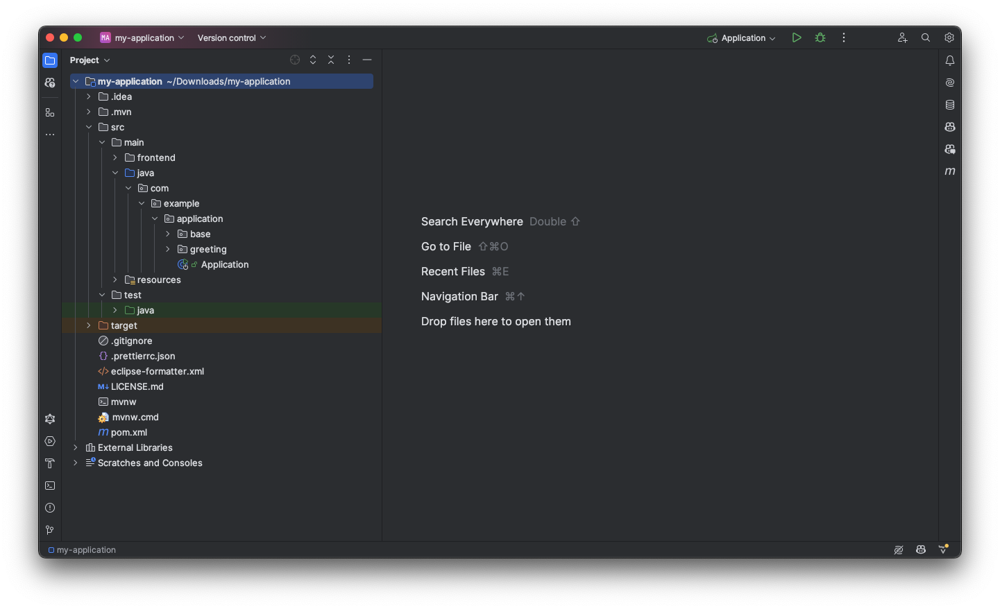

// TODO Do we need a guide for importing the project into your IDE, or is that outside the context?
// TODO This page contains a lot of links to guides and deep dives. Should they be added to the Next Steps page instead to make the page more readable?

= Meet Your Walking Skeleton
:toclevels: 2

Open your newly generated <<start#,walking skeleton>> in your Java IDE. In IntelliJ IDEA, it could look like this:

The walking skeleton is a single-module Maven project. If you are not familiar with Maven, look through the https://maven.apache.org/guides/getting-started/maven-in-five-minutes.html[Maven in 5 Minutes] tutorial before proceeding.

The most important files and directories in your skeleton are the following:

[source]
----
my-application/
├── src/
│   ├── main/
│   │   ├── frontend/      <1>
│   │   │   └── ...     
│   │   ├── java/          <2>
│   │   │   └── ...     
│   │   └── resources/     <3>
│   │   │   └── ...     
│   └── test/
│       └── java/          <4>
│           └── ...     
└── pom.xml                <5>
----
<1> Frontend source files, such as CSS and TypeScript files.
<2> Java source files.
<3> Configuration files and other files needed by the application.
<4> Java test files.
<5> Maven POM-file for your application.

To make building easier, the skeleton includes the https://maven.apache.org/wrapper/[Maven Wrapper]. Because of this, you don't have to install Maven on your computer. Instead, you can use the `mvnw` (macOS and Linux) or `mvnw.cmd` (Windows) scripts to run Maven on the command line.

The skeleton contains other files, such as a `.gitignore` file optimized for Vaadin projects, and configuration files for the https://github.com/diffplug/spotless[Spotless] code formatter.

The `LICENCE.md` file is a placeholder for your application's licence. Replace with your own license, or delete if you don't need it.

Next, you'll have a closer look at the Java sources, the frontend sources, and the POM-file.

== Java Sources

A walking skeleton always contains the following Java files, regardless of whether you chose to generate Flow views or React view:

[source]
----
src
├── main/java
│   ├── com.example.application
│   │   ├── base
│   │   │   └── domain
│   │   │       └── AbstractEntity.java
│   │   └── greeting
│   │       ├── domain
│   │       │   ├── Greeting.java
│   │       │   └── GreetingRepository.java
│   │       └── service
│   │           └── GreetingService.java
│   └── Application.java
│
└── test/java
    └── com.example.application
        └── greeting
            └── service
                └── GreetingServiceIT.java
----

If you generated a Flow view, the project contains more Java sources. You'll learn about those later.

The main entry point into the application is `Application.java`. This class contains the `main()` method that start up the Spring Boot application.

The skeleton uses feature-based package naming, and has two feature packages: `base`, and `greeting`. The `base` package contains classes that are intended to be re-used, either through composition or extension. The `greeting` package is an example feature that you'll want to delete from your project once you've created your first real feature.

You'll find `package-info.java` files in every package. These files add the `@NullMarked` annotation from https://jspecify.dev[JSpecify] to each package. This instructs static analysis tools that every return value and method parameter can never be `null` unless explicitly stated with a `@Nullable` annotation. This is a good practice that reduces bugs caused by `NullPointerException`.

=== The Greeting Feature

The `greeting` feature consists of a JPA entity, a Spring Data JPA repository interface, and an application service.

The repository stores and fetches entities from a relational database. The skeleton uses an in-memory H2 database. This is useful for prototyping, but soon you'll want to replace it with something else. The  <<{articles}/building-apps/persistence/replace-h2#,Replace H2 with PostgreSQL>> guide shows you how to do this. For more information about persistence in Vaadin applications, see the <<{articles}/building-apps/deep-dives/persistence#,Persistence in Vaadin applications>> deep dive.

The application service acts as the API of the feature and is the boundary between the _presentation layer_ and the _application layer_. Its main purpose in the skeleton is to show how an application service interacts with the domain model in a Vaadin application. See the <<{articles}/building-apps/deep-dives/architecture/layers#,Conceptual Layers>> deep dive for more information about the presentation and application layers.

The greeting service has a sample integration test. It starts up the application and its embedded H2 database, and checks that the service works as expected. Its main purpose in the skeleton is to show how to write integration tests for application services.

=== Flow Views [badge-flow]#Flow#

If you generated a Flow view, you'll find some extra Java files in the skeleton:

[source]
----
src
└── main/java
    └── com.example.application
        ├── base
        │   ├── component
        │   │   └── ViewToolbar.java
        │   └── view
        │       ├── MainErrorHandler.java
        │       └── MainLayout.java
        └── greeting
            └── view
                └── GreetingView.java 
----

The `base` feature package contains two UI-related sub-packages: `component` and `view`.

The `component` package contains custom UI components that can be reused throughout the entire application. The skeleton only contains one, but as your application grows, you'll add more components to this package.

The `view` package contains view-related classes that cut across multiple views in multiple features. The skeleton contains an error handler, and a main layout.

The error handler receives all exceptions that reach the user interface, logs them, and shows an error notification to the user. You'll want to customize this as the application grows. For more information about error handling, see the <<{articles}/building-apps/views/handle-errors#,Handle Errors>> guide.

Your application shows all the views inside the main layout by default. It contains the application's name, a navigation menu, and a mock user menu that doesn't do anything. You'll want to at least change the application name, and either remove or  implement the user menu. The <<{articles}/building-apps/security/add-user-menu#,Add a User Menu>> guide shows you how to do this. If you are interested in learning more about the main layout itself, see the <<{articles}/building-apps/views/add-router-layout#,Add a Router Layout>> guide.

The `greeting` feature package contains one UI-related sub-package: `view`. It contains the view that allows users to create and list greetings. If you want to add a new view to your application, see the <<{articles}/building-apps/views/add-view#,Add a View>> guide.

== Frontend Sources

TODO Write here

=== React Views [badge-hilla]#Hilla#

TODO Write here

== The POM File

- Dependencies
- Maven plugins
- H2 database