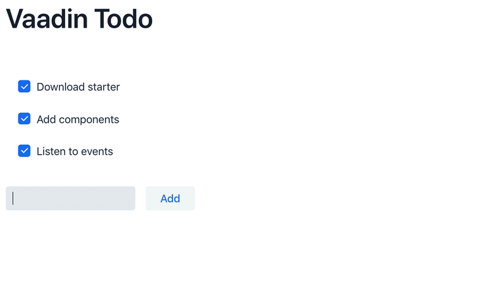

= Vaadin Flow Quick Start
:wizard-name: Vaadin Start

Vaadin Flow helps you quickly to build web applications in pure Java -- without writing any HTML or JavaScript.

This guide shows how to build a small, but fully functional ToDo application using Vaadin Flow.

== Needs & Download

To start, you'll need JDK 17 or higher (e.g., https://adoptium.net/[Eclipse Temurin JDK]).

++++

<a href="https://start.vaadin.com/dl?preset=flow-quickstart-tutorial" class="button primary water quickstart-download-project"
 onClick="function test(){ _hsq && _hsq.push(['trackEvent', { id: '000007517662', value: null }]); } test(); return true;">Download</a>

++++

Unpack the downloaded `ZIP` file into a folder on your computer, and <<./step-by-step/importing#, import the project into the IDE of your choice>>.

== Add Code

Next, you'll add code. Open `src/main/java/com/example/application/views/main/MainView.java`. Replace the code in [filename]`MainView.java` with the following:

.`MainView.java`
[source,java]
----
package com.example.application.views.main;

import com.vaadin.flow.component.Key;
import com.vaadin.flow.component.button.Button;
import com.vaadin.flow.component.checkbox.Checkbox;
import com.vaadin.flow.component.html.H1;
import com.vaadin.flow.component.orderedlayout.HorizontalLayout;
import com.vaadin.flow.component.orderedlayout.VerticalLayout;
import com.vaadin.flow.component.textfield.TextField;
import com.vaadin.flow.router.Route;

@Route("") // <1>
public class MainView extends VerticalLayout { // <2>

  public MainView() {
    VerticalLayout todosList = new VerticalLayout(); // <3>
    TextField taskField = new TextField(); // <4>
    Button addButton = new Button("Add"); // <5>
    addButton.addClickListener(click -> { // <6>
      Checkbox checkbox = new Checkbox(taskField.getValue());
      todosList.add(checkbox);
    });
    addButton.addClickShortcut(Key.ENTER); // <7>

    add( // <8>
      new H1("Vaadin Todo"),
      todosList,
      new HorizontalLayout(
        taskField,
        addButton
      )
    );
  }
}
----
<1> The `@Route` annotation makes the view accessible to the end user, in this case using the empty `` route.
<2> As the [classname]`MainView` class extends [classname]`VerticalLayout`, components added to it are ordered vertically.
<3> `todosList` is a vertical layout that displays a list of the tasks along with checkboxes.
<4> `taskField` is a text input field to enter the description of new tasks.
<5> `addButton` is a button for adding a new task.
<6> In the listener for the button click, first create a new checkbox with the value from the `taskField` as its label. Then add the checkbox to the `todosList`.
<7> Add a shortcut for the `addButton` component when the [guibutton]#Enter# key is pressed.
<8> Call [methodname]`add()` on the [classname]`VerticalLayout` to display the components vertically.
Notice that `taskField` and `addButton` are in a `HorizontalLayout`, which puts them next to each other.

== Run the Application

That may not seem like much, but you're ready to run the application. To run it in your IDE, launch [filename]`Application.java`, located under `src/main/java/org/vaadin/example`.

Alternatively, you can run the project from the command-line by entering `./mvnw` on macOS or Linux systems, `mvnw` on Windows.

Then, in your browser, open `http://localhost:8080[localhost:8080, rel="nofollow"]`. You should see the following:

The source code of this ToDo project is https://github.com/vaadin/flow-quickstart-tutorial[available on GitHub].

[discrete]
== Go Further

Now that you've seen how Vaadin Flow empowers you to build web applications, quickly and in pure Java -- without writing any HTML or JavaScript -- you're ready to learn more.

Continue learning Vaadin Flow by following the <<../tutorial/overview#, in-depth 2-hour course>>, or create an application with custom views with Vaadin Start.

https://start.vaadin.com?preset=latest[Open {wizard-name}, role="button primary water"]

[discussion-id]`4762E8FE-6BAA-405E-8C48-E62042C55239`
