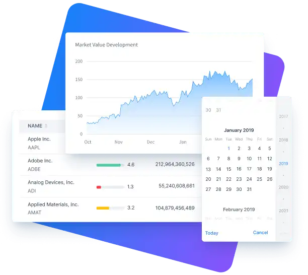

= Components

[link=https://vaadin.com/docs/components]
[.subtle]

xref:/components#[Browse all Vaadin components, role="button secondary water"]

In addition to the built-in components, you can use any web components and JavaScript components.

== Topics

section_outline::[]
