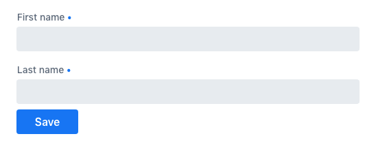
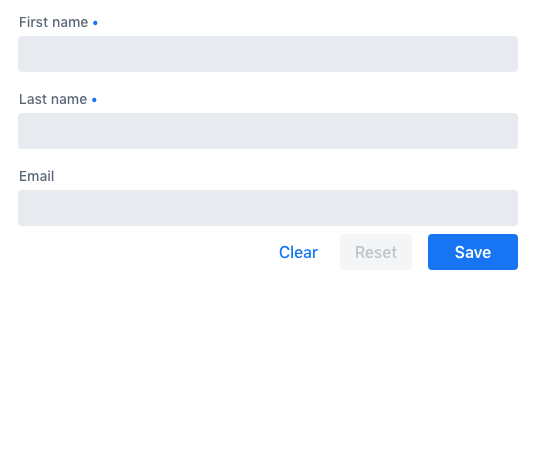

:hilla-lit:
// Workaround for https://github.com/vaadin/docs-app/issues/411
:root-fix:

= Reacting to Form State Changes

// tag::content[]

You can display some parts of a form. differently -- depending on the form state. You can, for example, disable the [guibutton]*Submit* button when a form has validation errors, or show an _'operation in progress'_ spinner while an async form submission is in progress.

ifdef::hilla-react[]
[source,tsx]
----
export default function ProfileView() {

  const form = useForm(EntityModel);

  return (
    <>
      ...
      <Button disabled={form.invalid}>submit</Button>
    </>
  );
}
----
endif::hilla-react[]
ifdef::hilla-lit[]
[source,html]
----
<vaadin-button ?disabled=${this.binder.invalid}>
  Submit
</vaadin-button>
----
endif::hilla-lit[]

The following properties are available both for the form as a whole, and for each field, independently. They're a part of the <<reference#binder-node,`BinderNode`>> interface.

ifdef::hilla-react[]
You can access form status properties for the whole form from the [classname]`UseFormResult` instance returned from [methodname]`useForm`:

[source,tsx]
----
const form = useForm(EntityModel);

const invalid = form.invalid;
const dirty = form.dirty;
const errors = form.errors;
...
----

To access form status properties for individual fields, use the [classname]`UseFormPartResult` instance returned from [methodname]`useFormPart`:

[source,tsx]
----
const form = useForm(EntityModel);
const nameField = useFormPart(form.model.name);

const invalid = nameField.invalid;
const dirty = nameField.dirty;
const errors = nameField.errors;
----
endif::hilla-react[]

ifdef::hilla-lit[]
You can access these properties either for a single field (e.g., `binder.for(model.firstName).dirty`), or for the entire form (e.g., `binder.dirty`).
endif::hilla-lit[]

- `dirty`: true if the value of the form or field has been modified by the user.
- `visited`: true if the form or field has been focused by the user.
- `invalid`: true if the form or field has validation errors.
- `required`: true if the form or field is required.
- `errors`: a list of all validation errors for a form or field and its sub-fields.
- `ownErrors`: a list of all the validation errors for a field without sub-fields or for the form, not specific to any field.

The following properties are available for the form as a whole, but not for individual fields. They're a part of the <<reference#binder,`Binder`>> interface. For example, you can access these properties via `binder.validating`.

- `validating`: true if the form is performing some validation.
- `submitting`: true if the form is submitting the data to a callback.

== Example: Disable Form while Submission in Progress

If form submission could take a long time, it's good to give users indication that something is happening. You may also want to prevent more form submissions until the first one is completed (e.g., in a payment form).

With the TypeScript `Binder` API, this can be done using the `submitting` property. In the following example, `binder.submitting` is bound to the `disabled` property of the [guibutton]*Submit* button to disable repeating form submissions. It's also used as a condition to render an additional 'submitting' message.

ifdef::hilla-react[]
[source,tsx]
----
export default function ProfileView() {

  const { model, submit, field, invalid, submitting } = useForm(PersonModel, {
    onSubmit: async (e) => {
      await PersonEndpoint.sendEntity(e);
    }
  });

  return (
    <>
      <VerticalLayout theme="spacing padding">
        <TextField label="First name" {...field(model.firstName)} />
        <TextField label="Last name" {...field(model.lastName)} />
      </VerticalLayout>
      <HorizontalLayout theme="spacing padding">
        <Button theme="primary" onClick={submit} disabled={invalid || submitting}>Save</Button>
        submitting
        

      </HorizontalLayout>
    </>
  );
}
----
endif::hilla-react[]
ifdef::hilla-lit[]
[source,html]
----
<vaadin-form-layout>
  <vaadin-text-field label="First name" ${field(model.firstName)}></vaadin-text-field>
  <vaadin-text-field label="Last name" ${field(model.lastName)}></vaadin-text-field>
</vaadin-form-layout>

<vaadin-horizontal-layout>
  <vaadin-button
    theme="primary"
    @click="${this.save}"
    ?disabled="${this.binder.invalid || this.binder.submitting}"
  >
    Save
  </vaadin-button>

  ${this.binder.submitting
    ? html`
        submitting
        

      `
    : nothing}
</vaadin-horizontal-layout>
----
endif::hilla-lit[]

== Example: List Validation Errors

Sometimes you may want to list all validation errors in one place. This is convenient especially in large forms, where it can be difficult to find the one field that failed the validation.

With the TypeScript `Binder` API, this can be done using the `errors` property. In the following example, the form template iterates over the `form.errors` list and renders the full list under the form.

ifdef::hilla-react[]
[source,tsx]
----
<dl>
  {form.errors.map(error => (
      <>
        <dt>{error.property as string}</dt>
        <dt>{error.message as string}</dt>
      </>
  ))}
</dl>
----
endif::hilla-react[]
ifdef::hilla-lit[]
[source,html]
----
(<dl>
  ${this.binder.errors.map(error => html`
    <dt>${error.property}</dt>
    <dd>${error.message}</dd>
  `)}
</dl>)
----
endif::hilla-lit[]

ifdef::hilla-react[]

== Example: Populate a Field Based on Another

Sometimes you may want to populate a field based on the value of another field. For example, you may want to set the value of a `city` select field based on the value of a `country` select field.

In such cases, you can use the `useEffect` Hook to react to changes in the value of the first field, and update the value of the second field, accordingly. The following simplified example shows how to do this:

[source,tsx]
----
const form = useForm(MyModel);
useEffect(() => {
  // Do something here to change the value of the second
  // field based on the first field value
}, [form.value.firstField]);
----

For a more complete example, open the following section.

.Interdependent Fields Example
[%collapsible]
====
[.example]
--
[source,tsx]
.CompanyOfficeView.tsx
----
include::{root}{root-fix}/frontend/demo/fusion/forms/formchange/CompanyOfficeView.tsx[tags=snippet,indent=0]
----
[source,java]
.OfficeService.java
----
include::{root}{root-fix}/src/main/java/com/vaadin/demo/fusion/forms/formchange/OfficeService.java[]
----
[source,java]
.CompanyOffice.java
----
include::{root}{root-fix}/src/main/java/com/vaadin/demo/fusion/forms/formchange/CompanyOffice.java[]
----
[source,java]
.Country.java
----
include::{root}{root-fix}/src/main/java/com/vaadin/demo/fusion/forms/formchange/Country.java[]
----
[source,java]
.City.java
----
include::{root}{root-fix}/src/main/java/com/vaadin/demo/fusion/forms/formchange/City.java[]
----
--
====

endif::hilla-react[]

// end::content[]
