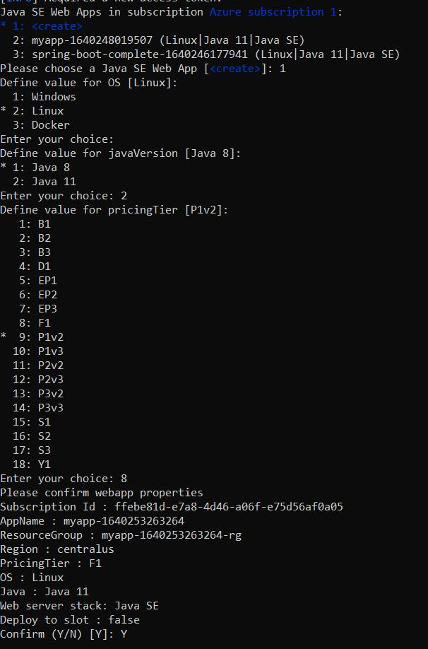
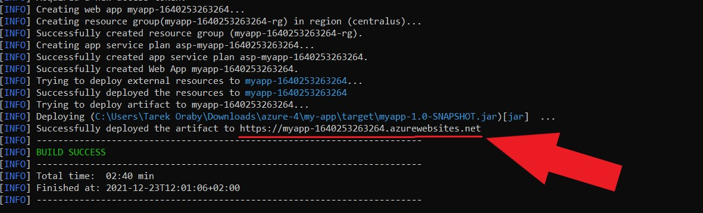

:lit:
// tag::content[]

= Deploying a Hilla Application to Azure Cloud
:experimental:

This tutorial shows you how to deploy a Hilla application to Microsoft's Azure cloud.
Azure offers a 30-day free trial that includes 12 months of free commercial services.
You can find details of their free and commercial services from the link:https://azure.microsoft.com/[Azure website].

.Azure account required
[NOTE]
To complete this tutorial, you need an Azure account.
You can sign up at https://signup.azure.com/.

== Step 1: Install the Azure CLI

You can find installation instructions for different platforms in the link:https://docs.microsoft.com/en-us/cli/azure/?view=azure-cli-latest[Azure CLI documentation].

== Step 2: Download a Starter App

Download a minimal Hilla project and unpack the downloaded zip into a folder on your computer.

ifdef::lit[]
[source,terminal]
----
npx @hilla/cli init --lit my-app
----
endif::[]
ifdef::react[]
[source,terminal]
----
npx @hilla/cli init my-app
----
endif::[]

== Step 3: Add the Azure Plugin

Open your [filename]`pom.xml` file and add the following section in the `<plugins>` tag in the `<build>` section:

.`pom.xml`
[source,xml]
----
<plugin>
  <groupId>com.microsoft.azure</groupId>
  <artifactId>azure-webapp-maven-plugin</artifactId>
  <version>2.2.3</version>
</plugin>
----

== Step 4: Create a Production Build

Open the project directory from a terminal window, and enter the following command to generate a `JAR` file of your application:

[source,terminal]
----
mvn package -Pproduction
----

== Step 5: Configure Your Application

From the terminal window, enter the following command:

[source,terminal]
----
mvn azure-webapp:config
----

This command authenticates you with Azure via the browser, assuming you aren't already logged in with the Azure CLI.
You are then prompted with certain options.
You can select the following:

. *<create>* when asked to choose a Java SE Web App.
. *Linux* when asked to choose an OS.
. *Java* 11 for the Java version
. *F1* for the pricingTier
. Enter kbd:[Y] on your keyboard to confirm

== Step 6: Deploy Your Application

Enter the following command to deploy your app:

[source,terminal]
----
mvn azure-webapp:deploy
----

You might be required to authenticate again in the browser.
Once authenticated, your application is deployed to Azure and you should see your application URL in the logs as in the following screenshot.

// end::content[]
