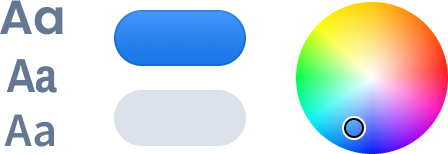

= {{title}}
:toc: macro
:toc-title: Component Categories

{{title}} consists of design tokens, components, and guidelines that allow designers and developers to collaborate and create high-quality and consistent UIs.

[.cards.large.hide-title]
== Content

[.cat-dataentry]
=== Components

Browse all UI components.

[.sr-only]
<<components#,Browse components>>

=== Lumo Theme

Discover the style properties and utility classes you can use to style applications.

[.sr-only]
<<lumo#,Browse the Lumo theme>>
