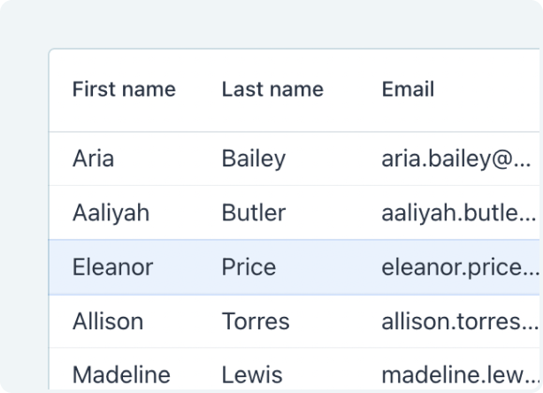
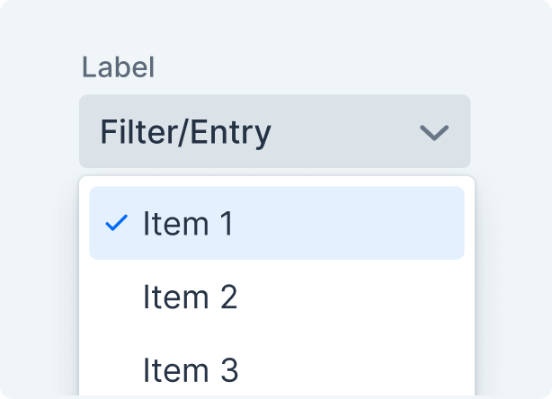
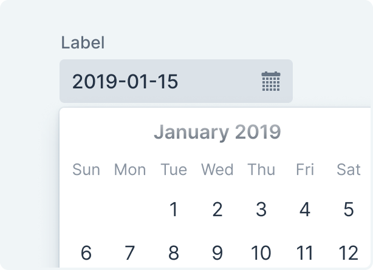
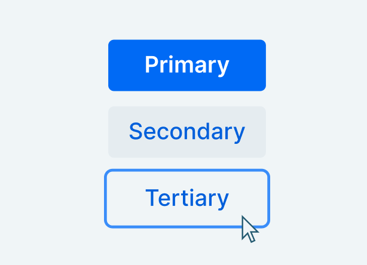
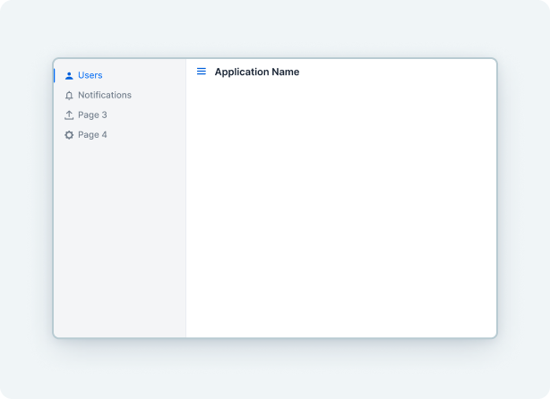

[.hero]
--
[discrete]
= Vaadin Docs

[subs="macros,attributes"]
++++

<h2>Develop Web Apps with Java</h2>

Build scalable user interfaces with Java, using the integrated frameworks, tooling, and components of Vaadin.

xref:/getting-started/quick-start#["Getting Started",role="button primary water"]

++++

[.column.hero-illustration]

--

[.cards.quiet.large]
== Getting Help

[.card.large]
=== Vaadin Community

If you’re stuck or need feedback on your implementation, the Vaadin forum is the perfect place to ask questions, share ideas, and connect with other developers.

link:/forum/[Join the forum]

[.card.large]
=== Video Course & Certification

Prefer to learn by watching? The free Vaadin training videos cover the basics of Vaadin Flow development and help you to get certified.

link:/learn/training[Start video course]

[.cards.quiet.large.callout.hide-title]
== Request a Team Trial

[.card.large]
=== Evaluate Vaadin the right way—with your team

Apply for the Team Trial and get expert-led guidance before you start building together.

link:https://pages.vaadin.com/request-a-team-trial[Apply For a Free Consultation, role="button-link"]

[.cards.quiet.large.components]
== Components

[.card.browse-all.large]
=== Browse Components

Vaadin Flow comes with over 40 UI components.

[.sr-only]
<<{articles}/components#, Browse all components>>

[.card]
=== Grid

include::components/grid/index.adoc[tag=description]

[.sr-only]
<<{articles}/components/grid#,See Grid>>

[.card]
=== Combo Box

include::components/combo-box/index.adoc[tag=description]

[.sr-only]
<<{articles}/components/combo-box#,See Combo Box>>

[.card]
=== Date Picker

include::components/date-picker/index.adoc[tag=description]

[.sr-only]
<<{articles}/components/date-picker#,See Date Picker>>

[.card]
=== Button

include::components/button/index.adoc[tag=description]

[.sr-only]
<<{articles}/components/button#,See Button>>

[.card]
=== App Layout

include::components/app-layout/index.adoc[tag=description]

[.sr-only]
<<{articles}/components/app-layout#,See App Layout>>

[.cards.quiet.large]
== Tools
include::tools/index.adoc[tag=all-tools]

++++

++++
