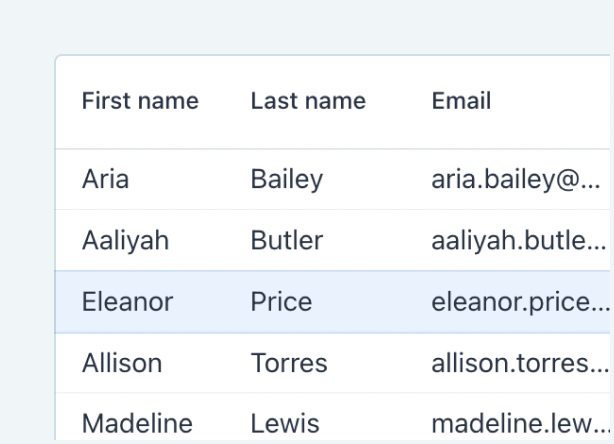
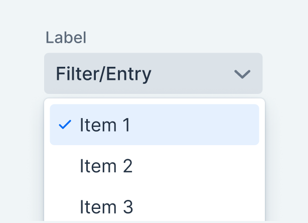
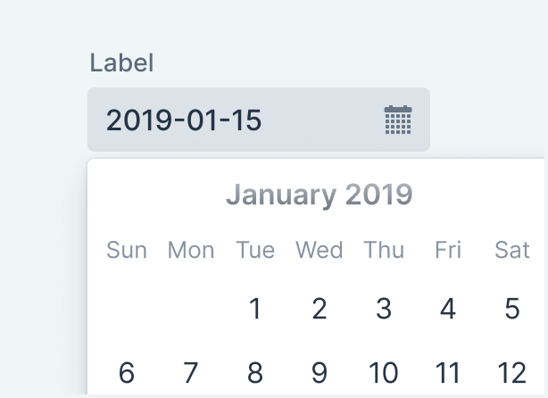
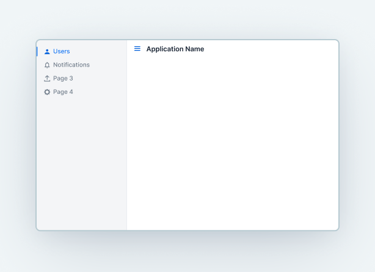

[.hero]
--
[discrete]
= Vaadin Documentation

[subs="macros,attributes"]
++++

<h2>Develop Web Apps with Java</h2>

Build scalable user interfaces with Java, using the integrated frameworks, tooling, and components of Vaadin.

xref:/flow/quick-start#["Flow Quick Start",role="button primary water"]
xref:/flow/tutorial/overview#["Tutorial",role="button secondary water"]

++++

[.column.hero-illustration]
image:flow/_images/code-editor-illustration.svg["", opts=inline]
--

[.cards.quiet.large.components]
== Components

[.card.browse-all.large]
=== Browse Components

Vaadin Flow comes with over 40 UI components.

[.sr-only]
<<{articles}/components#, Browse all components>>

[.card]
=== Grid

include::components/grid/index.adoc[tag=description]

[.sr-only]
<<{articles}/components/grid#,See Grid>>

[.card]
=== Combo Box

include::components/combo-box/index.adoc[tag=description]

[.sr-only]
<<{articles}/components/combo-box#,See Combo Box>>

[.card]
=== Date Picker

include::components/date-picker/index.adoc[tag=description]

[.sr-only]
<<{articles}/components/date-picker#,See Date Picker>>

[.card]
=== Button

include::components/button/index.adoc[tag=description]

[.sr-only]
<<{articles}/components/button#,See Button>>

[.card]
=== App Layout

include::components/app-layout/index.adoc[tag=description]

[.sr-only]
<<{articles}/components/app-layout#,See App Layout>>

[.cards.quiet.large]
== Tool
include::tools/index.adoc[tag=all-tools]

++++

++++
