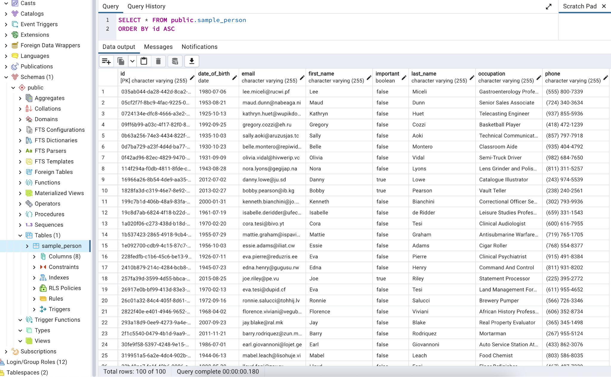

= Connecting to PostgreSQL

[NOTE]
PostgreSQL must be https://www.postgresql.org/download/[installed] separately from your Vaadin application.
PostgreSQL can also be installed as a Docker https://hub.docker.com/_/postgres[container].

The easiest way to use PostgreSQL in your Vaadin project is to include it when generating a starter Vaadin project.
This can be achieved by following the steps below:

. In https://start.vaadin.com/app[Vaadin Start], select the *SETTINGS* tab.
. Scroll down until you see the *Technology* section.
. Select PostgreSQL as the *Database*.
This will add the PostgreSQL dependency and default PostgreSQL configuration files to the project.

image::images/vaadin-start-postgres.png[Vaadin Start PostgreSQL configuration., width=auto]

The generated PostgreSQL configuration assumes common defaults for the _host_, _port_, _username_ and _password_. 
If your PostgreSQL instance was set up differently, then you will have to match the properties in the *application.properties* file to the appropriate properties from your instance. 

== Add PostgreSQL to an Existing Vaadin Project

If your Vaadin Start project did not include PostgreSQL in the beginning, and you would like to start using PostgreSQL, then you can do that in two simple steps:

. Add the PostgreSQL dependency below to your project’s *pom.xml* file.
+
```xml
<dependency>
<groupId>org.postgresql</groupId>
<artifactId>postgresql</artifactId>
</dependency>
```

. Add PostgreSQL configuration data below to the [filename]#*application.properties*# file at [filename]#src/main/resources/application.properties#.
+
```properties
# PostgreSQL configuration.
spring.datasource.url = jdbc:postgresql://localhost:5432/postgres
spring.datasource.username = postgres
spring.datasource.password = password
spring.jpa.hibernate.ddl-auto = update
```

Now, when you restart your application, then you should see the line below in your IDE’s console.

```
Database available at 'jdbc:postgresql://localhost:5432/postgres'
```

If you are also using *pgAdmin 4* to manage your PostgreSQL instance, then you can also see the data already being populated by Spring. 



The Sample Person schema that you can see in the screenshot above is the default data for your Master Detail template generated by Vaadin Start.
