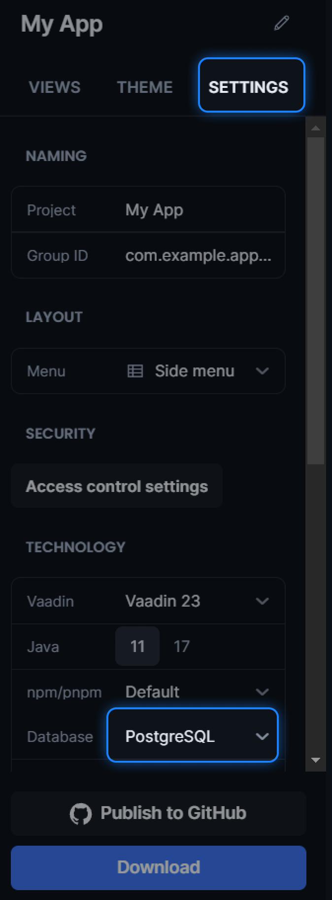

= Connecting to PostgreSQL

PostgreSQL is a free and open source relational database that's commonly used to persist data for Spring backends.
You should https://www.postgresql.org/download/[install PostgreSQL] separately before you can connect to it from your Vaadin application (you can also install PostgreSQL as a https://hub.docker.com/_/postgres[Docker container]).

== Adding PostgreSQL to New Vaadin Applications

The easiest way to use PostgreSQL in your Vaadin project is to include it when generating a starter project from https://start.vaadin.com/[Vaadin Start].
You can achieve this by following the steps below:

. In https://start.vaadin.com/app[Vaadin Start], select the *SETTINGS* tab.
. Scroll down until you see the *Technology* section.
. Select PostgreSQL as the *Database*.

Now the generated project includes the necessary configurations to connect to PostgreSQL.
Specifically, the generated project contains the following dependency inside the [filename]`pom.xml` file:

.`pom.xml`
[source, xml]
----
<dependency>
  <groupId>org.postgresql</groupId>
  <artifactId>postgresql</artifactId>
</dependency>
----

The generated project also contains the following PostgreSQL configuration added to the [filename]`src/main/resources/application.properties` file:

.`application.properties`
[source, properties]
----
# PostgreSQL configuration.
spring.datasource.url = jdbc:postgresql://localhost:5432/postgres
spring.datasource.username = postgres
spring.datasource.password = password
spring.jpa.hibernate.ddl-auto = update
----

The generated PostgreSQL configuration assumes common defaults for the `host`, `port`, `username`, and `password`.
If your PostgreSQL instance was set up differently, then you should match the properties in the [filename]`application.properties` file to the appropriate properties from your database instance.

include::{root}/articles/integrations/databases/_shared.adoc[]

Now, when you start the application, you should see the following line in your IDE console.

[source,terminal]
----
Database available at 'jdbc:postgresql://localhost:5432/postgres'
----

== Adding PostgreSQL to an Existing Vaadin Project

For an existing Vaadin project, you can connect to PostgreSQL by:

. Adding the previously mentioned PostgreSQL dependency to the [filename]`pom.xml` file.
. Adding the previously mentioned PostgreSQL configuration to the [filename]`application.properties` file.

[discussion-id]`6C0C05FE-BB85-4DB0-AD82-8289272364B7`
