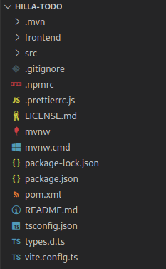
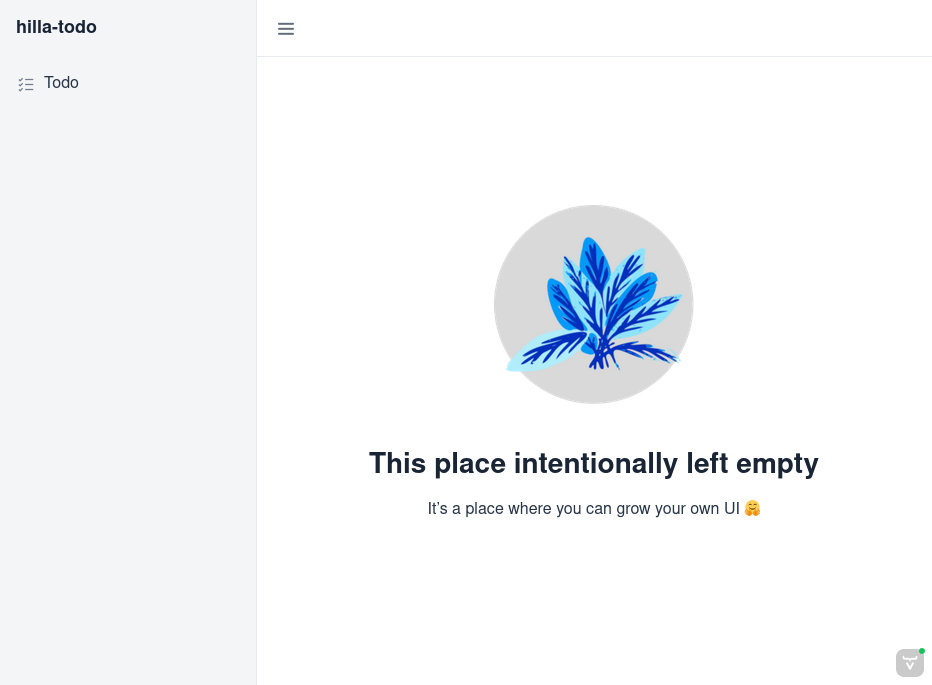
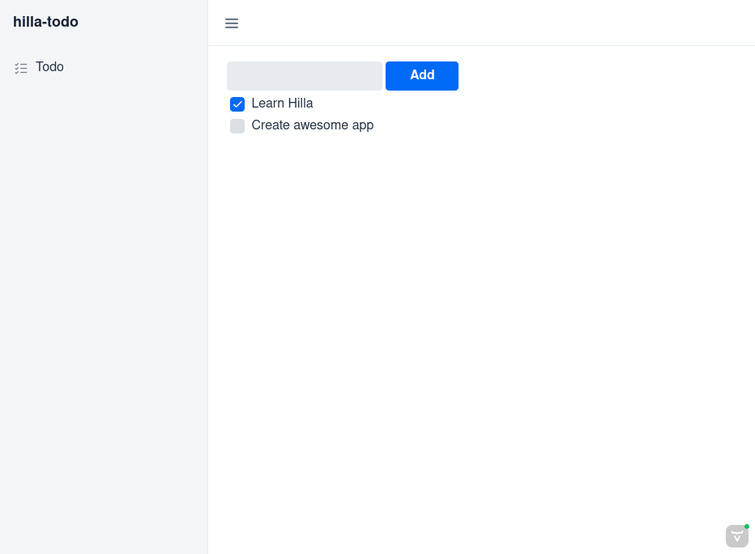

:lit:
// tag::content[]

= Basics Tutorial
:sectnums:

== Requirements

- About 10–20 minutes, depending on if you decide to do every part step by step.
+
include::{articles}/lit/start/quick.adoc[tag=requirements]

https://code.visualstudio.com/[Visual Studio Code] is used in this tutorial.
See the https://youtu.be/G_aJONwi0qo[setup instructions] on YouTube.
You can use any IDE that supports Java, TypeScript, HTML, and CSS.

This tutorial is intended for developers with a basic understanding of Java, JavaScript,
ifdef::react[]
React,
endif::[]
HTML, and CSS.
You don't need to be an expert by any means, but understanding the syntax and basic concepts makes it easier to follow along.

== Create a Hilla Project

Use the Hilla CLI to create a new project:

ifdef::lit[]
[source,terminal]
----
npx @hilla/cli init --preset hilla-tutorial hilla-todo
----

Alternatively, you can https://start.vaadin.com/dl?preset=hilla-tutorial&projectName=hilla-todo[download the starter as a zip-file] and extract it.
endif::[]
ifdef::react[]
[source,terminal]
----
npx @hilla/cli init --preset react-tutorial hilla-todo
----

Alternatively, you can https://start.vaadin.com/dl?preset=react-tutorial&projectName=hilla-todo[download the starter as a zip-file] and extract it.
endif::[]

Unpack the downloaded zip into a folder on your computer, and import the project in the IDE of your choice.

If you open one of the `.ts` files inside the `frontend/views` folder, you might see red underlines for unresolved imports. They get resolved when you start the development server for the first time, when all dependencies are downloaded.

.Importing into VS Code
[%collapsible]
====
Import the project by either:

- navigating to the project folder and running `code .` (note the period), or
- choosing menu:File[Open...] in VS Code and selecting the _project folder_.

[discrete]
===== Recommended Extensions

You should install the following extensions to VS Code for an optimal development experience:

* https://marketplace.visualstudio.com/items?itemName=vscjava.vscode-java-pack[Java Extension Pack]
ifdef::lit[]
* https://marketplace.visualstudio.com/items?itemName=runem.lit-plugin[Lit-plugin]
endif::[]
* https://marketplace.visualstudio.com/items?itemName=Pivotal.vscode-spring-boot[Spring Boot Tools]

VS Code should automatically suggest these for you when you open the project.
====

.Project architecture and structure
[%collapsible]
====
Hilla projects are based on https://spring.io/projects/spring-boot[Spring Boot] and use https://maven.apache.org/[Maven] for dependency management and build configuration.

[.subtle]

The following lists the key folders and files in a Hilla application project:

// TODO this list should probably be written in full in a reference article, and then include a snippet from there to here
// TODO then include part of that list here, and do it similarly in the application architecture page which outlines the project structure
// See vaadin.com/docs/latest/configuration/source-control for an example in Vaadin docs

`frontend`::
The folder where your views and front-end code live.

`src`::
The folder where your Java back-end code lives.

`pom.xml`::
The project configuration file, which defines dependencies.

`frontend/index.html`::
The bootstrap page.
You don't usually need to edit this.

ifdef::lit[]
`frontend/index.ts`::
endif::[]
ifdef::react[]
`frontend/routes.tsx`::
endif::[]
Your application routes are defined here.

`src/main/java/com/example/application/Application.java`::
The Java class which runs the Spring Boot application.

ifdef::lit[]
See <<../../guides/architecture#,Application architecture>> for more details.
endif::lit[]
====

== Define the Data Model & Service Layer

Begin by setting up the data model and services for accessing the database. You can do this in two steps:

. Define an entity.
. Create a repository for accessing the database.

This tutorial shows how to use an in-memory H2 database and JPA for persistence.
The starter you downloaded already includes the needed dependencies in the `pom.xml` file.

=== Define an Entity

Define a JPA _entity_ class for the data model, by creating a new file, `Todo.java`, in `src/main/java/com/example/application` with the following content:

.`Todo.java`
[source,java]
----
package com.example.application;

import jakarta.persistence.Entity;
import jakarta.persistence.GeneratedValue;
import jakarta.persistence.Id;
import jakarta.validation.constraints.NotBlank;

@Entity // <1>
public class Todo {

  @Id
  @GeneratedValue
  private Integer id;

  private boolean done = false;

  @NotBlank // <2>
  private String task;

  public Todo() {}

  public Todo(String task) {
    this.task = task;
  }

  public Integer getId() {
    return id;
  }

  public void setId(Integer id) {
    this.id = id;
  }

  public boolean isDone() {
    return done;
  }

  public void setDone(boolean done) {
    this.done = done;
  }

  public String getTask() {
    return task;
  }

  public void setTask(String task) {
    this.task = task;
  }
}
----
<1> Turn the class into a JPA entity with an `@Entity` annotation.
<2> Add a `@NotBlank` Java bean validation annotation to enforce validity both in the view and on the server.

=== Create a Repository

Next, create a _repository_ for accessing the database.
You only need to define an interface with type information: Spring Data takes care of the implementation.
Create a new file, `TodoRepository.java`, in `src/main/java/com/example/application`, with the following contents:

.`TodoRepository.java`
[source,java]
----
package com.example.application;

import org.springframework.data.jpa.repository.JpaRepository;

public interface TodoRepository extends JpaRepository<Todo, Integer> {
}
----

You now have all the necessary back-end code in place to start building a UI.

Hilla can generate TypeScript versions of the Java files you created. To achieve this, run the project from the command line:

include::{articles}/lit/start/quick.adoc[tag=run]

**The first time you run the application, it may take up to a few minutes**, as Hilla downloads all the dependencies and builds a front-end bundle.
Subsequent builds don't download dependencies, so that they are much faster.

When the build has finished, you should see the application running on http://localhost:8080.

== Create a Typed Server Endpoint

One of the key features of Hilla is type-safe server access through _endpoints_.
When you define an `@Endpoint`, Hilla creates the needed REST-like endpoints, secures them, and generates TypeScript interfaces for all the data types and public methods used.
Having full-stack type safety helps you stay productive through autocomplete and helps guard against breaking the UI when you change the data model on the server.

Create a new `TodoEndpoint.java` file in `src/main/java/com/example/application` with the following content:

.`TodoEndpoint.java`
[source,java]
----
package com.example.application;

import java.util.List;

import com.vaadin.flow.server.auth.AnonymousAllowed;
import dev.hilla.Endpoint;
import dev.hilla.Nonnull;

@Endpoint // <1>
@AnonymousAllowed // <2>
public class TodoEndpoint {
  private TodoRepository repository;

  public TodoEndpoint(TodoRepository repository) { // <3>
    this.repository = repository;
  }

  public @Nonnull List<@Nonnull Todo> findAll() { // <4>
    return repository.findAll();
  }

  public Todo save(Todo todo) {
    return repository.save(todo);
  }
}
----
<1> Annotating a class with `@Endpoint` exposes it as a service for client-side views.
All *public* methods of an endpoint are callable from TypeScript.
<2> By default, endpoint access requires an authenticated user. `@AnonymousAllowed` enables access for anyone.
See <<{articles}/lit/guides/security/configuring#,Configuring Security>> for more information on endpoint security.
<3> Use Spring to automatically inject the `TodoRepository` dependency for database access.
<4> Using the `@Nonnull` annotation ensures that the TypeScript generator doesn't interpret these values as possibly `undefined`.

// TODO only needed if the server is started as an intermediate step
// Save the file and ensure the change is loaded.
// You should see log output from the reload in the console.
// It should end with the message, `Frontend compiled successfully`.

// If you didn't have the server running, or if something failed, (re)start the server with the `mvn` command.

== Build the Todo View

ifdef::lit[]
Hilla uses the https://lit.dev/[Lit] library for client-side views.
Lit is a lightweight and highly performant library for building reactive components with declarative templates.
endif::[]
ifdef::react[]
Hilla can use React for client-side code.
You can use your React skills and favourite libraries, and you have first-class support for Vaadin components.
endif::[]

Next, you create a view for adding and viewing to-do items. You can choose to build it step by step, learning some concepts along the way, or to copy the complete view implementation if you are in a hurry. When you're ready, you can learn more about <<{articles}/lit/components/create#,creating components>>.

ifdef::react[]
In this example we'll use Formik to create our form, so we need to add it to the project:

[source,terminal]
----
npm install formik --save
----
endif::[]

.Build the View Step-by-Step
[%collapsible]
====
ifdef::lit[]
Open the `frontend/views/todo/todo-view.ts` file and replace its contents with the following:

.`todo-view.ts`
[source,typescript]
----
import { html } from 'lit';
import { customElement, state } from 'lit/decorators.js';
// <1>
import '@vaadin/button';
import '@vaadin/checkbox';
import '@vaadin/text-field';
import { Binder, field } from '@hilla/form';
import Todo from 'Frontend/generated/com/example/application/Todo';
import TodoModel from 'Frontend/generated/com/example/application/TodoModel';
import { TodoEndpoint } from 'Frontend/generated/endpoints';
import { View } from '../view';

@customElement('todo-view') // <2>
export class TodoView extends View { // <3>
}
----
<1> Import the UI components, helpers, and generated TypeScript models required for building the view.
<2> Register the new component with the browser.
This makes it available as `<todo-view>`.
The routing in `index.ts` is already set up to show it when you navigate to the application.
<3> Define the component class that extends from `View`.

[discrete]
=== Define the View State

Inside the `TodoView` class, define the view state as follows:

.`todo-view.ts`
[source,typescript]
----
@state()
private todos: Todo[] = []; // <1>
private binder = new Binder(this, TodoModel); // <2>
----
<1> The list of `Todo` items is private and decorated with `@state()`, so Lit observes it for changes.
<2> A Hilla `Binder` is used to handle the form state for creating new `Todo` objects.
`TodoModel` is automatically generated by Hilla.
This describes the data types and validations that `Binder` needs.
Read more about forms in <<{articles}/lit/guides/forms/binder#,Binding Data to Forms>>.

[discrete]
=== Define Styles

Define some padding on the view.
Web Components have a default `display` value of `inline`, which is rarely what you want.
Set it to `block` instead by adding the following code to the `themes/hilla-todo/styles.css` file, which is where you define styles in a Hilla application, as explained in <<{articles}/lit/guides/styling#,Styling>>.

.`themes/hilla-todo/styles.css`
[source,css]
----
todo-view {
  display: block;
  padding: var(--lumo-space-m) var(--lumo-space-l); /* <1> */
}
----
<1> The `padding` property is defined using the https://vaadin.com/docs/latest/styling/lumo/lumo-style-properties/size-space#space[spacing properties] to be consistent with the rest of the app.

[discrete]
=== Define the HTML Template

Go back to the `todo-view.ts` file and define a `render()` method that returns an `html` template literal inside the class.

.`todo-view.ts`
[source,typescript]
----
render() {
  return html`

  `;
}
----

Add the following code within the `html` template:

.`todo-view.ts`
[source,typescript]
----

  <vaadin-text-field
    label="Task"
    ${field(this.binder.model.task) /* <1> */ }
  ></vaadin-text-field>
  <vaadin-button
    theme="primary"
    @click=${this.createTodo /* <2> */}
    ?disabled=${this.binder.invalid /* <3> */}
  >
    Add
  </vaadin-button>

----
<1> The Text Field component is bound to the `task` property of a `Todo` using `${field(this.binder.model.task)}`.
You can read more about forms in <<{articles}/lit/guides/forms/binder#,Binding Data to Forms>>.
<2> The click event of the *Add* button is bound to the `createTodo()` method.
<3> The button is disabled if the form is invalid.

Right underneath the previous `
`, add the following code:

.`todo-view.ts`
[source,typescript]
----

  ${this.todos.map((todo) => /* <1> */ html`
      

        <vaadin-checkbox
          ?checked=${todo.done /* <2> */}
          @checked-changed=${(e: CustomEvent) => // <3>
            this.updateTodoState(todo, e.detail.value)}
        ></vaadin-checkbox>
        ${todo.task}
      

    `
  )}

----
<1> The existing `todo` items are shown by mapping the `todos` array to Lit templates.
The template for a single `Todo` contains a checkbox and the task text.
<2> Bind the `checked` boolean attribute to the `done` property on the `todo`.
<3> Call the `updateTodoState()` method, with the `todo` and the new value, whenever the checked value changes.

[discrete]
=== Update View State and Call Backend

// TODO should probably use firstUpdated instead, like in the previous "quick start tutorial"
// remember to update in github as well, if changed
Below the `render()` method in the `TodoView` class, add a `connectedCallback()` lifecycle callback to initialize the view when it's attached to the DOM.

.`todo-view.ts`
[source,typescript]
----
async connectedCallback() { // <1>
  super.connectedCallback(); // <2>
  this.todos = await TodoEndpoint.findAll(); // <3>
}
----
<1> Use an https://developer.mozilla.org/en-US/docs/Web/JavaScript/Reference/Statements/async_function[async function] to make it easier to handle asynchronous code.
<2> Remember to call the superclass method.
<3> The `getTodos()` method is automatically generated by Hilla based on the method in `TodosEndpoint.java`.
The method was imported in the head of the file.
The `await` keyword waits for the server response without blocking the UI.

Below the `connectedCallback()`, add another method to handle the creation of a new `Todo`.

.`todo-view.ts`
[source,typescript]
----
async createTodo() {
  const createdTodo = await this.binder.submitTo(TodoEndpoint.save); // <1>
  if (createdTodo) {
    this.todos = [...this.todos, createdTodo]; // <2>
    this.binder.clear(); // <3>
  }
}
----
<1> Use `binder` to submit the form to `TodoEndpoint`.
The `Binder` validates the input before posting it, and the server revalidates it.
<2> Update the state with a new array that includes the saved `Todo`.
This re-renders the view.
<3> Clear the form input.

Finally, add a method for updating the `todo` state right below `createTodo()`:

.`todo-view.ts`
[source,typescript]
----
updateTodoState(todo: Todo, done: boolean) {
  todo.done = done;
  const updatedTodo = { ...todo }; // <1>
  this.todos = this.todos.map((t) => (t.id === todo.id ? updatedTodo : t)); // <2>
  TodoEndpoint.save(updatedTodo); // <3>
}
----
<1> Create a new `Todo` with the updated `done` state.
<2> Update the local `todos` array with the new state.
The `map` operator creates a new array where the changed `todo` is swapped out.
This re-renders the view.
<3> Save the updated `todo` to the server.
endif::[]
ifdef::react[]
Open the `frontend/views/todo/TodoView.tsx` file and replace its contents with the following:

.`TodoView.tsx`
[source,typescript]
----
import type Todo from 'Frontend/generated/com/example/application/Todo'; // <1>
import { useEffect, useState } from 'react';
import { FormikErrors, useFormik } from 'formik';
import { Button } from '@hilla/react-components/Button.js';
import { Checkbox } from '@hilla/react-components/Checkbox.js';
import { TextField } from '@hilla/react-components/TextField.js';
import { TodoEndpoint } from 'Frontend/generated/endpoints';
import { EndpointValidationError } from '@hilla/frontend';

export default function TodoView() { // <2>
  return (
  );
}
----
<1> Import the UI components, helpers, and generated TypeScript models required for building the view.
<2> Define the view.

[discrete]
=== Define the View State

Inside the `TodoView` function, define the view state as follows:

.`TodoView.tsx`
[source,typescript]
----
const empty: Todo = { task: '', done: false };
const [todos, setTodos] = useState(Array<Todo>()); // <1>
----
<1> The list of `Todo` items is stored using a React Hook.

// TODO: add styles like in the Lit version

[discrete]
=== Create the Form Handler

[source,typescript]
----
const formik = useFormik({
  initialValues: empty,
  onSubmit: async (value: Todo, { setSubmitting, setErrors }) => {
    try {
      const saved = await TodoEndpoint.save(value) ?? value;
      setTodos([...todos, saved]);
      formik.resetForm();
    } catch (e: unknown) {
      if (e instanceof EndpointValidationError) {
        const errors: FormikErrors<Todo> = {}
        for (const error of e.validationErrorData) {
          if (typeof error.parameterName === 'string' && error.parameterName in empty) {
            const key = error.parameterName as (string & keyof Todo);
            errors[key] = error.message;
          }
        }
        setErrors(errors);
      }
    } finally {
      setSubmitting(false);
    }
  },
});
----

[discrete]
=== Define the HTML Template

Add the following code inside the `return` statement:

.`TodoView.tsx`
[source,typescript]
----
<>
  

    <TextField
      name='task'
      label="Task"
      value={formik.values.task}
      onChange={formik.handleChange}
      onBlur={formik.handleChange}
    />
    <Button
      theme="primary"
      disabled={formik.isSubmitting}
      onClick={formik.submitForm}
    >Add</Button>
  

</>
----

Right below the previous `
`, add the following code:

.`TodoView.tsx`
[source,typescript]
----

  {todos.map(todo => (
    <Checkbox
      key={todo.id}
      checked={todo.done}
      onCheckedChanged={({ detail: { value } }) => changeStatus(todo, value)}>
      {todo.task}
    </Checkbox>
  ))}

----

Before the `return` method, add a React effect to load the initial values.

.`TodoView.tsx`
[source,typescript]
----
useEffect(() => {
  (async () => {
    setTodos(await TodoEndpoint.findAll());
  })();

  return () => { };
}, []);
----

Finally, add a function to handle checking a todo as done.

[source,typescript]
----
async function changeStatus(todo: Todo, done: boolean) {
  const newTodo = { ...todo, done: done };
  const saved = await TodoEndpoint.save(newTodo) ?? newTodo;
  setTodos(todos.map(item => item.id === todo.id ? saved : item));
}
----

endif::[]
====

.Get the complete view implementation
[%collapsible]
====

ifdef::lit[]
Open the `frontend/views/todo/todo-view.ts` file and replace its contents with the following:

.`todo-view.ts`
[source,typescript]
----
import { html } from 'lit';

import { customElement, state } from 'lit/decorators.js';

import '@vaadin/button';
import '@vaadin/checkbox';
import '@vaadin/text-field';
import { Binder, field } from '@hilla/form';
import Todo from 'Frontend/generated/com/example/application/Todo';
import TodoModel from 'Frontend/generated/com/example/application/TodoModel';
import { TodoEndpoint } from 'Frontend/generated/endpoints';
import { View } from '../view';

@customElement('todo-view')
export class TodoView extends View {
  @state()
  private todos: Todo[] = [];

  private binder = new Binder(this, TodoModel);

  render() {
    return html`
      

        <vaadin-text-field label="Task" ${field(this.binder.model.task)}></vaadin-text-field>
        <vaadin-button theme="primary" @click=${this.createTodo} ?disabled=${this.binder.invalid}>
          Add
        </vaadin-button>
      

      

        ${this.todos.map(
          (todo) => html`
            

              <vaadin-checkbox
                ?checked=${todo.done}
                @checked-changed=${(e: CustomEvent) => this.updateTodoState(todo, e.detail.value)}></vaadin-checkbox>
              ${todo.task}
            

        `)}
      

    `;
  }

  async connectedCallback() {
    super.connectedCallback();
    this.todos = await TodoEndpoint.findAll();
  }

  async createTodo() {
    const createdTodo = await this.binder.submitTo(TodoEndpoint.save);
    if (createdTodo) {
      this.todos = [...this.todos, createdTodo];
      this.binder.clear();
    }
  }

  updateTodoState(todo: Todo, done: boolean) {
    todo.done = done;
    const updatedTodo = { ...todo };
    this.todos = this.todos.map((t) => (t.id === todo.id ? updatedTodo : t));
    TodoEndpoint.save(updatedTodo);
  }
}
----
endif::[]
ifdef::react[]
Open the `frontend/views/todo/TodoView.tsx` file and replace its contents with the following:

.`TodoView.tsx`
[source,typescript]
----
import type Todo from 'Frontend/generated/com/example/application/Todo';
import { useEffect, useState } from 'react';
import { FormikErrors, useFormik } from 'formik';
import { Button } from '@hilla/react-components/Button.js';
import { Checkbox } from '@hilla/react-components/Checkbox.js';
import { TextField } from '@hilla/react-components/TextField.js';
import { TodoEndpoint } from 'Frontend/generated/endpoints';
import { EndpointValidationError } from '@hilla/frontend';

export default function TodoView() {
  const empty: Todo = { task: '', done: false };
  const [todos, setTodos] = useState(Array<Todo>());

  useEffect(() => {
    (async () => {
      setTodos(await TodoEndpoint.findAll());
    })();

    return () => { };
  }, []);

  const formik = useFormik({
    initialValues: empty,
    onSubmit: async (value: Todo, { setSubmitting, setErrors }) => {
      try {
        const saved = (await TodoEndpoint.save(value)) ?? value;
        setTodos([...todos, saved]);
        formik.resetForm();
      } catch (e: unknown) {
        if (e instanceof EndpointValidationError) {
          const errors: FormikErrors<Todo> = {};
          for (const error of e.validationErrorData) {
            if (typeof error.parameterName === 'string' && !(error.parameterName in empty)) {
              const key = error.parameterName as string & keyof Todo;              
              errors[key] = error.message.substring(error.message.indexOf("validation error:"));
            }
          }
          setErrors(errors);
        }
      } finally {
        setSubmitting(false);
      }
    },
  });

async function changeStatus(todo: Todo, done: boolean) {
  const newTodo = { ...todo, done: done };
  const saved = await TodoEndpoint.save(newTodo) ?? newTodo;
  setTodos(todos.map(item => item.id === todo.id ? saved : item));
}

  return (
    <>
      

        <TextField
          name="task"
          label="Task"
          value={formik.values.task}
          onChange={formik.handleChange}
          onBlur={formik.handleChange}
          errorMessage={formik.errors.task}
          invalid={formik.errors.task? true : false}
        ></TextField>
        <Button
          theme="primary"
          disabled={formik.isSubmitting}
          onClick={formik.submitForm}
        >Add</Button>
      

      

        {todos.map(todo => (
          <Checkbox
            key={todo.id}
            checked={todo.done}
            onCheckedChanged={({ detail: { value } }) => changeStatus(todo, value)}>
            {todo.task}
          </Checkbox>
        ))}
      

    </>
  );
}
----
endif::[]
====

== Run the Application

Run the project from the command line with the following command:

include::{articles}/lit/start/quick.adoc[tag=run]

[.secondary-text.small]
The first time you run the application, it may take up to a few minutes, as Hilla downloads all the dependencies and builds a front-end bundle.
Subsequent builds don't download dependencies, so that they are much faster.

When the build has finished, you should see the application running on http://localhost:8080.

You should now have a fully functional to-do application.
Notice that when you refresh the browser, it keeps the same `todo` items, as they are persisted in the database.

// TODO Heroku no longer offers a free option, so not sure if we should promote that here
// == Deploy the Application to Heroku (Optional)

// The following steps are optional.
// You can follow them to deploy your application to https://www.heroku.com/[Heroku], a cloud deployment platform that offers a free tier that doesn't require a credit card.

// .Deploying to Heroku
// [%collapsible]
// ====
// // tag::heroku-steps[]
// [discrete]
// === Preparing the Application for Production
// It's important to build a separate production-optimized version of the application before deploying it.
// In development mode, Hilla has a live-reload widget, debug logging, and uses a quick, but unoptimized, frontend build that includes source maps for easy debugging.
// Unoptimized frontend bundles can contain several megabytes of JavaScript.

// The `pom.xml` build includes a `production` profile configuration that prepares an optimized build that's ready for production.

// [discrete]
// ==== Using a PostgreSQL Database in Production

// During development, the application has used an in-memory H2 database.
// It's convenient and works well for a single user.
// In production, you want to use something more robust and persistent.
// Heroku's free tier supports PostgreSQL, so can configure your application to use that.

// First, add the PostgreSQL dependency in the production profile of `pom.xml`:

// .`pom.xml`
// [source,xml]
// ----
// <profile>
//   <id>production</id>
//   <!-- Omitted -->
//   <dependencies>
//     <dependency>
//       <groupId>org.postgresql</groupId>
//       <artifactId>postgresql</artifactId>
//     </dependency>
//   </dependencies>
// </profile>
// ----

// Next, configure how JPA should handle schema generation.
// Add the following two properties to the end of `application.properties`.

// .`src/main/resources/application.properties`
// [source]
// ----
// spring.jpa.generate-ddl=true
// spring.jpa.hibernate.ddl-auto=create-drop
// ----

// .Avoid data loss
// [WARNING]
// This setup recreates the database on every deployment. If you are working with real data, you should use `ddl-auto=none` and instead use a database migration tool like https://www.liquibase.org/[Liquibase] or https://flywaydb.org/[Flyway] so you can evolve the database schema without losing data.

// [discrete]
// ==== Building a Production-Optimized JAR

// Build the application with the `production` profile:

// [source,bash]
// ----
// mvn clean package -Pproduction
// ----

// This builds a production-optimized JAR file in the `target` folder.

// [discrete]
// === Creating a Heroku Account and Installing Heroku CLI

// Complete the following steps to create a Heroku account and install the Heroku CLI.

// . Go to https://signup.heroku.com/, create a new account, and verify your email.
// . Go to https://devcenter.heroku.com/articles/heroku-cli and follow the instructions for installing the CLI on your operating system.

// [discrete]
// === Deploying a Hilla Application to Heroku

// Use the Heroku CLI to create and deploy your application.

// . Log in:
// +
// [source,terminal]
// ----
// heroku login
// ----
// . Configure the correct Java version:
// +
// [source,terminal]
// ----
// echo "java.runtime.version=11" > system.properties
// ----
// . Install the Heroku Java plugin:
// +
// [source,terminal]
// ----
// heroku plugins:install java
// ----
// . Create a new app.
// Replace APPNAME with a name of your choice.
// APPNAME is part of the URL, like https://APPNAME.herokuapp.com, so choose a name that's unique and easy to remember.
// +
// [source,terminal]
// ----
// heroku create APPNAME
// ----
// . Create a secret key for your application:
// +
// [source,terminal]
// ----
// heroku config:set APP_SECRET=$(openssl rand -base64 32)
// ----
// . Enable the PostgreSQL plugin for the newly created app:
// +
// [source,terminal]
// ----
// heroku addons:create heroku-postgresql -a APPNAME
// ----
// . Deploy the production-optimized JAR file you created in the previous section.
// +
// [source,terminal]
// ----
// heroku deploy:jar target/fusioncrmtutorial-1.0-SNAPSHOT.jar -a APPNAME
// ----
// . Open the application in your browser.
// +
// [source,terminal]
// ----
// heroku open
// ----
// . View the application logs and see if anything goes wrong.
// +
// [source,terminal]
// ----
// heroku logs --tail
// ----
// // end::heroku-steps[]
// ====

// == Next steps

// After completing the tutorial, you are ready to start experimenting on your own or continue to more advanced guides in the documentation.

// end::content[]
