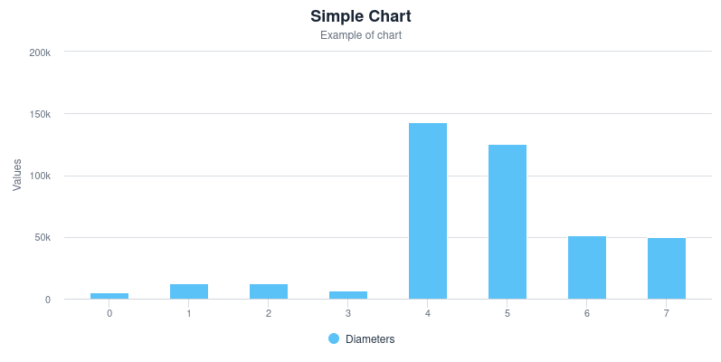
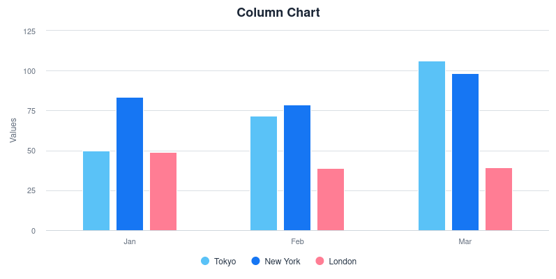
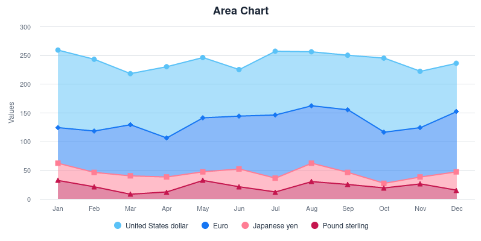
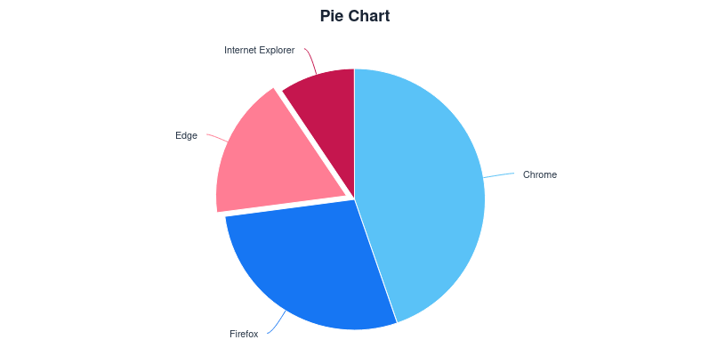
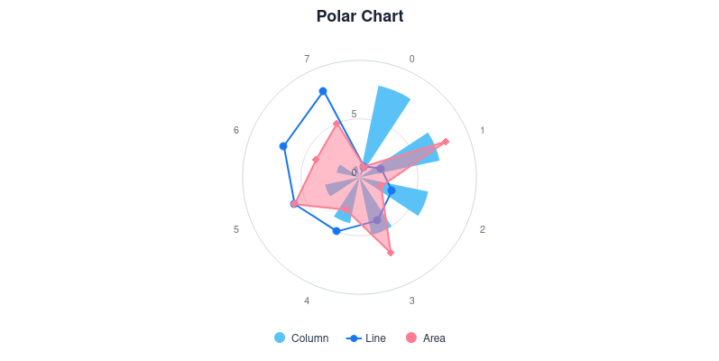

= Charts

Interaction with the vector graphics is animated. They render crisply on any device.

:commercial-feature: Charts
include::{articles}/_commercial-banner.asciidoc[opts=optional]

[source,tsx]
----
<Chart title="Simple Chart" subtitle="Example of chart">
  <ChartSeries
    type="column"
    values={[4900, 12100, 12800, 6800, 143000, 125000, 51100, 49500]}
    title="Diameters"
  />
</Chart>
----

Have a look at the https://charts.demo.vaadin.com/vaadin-charts/[Elements API] for live examples and details.

== Chart Types

Charts come with over a dozen types of charts:

|===
|   `area` |   `arearange` |   `areaspline` |   `areasplinerange`
|   `bar`
|   `boxplot`
|   `bubble`
|   `bullet`
|   `candlestick`
|   `column`
|   `columnrange`
|   `errorbar`
|   `flags`
|   `funnel`
|   `gauge`
|   `heatmap`
|   `line`
|   `ohlc`
|   `organization`
|   `pie`
|   `polygon`
|   `pyramid`
|   `scatter`
|   `solidgauge`
|   `spline`
|   `treemap`
|   `timeline`
|   `waterfall`
|   `xrange`
|
|
|
|===

== Examples

=== Column Chart

[source,typescript]
----
<Chart
  title="Column Chart"
  type="column"
  categories={["Jan", "Feb", "Mar"]}
>
  <ChartSeries title="Tokyo" values={[49.9, 71.5, 106.4]} />
  <ChartSeries title="New York" values={[83.6, 78.8, 98.5]} />
  <ChartSeries title="London" values={[48.9, 38.8, 39.3]} />
</Chart>
----

=== Area Chart

[source,typescript]
----
<Chart
  type="area"
  title="Area Chart"
  stacking="normal"
  categories={"Jan,Feb,Mar,Apr,May,Jun,Jul,Aug,Sep,Oct,Nov,Dec".split(",")}
>
  <ChartSeries
    title="United States dollar"
    values={[135, 125, 89, 124, 105, 81, 111, 94, 95, 129, 98, 84]}
  />
  <ChartSeries
    title="Euro"
    values={[62, 72, 89, 68, 94, 92, 110, 100, 109, 89, 86, 105]}
  />
  <ChartSeries
    title="Japanese yen"
    values={[30, 25, 32, 26, 15, 31, 24, 32, 21, 8, 12, 32]}
  />
  <ChartSeries
    title="Pound sterling"
    values={[32, 21, 8, 12, 32, 21, 12, 30, 25, 19, 26, 15]}
  />
</Chart>
----

=== Pie Chart

[source,typescript]
----
<Chart type="pie" title="Pie Chart" tooltip>
  <ChartSeries
    title="Brands"
    values={[
      { name: "Chrome", y: 38 },
      { name: "Firefox", y: 24 },
      { name: "Edge", y: 15, sliced: true, selected: true },
      { name: "Internet Explorer", y: 8 },
    ]}
  />
</Chart>
----

=== Polar Chart

[source,typescript]
----
<Chart polar title="Polar Chart">
  <ChartSeries
    type="column"
    title="Column"
    values={[8, 7, 6, 5, 4, 3, 2, 1]}
  />
  <ChartSeries type="line" title="Line" values={[1, 2, 3, 4, 5, 6, 7, 8]} />
  <ChartSeries type="area" title="Area" values={[1, 8, 2, 7, 3, 6, 4, 5]} />
</Chart>
----

:component-path: charts
include::{articles}/react/components/_vaadindocs.adoc[]
