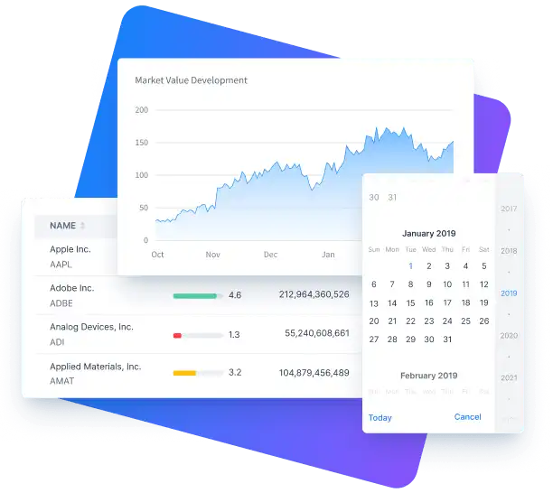

= Components

It seamlessly integrates a React TypeScript frontend with a Spring Boot backend using type-safe server communication, integrated tooling, and accessible UI components. Scroll to explore Hilla’s React component library.

[.subtle]

== Hilla's React Component Library

In addition to the built-in components, you can use any other React components.

section_outline::[]
