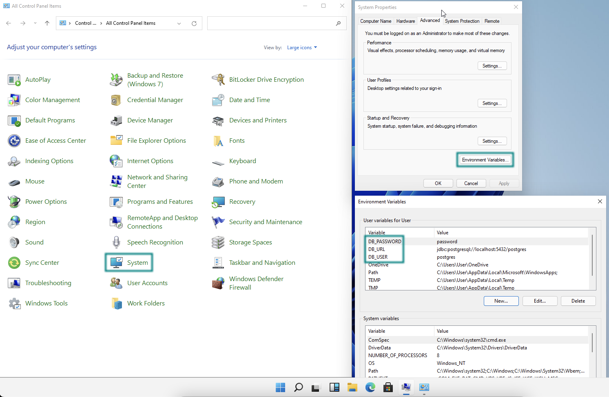

= Storing Sensitive Data in a Spring Boot Application

It's often bad practice to put sensitive information, such as database URI, username, or password, in your [filename]`application.properties` file. If sensitive information is stored in project files or code, it might leak when you commit your project to source control management systems.

To avoid leaking sensitive information, you should consider storing sensitive information outside of your project files. In no case should you ever `git commit` passwords or other secrets into the repository.

This guide demonstrates two ways to externalize sensitive data: using system environment variables; and using an external properties file

== Use System Environment Variables

One of the easiest ways to externalize sensitive information is to set those values as system environment variables.

For example, a https://start.vaadin.com/[Vaadin Start] project configured to use PostgreSQL might contain the following sensitive information in the [filename]`application.properties` file.

.application.properties
[source,properties]
----
...
spring.datasource.url = jdbc:postgresql://localhost:5432/postgres
spring.datasource.username = postgres
spring.datasource.password = password
...
----

To replace the sensitive information with system environment variables, you should edit your file similarly to the following:

.application.properties
[source,properties]
----
...
spring.datasource.url = ${DB_URL}
spring.datasource.username = ${DB_USER}
spring.datasource.password = ${DB_PASSWORD}
...
----

The `${...}` token is the special syntax for Spring's https://docs.spring.io/spring-boot/docs/current/reference/html/features.html#features.external-config.files.property-placeholders[property placeholder], while `DB_URL`, `DB_USER`, and `DB_PASSWORD` represent the actual environment variables that you need to set in your own system.

On Linux and macOS, use the following commands in a terminal to temporarily set the environment variables.

[source,zsh]
----
export DB_URL=jdbc:postgresql://localhost:5432/postgres
export DB_USER=postgres
export DB_PASSWORD=password
----

However, if you want to set the environment variables permanently, you need to add these commands to your [filename]`~/.zprofile` (_zsh_) or [filename]`~/.bashrc` (_bash_) files, depending on your system's default shell.

On Windows, you can set the environment variable by:

- Navigating to *Control Panel* > *System*.
- In *System Properties*, select *Advanced* > *Environment Variables*.
- Add new user or system environment variables by using the *New* buttons.

== Import Configuration from External File

Another simple solution to externalize sensitive information would be to import external property files using Spring Boot's `spring.config.import` properties.

Assuming that you have an external file called [filename]`db.properties` to hold your database secrets,

.db.properties
[source,properties]
----
spring.datasource.url = jdbc:postgresql://localhost:5432/postgres
spring.datasource.username = postgres
spring.datasource.password = password
----

Then you can import this file into your Vaadin app's default [filename]`application.properties` instead.

.application.properties
[source,properties]
----
...
spring.config.import = file:/Users/MyUserName/secret/db.properties
...
----

[discussion-id]`FCC4C231-5DB9-4950-9559-C89630042A43`
