= [since:com.vaadin:vaadin@V24.3]#Navigation Access Control#

Navigation Access Control is a Flow security feature that allows to allow or deny the navigation to a certain view based on different and pluggable rules.
When active, the access control intercepts navigation events, evaluates all configured rules and decides if the target view should be rendered or if the access should be denied.

Navigation Access Control is an improvement and a replacement of the [classname]`ViewAccessChecker` mechanism.
It provides annotation based view security, but it also expands the capabilities of the former access checker by introducing a new path based check and allowing to set up custom rules by implementing the [interfacename]`NavigationAccessChecker` interface.

== Architecture

The Navigation Access Control mechanism is composed by three fundamental components

* [classname]`NavigationAccessControl` is the entry point for navigation security. It listens for navigation events, it evaluates all the security rules and, based on the results, it allows or denies the access to the target view.
* [interfacename]`NavigationAccessChecker` interface implementors represent the security rules that are evaluated during a navigation event.
* [interfacename]`DecisionResolver` has the responsibility to taking the final decision to allow or deny a navigation, based on the result of the evaluation of the security rules.

[classname]`NavigationAccessControl` can be configured to evaluate multiple [interfacename]`NavigationAccessChecker`.
For example, you can enable annotation based view access check and path based access check. During a navigation request, both checkers are evaluated against the current [classname]`NavigationContext` and they produce an [classname]`AccessCheckResult`.
The [interfacename]`DecisionResolver` analyzes the results and provides the final decision, that the access control uses to proceed with the navigation or reroute to the login view or to an error page.

=== Navigation Access Checkers

Vaadin provides two implementations of [interfacename]`NavigationAccessChecker` interface: [classname]`AnnotatedViewAccessChecker` and [classname]`RoutePathAccessChecker`.

[classname]`AnnotatedViewAccessChecker` works in the exact same way as the former [classname]`ViewAccessChecker`.
It looks for security annotation ([annotationname]`@AnonymousAllowed`, [annotationname]`@PermitAll`, or [annotationname]`@RolesAllowed`) on the target view class and evaluates them against the current navigation context.
[classname]`AnnotatedViewAccessChecker` delegates the check to an instance of [classname]`AccessAnnotationChecker`, that can be extended to provide custom rules.

[classname]`RoutePathAccessChecker` instead evaluates the path used to navigate to a view.
It requires an implementation of [interfacename]`AccessPathChecker`, that is responsible for the effective path verification.
The Vaadin spring add-on offers an [interfacename]`AccessPathChecker` implementation based on Spring Security configuration.
The path used to navigate to the target view is evaluated using the Spring [interfacename]`WebInvocationPrivilegeEvaluator` component, that applies the rules defined by the request matchers configured for Spring Security.
Integration with other security frameworks can be accomplished in a similar way, by providing a specific [interfacename]`AccessPathChecker` implementation.

If the above checkers are not enough to fulfill the project requirements, a custom [classname]`NavigationAccessChecker` can be implemented.
[classname]`NavigationAccessChecker` has a single method that takes a [classname]`NavigationContext` as input and produces an [classname]`AccessCheckResult` as output.

The [classname]`NavigationContext` provides information about the current navigation, such as target view class and location, potential authenticated user and its roles.

The [classname]`AccessCheckResult` holds the decision taken by the checker and potentially a informative reason about the decision.
The decision can be `ALLOW`, `DENY`, `NEUTRAL` or `REJECT`.
`ALLOW` and `DENY` are self-explanatory.
`NEUTRAL` means that the checker has not enough information to take a decision and it delegates the responsibility to the other configured checkers.
`REJECT` has the same meaning of `DENY`, but it is used to signal critical situation where the checker is not able to take the decision because of a system configuration error.
In development mode, a rejection is handled by throwing an exception, so that the situation can be immediately detected.
The [classname]`AccessCheckResult` object is created by calling [classname]`NavigationContext` helper methods [methodname]`allow`, [methodname]`deny`, [methodname]`neutral` or [methodname]`reject`.

For example, a navigation access check implementation that allows access to a voting view only when voting has been marked as open could look like the following code.

[source,java]
----
include::{root}/src/main/java/com/vaadin/demo/flow/auth/VotingNavigationAccessChecker.java[tags=snippet]
----

=== Decision Resolver

The [interfacename]`DecisionResolver` component is responsible to analyze the results provided by the navigation access checkers and compute the final decision to grant or deny access to a view.

The default implementation takes the decision by applying the following rules:

[cols="1,1"]
|===
| Navigation access checkers results | Decision

| All ALLOW       | ALLOW
| ALLOW + NEUTRAL | ALLOW
| All DENY        | DENY
| DENY + NEUTRAL  | DENY
| ALL NEUTRAL     | DENY
| ALLOW + DENY    | REJECT
|===

As shown in the above table, if the navigation access checkers do not agree on the decision (excluding neutral votes), the default resolver rejects the navigation, causing an exception to be thrown in development mode.
This situation usually happens because of invalid security configurations. For example, a view may be annotated with [annotaionname]`@AnnonymousAllowed` but the Spring Security configuration has a request matcher for the view path that grants access only to authenticated user.

If the default implementation does not fit the requirements of the project, you can implement your own [interfacename]`DecisionResolver`.
The interface defines a single method that takes as input the results computed by the navigation access checker and the current navigation context, and its output is an [classname]`AccessCheckResult`.

In the following example, the decision resolver allows access to the view if at least one of the checkers provided an `ALLOW` result.

[source,java]
----
include::{root}/src/main/java/com/vaadin/demo/flow/auth/CustomDecisionResolver.java[tags=snippet]
----

== Configuration

Navigation Access Control is automatically enabled on Spring Boot projects using [classname]`VaadinWebSecurity`.
To enable the feature in plain Java projects, follow the specific documentation.

This chapter shows how to customize Navigation Access Control for both Spring and plain Java projects.

=== Spring Projects

When using [classname]`VaadinWebSecurity` as base class for configuring Spring Security, the Navigation Access Control feature is enabled by default.
You can disable it by overriding the [methodname]`enableNavigationAccessControl` to return `false`.
For backward compatibility, only the [classname]`AnnotatedViewAccessChecker` is active by default.

For a fine grained configuration, you can expose a bean of type [classname]`NavigationAccessControlConfigurer`.
[classname]`NavigationAccessControlConfigurer` allows to activate out-of-the-box navigation access checkers or add new ones, provide a custom decision resolver, completely disable the functionality, etc.

In the following example, Navigation Access Control is configured to activate route path checker, a custom checker instance and all available [interfacename]`NavigationAccessChecker` beans that extend [classname]`VotingNavigationAccessChecker`.
It also provides a custom decision resolver.

.Customize NavigationAccessControl in Spring project
[source,java]
----
@Bean
NavigationAccessControlConfigurer navigationAccessControlConfigurerCustomizer() {
    new NavigationAccessControlConfigurer() 
            .withRoutePathAccessChecker() // <1>
            .withNavigationAccessChecker(new CustomChecker()) // <2>
            .withAvailableNavigationAccessCheckers(checker -> 
                checker instanceof VotingNavigationAccessChecker  // <3>
            )
            .withDecisionResolver(new CustomDecisionResolver()) // <4>
}
----
<1> Activates the route path access checker. The implementation is provided out-of-the-box by the Vaadin Spring module and exposed as a bean.
<2> Adds a custom navigation access checker, by creating a new instance.
<3> Activates all registered navigation access checker bean, that match the predicate.
<4> Sets a custom decision resolver.

Consult the [classname]`NavigationAccessControlConfigurer` Javadoc for further information on how navigation access control can be customized.

[NOTE]
====
If [classname]`VaadinWebSecurity` is not used, exposing the [classname]`NavigationAccessControlConfigurer` bean is mandatory to activate navigation access control.
====

=== Plain Java Projects

Set up of Navigation Access Control in plain Java projects is documented in this <<{articles}/security/advanced-topics/securing-plain-java-app#adding-vaadinserviceinitlistener, separate chapter>>.

To apply custom settings, you need to create the [classname]`NavigationAccessControl` instance, providing the list of navigation access checker and the decision resolver to be used.

It is important to know that for plain Java projects there is no out-of-the-box support for route path access checking.
However, as described earlier, it is possible to implement a custom [interfacename]`AccessPathChecker` that integrates with the security framework used in the project.

Here is how you can implement the example of the previous paragraph, in a non-Spring Java project.

.Custom NavigationAccessControl in plain Java project
[source,java]
----
public class FooBarSecurityAccessPathChecker implements AccessPathChecker {
    @Override
    public boolean hasAccess(
        String path, Principal principal, Predicate<String> roleChecker) {
        // implementation omitted
    }
}

public class NavigationAccessCheckerInitializer implements VaadinServiceInitListener {

    public NavigationControlAccessCheckerInitializer() {
        accessControl = new NavigationAccessControl(List.of(
            new RoutePathAccessChecker(new FooBarSecurityAccessPathChecker()),
            new CustomChecker(),
            new VotingNavigationAccessChecker()
        ), new CustomDecisionResolver()); 
        accessControl.setLoginView(LoginView.class); 
    }
}
----

[discussion-id]`4164EB30-201D-4FD3-940F-03630A752AD5`
