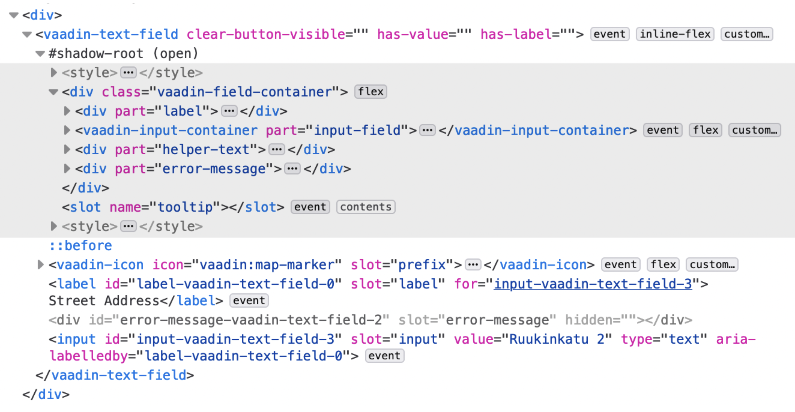

= Shadow DOM Styling of Components

Vaadin components use a native HTML feature called https://developer.mozilla.org/en-US/docs/Web/Web_Components/Using_shadow_DOM[Shadow DOM, window=_blank] which isolates their JavaScript and CSS from the surrounding page. This helps simplify the internal scripting and styling of the components. It also means that traditional, global, or page-level CSS doesn't affect the elements inside the components. Instead, <<../styling-components/parts-and-states#shadow-parts, shadow parts>> and <<../lumo/lumo-style-properties#, style properties>> are used to expose many of these internal elements and styles for customization.

.HTML Structure of a Component with Shadow DOM on Gray Background

In some cases, these recommended and officially supported approaches may be insufficient. For example, if there's a need to customize the styling of an element that is not exposed as a shadow part, the `::part()` selector won't be of any use. The Vaadin platform provides a mechanism for this by allowing developers to inject CSS into the Shadow DOM of Vaadin components.

.Shadow DOM Style Injection Not Recommended
[NOTE]
====
Although mechanisms for injecting custom styles into the Shadow DOM of Vaadin components is still supported, this is no longer the recommended approach to styling. See <<../styling-components#, Styling Vaadin Components>> for a description of the recommended way to style components.
====

Stylesheets placed in a sub-folder called `components`, inside the application theme folder, and named according to the root HTML element of components, are automatically injected into the Shadow DOM of those components. In the example below, the `components` folder contains Shadow DOM stylesheets for Text Field and Dialog:

.Component Shadow DOM Stylesheets in Theme's Component Sub-Folder
[source]
----
[project root]
└── frontend
    └── themes
        └── my-theme
            └── components
                ├── vaadin-text-field.css
                └── vaadin-dialog-overlay.css
----

.Disable Pre-Compiled Frontend Bundle
[NOTE]
====
The loading of shadow DOM stylesheets from the `components` sub-folder isn't compatible with the [since:com.vaadin:vaadin@V24]#<</configuration/development-mode#precompiled-bundle, pre-compiled frontend bundle>>#. To use this mechanism for loading shadow DOM styles, you need to <</configuration/development-mode#disable-precompiled-bundle, disable the pre-compiled bundle>>.
====

.Don't add imports for Shadow DOM stylesheets.
[NOTE]
Shadow DOM stylesheets placed in the `components` folder are loaded automatically into components with matching names. You shouldn't use `@import` in [filename]`styles.css` or `@CssImport` annotations in your Java code to import these stylesheets.

== Writing CSS for Shadow DOM Stylesheets

Shadow DOM stylesheets are regular stylesheets, with a few Shadow DOM-specific CSS peculiarities:

- `:host()` denotes the root element of the component. Additional selectors like class names and attributes are placed inside the parenthesis (e.g., `:host([focused])` and `:host(.special)`)
- `::slotted()` denotes child elements located outside the Shadow DOM, but rendered as child elements of a Shadow DOM element through the https://developer.mozilla.org/en-US/docs/Web/HTML/Element/slot[slot,window=_blank] feature. Additional elements, class and attribute selectors can be placed inside the parenthesis (e.g., `::slotted(span)`).
- There's no way to style a Shadow DOM element based on a parent element of the component.

The DOM inspector feature in the developer tools of web browsers can be used to inspect the DOM structure of Vaadin components and identify the elements to target with Shadow DOM stylesheets.

Note that the Shadow DOM structure is subject to change in later versions. The internal structure of Vaadin components may need to change in later versions to enable new features, improve accessibility, or as part of bug fixes. This is likely to affect Shadow DOM CSS which targets elements by means other than `part` attributes. Shadow DOM styling is inherently less future-proof than the <<../styling-components#, recommended styling approaches>>.

[discussion-id]`a97dc9f0-a6d1-466e-b25e-2e3d055b7a4b`

++++

++++
