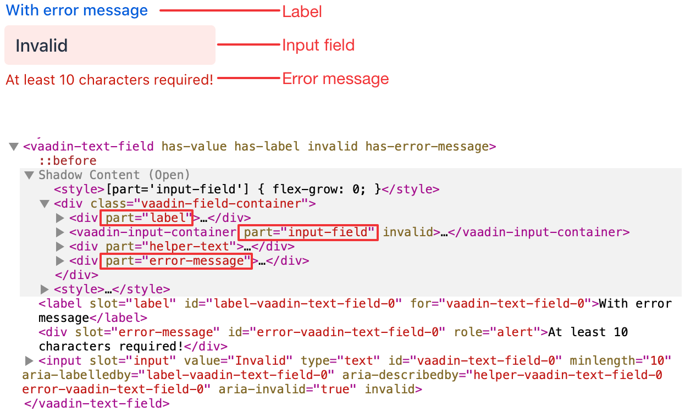
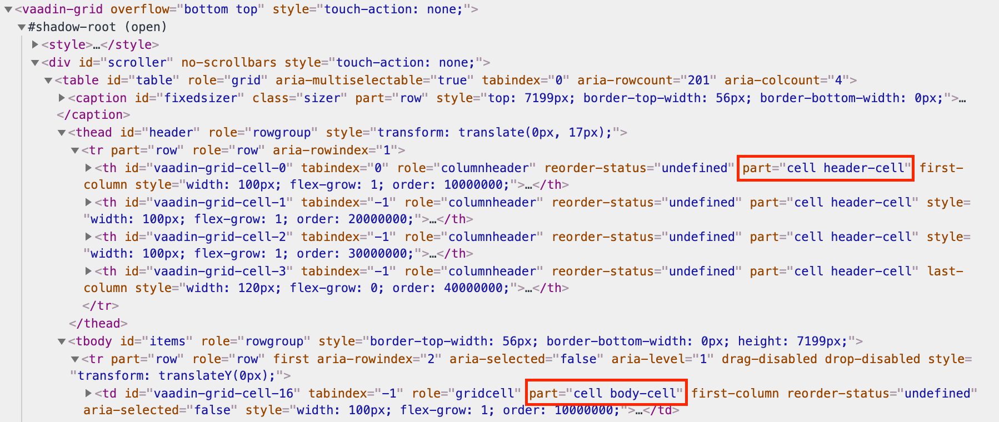
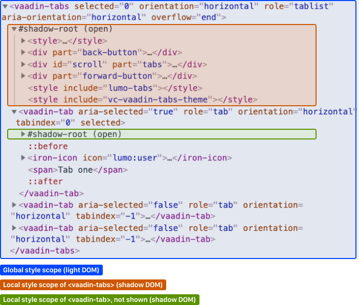
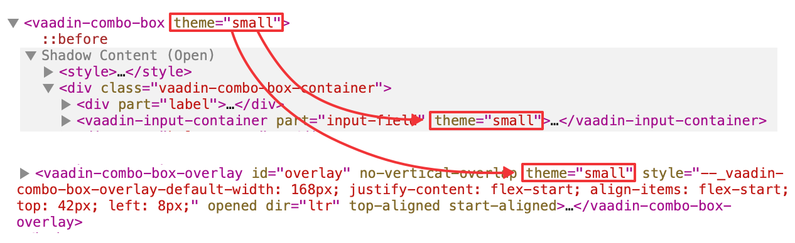

= Styling Components
ifdef::web[]
endif::web[]

Write component-specific style sheets to customize their internal styling.

The easiest way to affect the styles of a component is to use the CSS custom properties available for each component.
If you need more control, such as styling different states of a component, you need to write component-specific style sheets and import them to the local style scope of each component.

include::{articles}/_figma-banner.adoc[opts=optional]

== Prerequisites

You should be familiar with <<style-scopes#,Style Scopes>>, <<css-custom-properties#,CSS Custom Properties>>, and <<{articles}/styling/custom-theme/creating-custom-theme#, Custom Theme>> before you can style Vaadin components effectively.

Vaadin components use the https://github.com/vaadin/vaadin-themable-mixin/[`ThemableMixin`] utility, which allows developers to add custom style sheets to the component's local scope.
Your custom components can also use the same mixin.
This documentation applies only to such components.

== Example

As an example, customize the styles of the Text Field component.

.`frontend/themes/mytheme/components/vaadin-text-field.css`
[source,css]
----
:host {
  padding: 0;
}

[part="input-field"] {
  box-shadow: inset 0 0 0 1px var(--lumo-contrast-30pct);
  background-color: var(--lumo-base-color);
}

[part="input-field"]:hover {
  box-shadow: inset 0 0 0 1px var(--lumo-contrast-50pct);
}

:host([invalid]) [part="input-field"] {
  box-shadow: inset 0 0 0 1px var(--lumo-error-color);
}

:host([focused]) [part="input-field"] {
  box-shadow: 0 0 0 2px var(--lumo-primary-color-50pct);
}
----

You might need to use more specific selectors to override the current theme's styles.
Use the browser inspector to identify the applied styles for the element that you wish to customize.

See <<{articles}/styling/custom-theme/creating-custom-theme#, Creating a Custom Theme>> for instructions on how to import the above styles into the local style scope of the Text Field component.

== Custom Properties

The only global CSS that can affect styles inside a shadow DOM's local scope are properties that are inherited.
Properties can be inherited by default, such as `font-family`, `color`, and all custom properties, or explicitly by the custom element using the `inherit` property value.

You can adjust any component-specific custom properties in the global scope, making them affect all instances of the component.

.`frontend/themes/mytheme/styles.css`
[source,css]
----
html {
  --vaadin-field-default-width: 10em;
}
----

You can find component-specific custom properties from the component's documentation.

Most components do _not_ have any specific custom properties.
Instead, themes provide most of the custom properties that you can customize (see *Foundation*).

== Stylable Parts

Vaadin components define certain elements inside their shadow DOM as their stylable parts.
They form the public theming and styling API of the component, together with custom properties and state attributes.
These stylable elements are marked with the `part` attribute.

The internal parts of each component are listed in the component's HTML API documentation.
See the https://cdn.vaadin.com/vaadin-web-components/{moduleNpmVersion:vaadin-text-field}/#/elements/vaadin-text-field[Styling section in Text Field API docs]

.Stylable parts of `<vaadin-text-field>`

== Supported CSS Selectors

When writing style sheets for a component's local style scope (inside shadow DOM), a subset of CSS selectors is considered as part of a component's public styling API.
Other selectors (including the `.class` and `#id` selectors) may stop working with any release because they are considered as internal implementation details.

In general, the `[part]` attribute selector is the only one you should use to target elements inside a component.

*Don't rely on the element type* which a part applies to.
For example, given `<input type="text" part="value">`, you shouldn't rely on the information that the element is actually a native `<input>` element, for example by using a selector like `input[part="value"]`.
This is considered as an internal implementation detail.
The element type could change in the future while the part name stays the same, for example, to `
`.

+:host+::
The `:host` selector allows you to select the host of the shadow DOM from within the local style scope. For example, the `<vaadin-text-field>` element from within its local scope.
+
[source,css]
----
:host {
  /* For example, styles for <vaadin-text-field> element */
}
----
+
The `:host` selector also accepts a simple selector as an argument, scoping the selector to match the host only if the added selector matches it as well. It's useful, for example, for matching specific <<states>> and <<{articles}/styling/lumo/variants/component-variants#,Theme Variants>> of a component (using an attribute selector).
+
[source,css]
----
:host([state]) {
  /* For example, styles for <vaadin-text-field> element
     in a particular state (focused, invalid, etc) */
}

:host([theme~="small"]) {
  /* Styles for the small variant */
}

:host([has-value][theme~="borderless"]:hover) {
  /* Styles for when the component state is "has-value",
     the "borderless" variant is used, and when the user
     is hover over the component. */
}
----
+
ifdef::web[]
Read more about the https://developer.mozilla.org/en-US/docs/Web/CSS/:host[:host] and https://developer.mozilla.org/en-US/docs/Web/CSS/:host()[:host()] selectors on MDN.
endif::web[]

[part]::
The stylable elements (marked with a `part` attribute) should only be targeted using the `[part="..."]` attribute selector.
+
.`frontend/themes/mytheme/components/vaadin-text-field.css`
[source,css]
----
[part="input-field"] {
  /* Styles for <vaadin-text-field>'s input-field part */
}
----
+
Use `part~="..."` to match a part which might have multiple names. For example, the cells inside a `<vaadin-grid>` have multiple part names like `"cell"` and `"body-cell"`.
+
.The effective DOM of the `<vaadin-grid>` element

+
.`frontend/themes/mytheme/components/vaadin-grid.css`
[source,css]
----
[part~="cell"] {
  /* Styles that affect all grid cells, including header, body and footer cells */
}

[part~="body-cell"] {
  /* Styles that only affect all body cells */
}
----
+
You can use this kind of attribute selector in all cases, if you want to be safe.
It works for parts with only one name as well.
+
ifdef::web[]
Read more about https://developer.mozilla.org/en-US/docs/Web/CSS/Attribute_selectors[attribute selectors] on MDN.
endif::web[]

::before and ::after::
The `::before` and `::after` pseudo-element selectors can be used in combination with the `:host` and `[part]` selectors.
The built-in themes can also use the pseudo-elements, so be aware of potential collisions.
+
.`frontend/themes/mytheme/components/vaadin-text-field.css`
[source,css]
----
:host::before {
  ...
}

[part="input-field"]::after {
  content: "";
  ...
}
----
+
ifdef::web[]
Read more about the https://developer.mozilla.org/en-US/docs/Web/CSS/::before[::before] and https://developer.mozilla.org/en-US/docs/Web/CSS/::after[::after] selectors on MDN.
endif::web[]

::slotted()::
The `::slotted()` pseudo-element selector represents any element that has been placed into a slot inside an HTML template. It always expects a simple selector as an argument.
+
.`frontend/themes/mytheme/components/vaadin-app-layout.css`
[source,css]
----
[part="drawer"] ::slotted(*) {
  /* Styles for any element which is in
    the light DOM of <vaadin-app-layout>
    and has the slot="drawer" attribute */
}
----
+
ifdef::web[]
Read more about the https://developer.mozilla.org/en-US/docs/Web/CSS/::slotted[::slotted()] selector on MDN.
endif::web[]

=== Example

As a concrete example how these selectors work, use the Tabs, Tab, and Icon components to build the following composition:

The DOM hierarchy of the above component structure is the following:

[source,html]
----
<vaadin-tabs>
  <vaadin-tab>
    <vaadin-icon icon="lumo:user"></vaadin-icon>
    Tab one
  </vaadin-tab>
  <vaadin-tab>
    <vaadin-icon icon="lumo:cog"></vaadin-icon>
    Tab two
  </vaadin-tab>
  <vaadin-tab>
    <vaadin-icon icon="lumo:bell"></vaadin-icon>
    Tab three
  </vaadin-tab>
</vaadin-tabs>
----

The resulting effective DOM, when the components are rendered, including shadow DOM, is the following:

Elements in the global style scope are outlined in blue.
The local style scope of the `<vaadin-tabs>` element is outlined in orange, and the local style scope of the first `<vaadin-tab>` element (not expanded) is outlined in green.

To select the `<vaadin-tabs>` element you could, for example, use the following selectors in the global style scope:

.`frontend/themes/mytheme/styles.css`
[source,css]
----
/* All tabs containers */
vaadin-tabs {
  ...
}

/* Only the horizontal tabs containers */
vaadin-tabs[orientation="horizontal"] {
  ...
}
----

To select the same element from its local style scope you could use the following selectors:

.`frontend/themes/mytheme/components/vaadin-tabs.css`
[source,css]
----
/* All tabs containers */
:host {
  ...
}

/* Only the horizontal tabs containers */
:host([orientation="horizontal"]) {

}
----

To select all or some `<vaadin-tab>` elements you could use the following selectors in the global style scope:

.`frontend/themes/mytheme/styles.css`
[source,css]
----
/* All tabs */
vaadin-tab {
  ...
}

/* Only the selected tab */
vaadin-tabs[selected] {
  ...
}
----

To select the same elements from the local style scope of the `<vaadin-tabs>` element, you could use the following selectors:

.`frontend/themes/mytheme/components/vaadin-tabs.css`
[source,css]
----
/* All tabs */
[part="tabs"] ::slotted(vaadin-tab) {
  ...
}

/* Only the selected tab */
[part="tabs"] ::slotted(vaadin-tab[selected]) {
  ...
}
----

You could also select the same `<vaadin-tab>` elements their local style scope using the following selectors:

.`frontend/themes/mytheme/components/vaadin-tab.css`
[source,css]
----
/* All tabs */
:host {
  ...
}

/* Only the selected tab */
:host([selected]) {
  ...
}
----

To select the `<vaadin-icon>` elements you could, for example, use the following selectors in the global style scope:

.`frontend/themes/mytheme/styles.css`
[source,css]
----
vaadin-tabs vaadin-icon {
  ...
}

vaadin-tab > vaadin-icon {
  ...
}
----

You could also select the same icon elements from the local style scope of `<vaadin-tab>`:

.`frontend/themes/mytheme/components/vaadin-tab.css`
[source,css]
----
::slotted(vaadin-icon) {
  ...
}
----

But you can't select the same icon elements from the local style scope of `<vaadin-tabs>` because the `::slotted()` selector only allows you to select the direct children of the host element. The following selectors won't work:

.`frontend/themes/mytheme/components/vaadin-tabs.css`
[source,css]
----
/* Doesn't select anything */
[part="tabs"] ::slotted(vaadin-tab vaadin-icon) {
  ...
}

/* Doesn't select anything */
[part="tabs"] ::slotted(vaadin-tab) vaadin-icon {
  ...
}
----

If the DOM hierarchy would contain more deeply nested elements, for example another element inside the `<vaadin-icon>` or `` elements, those could only be selected from the global style scope.

== States

Some components expose their internal state as top-level attributes for styling purposes.

For example, you can style the Text Field component when it's invalid, using the `+[invalid]+` state attribute selector.

.`frontend/themes/mytheme/components/vaadin-text-field.css`
[source,css]
----
:host([invalid]) [part="input-field"] {
  box-shadow: inset 0 0 0 1px var(--lumo-error-color);
}
----

The state attributes for each component are listed in the component's HTML API documentation.
See the https://cdn.vaadin.com/vaadin-web-components/{moduleNpmVersion:vaadin-text-field}/#/elements/vaadin-text-field[Styling section in Text Field API docs]

In addition to the `[state]` attributes, standard CSS pseudo-classes (`:hover`, `:active`, etc.) can be used for both the component host and stylable parts.

.`frontend/themes/mytheme/components/vaadin-text-field.css`
[source,css]
----
[part="input-field"]:hover {
  box-shadow: inset 0 0 0 1px var(--lumo-contrast-50pct);
}
----

Like the host element, named internal parts can also expose state attributes for themselves, which can be used for styling.
These are also listed in the element's API documentation.

For example, you can target a selected date in a `<vaadin-date-picker>`:

.`frontend/themes/mytheme/components/vaadin-month-calendar.css`
[source,css]
----
[part~="date"][selected] {
 /* Styles for a selected date */
}
----

== Sub-Components

Components can contain other components inside their shadow DOM.
This creates a hierarchy of style scopes.

Theme variants (the `theme` attribute values) are propagated from the parent component to all its sub-components.
They allow you to scope sub-component styles per-instance.

Theme variant propagation isn't limited to the built-in variants (theme attribute values).
Your <<{articles}/styling/custom-theme/custom-component-variants#,custom theme variants>> propagate in the same way.

====
++++

  <b>Hierarchy of Vaadin components and sub-components</b> (Click to expand)

++++

The following components allow you to style their stylable parts in their local style scope.
Technically they extend `ThemableMixin`.

Nested items are sub-components, meaning the `theme` attribute is propagated to them from their parent component.
The overlay components are rendered directly under the `<body>` element and aren't nested inside their parent component in the resulting DOM.

Styles are inherited when components are extended.

*Accordion*

* `<vaadin-accordion>`
** `<vaadin-accordion-panel>` (extends `<vaadin-details>`)

*App Layout*

* `<vaadin-app-layout>`
* `<vaadin-drawer-toggle>` (extends `<vaadin-button>`)

*Button*

* `<vaadin-button>`

*Checkbox*

* `<vaadin-checkbox>`
* `<vaadin-checkbox-group>`

*Combo Box*

* `<vaadin-combo-box>` (and `<vaadin-combo-box-light>`)
** `<vaadin-input-container>` (not in `<vaadin-combo-box-light>`)
** `<vaadin-combo-box-overlay>` (extends `<vaadin-overlay>`)
*** `<vaadin-combo-box-item>`

*Confirm Dialog*

* `<vaadin-confirm-dialog>`
** `<vaadin-dialog>`

*Context Menu*

* `<vaadin-context-menu>`
** `<vaadin-context-menu-overlay>` (extends `<vaadin-overlay>`)
*** `<vaadin-context-menu-list-box>` (extends `<vaadin-list-box>`)
**** `<vaadin-context-menu-item>` (extends `<vaadin-item>`)

*CRUD*

* `<vaadin-crud>`
** `<vaadin-crud-grid>` (extends `<vaadin-grid>`)
** `<vaadin-dialog-layout>`
*** `<vaadin-dialog>`

*Custom Field*

* `<vaadin-custom-field>`

*Date Picker*

* `<vaadin-date-picker>` (and `<vaadin-date-picker-light>`)
** `<vaadin-input-container>` (not in `<vaadin-date-picker-light>`)
** `<vaadin-date-picker-overlay>` (extends `<vaadin-overlay>`)
*** `<vaadin-date-picker-overlay-content>`
**** `<vaadin-month-calendar>`

*Date-Time Picker*

* `<vaadin-date-time-picker>`
** `<vaadin-date-time-picker-date-picker>`
** `<vaadin-date-time-picker-time-picker>`

*Details*

* `<vaadin-details>`

*Dialog*

* `<vaadin-dialog>`
** `<vaadin-dialog-overlay>` (extends `<vaadin-overlay>`)

*Form Layout*

* `<vaadin-form-layout>`
* `<vaadin-form-item>`

*Grid*

* `<vaadin-grid>`
* `<vaadin-grid-sorter>`
* `<vaadin-grid-tree-toggle>`

*Grid Pro*

* `<vaadin-grid-pro>`
* `<vaadin-grid-pro-edit-checkbox>` (extends `<vaadin-checkbox>`)
* `<vaadin-grid-pro-edit-select>` (extends `<vaadin-select>`)
* `<vaadin-grid-pro-edit-text-field>` (extends `<vaadin-text-field>`)

*Item*

* `<vaadin-item>`

*List Box*

* `<vaadin-list-box>`

*Login*

* `<vaadin-login-overlay>`
** `<vaadin-login-overlay-wrapper>` (extends `<vaadin-overlay>`)
* `<vaadin-login-form>`
** `<vaadin-login-form-wrapper>`

*Menu Bar*

* `<vaadin-menu-bar>`
** `<vaadin-menu-bar-button>`
** `<vaadin-menu-bar-submenu>` (extends `<vaadin-context-menu>`)

*Notification*

* `<vaadin-notification>`
** `<vaadin-notification-card>`

*Ordered Layout*

* `<vaadin-horizontal-layout>`
* `<vaadin-vertical-layout>`

*Progress Bar*

* `<vaadin-progress-bar>`

*Radio Button*

* `<vaadin-radio-button>`
* `<vaadin-radio-group>`

*Rich Text Editor*

* `<vaadin-rich-text-editor>`

*Select*

* `<vaadin-select>`
** `<vaadin-input-container>`
** `<vaadin-select-overlay>` (extends `<vaadin-overlay>`)
** `<vaadin-select-value-button>` (extends `<vaadin-button>`)

*Split Layout*

* `<vaadin-split-layout>`

*Tabs*

* `<vaadin-tabs>`
** `<vaadin-tab>`

*Text Field*

* `<vaadin-email-field>` (extends `<vaadin-text-field>`)
* `<vaadin-integer-field>`
* `<vaadin-number-field>`
* `<vaadin-password-field>` (extends `<vaadin-text-field>`)
* `<vaadin-text-area>`
* `<vaadin-text-field>`

*Time Picker*

* `<vaadin-time-picker>`
** `<vaadin-input-container>`
** `<vaadin-time-picker-overlay>` (extends `<vaadin-combo-box-overlay>`)
*** `<vaadin-time-picker-item>` (extends `<vaadin-combo-box-item>`)

*Upload*

* `<vaadin-upload>`
* `<vaadin-upload-file>`

++++

++++

====

.Using the "small" theme variant on Combo Box
====
[source,html]
----
<vaadin-combo-box theme="small"></vaadin-combo-box>
----

.The theme attribute is propagated to sub-components of Combo Box

====

== Overlays

Components such as Dialog, Notification, Combo Box, Date Picker, Time Picker, Select, Menu Bar and Context Menu internally use the Overlay component (`<vaadin-overlay>`).

The Overlay component allows the main components to render content on top of all other components in the application.
It avoids any potential clipping stacking context issues where the overlay would be partially or completely hidden depending on where it's placed in the component hierarchy.
One example of a such situation are Grid cells, which create a clipping stacking context.

All components that have an overlay sub-component have their own extension of the base Overlay component, for example “Dialog Overlay” (`<vaadin-dialog-overlay>`) and “Date Picker Overlay” (`<vaadin-date-picker-overlay>`).
As an overlay is considered to be a sub-component of the main component, <<{articles}/styling/lumo/variants/component-variants#, sub-component variants>> apply to them as well.

See <<sub-components>> for the component hierarchy reference.

Sometimes the parent component can be completely hidden, as in the dialog component for example, whereas sometimes both the parent component and its overlay component can contain content, as for example in the date picker component.

=== Stylable Parts of Overlay

The `<vaadin-overlay>` component, including and all components extending it, contains the following stylable parts:

`overlay`:: The visual container of the overlay. It's typically also a scrolling container so you should avoid setting padding to it.
`content`:: The content area inside the `overlay`. You can apply padding to this part.
`backdrop`:: The optional modality curtain that covers the whole viewport and is visually behind the `overlay` part.

==== Example

Changing the background color and padding of the Dialog overlay component.

.`frontend/themes/mytheme/components/vaadin-dialog-overlay.css`
[source,css]
----
[part="overlay"] {
  background-color: var(--lumo-contrast-10pct);
}

[part="content"] {
  padding: 0;
}
----

== Input Container

Components such as Combo Box, Date Picker, Select, Text Field and Time Picker internally use the Input Container component (`<vaadin-input-container>`).
The customizations done for the Input Container component end up affecting other components as well, which internally use Input Container.

An input container provides a default slot for an HTML element that contains a value, as well as `prefix` and `suffix` named slots.
Depending on the main component, an element to display value is either `<input>` or `<textarea>`, except for Select which provides its own component.

In the same way as <<overlays>>, an Input Container is considered to be a sub-component of the main component.
<<{articles}/styling/lumo/variants/component-variants#, Sub-component variants>> apply to them as well.
By default it supports `align-left`, `align-center` and `align-right` variants.

See <<sub-components>> for the component hierarchy reference.

// == Component Icons
//
// TODO

== Scoping Component Styles

A style sheet imported into a component's local scope (see <<style-scopes#,Style Scopes>>) affects all the instances of the component.
But what if you only want to target a single instance of a component with custom styles?

Styles can be scoped to specific component instances in two ways:

1. *Expose new custom properties*
  This is the recommended first option for simple situations.
  If you end up exposing more than a handful of properties, you should consider the second option.
2. *Use scoping selectors*
  This approach is used by the built-in variations in Vaadin themes (Lumo and Material), which are scoped using the `theme` attribute.
  The downside of this approach is that you end up adding the selectors and properties to all instances, even though only some instances need those styles (they won't apply unless the scoping selector is used on the host element).

.Expose new custom properties
====

.`frontend/themes/mytheme/components/vaadin-text-field.css`
[source,css]
----
[part="input-field"] {
  background-color: var(--input-field-background-color, #fff);
}
----

.`frontend/themes/mytheme/styles.css`
[source,css]
----
/* Use the new custom property */
.some-part-of-my-app vaadin-text-field {
  --input-field-background-color: #eee;
}
----
====

.Use scoping selectors
====

.`frontend/themes/mytheme/components/vaadin-text-field.css`
[source,css]
----
:host(.special-field) [part="input-field"] {
  background-color: #000;
  color: #fff;
  border: 2px solid #fff;
  border-radius: 9px;
}
----

[source,html]
----
<!-- Use the new scoping selector anywhere in your application -->
<vaadin-text-field class="special-field"></vaadin-text-field>
----
====

You can also use the `theme` attribute (see <<{articles}/styling/custom-theme/custom-component-variants#,custom component variants>>) as a scoping selector for your style overrides, as shown in the example that follows.
The `theme` attribute has the benefit of propagating through the <<sub-components,sub-components>> (other attributes don't propagate).

.Scoping using the theme attribute
====

.`frontend/themes/mytheme/components/vaadin-text-field.css`
[source,css]
----
:host([theme~="special-field"]) [part="input-field"] {
  background-color: #000;
  color: #fff;
  border: 2px solid #fff;
  border-radius: 9px;
}
----

[source,html]
----
<!-- Apply the theme attribute to any text-field in your application -->
<vaadin-text-field theme="special-field"></vaadin-text-field>
----
====

[discussion-id]`DD654FA4-F61F-435D-9206-0FB61651F581`
