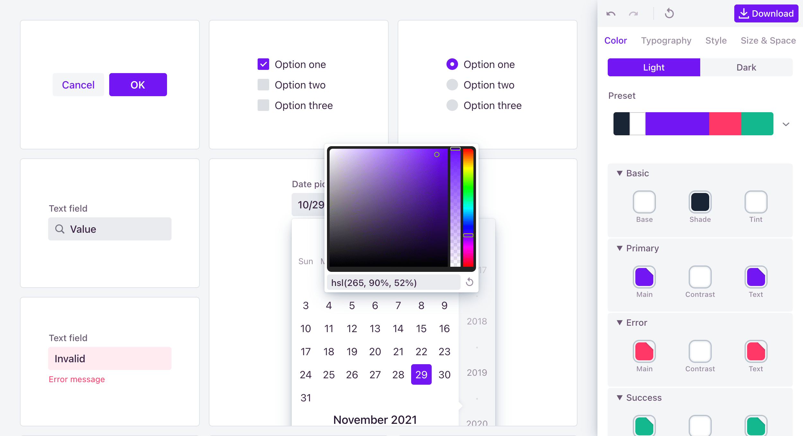

= Theme Editor

[.fullbleed]

https://demo.vaadin.com/lumo-editor[Open Theme Editor^, role="button primary water"]

.Designed for an older version of Vaadin
[NOTE]
The theme editor was designed for Vaadin 10, and hasn't yet been updated to support later versions out of the box.
The resulting CSS is still usable as-is in all versions.

== Where to Put the CSS

Instead of HTML imports and `<custom-style>`, which were used in earlier Vaadin versions, you should place the CSS in your <<{articles}/styling/custom-theme/creating-custom-theme#document-root-style-sheet, custom theme’s document root style sheet>>. For example, [filename]`frontend/themes/my-theme/document.css`.

The CSS inside the `"button-style"` and `"text-field-style"` `<dom-module>` elements (in the editor's output) should be placed in the corresponding <<{articles}/styling/custom-theme/creating-custom-theme#vaadin-component-styles, component style sheets>> in your custom theme.
For example, [filename]`frontend/themes/my-theme/components/vaadin-button.css` and [filename]`frontend/themes/my-theme/components/vaadin-text-field.css`.

== Feedback

The theme editor isn't an officially supported tool, but you can still let us know if you have any issues with it or wish us to develop it further.

https://discord.gg/MYFq5RTbBn[Chat on Discord^, role="button secondary water small"]

++++

++++

[discussion-id]`A98BC90E-BA7F-4802-94DA-067404813FA4`
