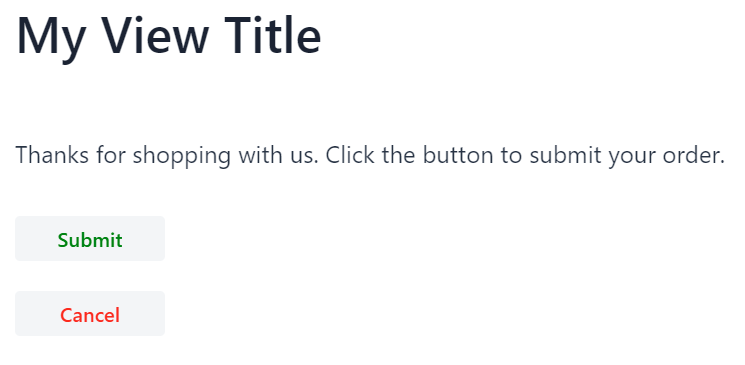
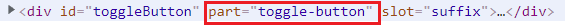
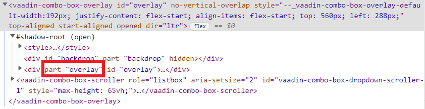

= Getting Started with Styling Vaadin Apps and Components

This guide covers the basics of styling Vaadin apps and components.
It provides an overview of several styling features and how to use them.
The topics mentioned here are covered in more detail elsewhere in the documentation.

While it is possible to style some parts of a Vaadin application using the Java API, this approach tends to be rather limited for mid- to large-sized applications.
So, it is recommended to do custom styling of a Vaadin application by adding CSS inside standard style sheets.
This guide focuses only on the recommended style-sheets approach.

The following topics are covered in this guide:

. <<styling.get-started.lumo-theme, Lumo theme and its variants>>, including its dark-mode variant
. <<styling.get-started.declaring-custom-theme, Declaring a custom theme on top of the Lumo theme>>
. <<styling.get-started.location-to-add-css, Where to place the CSS files of a custom theme>>
. <<styling.get-started.overriding-lumo, Styling by overriding the default Lumo values>>
. <<styling.get-started.selective-styling-light-dom, Selectively styling views and components>>
. <<styling.get-started.shadow-dom-styling, Styling elements in the shadow DOM>>
. <<styling.get-started.shadow-dom-styling-selectively, Selectively styling elements in the shadow DOM>>
. <<styling.get-started.sub-component-styling, Selectively styling sub-components of a Vaadin component>> (for example, the overlay of a DatePicker or a ComboBox)

[[styling.get-started.lumo-theme]]
== Lumo Theme and Variants

The default look and feel of <<{articles}/components#, Vaadin components>> is based on a built-in theme called Lumo.
This theme is essentially a bunch of CSS custom properties (such as colors, typography, and sizes) that each has a CSS variable assigned to it.

Lumo theme is available in a light and a dark variant.
The theme also has two sizing flavors: regular and compact.
You can use these variants to customize the look and feel of your application.

* To enable the dark mode variant, you need to use the `@Theme` annotation, which can be added to a class that implements `AppShellConfigurator`.
In a Spring Boot application, you could have an application configuration class that implements `AppShellConfigurator` and adds the `@Theme("dark")` annotation to it.
* To enable the compact mode, you need to add `@JsModule("@vaadin/vaadin-lumo-styles/presets/compact.js")` annotation anywhere in your application.

The following code snippet shows how to enable both the dark and compact modes:

[source,java]
----
@Theme(variant = Lumo.DARK) // <1>
@JsModule("@vaadin/vaadin-lumo-styles/presets/compact.js") // <2>
@SpringBootApplication
public class Application extends SpringBootServletInitializer
     implements AppShellConfigurator { // <3>

  public static void main(String[] args) {
        SpringApplication.run(Application.class, args);
    }

}
----
<1> The `@Theme` annotation specifies the variant of the Lumo theme to use.
By default, the Lumo theme is used in the light variant.
<2> Adding this `@JsModule` annotation enables the compact mode.
<3> The `@Theme` annotation can only be added once in the application on top of a class that implements `AppShellConfigurator`.

For more information and advanced use cases, see the <<{articles}/styling/lumo/variants#, Lumo theme variants>> guide.

[[styling.get-started.declaring-custom-theme]]
== Declaring a Custom Theme

A custom theme is the easiest way to provide a custom look and feel for your entire application.
The CSS in a custom theme is always applied on top of the default *Lumo* theme, or one of its variants.

To start, we need to declare the name of the custom theme.
This name will be used to identify the location of custom theme's CSS files.

The easiest way to declare the name of the custom theme is to add the `@Theme` annotation on a class that implements `AppShellConfigurator`.
For example, in a Spring Boot application, you can declare a custom theme called `my-theme` by adding the following `@Theme` annotation to a class that implements `AppShellConfigurator`:

.`Application.java`
[source, java]
----
@Theme(value = "my-theme") // <1>
@SpringBootApplication
public class Application extends SpringBootServletInitializer implements AppShellConfigurator { // <2>
  public static void main(String[] args) {
        SpringApplication.run(Application.class, args);
    }
}
----
<1> The `@Theme` annotation is used to declare the name of the custom theme (in this case, the "my-theme" custom theme).
This custom theme will be applied on top of the default Lumo theme.
<2> The `@Theme` annotation can only be added once in the application on top of a class that implements `AppShellConfigurator`.

By default, projects downloaded from https://start.vaadin.com/[start.vaadin.com] come with the `@Theme` annotation added to the `Application` class.

Note that you can also declare a custom theme on top of Lumo's dark and compact variants.
To declare it on top of the dark variant, you would use the `@Theme(value = "my-theme", variant = Lumo.DARK)` annotation.
To declare it on top of the compact variant, you would add the `@JsModule("@vaadin/vaadin-lumo-styles/presets/compact.js")` annotation.

See the <<{articles}/styling/theme-annotation#, @Theme annotation>> and <<{articles}/styling/custom-theme/creating-custom-theme#, Creating a Custom Theme>> guides for more information on declaring a custom theme.

[[styling.get-started.location-to-add-css]]
== Where to Place Your CSS

The CSS files of a custom theme should be placed inside a specific folder located under the `frontend/themes` of your project.
This directory has something like the following minimal structure:

----
frontend
└── themes              <1>
    └── my-theme        <2>
        ├── components/ <3>
        └── styles.css  <4>
----
<1> The [filename]#themes# folder can contain multiple custom themes (but only one can be applied to the application at a time).
<2> Each theme is in its own sub-folder.
The name of this folder is provided as a parameter to the [classname]`@Theme` annotation to apply the theme to the application.
<3> The [filename]#components# sub-folder is for <<{articles}/styling/custom-theme/styling-components#, component style sheets>> that target the (local CSS) internals of Vaadin components.
<4> [filename]#styles.css# is the theme's master style sheet that is automatically loaded when the theme is applied.

Note that in the above directory structure, the `my-theme` sub-folder might be named differently in your case.
This folder should have the same name as the one used to declare the custom theme using the `@Theme` annotation.

Custom CSS should be placed in one of the following locations:

. Inside the `styles.css` file
. As a separate CSS file, which is imported from within `styles.css`
. Under the `components/` directory in order to style the (local CSS) internals of Vaadin components (such as a Vaadin Button)

The first and simplest option is to place the custom CSS directly inside the `styles.css` file.
For example, adding the following snippet to `styles.css` would change the font family and size of the whole Vaadin application.

.`styles.css`
[source, css]
----
* {
    font-family: "Lucida Console", "Courier New", monospace;
    font-size: 1rem;
}
----

However, as the number of custom stylings increases, it becomes convenient to organize the styles into separate `.css` files.
In order to do this, simply create a new CSS file and import that from within `styles.css`.

For example, if we create a new CSS file called `main-view.css` at `frontend/themes/my-theme/views/main-view.css`, then we would import this file by adding the following line to `styles.css`:

.`styles.css`
[source, css]
----
@import url('./views/main-view.css');
----

Finally, the `components/` directory is used only to style the (local CSS) internals of Vaadin components.
However, there are special rules for naming files in this directory, which are explained, with examples, in a <<styling.get-started.shadow-dom-styling, separate section>> below.

[[styling.get-started.overriding-lumo]]
== Styling by Overriding Lumo Defaults

As noted above, the default styling of Vaadin components is based on a built-in theme, called Lumo.
One easy way to customize the look and feel of your application involves overriding the default values of this Lumo theme.

include::_shared.adoc[]

For more information about the Lumo theme and how to use it for styling, see the <<{articles}/styling/lumo#, Lumo theme>> section.

[[styling.get-started.selective-styling-light-dom]]
== How to Selectively Style Views and Components

So far, we have been discussing ways to style all components belonging to a certain kind in the same way.
For example, if we want to set the width of all Button components within our application, we could add something like the following to the `styles.css` file:

.`styles.css`
[source, css]
----
vaadin-button {
    width: 140px;
}
----

However, we often want to style the same kind of component differently, depending on its function within our application.
For example, we might want to style the Button component differently in our application, depending on whether it is a “Signup” button or a “Delete account!” button.

The easiest way to style views and components selectively is by providing them with a CSS class name from the Java API.
All Vaadin components and views have an `addClassNames()` method that can be used for this purpose.

To illustrate, the following view makes use of the `addClassNames()` method to assign a CSS class name to the view itself, as well as to the components that it includes.

[source, java]
----
import com.vaadin.flow.component.button.Button;
import com.vaadin.flow.component.html.H1;
import com.vaadin.flow.component.html.Paragraph;
import com.vaadin.flow.component.orderedlayout.VerticalLayout;
import com.vaadin.flow.router.Route;

@Route("")
public class MyView extends VerticalLayout {

    public MyView() {
        addClassNames("my-view"); // <1>

        H1 heading = new H1("My View Title");
        Paragraph text = new Paragraph("Thanks for shopping with us. Click the button to submit your order.");

        Button submitButton = new Button("Submit");
        submitButton.addClassNames("submit-button", "wide-button"); // <2>

        Button cancelButton = new Button("Cancel");
        cancelButton.addClassNames("cancel-button", "wide-button"); // <3>

        add(heading, text, submitButton, cancelButton);

    }
}
----
<1> The `addClassNames()` method is used to assign a CSS class name to the whole view, which is a `VerticalLayout` in this case.
<2> Use the `addClassNames()` method on the `submitButton` component to assign CSS class names to the "Submit" button.
<3> Use the `addClassNames()` method on the `cancelButton` component to assign CSS class names to the "Cancel" button.

These CSS class names can then be used to selectively style this view and its components.
For example, adding the following to `styles.css` demonstrates how selective styling can be achieved.

.`styles.css`
[source, css]
----
.my-view  {
    padding: 1em;
}

.my-view h1 {
    /*Only applies to the h1 headers inside my-view*/
    margin-top: 0;
}

p {
    /*Applies to all p elements regardless of whether they are
     located inside my-view*/
    font-size: 1.2em;
}

.submit-button {
    color: green;
}

.cancel-button {
    color: red;
}

.wide-button {
    width: 120px;
}
----

Now after the selective styling is applied, `MyView` will look as follows:

[[styling.get-started.shadow-dom-styling]]
== Styling the Internals of Vaadin Components Using the /components Directory

Customizing styling using the two aforementioned options (namely by placing styles inside `styles.css`, or inside a separate file imported from within `styles.css`) should work for views and layouts created within the project.
However, these two options are not guaranteed to work if one aims to style the internals of a Vaadin component.

Custom styling of the internals of Vaadin components, such as the `Grid` or ComboBox components, needs to be placed under the `frontend/themes/my-theme/components` directory. (Note again that the `my-theme` folder name might be different in your case.)

For example, let's assume we want to increase the size of the toggle icon that opens the dropdown menu of a ComboBox.

If we inspect this toggle in Chrome (right-click on the toggle and select the **Inspect** option), we will see that it has an attribute called `part` whose value is equal to `toggle-button`.

To style this part, we need to create a file called `vaadin-combo-box.css` and place it under the `frontend/themes/my-theme/components/` directory.
In this file, we can do something like the following to increase the size of the ComboBox toggle.

.`vaadin-combo-box.css`
[source, css]
----
[part="toggle-button"] {
    font-size: 2em;
}
----

Note that the files placed under the `/components` directory have to exactly match the Vaadin component names as they appear in the DOM.
For example, the ComboBox component appears in the DOM as `vaadin-combo-box`.
Accordingly, the styling file of the ComboBox has to be named exactly `vaadin-combo-box.css`.

[[styling.get-started.shadow-dom-styling-selectively]]
== Selectively Styling the Internals of a Vaadin Component

We just saw how to style the internals of a Vaadin component by using the `part` property and placing the CSS inside a specific file placed under the `frontend/themes/my-theme/components/` directory.
Specifically, we saw how to style the ComboBox toggle using the `[part="toggle-button"]` selector and placing the CSS in a file called `vaadin-combo-box.css` that resides under the `frontend/themes/my-theme/components/` directory.

However, this approach will style all toggle elements of all the ComboBox components in our application in the same way.
What if we want our styling to apply to only some toggle elements but not to others?

Here we can follow the same approach as we did above to selectively style views and components.
That is, we can provide the component with a CSS class name from the Java API using the `addClassNames()` method.
Then we can use this CSS class name to selectively style the internal part of the component.

For example, suppose that our application has the following two ComboBox components:

[source, java]
----
ComboBox<String> firstCombo = new ComboBox<>();
comboBox.setItems("Earth", "Mars");

ComboBox<String> secondCombo = new ComboBox<>();
comboBox.setItems("Mercury", "Venus");
----

If we want to style the toggle part of these two components differently, we can do this by providing each ComboBox with a different CSS classname as follows:

[source, java]
----
firstCombo.addClassNames("first-combo");
secondCombo.addClassNames("second-combo");
----

Then, in `frontend/themes/my-theme/components/vaadin-combo-box.css`, we can selectively style the toggle element of the two components differently by doing something like:

.`vaadin-combo-box.css`
[source, css]
----
:host(.first-combo) [part="toggle-button"] {
    font-size: 2em;
}

:host(.second-combo) [part="toggle-button"] {
    font-size: 1em;
}
----

Notice that we have to use here the `:host()` shadow function because the `toggle-button` part is located inside the https://developer.mozilla.org/en-US/docs/Web/Web_Components/Using_shadow_DOM[shadow DOM] of the ComboBox.

[[styling.get-started.sub-component-styling]]
== How to Selectively Style a Sub-component of a Vaadin Component

There are cases in which we cannot use CSS classnames to do the selective styling.
Specifically, we cannot rely on CSS classnames when we want to style the sub-components of a Vaadin component.

What do we mean by a sub-component? Some Vaadin components create sub-components that exist in the DOM independently from the Vaadin component itself.
This is noticeably the case for the Vaadin components, such as the DatePicker, Dialog, and ComboBox, that open an overlay during user interaction.
For example, a ComboBox adds a `vaadin-combo-box-overlay` element in the DOM when the user clicks on the toggle button to see the list of the available options.
This `vaadin-combo-box-overlay` element exists in the DOM independently from the `vaadin-combo-box` element itself.

The fact that they exist in the DOM independently from their parent component means that a CSS classname that is given to the parent element is not propagated down to the sub-component.
For example, if we give a ComboBox a classname from the Java API, only the `vaadin-combo-box` element will get this classname in the DOM, not the `vaadin-combo-box-overlay` element.

Instead of classnames, we can rely on the `theme` attribute as a selector in order to selectively style a sub-component of a Vaadin component.
Unlike the classnames, the `theme` attribute has the benefit of propagating through to the sub-components.

We can provide a component with a theme attribute from the Java API using the `addThemeName()` method.

For example, like before suppose that our application has the following two ComboBox components:

[source, java]
----
ComboBox<String> firstCombo = new ComboBox<>();
firstCombo.setItems("Earth", "Mars");

ComboBox<String> secondCombo = new ComboBox<>();
secondCombo.setItems("Mercury", "Venus");
----

Suppose that we want to change the background color of the drop-down list of items that the user sees when they open the ComboBox.
This background color is controlled by the `background-color` property of the `overlay` part of the `vaadin-combo-box-overlay` element.
This `overlay` part in the DOM is highlighted in the following screenshot:

To selectively style the background of the overlay of the two ComboBox components, we can first give each one of them a theme name using the Java API as follows:

[source, java]
----
firstCombo.addThemeName("first-combo");
secondCombo.addThemeName("second-combo");
----

Then, we need to create a new file called `vaadin-combo-box-overlay.css` and place it under the `frontend/themes/my-theme/components` directory.
In this file, we can selectively style the overlay part of the `vaadin-combo-box-overlay` element of the two ComboBoxes by doing something like:

.`vaadin-combo-box-overlay.css`
[source, css]
----

:host([theme~="first-combo"]) [part="overlay"] {
    background-color: rosybrown;
}

:host([theme~="second-combo"]) [part="overlay"] {
    background-color: aquamarine;
}
----

Here again we are using the `:host()` shadow function because the overlay part is located inside the shadow DOM of the `vaadin-combo-box-overlay` element.

[.discussion-id]
1ED4F78A-5736-491F-8E91-D7F5A00A0885
