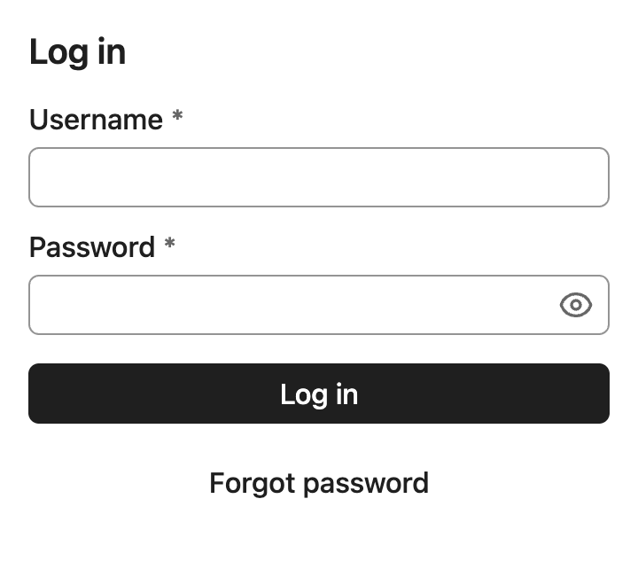
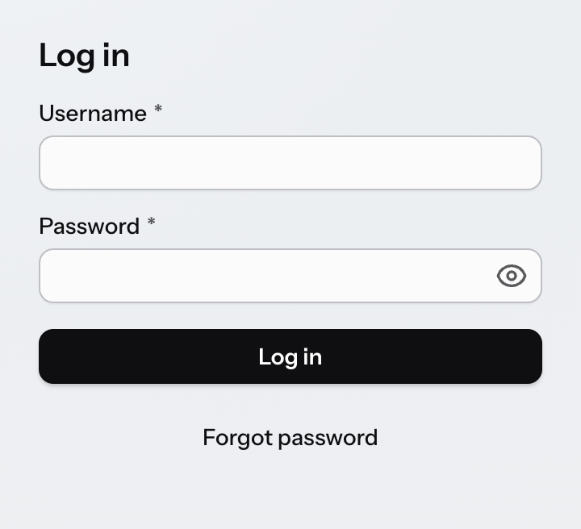
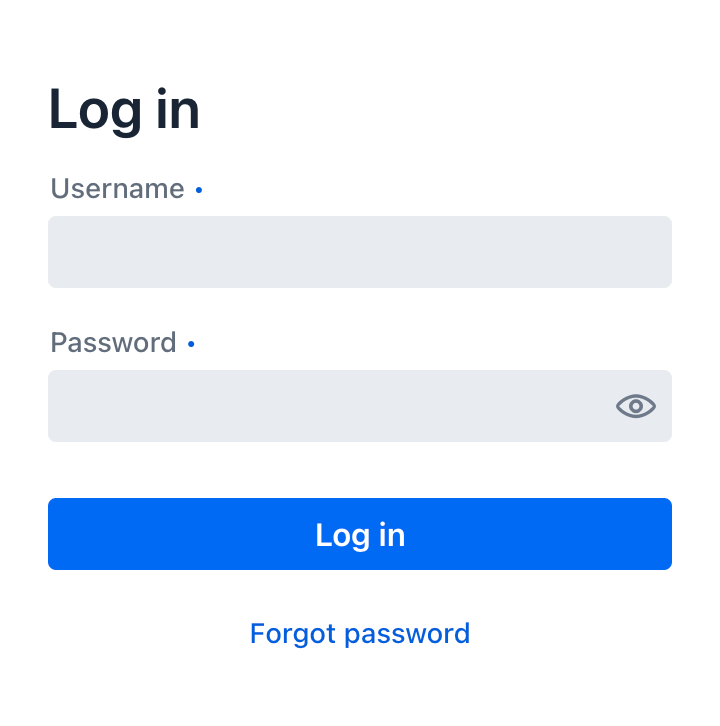

= Styling Overview

Vaadin applications are primarily styled with CSS in style sheets, just like any other web UI. You can also apply inline styles to elements, and use utility classes.

== Stylesheets

In most project configurations, <<{articles}/styling/stylesheets#, stylesheets>> are placed in the `src/main/resources/META-INF/resources` folder. In non-Spring projects packaged as WAR files they are placed in the `src/main/webapp` folder. In both cases they are loaded with the [annotationname]`@StyleSheet` annotation.

[annotationname]`@StyleSheet` annotations should primarily be applied to the main application class that implements the [interfacename]`AppShellConfigurator` interface. This ensures that the CSS in it is applied globally, up-front, when the application UI is loaded into the browser.

[source,java]
----
@StyleSheet("styles.css")
public class Application implements AppShellConfigurator {
 ...
}
----

You can split your CSS over multiple stylesheets, and load them either with separate [annotationname]`@StyleSheet` annotations, or load additional stylesheets using the CSS `@import` rule.

.src/main/resources/META-INF/resources/styles.css
[source,css]
----
@import "additional-styles.css";

/* your CSS goes here */
----

More details are provided in the <<{articles}/styling/stylesheets#, Stylesheets>> section.

.Vaadin 24 way of applying styles is deprecated but supported
[NOTE]
The Vaadin 24 way of loading styles through the [annotationname]`@Theme` annotation and a theme folder in `frontend/themes` has been deprecated in Vaadin 25, but is still supported through the `themeComponentStyles` <<{articles}/flow/configuration/feature-flags#,feature flag>>. Please see the link:/docs/v24/styling[Vaadin 24 Styling documentation] for details on this usage.

== Themes

By default, Vaadin components are rendered with their minimalistic built-in <<themes/base#, base styles>>, which are a good starting point if you want to customize the look and feel extensively. Vaadin also ships with two themes, <<themes/aura#, Aura>> and <<themes/lumo#, Lumo>>, that provide a more polished look and feel for Vaadin components.

[cols="^.^1, ^.^1, ^.^1"]
|===
|Base|Aura|Lumo

|

|

|
|===

Vaadin themes can be loaded with the [annotationname]`@StyleSheet` annotation. The [classname]`Aura` and [classname]`Lumo` Java classes provide constants for the stylesheet path that can be used with the [annotationname]`@StyleSheet` annotation.

Note that themes should be imported before any other styles in your application.

[source,java]
----
/* Aura theme loaded with @StyleSheet annotation */
@StyleSheet(Aura.STYLESHEET)
@StyleSheet("styles.css")
public class Application implements AppShellConfigurator {
 ...
}
----

Both themes provide a comprehensive set of style properties (CSS custom properties) that make them easily customizable without complex CSS selectors. These properties are listed on the <<themes/aura#, Aura>> and <<themes/lumo#, Lumo>> reference pages.

[source,css]
----
html {
  --lumo-primary-color: green;
  --lumo-font-family: Times;
}
----

You can choose to apply your own styling on top of either theme, or on top of the minimal “white label” base styles built into Vaadin components, depending on the look and feel you want to have in your UI.

== Component Style Properties

Vaadin components also provide their own component-specific style properties for customizing their styles. These properties are listed on the Styling sub-pages in the component documentation (see e.g. <<{articles}/components/text-field/styling#,Text Field>>), along with the most common CSS selectors you can use to target the parts and states of components with your own CSS.

Component style properties differ from theme style properties in that they are specific to a particular component type.

.Customizing Vaadin component style properties
[source,css]
----
html {
  --vaadin-button-background: lightgray;
}
----

== Applying CSS to Components

The most common selectors needed to style Vaadin components are listed on the _Styling_ sub-pages in the component documentation (see e.g. <<{articles}/components/text-field/styling#,Text Field>>), along with the style properties built into the components.

.Applying custom CSS to a component's state and part
[source,css]
----
vaadin-button[disabled]::part(label) {
  color: darkgray;
}
----

== Component Style Variants

Many Vaadin components also have style variants as built-in features. These can be found in the documentation for each component.

.Button component variants in Aura theme
image::_images/component-variants.png[width=50%]

== Recommended Approach

The recommended approach to styling Vaadin components is:

*  *Theme*: choose the <<{articles}/styling/themes#,theme>> that is the best match to your desired look and feel for components, or stick to the components’ base styles if neither theme is a good match;
*  *Variant*: check if the component provides a style variant that corresponds (at least partially) to what you’re after;
*  *Style Properties*: customize the component using <<{articles}/styling/styling-components#theme-style-properties,theme>> and/or <<{articles}/styling/styling-components#component-style-properties,component style properties>>;
*  *CSS style blocks*: <<{articles}/styling/styling-components#writing-css-for-vaadin-components,write your own CSS>> (using documented selectors) only once you can’t get further with the above approaches.

.Shadow DOM Styling Not Recommended
[NOTE]
In older versions of Vaadin, components were primarily styled by injecting CSS into their shadow DOM using the `themes/<theme-name>/components` folder or, in even older versions, the `themeFor` property of the [annotationname]`@CssImport` annotation. Although _still supported_, this approach is no longer recommended. All styling documentation, including the reference tables on components’ _Styling_ pages, is based on normal CSS applied to the document scope.

== Styling HTML Elements

<<{articles}/styling/utility-classes#, Utility classes>> can be used to apply styles to HTML elements (like `
` and ``), and (with some limitations) to Vaadin components. Vaadin supports Tailwind CSS, and the Lumo theme has its own set of Lumo Utility Classes.

[source,java]
----
var warningBox = new Div("Warning!");
warningBox.addClassNames("bg-orange-400 p-20px");
----

== Inline Styles

Inline CSS can also be applied to individual elements and components. These should be used sparingly to avoid hard-to-maintain spaghetti code, but can be useful e.g. for applying styles dynamically based on business logic.

[source,java]
----
warningBox.getStyle().setBackground("#ff8904");

saveButton.getStyle().set("--vaadin-button-background", "green");
----

== Topics

section_outline::[]

[discussion-id]`a8b31702-5795-473f-a23c-25d4e64f3ef3`
