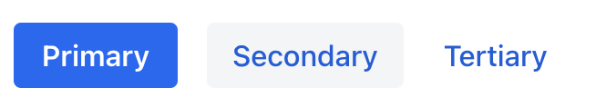
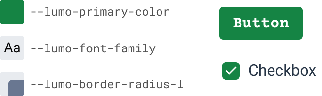
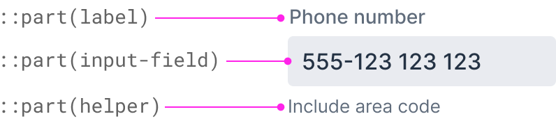
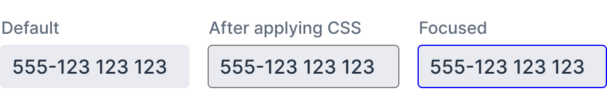
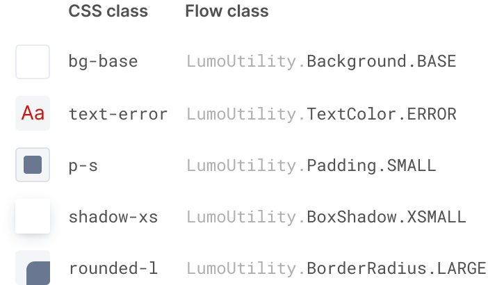

= Styling – Overview

This page contains a brief overview of the main aspects of styling Vaadin applications:

* How to customize the styling of Vaadin components;
* How to style other UI elements; and
* Where to put your CSS code.

The other pages in the Styling section provide further details on these methods and other related topics.

== Customizing Component Styles

The look and feel of Vaadin components is highly customizable in several ways:

=== Built-in Style Variants

Many Vaadin components come with built-in *style variants* that can be used to change the color, size, or other visual aspects of individual component instances through the `addThemeVariants` Java API.

[.fill.white]

[source,java]
----
Button btn = new Button("Save");
btn.addThemeVariants(ButtonVariant.LUMO_PRIMARY);
----

==== Further Reading

* <<../components#, Browse components>> to see their built-in style variants

=== Customizing Style Properties

The default styling of Vaadin components is based on *style properties* -- customizable CSS values -- in the default Lumo theme. They can be used to tweak colors, fonts, sizing, and other properties without writing custom CSS.

.A small sample of Lumo style properties and their use in Vaadin components
[.fill.white]
image::_images/lumo-properties.png[A small sample of Lumo style properties and their use in Vaadin components, 400]

Style properties can be customized by providing new values for them in a CSS stylesheet.

[source,css]
----
/* Global style values */
html {
  --lumo-primary-color: green;
  --lumo-font-family: "Roboto";
}

/* Scoped to a type of component */
vaadin-button {
  --lumo-font-family: "Courier";
}
----

.The effects of the above customizations
[.fill.white]

A style property value can have different scopes:

* *Global*, which affects the entire application. It’s applied to the `html` selector.
* *Component type* specific. It’s applied to the component’s root element selector
* *Component instances* – specific to one or more – to which a particular *CSS class name* has been applied (as shown below)

[source,java]
----
Button specialButton = new Button("I'm special");
specialButton.addClassName("special");
----

[source,css]
----
/* Scoped to instances with a particular CSS class name */
vaadin-button.special {
  --lumo-primary-color: cyan;
}
----

Style properties are recommended as the primary approach to both Vaadin component style customization and custom CSS. They make it easier to achieve a consistent look and feel across the application.

==== Further Reading

* <<lumo/lumo-style-properties#, List of Lumo style properties>>
* <<styling-components#styling-components-with-style-properties, Styling components through style properties>>

=== Applying CSS to Components

If you need to customize a component in ways that cannot be achieved with Lumo style properties, you can apply custom *CSS* to the component in a stylesheet.

Each component has a [guilabel]*Styling* documentation page that lists the CSS selectors to use for targeting the component, its parts, and its states.

.Some of the stylable parts of a Text Field component
[.fill.white]

CSS is applied to components in regular CSS stylesheets, typically in the application theme folder.

.`frontend/themes/my-theme/styles.css`
[source,css]
----
vaadin-text-field::part(input-field) {
  border: 1px solid gray;
}

vaadin-text-field[focused]::part(input-field) {
  border-color: blue;
}
----

.Effects of the above CSS
[.fill.white]

CSS can be scoped to specific component instances by applying *CSS class names* to them.

[source,java]
----
TextField specialTextField = new TextField("I'm special");
specialTextField.addClassName("special");
----

[source,css]
----
vaadin-text-field.special::part(input-field) {
  border-color: orange;
}
----

==== Further Reading

* <<styling-components#styling-components-with-css, Styling components with CSS>>
* <<../components#, Browse components to see their CSS selectors>>
* <<styling-components/styling-component-instances#, Applying CSS to specific component instances# with CSS class names>>

== Styling Other UI Elements

Although Vaadin application UIs are built primarily using Vaadin components, *native HTML elements*, like `` and `
`, are also often used for layout and custom UI structures. These can be styled with custom CSS, and with utility classes that bundle predefined styles as easy-to-use constants.

=== Applying CSS to HTML Elements

Custom CSS is applied to native HTML elements similarly to Vaadin components, by placing it in a stylesheet in the application theme folder. Styles can be scoped to individual instances of these elements by applying CSS class names to them using the `addClassNames` Java API.

[source,java]
----
Span warning = new Span("This is a warning");
warning.addClassName("warning");
----

.styles.css
[source,css]
----
span.warning {
  color: orange;
}
----

==== Further Reading

* <<../create-ui/standard-html#, Native HTML element classes in Flow>>
* <<styling-other-elements#, Applying CSS to native HTML elements>>

=== Applying Styles with Utility Classes

The *Lumo Utility Classes* are a set of predefined CSS classes (similar to Tailwind CSS) that can be used to apply styling to HTML elements without writing your own CSS.

.Small sample of Lumo Utility Classes
[.fill.white]

The `LumoUtility` collection in Flow provides constants for each utility class. They are applied using the same `addClassNames` API as is used for custom CSS class names.

[source,java]
----
Span errorMsg = new Span("Error");
errorMsg.addClassNames(
  LumoUtility.TextColor.ERROR,
  LumoUtility.Padding.SMALL,
  LumoUtility.Background.BASE,
  LumoUtility.BoxShadow.XSMALL,
  LumoUtility.BorderRadius.LARGE
);
----

.Effects of the above application of utility classes
[.fill.white]

.Lumo Utility Classes are for HTML elements, not for Vaadin components
[NOTE]
====
The Lumo utility classes are primarily designed to be used with native HTML elements, Vaadin layout components, and custom UI structures. Although some of them do work as expected on some Vaadin components, this is not their intended use. They can't be used to style the inner parts of components.
====

==== Further Reading

* <<lumo/utility-classes#, Lumo Utility Classes>>

== Where to Place Styles and How to Load Them

Style property customizations and custom CSS are both placed in CSS stylesheets, typically in the application's theme folder. The theme folder is specified using the `@Theme` annotation.

A master stylesheet, named `styles.css`, is automatically loaded. If you wish to split your CSS into multiple stylesheets, these can be added via CSS `@import` directives in the master stylesheet.

.Theme folder location and structure
[source]
----
frontend
└── themes
    └── my-theme
        ├── styles.css
        └── theme.json
----

[source,java]
----
@Theme("my-theme")
public class Application implements AppShellConfigurator {
  ...
}
----

Note that application projects generated with *Vaadin Start* have a theme folder applied by default.

.`@CssImport` is supported but not recommended.
[NOTE]
In older versions of Vaadin, stylesheets were loaded using `@CssImport` and `@Stylesheet` annotations, and in very old versions using the `@HtmlImport` annotation. While `@CssImport `and `@Stylesheet` still work, they are no longer recommended as the primary way to load styles into the UI.

=== Further Reading

* <<application-theme#, Application theme folder>>

== Topics

section_outline::[]
