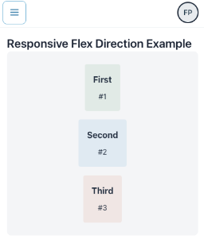
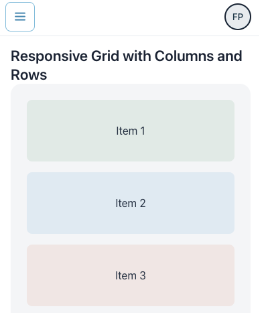

= Lumo Utility Classes: Responsive Breakpoints

Lumo includes a powerful set of responsive utility classes that allow you to apply specific styles based on the screen (viewport) size.
These classes use breakpoint CSS class name prefixes (`sm:`, `md:`, `lg:`, `xl:`, `2xl:`) to apply styles only when the screen width meets a certain minimum threshold.

You can apply these classes to any Vaadin Flow component using the `addClassNames()` method.
This enables you to build complex, adaptive interfaces declaratively and directly from your Java code.

[IMPORTANT]
.Exclusive Focus on Breakpoints
====
This document focuses specifically on the **responsive breakpoint prefixes** (e.g., `sm:`, `md:`) and their corresponding Java APIs within `LumoUtility.Breakpoint`.

Although the examples use various base utility classes (like `Display.FLEX` or `Padding.MEDIUM`) to provide context, they are not the main topic here.
For a complete reference of all available utility classes, see the main <<utility-classes.adoc#, Lumo Utility Classes>> documentation.
====

The default breakpoints are activated at the following minimum widths:

.Available Responsive Breakpoint Classes
|===
|Breakpoint |CSS class name prefixes |Minimum width |Equivalent screens |Equivalent in CSS

|Breakpoint.Small
|sm
|640px
|Mobile devices
|@media (min-width: 640px) {}

|Breakpoint.Medium
|md
|768px
|Tablets
|@media (min-width: 768px) {}

|Breakpoint.Large
|lg
|1024px
|Small laptops
|@media (min-width: 1024px) {}

|Breakpoint.XLarge
|xl
|1280px
|Large laptops
|@media (min-width: 1280px) {}

|Breakpoint.XXLarge
|2xl
|1536px
|Large desktops
|@media (min-width: 1536px) {}
|===

=== Responsive Utilities and Limitations

Currently, Lumo provides responsive breakpoint prefixes (e.g., `sm:`, `md:`) for a specific set of utility groups.
This allows you to apply styles that adapt to different screen sizes directly from Java.

The utility groups that support responsive breakpoints are:

1. *Align Items:* Controls alignment of flex items along the cross-axis. (e.g., `sm:items-start`, `lg:items-center`)
2. *Display:* Controls whether an element is shown, hidden, or changes display mode. (e.g., `sm:hidden`, `md:block`, `lg:flex`)
3. *Flex Direction:* Defines the direction of items in a flex container (`row` or `column`). (e.g., `sm:flex-col`, `lg:flex-row`)
4. *Font Size:* Adjusts the text size based on screen size for readability and hierarchy. (e.g., `sm:text-lg`, `lg:text-3xl`)
5. *Grid:* Controls the number of columns in a grid layout depending on screen width. (e.g., `sm:grid-cols-2`, `md:grid-cols-4`)
6. *Position:* Controls the position property (`static`, `sticky`, `absolute`, etc.) responsively. (e.g., `md:sticky`, `lg:fixed`)

[IMPORTANT]
====
**What about other utilities like Spacing, Gap, or Justify Content?**

Common utilities such as `Padding`, `Margin`, `Gap`, and `JustifyContent` **do not currently have responsive breakpoint variants** in the `LumoUtility` Java API.

To apply responsive styles for these properties, you should use custom CSS with media queries in your application's theme.
This approach gives you full control over the responsive behavior.
====

==== Example: Creating Responsive Padding with Custom CSS

Let's say you want a `Div` to have small padding on mobile devices and large padding on desktops.

1- **Apply a custom class name in Java:**

[.example]
--
[source,java]
----
Div responsiveCard = new Div();
responsiveCard.addClassName("responsive-padding-card");
// You can still apply non-responsive utilities
responsiveCard.addClassNames(LumoUtility.Background.CONTRAST_5, LumoUtility.BorderRadius.LARGE);
----
--

2- **Define the responsive styles in your theme's CSS file (`styles.css`):**

[.example]
--
[source,css]
----
/* styles.css */

.responsive-padding-card {
  /* Default style for mobile */
  padding: var(--lumo-space-s);
}

/* Apply larger padding on medium screens and up */
@media (min-width: 768px) {
  .responsive-padding-card {
    padding: var(--lumo-space-l);
  }
}
----
--

== Responsive Utility Examples

The following sections explore each of the 6 utility groups that currently offer responsive variants in the `LumoUtility` Java API.

Each section follows a similar structure to facilitate understanding:
a brief description of the utility, a basic usage example, a list of the available classes, and a complete, practical example demonstrating its application in a real-world scenario.

== Align Items

`LumoUtility.AlignItems` controls the alignment of items along the cross axis of a flexbox or the block axis of a grid.

`LumoUtility.AlignItems.Breakpoint` provides the same alignment options, but scoped to specific viewport sizes.

=== Basic Breakpoint Usage

[.example]
--
[source,java]
----
// Instantiate a container component
Div container = new Div();

// Apply different align-items at different breakpoints
container.addClassNames(
        LumoUtility.Display.FLEX,
        // align-items: start on small screens
        LumoUtility.AlignItems.Breakpoint.Small.START,
        // align-items: center on medium screens
        LumoUtility.AlignItems.Breakpoint.Medium.CENTER,
        // align-items: end on large screens
        LumoUtility.AlignItems.Breakpoint.Large.END
);
----
--

The available classes within `Small`, `Medium`, `Large`, `XLarge`, and `XXLarge` breakpoints are:

* `BASELINE` (e.g., `sm:items-baseline`, `md:items-baseline`) equivalent in CSS to `align-items: baseline`
* `CENTER` (e.g., `sm:items-center`, `md:items-center`) equivalent in CSS to `align-items: center`
* `END` (e.g., `sm:items-end`, `md:items-end`) equivalent in CSS to `align-items: flex-end`
* `START` (e.g., `sm:items-start`, `md:items-start`) equivalent in CSS to `align-items: flex-start`
* `STRETCH` (e.g., `sm:items-stretch`, `md:items-stretch`) equivalent in CSS to `align-items: stretch`

=== Complete Responsive Example

[.example]
--
[source,java]
----
import com.vaadin.flow.component.button.Button;
import com.vaadin.flow.component.html.Div;
import com.vaadin.flow.component.html.H3;
import com.vaadin.flow.theme.lumo.LumoUtility;

public class ResponsiveAlignItemsExample extends Div {

    public ResponsiveAlignItemsExample() {
        H3 title = new H3("Responsive Align Items Example");

        // Create a responsive flex container
        Div responsiveContainer = new Div();

        responsiveContainer.addClassNames(
             // Basic flex setup
            LumoUtility.Display.FLEX,
            LumoUtility.FlexDirection.COLUMN,
            LumoUtility.Padding.MEDIUM,

            // Responsive align-items

            // End on mobile
            LumoUtility.AlignItems.END,
            // Center on tablet
            LumoUtility.AlignItems.Breakpoint.Medium.CENTER,
            // Start on desktop
            LumoUtility.AlignItems.Breakpoint.Large.START
        );

        // Add content
        responsiveContainer.add(
            new Button("Button 1"),
            new Button("Button 2"),
            new Button("Button 3")
        );

        add(title, responsiveContainer);
    }
}
----
--

.Example of AlignItems Responsive `Viewport >= Breakpoint.Large | Breakpoint.Large.START`
[.fill.white]
image::../_images/align_items_large.png[AlignItems Responsive Breakpoints]

.Example of AlignItems Responsive `Viewport >= Breakpoint.Medium | Breakpoint.Medium.CENTER`
[.fill.white]

.Example of AlignItems Responsive `Viewport >= Breakpoint.Small | Breakpoint.Small.END`
[.fill.white]
image::../_images/align_items_small.png[AlignItems Responsive Breakpoints]

==== Key Points

1. *Mobile First*: Breakpoint utilities typically work mobile-first, so `Small` applies to all screen sizes unless overridden.
2. *Cascading*: Larger breakpoint styles override smaller ones.
For example, `Large.CENTER` will override `Medium.START` on large screens.
3. *Combining*: You can combine multiple breakpoint utilities for different properties (`align-items`, `justify-content`, `flex-direction`, etc.).
4. *Testing*: Test your responsive behavior by resizing your browser window or using browser dev tools to simulate different screen sizes.

The breakpoint system makes it easy to create responsive layouts that adapt to different screen sizes without writing custom CSS media queries.

== Display

`LumoUtility.Display` setting the display property of an element.
Determines whether the element is a block or inline element and how its items are laid out.

`LumoUtility.Display.Breakpoint` defining the display property of an element that will be applied only for certain viewport sizes.

=== Basic Breakpoint Usage

[.example]
--
[source,java]
----
// Instantiate a container component
Div container = new Div();

// Apply different display values at different breakpoints
container.addClassNames(
        // Hide on small screens
        LumoUtility.Display.HIDDEN,
        // Show as block on medium screens
        LumoUtility.Display.Breakpoint.Medium.BLOCK,
        // Show as flex on large screens
        LumoUtility.Display.Breakpoint.Large.FLEX
);
----
--

The available classes within `Small`, `Medium`, `Large`, `XLarge`, and `XXLarge` breakpoints are:

* `BLOCK` (e.g., `sm:block`, `md:block`) equivalent in CSS to `display: block`
* `FLEX` (e.g., `sm:flex`, `md:flex`) equivalent in CSS to `display: flex`
* `GRID` (e.g., `sm:grid`, `md:grid`) equivalent in CSS to `display: grid`
* `HIDDEN` (e.g., `sm:hidden`, `md:hidden`) equivalent in CSS to `display: none`
* `INLINE` (e.g., `sm:inline`, `md:inline`) equivalent in CSS to `display: inline`
* `INLINE_BLOCK` (e.g., `sm:inline-block`, `md:inline-block`) equivalent in CSS to `display: inline-block`
* `INLINE_FLEX` (e.g., `sm:inline-flex`, `md:inline-flex`) equivalent in CSS to `display: inline-flex`
* `INLINE_GRID` (e.g., `sm:inline-grid`, `md:inline-grid`) equivalent in CSS to `display: inline-grid`

=== Complete Responsive Example

[.example]
--
[source,java]
----
import com.vaadin.flow.component.button.Button;
import com.vaadin.flow.component.html.Div;
import com.vaadin.flow.component.html.H3;
import com.vaadin.flow.component.html.Span;
import com.vaadin.flow.theme.lumo.LumoUtility;

public class ResponsiveDisplayExample extends Div {

    public ResponsiveDisplayExample() {
        H3 title = new H3("Responsive Display Example");

        // Mobile-only message
        Div mobileMessage = new Div();
        mobileMessage.add(VaadinIcon.MOBILE.create(), new Span("Mobile view active"));
        mobileMessage.addClassNames(
                // Show on mobile
                LumoUtility.Display.BLOCK,
                // Hide on tablet and up
                LumoUtility.Display.Breakpoint.Medium.HIDDEN,
                // Hide on desktop
                LumoUtility.Display.Breakpoint.Large.HIDDEN,
                LumoUtility.Background.SUCCESS_10,
                LumoUtility.Padding.MEDIUM,
                LumoUtility.BorderRadius.MEDIUM
        );

        // Tablet-only message
        Div tabletMessage = new Div();
        tabletMessage.add(VaadinIcon.TABLET.create(), new Span("Tablet view active"));
        tabletMessage.addClassNames(
                // Hide on mobile
                LumoUtility.Display.HIDDEN,
                // Show on tablet
                LumoUtility.Display.Breakpoint.Medium.BLOCK,
                // Hide on desktop
                LumoUtility.Display.Breakpoint.Large.HIDDEN,
                LumoUtility.Background.PRIMARY_10,
                LumoUtility.Padding.MEDIUM,
                LumoUtility.BorderRadius.MEDIUM
        );

        // Desktop-only message
        Div desktopMessage = new Div();
        desktopMessage.add(VaadinIcon.DESKTOP.create(), new Span("Desktop view active"));
        desktopMessage.addClassNames(
                // Hide on mobile
                LumoUtility.Display.HIDDEN,
                // Hide on tablet
                LumoUtility.Display.Breakpoint.Medium.HIDDEN,
                // Show on desktop
                LumoUtility.Display.Breakpoint.Large.BLOCK,
                LumoUtility.Background.ERROR_10,
                LumoUtility.Padding.MEDIUM,
                LumoUtility.BorderRadius.MEDIUM
        );

        add(title, mobileMessage, tabletMessage, desktopMessage);
    }
}
----
--

.Example of Display Desktop Responsive `Viewport >= Breakpoint.Large`
[.fill.white]
image::../_images/display_desktop.png[Display Responsive Breakpoints]

.Example of Display Tablet Responsive `Viewport >= Breakpoint.Medium`
[.fill.white]

.Example of Display Mobile Responsive `Viewport >= Breakpoint.Small`
[.fill.white]
image::../_images/display_mobile.png[Display Responsive Breakpoints]

==== Key Points

1. *Mobile First:* Display breakpoints work mobile-first, so `Small` applies to all screen sizes unless overridden.
2. *Visibility Control:* Use `HIDDEN` to hide elements at specific breakpoints, which is great for responsive navigation.
3. *Layout Switching:* Change between `BLOCK`, `FLEX`, and `GRID` to create completely different layouts at different screen sizes.
4. *Performance:* Elements with `display: none` are not rendered, which can improve performance on mobile devices.
5. *Progressive Enhancement:* Start with a simple mobile layout and enhance for larger screens.
6. *Testing:* Always test responsive behavior by resizing your browser or using developer tools to simulate different devices.

The Display breakpoint system provides powerful control over element visibility and layout behavior across different screen sizes, enabling you to create truly responsive interfaces without custom CSS.

== Flex Direction

`LumoUtility.FlexDirection` defines the direction of items in a flex container.
This is extremely useful for switching from a column layout on mobile to a row layout on desktop.

`LumoUtility.FlexDirection.Breakpoint` allows you to apply different `flex-direction` values at different screen sizes (responsive design).
This is particularly useful for changing layout orientation based on screen size, such as switching from horizontal to vertical layouts.

=== Basic Breakpoint Usage

[.example]
--
[source,java]
----
// Instantiate a container component
Div container = new Div();

// Apply different flex-direction values at different breakpoints
container.addClassNames(
    LumoUtility.Display.FLEX,
    // Stack vertically on small screens
    LumoUtility.FlexDirection.Breakpoint.Small.COLUMN,
    // Arrange horizontally on medium screens
    LumoUtility.FlexDirection.Breakpoint.Medium.ROW
);
----
--

The available classes within `Small`, `Medium`, `Large`, `XLarge`, and `XXLarge` breakpoints are:

* `COLUMN` (e.g., `sm:flex-col`, `md:flex-col`) equivalent in CSS to `flex-direction: column`
* `ROW` (e.g., `sm:flex-row`, `md:flex-row`) equivalent in CSS to `flex-direction: row`

=== Complete Responsive Example

[.example]
--
[source,java]
----
import com.vaadin.flow.component.html.Div;
import com.vaadin.flow.component.html.H3;
import com.vaadin.flow.component.html.Span;
import com.vaadin.flow.theme.lumo.LumoUtility;

public class ResponsiveFlexDirectionExample extends Div {

    public ResponsiveFlexDirectionExample() {
        H3 title = new H3("Responsive Flex Direction Example");

        // Container that changes flex direction based on screen size
        Div flexContainer = new Div();
        flexContainer.addClassNames(
            // Basic flex setup
            LumoUtility.Display.FLEX,
            LumoUtility.Gap.MEDIUM,
            LumoUtility.Padding.LARGE,
            LumoUtility.BorderRadius.MEDIUM,
            LumoUtility.Background.CONTRAST_5,

            // Responsive flex-direction

            // Stack on mobile
            LumoUtility.FlexDirection.COLUMN,
            // Horizontal on tablet
            LumoUtility.FlexDirection.Breakpoint.Medium.ROW,

            // Responsive alignment (works with flex-direction changes)
            LumoUtility.AlignItems.CENTER,
            LumoUtility.AlignItems.Breakpoint.Large.START
        );

        // Add content with indicators
        flexContainer.add(
            createFlexItem("First", "1", LumoUtility.Background.SUCCESS_10),
            createFlexItem("Second", "2", LumoUtility.Background.PRIMARY_10),
            createFlexItem("Third", "3", LumoUtility.Background.ERROR_10)
        );

        add(title, flexContainer);
    }

    private Div createFlexItem(String text, String number, String bgColor) {
        Div item = new Div();
        item.addClassNames(
            bgColor,
            LumoUtility.Padding.MEDIUM,
            LumoUtility.BorderRadius.SMALL,
            LumoUtility.Display.FLEX,
            LumoUtility.AlignItems.CENTER,
            LumoUtility.JustifyContent.CENTER,
            LumoUtility.FlexDirection.COLUMN,
            LumoUtility.Gap.SMALL
        );

        Span label = new Span(text);
        label.addClassName(LumoUtility.FontWeight.BOLD);

        Span numberSpan = new Span("#" + number);
        numberSpan.addClassName(LumoUtility.FontSize.SMALL);

        item.add(label, numberSpan);
        return item;
    }
}
----
--

.Example of FlexDirection Column Breakpoints
[.fill.white]

.Example of FlexDirection Row Responsive
[.fill.white]
image::../_images/flex_direction_row.png[FlexDirection Responsive Breakpoints]

==== Key Points

1. *Mobile First:* FlexDirection breakpoints work mobile-first, so `Small.COLUMN` applies to all screen sizes unless overridden by larger breakpoints.
2. *Layout Transformation:* Easily switch between vertical stacking (mobile) and horizontal layouts (desktop) for better space utilization.
3. *Combined with Other Flex Properties:* FlexDirection changes work well with responsive *AlignItems*, *JustifyContent*, and *Gap* utilities.
4. *Form Optimization:* Perfect for forms that need to stack on mobile but can be side-by-side on desktop.
5. *Navigation Patterns:* Essential for responsive navigation that collapses to vertical on mobile devices.
6. *Testing:* Always test the flow and visual hierarchy when direction changes across breakpoints.

The FlexDirection breakpoint system provides powerful control over layout flow and element arrangement, making it easy to create responsive designs that adapt naturally to different screen sizes.

== Font Size

`LumoUtility.FontSize` adjusts the font size of text based on the screen size to improve readability and visual hierarchy.

`LumoUtility.FontSize.Breakpoint` allows you to apply different `font-size` values at different screen sizes (responsive design).
This is particularly useful for creating typography that scales appropriately across devices, ensuring optimal readability on all screen sizes.

=== Basic Breakpoint Usage

[.example]
--
[source,java]
----
// Instantiate a container component
Div container = new Div();

// Apply different align-items at different breakpoints
container.addClassNames(
        // Large font on small screens
        LumoUtility.FontSize.LARGE,
        // Extra large on medium screens
        LumoUtility.FontSize.Breakpoint.Medium.XLARGE,
        // Extra extra large on large screens
        LumoUtility.FontSize.Breakpoint.Large.XXLARGE
);
----
--

The available classes within `Small`, `Medium`, `Large`, `XLarge`, and `XXLarge` breakpoints are:

.Available Responsive Font Sizes
[cols="1,2,2a,2b"]
|===
| Java Constant | Description | CSS class name prefixes  | Equivalent in CSS

| `XXSMALL`
| Extra extra small text
| `text-2xs`
| `font-size: 0.75rem`

| `XSMALL`
| Extra small text
| `text-xs`
| `font-size: 0.8125rem`

| `SMALL`
| Small text
| `text-s`
| `font-size: 0.875rem`

| `MEDIUM`
| Medium/normal text
| `text-m`
| `font-size: 1rem`

| `LARGE`
| Large text
| `text-l`
| `font-size: 1.125rem`

| `XLARGE`
| Extra large text
| `text-xl`
| `font-size: 1.375rem`

| `XXLARGE`
| Extra extra large text
| `text-2xl`
| `font-size: 1.75rem`

| `XXXLARGE`
| Extra extra extra large text
| `text-3xl`
| `font-size: 2.5rem`
|===

=== Complete Responsive Typography Example

[.example]
--
[source,java]
----
import com.vaadin.flow.component.html.H1;
import com.vaadin.flow.component.html.H2;
import com.vaadin.flow.component.html.Span;
import com.vaadin.flow.theme.lumo.LumoUtility;

public class ResponsiveTypographyExample extends Div {

    public ResponsiveTypographyExample() {
        // Main heading with significant size changes
        H1 mainHeading = new H1("Welcome to Our Platform");
        mainHeading.addClassNames(
                // Responsive font sizes

                // Large on mobile
                LumoUtility.FontSize.LARGE,
                // XXLarge on tablet
                LumoUtility.FontSize.Breakpoint.Medium.XXLARGE,
                // XXXLarge on desktop
                LumoUtility.FontSize.Breakpoint.Large.XXXLARGE,

                // Additional styling
                LumoUtility.FontWeight.BOLD,
                LumoUtility.TextColor.PRIMARY,
                LumoUtility.Margin.NONE,
                LumoUtility.Padding.MEDIUM
        );

        // Subtitle with moderate scaling
        H2 subtitle = new H2("Discover amazing features and services");
        subtitle.addClassNames(
                // Medium on mobile
                LumoUtility.FontSize.MEDIUM,
                // Large on tablet
                LumoUtility.FontSize.Breakpoint.Medium.LARGE,
                // XL on desktop
                LumoUtility.FontSize.Breakpoint.Large.XLARGE,

                LumoUtility.TextColor.SECONDARY,
                LumoUtility.FontWeight.NORMAL,
                LumoUtility.Margin.SMALL
        );

        // Body text with subtle scaling
        Span bodyText = new Span(
                "Our platform offers cutting-edge solutions for modern businesses. " +
                "Experience seamless integration, powerful analytics, and intuitive design " +
                "that adapts to your needs across all devices."
        );
        bodyText.addClassNames(
                // Small on mobile
                LumoUtility.FontSize.SMALL,
                // Medium on tablet+
                LumoUtility.FontSize.Breakpoint.Medium.MEDIUM,
                // Large on desktop
                LumoUtility.FontSize.Breakpoint.Large.LARGE,

                LumoUtility.TextColor.BODY,
                LumoUtility.LineHeight.MEDIUM,
                LumoUtility.Padding.MEDIUM
        );

        add(mainHeading, subtitle, bodyText);
    }
}
----
--

.Example of FontSize Responsive `Viewport >= Breakpoint.Large`
[.fill.white]

.Example of FontSize Responsive `Viewport >= Breakpoint.Medium`
[.fill.white]

.Example of FontSize Responsive `Viewport >= Breakpoint.Small`
[.fill.white]
image::../_images/font_size_small.png[FontSize Responsive Breakpoints]

==== Key Points

1. *Reading Comfort:* Font sizes should be comfortable to read at typical viewing distances for each device type.
2. *Visual Hierarchy:* Maintain proper typographic hierarchy across breakpoints - headlines should always be larger than body text.
3. *Content Density:* Mobile screens benefit from slightly smaller body text to fit more content, while desktop can use larger text for better readability.
4. *Progressive Enhancement:* Start with readable mobile sizes and enhance for larger screens rather than scaling down.
5. *Performance Impact:* Font size changes are lightweight and don't significantly impact performance.
6. *Accessibility:* Ensure minimum font sizes meet accessibility guidelines (typically 14px+ for body text).
7. *Brand Consistency:* Maintain your brand's typographic personality while adapting sizes for different contexts.

The FontSize breakpoint system enables you to create typography that feels native to each device while maintaining consistent information hierarchy and readability across all screen sizes.

== Grid

`LumoUtility.Grid` defines the number of columns and rows in a grid container.
This is perfect for creating responsive card layouts that adapt to the available space.

`LumoUtility.Grid.Breakpoint` allows you to apply different CSS Grid properties at different screen sizes (responsive design).
This includes *columns* configurations that adapt to create optimal layouts across devices.

=== Basic Breakpoint Usage

[.example]
--
[source,java]
----
// Instantiate a container component
Div container = new Div();

// Apply different align-items at different breakpoints
container.addClassNames(
            LumoUtility.Display.GRID,
            // 1 column on small screens
            LumoUtility.Grid.Column.COLUMNS_1,
            // 2 columns on medium screens
            LumoUtility.Grid.Breakpoint.Medium.COLUMNS_2,
            // 3 columns on large screens
            LumoUtility.Grid.Breakpoint.Large.COLUMNS_3,
            // 4 columns on extra large screens
            LumoUtility.Grid.Breakpoint.XLarge.COLUMNS_4
);
----
--

The available classes within `Small`, `Medium`, `Large`, `XLarge`, and `XXLarge` breakpoints are:

* `COLUMNS_1` through `COLUMNS_12` - Grid with 1 to 12 columns (e.g., `sm:grid-cols-1`, `md:grid-cols-12`) equivalent in CSS to `grid-template-columns: repeat(1, minmax(0, 1fr))` through `grid-template-columns: repeat(12, minmax(0, 1fr))`

=== Complete Responsive Grid Example with Columns and Rows

[.example]
--
[source,java]
----
import com.vaadin.flow.component.html.Div;
import com.vaadin.flow.component.html.H3;
import com.vaadin.flow.component.html.Span;
import com.vaadin.flow.theme.lumo.LumoUtility;

public class ResponsiveGridColumnsRowsExample extends Div {

    public ResponsiveGridColumnsRowsExample() {
        H3 title = new H3("Responsive Grid with Columns and Rows");

        // Grid container with responsive columns and rows
        Div gridContainer = new Div();
        gridContainer.addClassNames(
            LumoUtility.Display.GRID,
            LumoUtility.Gap.MEDIUM,
            LumoUtility.Padding.LARGE,
            LumoUtility.Background.CONTRAST_5,
            LumoUtility.BorderRadius.LARGE,

            // Responsive grid columns

            // 1 column on mobile
            LumoUtility.Grid.Column.COLUMNS_1,
            // 2 columns on tablet
            LumoUtility.Grid.Breakpoint.Medium.COLUMNS_2,
            // 3 columns on desktop
            LumoUtility.Grid.Breakpoint.Large.COLUMNS_3,
            // 4 columns on large desktop
            LumoUtility.Grid.Breakpoint.XLarge.COLUMNS_4,
            // 6 columns on extra large
            LumoUtility.Grid.Breakpoint.XXLarge.COLUMNS_6
        );

        // Create grid items with different spans
        for (int i = 1; i <= 12; i++) {
            Div gridItem = createGridItem("Item " + i, i);

            gridContainer.add(gridItem);
        }

        add(title, gridContainer);
    }

    private Div createGridItem(String title, int index) {
        Div item = new Div();

        // Different background colors for visual distinction
        String bgColor = switch (index % 4) {
            case 1 -> LumoUtility.Background.SUCCESS_10;
            case 2 -> LumoUtility.Background.PRIMARY_10;
            case 3 -> LumoUtility.Background.ERROR_10;
            default -> LumoUtility.Background.CONTRAST_10;
        };

        item.addClassNames(
            bgColor,
            LumoUtility.BorderRadius.MEDIUM,
            LumoUtility.Padding.LARGE,
            LumoUtility.Display.FLEX,
            LumoUtility.AlignItems.CENTER,
            LumoUtility.JustifyContent.CENTER,
            LumoUtility.Height.LARGE
        );

        item.add(new Span(title));
        return item;
    }
}
----
--

.Example of Grid Responsive `Viewport >= Breakpoint.XLarge`
[.fill.white]
image::../_images/grid_extra_large.png[Grid Responsive Breakpoints]

.Example of Grid Responsive `Viewport >= Breakpoint.Medium`
[.fill.white]

.Example of Grid Responsive `Viewport >= Breakpoint.Small`
[.fill.white]

==== Key Points

1. *Mobile First Approach:* Start with single column layouts and expand for larger screens using `Small.COLUMNS_1` -> `Large.COLUMNS_4`.
2. *Column Spans:* Use `COLUMN_SPAN_*` to create featured content that stands out across multiple grid cells.
3. *Content Hierarchy:* Larger spans naturally create visual hierarchy - use them for important content like hero sections or featured products.
4. *Auto-Placement:* Grid automatically places items in available cells, making it easy to add/remove content without breaking the layout.
5. *Performance:* CSS Grid with breakpoints provides excellent performance compared to JavaScript-based responsive solutions.

The Grid breakpoint system with columns provides fine-grained control over responsive layouts, enabling complex magazine-style designs that adapt beautifully across all device sizes while maintaining visual hierarchy and content flow.

== Position

`LumoUtility.Position` controls the property of an element at different breakpoints, enabling advanced layouts like fixed sidebars on desktop that are part of the normal flow on mobile.

`LumoUtility.Position.Breakpoint` allows you to apply different CSS positioning properties at different screen sizes (responsive design).
This includes positioning types, directional offsets, and negative positioning that adapt to create optimal layouts and overlays across devices.

=== Basic Breakpoint Usage

[.example]
--
[source,java]
----
// Instantiate a container component
Div container = new Div();

// Apply different align-items at different breakpoints
container.addClassNames(
        // Relative positioning on small screens
        LumoUtility.Position.RELATIVE,
        // Absolute positioning on medium screens
        LumoUtility.Position.Breakpoint.Medium.ABSOLUTE,
        // Fixed positioning on large screens
        LumoUtility.Position.Breakpoint.Large.FIXED
);
----
--

The available classes within `Small`, `Medium`, `Large`, `XLarge`, and `XXLarge` breakpoints are:

* `ABSOLUTE` - Absolutely positioned (e.g., `sm:absolute`, `md:absolute`) equivalent in CSS to `position: absolute`
* `FIXED` - Fixed positioned (e.g., `sm:fixed`, `md:fixed`) equivalent in CSS to `position: fixed`
* `RELATIVE` - Relatively positioned (e.g., `sm:relative`, `md:relative`) equivalent in CSS to `position: relative`
* `STATIC` - Static positioned (e.g., `sm:static`, `md:static`) equivalent in CSS to `position: static`
* `STICKY` - Sticky positioned (e.g., `sm:sticky`, `md:sticky`) equivalent in CSS to `position: sticky`

=== Complete Responsive Position Example

[.example]
--
[source,java]
----
import com.vaadin.flow.component.button.Button;
import com.vaadin.flow.component.html.Div;
import com.vaadin.flow.component.html.H3;
import com.vaadin.flow.component.html.Span;
import com.vaadin.flow.theme.lumo.LumoUtility;
import com.vaadin.flow.component.icon.VaadinIcon;

public class ResponsivePositionExample extends Div {

    public ResponsivePositionExample() {
        H3 title = new H3("Responsive Position Example");

        // Container with relative positioning
        Div container = new Div();
        container.addClassNames(
                LumoUtility.Position.RELATIVE,
                LumoUtility.Background.CONTRAST_5,
                LumoUtility.Height.XLARGE,
                LumoUtility.Width.FULL,
                LumoUtility.BorderRadius.LARGE,
                LumoUtility.Margin.LARGE
        );

        // Main content
        Div mainContent = new Div("Main Content Area");
        mainContent.addClassNames(
                LumoUtility.Background.BASE,
                LumoUtility.Padding.LARGE,
                LumoUtility.BorderRadius.MEDIUM,
                LumoUtility.Height.LARGE,
                LumoUtility.Display.FLEX,
                LumoUtility.AlignItems.CENTER,
                LumoUtility.JustifyContent.CENTER
        );

        // Floating action button - responsive positioning
        Button fab = new Button(VaadinIcon.ENVELOPE_O.create());
        fab.addClassNames(
                // Position types change with screen size

                // On mobile, keep it in the normal document flow to avoid overlap issues
                LumoUtility.Position.RELATIVE,
                // On tablets and up, float it over the content
                LumoUtility.Position.Breakpoint.Medium.ABSOLUTE,

                // --- Position offsets (only apply when position is absolute/fixed) ---
                LumoUtility.Position.Bottom.MEDIUM,
                LumoUtility.Position.End.MEDIUM,

                // Styling
                LumoUtility.Background.PRIMARY,
                LumoUtility.TextColor.PRIMARY_CONTRAST,
                LumoUtility.BorderRadius.FULL,
                LumoUtility.Width.LARGE,
                LumoUtility.Height.LARGE,
                LumoUtility.BoxShadow.LARGE
        );

        // Notification banner - responsive positioning
        Div notification = new Div(VaadinIcon.BELL_O.create(), new Span("New updates available!"));
        notification.addClassNames(
                // Changes from static to sticky to fixed

                // On mobile, it's just a static block at the top
                LumoUtility.Position.STATIC,
                // On tablets, it sticks to the top when you scroll
                LumoUtility.Position.Breakpoint.Medium.STICKY,
                // On desktops, it's always fixed to the top of the viewport
                LumoUtility.Position.Breakpoint.Large.FIXED,

                // Position when fixed/sticky

                // Top of viewport
                LumoUtility.Position.Top.NONE,
                // Left edge
                LumoUtility.Position.Start.NONE,

                // Styling
                LumoUtility.Background.SUCCESS,
                LumoUtility.TextColor.SUCCESS_CONTRAST,
                LumoUtility.Padding.MEDIUM,
                LumoUtility.Width.FULL,
                LumoUtility.TextAlignment.CENTER,
                LumoUtility.BoxShadow.MEDIUM
        );

        container.add(mainContent, fab);
        add(title, notification, container);
    }
}
----
--

.Example of Position Responsive `Viewport >= Breakpoint.Large`
[.fill.white]
image::../_images/position_large.png[Position Responsive Breakpoints]

.Example of Position Responsive `Viewport >= Breakpoint.Medium`
[.fill.white]
image::../_images/position_medium.png[Position Responsive Breakpoints]

.Example of Position Responsive `Viewport >= Breakpoint.Small`
[.fill.white]

==== Key Points

1. *Position Type Changes:* Elements can change from `RELATIVE` on mobile to `ABSOLUTE` or `FIXED` on desktop, enabling different interaction patterns.
2. *Layout Strategy:* Mobile-first approach often uses normal document flow (`RELATIVE`, `STATIC`) and adds positioned overlays on larger screens.
3. *Z-Index Management:* When using positioned elements, consider z-index stacking context for proper layering.
4. *Performance:* Positioned elements, especially `FIXED`, can impact scroll performance on mobile devices.
5. *Accessibility:* Ensure positioned elements don't obstruct important content and remain accessible via keyboard navigation.
6. *Responsive Context:* Position changes work best when the parent container's positioning context is considered across breakpoints.

The Position breakpoint system enables sophisticated responsive layouts with floating elements, overlays, and adaptive positioning strategies that enhance user experience across all device sizes while maintaining proper document flow and accessibility.

== Conclusion

Lumo’s responsive breakpoint utilities offer a structured and consistent way to adapt layouts and styles across different device sizes directly from Java code.
By leveraging the six supported groups — *Align Items, Display, Flex Direction, Font Size, Grid,* and *Position* — developers can create responsive, mobile-first designs without writing custom media queries.

Keep in mind the following best practices:

* Start with a **mobile-first** approach and progressively enhance for larger screens.
* **Combine utilities** carefully to maintain readability and consistent layout behavior.
* **Test across devices** and use browser developer tools to validate responsiveness.
* For utilities not yet covered by breakpoints (such as spacing, gap, or justify content), extend your theme with **custom CSS** media queries.

For a complete overview of all available utility classes, refer to the main <<utility-classes.adoc#, Lumo Utility Classes>> documentation.
