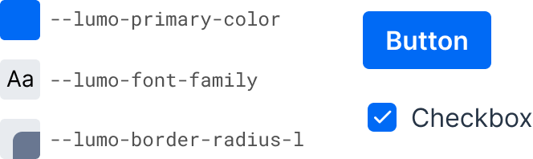

= Lumo Style Properties

Lumo is based on a set of style properties – CSS custom properties – representing colors, fonts, sizes and other styles, that can be customized by providing new values for them in a CSS stylesheet, either globally, or #scoped# to a certain component type or instance.

.A small sample of Lumo style properties and their use in Vaadin components

.Customizing values of Lumo style properties
[source,css]
----
html {
  --lumo-primary-color: green;
  --lumo-font-family: 'Roboto';
}
----

Lumo style properties can also be used in CSS instead of hard-coded literal values, through the `var()` function:

.Use of Lumo style properties in custom CSS
[source,css]
----
div {
  border: 1px solid var(--lumo-primary-color);
  border-radius: var(--lumo-border-radius-m);
}
----

The #Styling Vaadin Components# section provides more details on using Lumo properties to modify the look and feel of Vaadin components. The #Styling Other UI Elements# section provides more details on using Lumo properties to style other UI elements.

== Topics

section_outline::[]
