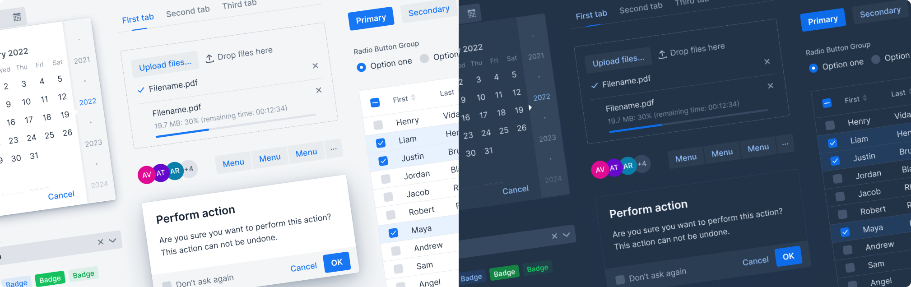

= Lumo Variants

The Lumo theme comes in two color variants: _light_ (default) and _dark_, as well as a _compact_ preset that can be applied simultaneously with the color variants. These are essentially predefined customizations of Lumo's <<lumo-style-properties#, style properties>>.

== Light and Dark Variants

Lumo comes in two built-in color variants: the default light variant, and a dark variant.

The dark variant can be applied statically to the entire UI using the `@Theme` annotation on the class that implements the `AppShellConfigurator` interface:

[source,java]
----
@Theme(variant = Lumo.DARK)
public class Application extends implements AppShellConfigurator {
  ...
}
----

The variant can also be applied only to certain parts of the UI, including individual components, through the ThemeList or Element API, depending on the component:

[source,java]
----
VerticalLayout layout = new VerticalLayout();
layout.getThemeList().add(Lumo.DARK);

Div div = new Div();
div.getElement().setAttribute("theme", Lumo.DARK);
----

In addition to applying the dark variant statically, applications can allow the user to switch between the light and dark variants by dynamically applying them to the `UI` class:

[source,java]
----
@Route("")
public class MainView extends VerticalLayout {

    public MainView() {
        Button toggleButton = new Button("Toggle theme variant", click -> {
            ThemeList themeList = UI.getCurrent().getElement().getThemeList(); 

            if (themeList.contains(Lumo.DARK)) { 
                themeList.remove(Lumo.DARK);
            } else {
                themeList.add(Lumo.DARK);
            }
        });

        add(toggleButton);
    }
}
----

The dark variant can also be https://cookbook.vaadin.com/os-light-dark-theme[applied automatically based on the operating system's light/dark mode setting]. It’s exposed to the browser through the `prefers-color-scheme` CSS feature.

== Compact Preset

Lumo also has a compact preset that applies reduced sizing to fonts and all Vaadin components. It is applied by loading an additional JavaScript module containing a modified set of Lumo sizing properties:

[source,java]
----
@JsModule("@vaadin/vaadin-lumo-styles/presets/compact.js")
public class MainLayout extends VerticalLayout { 
  ...
}
----
