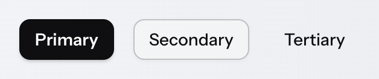
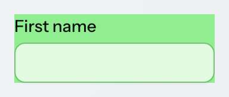
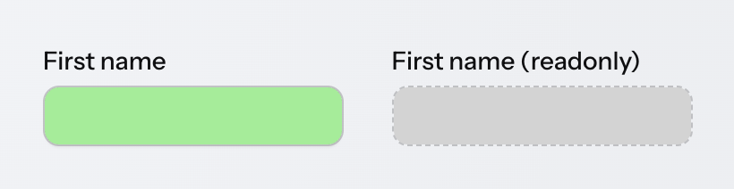

= Styling Vaadin Components

There are two primary ways to style Vaadin components:

* *Style properties* built into the components themselves, and into the Aura and Lumo themes. These make it easy to customize component styles without having to figure out the appropriate CSS selectors.
* *CSS style blocks* that consist of a selector that targets a particular element and/or state of the component, and one or more CSS property-value pairs.

Both style properties and CSS style blocks are placed in <<{articles}/styling/stylesheets#,stylesheets>> loaded into the application UI.

[source,css]
----
/* Customizing component styles properties globally */
html {
  --vaadin-button-background: lightgray;
  --vaadin-button-border-color: darkgray;
}

/* Customizing a component part with a style block */
vaadin-app-layout::part(navbar) {
  padding: 0.5em 1em;
}
----

Many Vaadin components also have style variants as built-in features. These can be found in the documentation for each component. They are applied in Flow through the `addThemeVariants` method and in React through the `theme` attribute.

.Button component variants in Aura theme

[.example.show-code]
--
[source,java]
----
<source-info group="Flow"></source-info>
Button button = new Button("Save");
button.addThemeVariants(ButtonVariant.AURA_PRIMARY);
----

[source,tsx]
----
<source-info group="React"></source-info>
<Button theme="primary">Save</Button>
----

--

== Recommended Styling Approach

The following layered approach to styling Vaadin components is recommended to minimize the amount of CSS, avoid breaking components and protect your styling from getting broken in future versions.

*  *Theme*: choose the <<{articles}/styling/themes#,theme>> that is the best match to your desired look and feel for components, or stick to the components’ base styles if neither theme is a good match;
*  *Variant*: check if the component provides a style variant that corresponds (at least partially) to what you’re after;
*  *Style Properties*: customize the component using <<{articles}/styling/styling-components#theme-style-properties,theme>> and/or <<{articles}/styling/styling-components#component-style-properties,component style properties>>;
*  *CSS style blocks*: <<{articles}/styling/styling-components#writing-css-for-vaadin-components,write your own CSS>> (using documented selectors) only once you can’t get further with the above approaches.

The choice between using component style properties or theme style properties depends on whether you want to customize a generic style (e.g. a color, a font or a size) across _all_ Vaadin components, or a specific visual detail of a specific type of component.

== Component Style Properties

Vaadin components provide their own style properties (CSS custom properties) for customizing their look and feel. They are the primary styling API of Vaadin components. Style properties provide an easier way to customize component styles as you don’t need to target specific component parts and states with CSS selectors.

Component style properties are prefixed with `--vaadin-`. Most of these properties are specific to a particular component type, such as `--vaadin-button-background`, but some are shared across multiple component types, like the `--vaadin-input-field-*` properties that are used on all input field components.

Style properties are generally applied to the `html` element at the root of the page, where they apply to all instances of the component within your UI, but you can also scope them to only apply within a certain part of your UI, or individual component instances, by using other selectors, such as CSS class names.

[source,css]
----
/* Globally to all instances */
html {
  --vaadin-button-background: lightgray;
  --vaadin-button-border-color: darkgray;
}

/* Scoped to the App Layout navbar */
vaadin-app-layout::part(navbar) {
  --vaadin-input-field-background: white;
}

/* Scoped to Text Fields with the 'search' classname */
vaadin-text-field.search {
  --vaadin-input-field-border-radius: 3em;
}
----

.CSS Class Names
[NOTE]
CSS class names are identifier-attributes applied to HTML elements in order to scope CSS styling to them. The same class name can be applied to multiple elements, and each element can have multiple class names. They have nothing to do with Java or TypeScript classes.

When the Aura or Lumo theme is used, most component style properties default to values based on theme style properties.

== Theme Style Properties

The <<{articles}/styling/themes#,Aura and Lumo themes>> also provide their own style properties (CSS custom properties) that make them easy to customize. When either theme is loaded, it applies its own values to the component style properties, in most cases based on its own style properties.

// TODO: Link to Aura and Lumo style property reference pages
Aura style properties are prefixed with `--aura-` while Lumo style properties are prefixed with `--lumo-`. The theme style properties are listed on the Aura and Lumo reference pages.

Like component style properties, theme properties are generally applied to the `html` element at the root of the page, where they apply to all instances of the component within your UI, but you can also scope them to only apply within a certain part of your UI, or individual component instances, by using other selectors, such as CSS classnames.

[source,css]
----
/* Globally to all instances */
html {
  --lumo-primary-color: green;
}

/* Scoped to the App Layout navbar */
vaadin-app-layout::part(navbar) {
  --lumo-primary-color: green;
}

/* Scoped to Text Fields with the 'search' classname */
vaadin-text-field.search {
  --lumo-primary-color: green;
}
----

Theme style properties can also be used to style HTML elements and layouts, to achieve consistency with component styles, using the CSS `var()` function:

[source,java]
----
var footer = new Footer();
footer.addClassNames("footer");
----

[source,css]
----
.footer {
  background-color: var(--lumo-contrast-20pct);
  font-size: var(--lumo-font-size-s);
}
----

== Writing CSS for Vaadin Components

Vaadin components are more complex than normal html elements, because they are made up of many individual elements in order to provide various features. Additionally, most of those elements are encapsulated within the component’s link:https://developer.mozilla.org/en-US/docs/Web/API/Web_components/Using_shadow_DOM[shadow DOM], which protects them from being inadvertently affected by external CSS.

As an example, simply setting the `background-color` property of the Text Field component in the same way as you would do on a native HTML `<input>` element does not change the color of the input field surface, but instead applies that color to the entire component’s background, including the label, error message, helper text and the spacing in between:

[source,css]
----
vaadin-text-field {
  background-color: lightgreen;
}
----

.Text Field with incorrectly applied background color

In order to style Vaadin components, you need to know the appropriate CSS selectors for targeting various parts and states within the components.

In the example below, the `::part(input-field)` selector is used to target the input field surface within the component, and the `[readonly]` selector is used to target the component in the read-only state.

[source,css]
----
vaadin-text-field::part(input-field) {
  background-color: lightgreen;
}

vaadin-text-field[readonly]::part(input-field) {
  background-color: lightgrey;
}
----

.Text Field with correctly applied background color

The most common selectors needed to style Vaadin components are listed on the _Styling_ sub-pages in the component documentation (see e.g. <<{articles}/components/text-field/styling#,TextField>>), along with the style properties built into the components.

.Shadow DOM Styling Not Recommended
[NOTE]
In older versions of Vaadin, components were primarily styled by injecting CSS into their shadow DOM using the `themes/<theme-name>/components` folder or, in even older versions, the `themeFor` property of the [classname]`@CssImport` annotation. Although _still supported_, this approach is no longer recommended. All styling documentation, including the reference tables on components’ _Styling_ pages, is based on normal CSS applied to the document scope.

The link:https://web.dev/learn/css/[web.dev CSS tutorial] is a good resource for learning the basics of CSS.

== Styling Component Parts and States

Various types of CSS selectors are used when applying custom CSS to Vaadin components. These can be divided into the parts that comprise the component, and the possible states of component parts.

=== Stylable Parts of Components

The various HTML elements that make up Vaadin components are listed on the Styling tab of each <<{articles}/components#,component documentation>> page. You'll see there four primary types of parts, each of which is associated with a different type of CSS selector.

==== Root Elements

Each Vaadin component has a root HTML element whose name starts with the `vaadin-` prefix, such as `vaadin-button` or `vaadin-combo-box`.

[source,css]
----
vaadin-button {
  background: orange;
}
----

==== Shadow Parts

Shadow parts are elements inside the component's shadow DOM and are styled using the `::part()` selector. As an example, the input surface of a Text Field is styled using the `input-field` shadow part name:

[source,css]
----
vaadin-text-field::part(input-field) {
  background: white;
  border: 1px solid gray;
}
----

Some Vaadin components like <<{articles}/components/grid#,Grid>> provide APIs that allow developers to apply their own part names to shadow parts like table cells based on custom logic.

==== Normal Child Elements

Normal HTML child elements are styled using the `>` selector. As an example, the Checkbox component's label is a `label` element:

[source,css]
----
vaadin-checkbox > label {
  font-weight: bold;
}
----

==== Pseudo-Elements

The pseudo-elements `::before` and `::after` are elements generated with CSS. They are commonly used for font-based icons and highlight effects for states like hover and focus, often on one of the shadow parts rather than the root element. As an example, the Date Picker’s icon is a pseudo-element in the `toggle-button` shadow part, and its required indicator is a pseudo-element on the `required-indicator` shadow part:

[source,css]
----
vaadin-date-picker::part(toggle-button)::before {
  color: blue;
}

vaadin-date-picker::part(required-indicator)::after {
  color: salmon;
}
----

==== Sub-Components

In addition to the above, many components utilize “sub-components” with their own root HTML elements. In many cases, these have their own shadow parts, child elements and pseudo-elements. As an example, the Date Picker’s overlay content renders month and year selectors using `vaadin-month-calendar` and `vaadin-date-picker-year` components. They both contain various shadow parts.

[source,css]
----
vaadin-month-calendar::part(date) {
  font-weight: bold;
}
----

=== Component States

The various states of a Vaadin component are listed on the Styling tab of each <<{articles}/components#,component documentation>> page. There you'll see three types of CSS selectors used for states: state attributes; state part-names; and pseudo classes. They're each described below, as well as how to negate state selectors.

==== State Attributes

Most states of component root elements and their various parts are exposed through state attributes and styled using attribute selectors of the form `component-name[state]`. As an example, disabled Buttons are identified by the `[disabled]` selector:

[source,css]
----
vaadin-button[disabled] {
  background: lightgray;
  color: darkgray;
}
----

State attributes can be combined with part selectors by placing the attribute selector before the part, child or pseudo-element selector:

[source,css]
----
vaadin-text-field[disabled]::part(input-field) {
  border-color: lightgray;
}

vaadin-checkbox[disabled] > label {
  color: gray;
}

vaadin-date-picker[disabled]::part(toggle-button)::before {
  visibility: hidden;
}
----

==== State Part-Names

Some shadow parts have their own states exposed as additional part names. As an example, a disabled date in the Date Picker’s calendar is styled using the part names `date` and `disabled`, combined into the same `::part()` selector:

[source,css]
----
vaadin-month-calendar::part(date disabled) {
  color: red;
}
----

==== Pseudo-Classes

Pseudo-classes are CSS features used for certain native HTML states like hover. They can be combined with any other selector:

[source,css]
----
vaadin-button:hover {
  border-color: blue;
}

vaadin-text-field[disabled]:hover::part(input-field) {
  border-color: red;
}
----

In the example above, the first style block applies a border color to Buttons on hover, and the second applies a red border color to the input surface of disabled Text Fields on hover.

==== Negating or Excluding States

To target the opposite of a state exposed as an attribute or a pseudo-class, the state selector can be wrapped in a `:not()` selector. This is often needed to exclude a particular state from a style block.

[source,css]
----
vaadin-button:not([disabled]) {
  border-color: blue;
}
----

=== Component Style Variants

Many Vaadin components come with built-in *style variants*, listed on the documentation page for each component, that can be used to change the color, size or other visual aspects of individual component instances through the `addThemeVariants` Java API.

.Button component variants in Aura theme

These variants are applied with `theme` attributes on the root elements of components, and can be targeted with CSS attribute selectors, and excluded by wrapping the attribute selector in a `:not()` selector.

[source,css]
----
vaadin-button[theme~="primary"] {
  background-color: orange;
}

vaadin-button:not([theme~="primary"]) {
  color: orange;
}
----

=== Unintentional Overriding of State and Variant Styles

Custom CSS applied to a component can often override state and variant styles built into the component. As an example, the following CSS changes the text color of all Buttons, including the built-in _Primary_ style variant and the _disabled_ state:

[source,css]
----
vaadin-button {
  color: red;
}
----

To only change the text color of enabled buttons using the default style variant, you need to exclude those with the `:not()` selector:

[source,css]
----
/* Selector that excludes disabled and primary buttons */
vaadin-button:not([disabled]):not([theme~="primary"]) {
  color: red;
}
----

== Styling Component Instances

Sometimes you need to apply different styles to specific _instances_ of a component, instead of all components of a particular type. This can be done by applying a CSS class name to the components and using that in your CSS selector, or by scoping the styles to components contained in a particular parent element.

=== Applying CSS to Component Instances

CSS can be scoped to specific component instances by applying CSS class names to the components with the `addClassName` method and adding them to the HTML element selector prefixed with a period, as shown in the example here:

[.example]
--
[source,java]
----
<source-info group="Flow"></source-info>
TextField textField = new TextField();
textField.addClassName("bordered");
----

[source,tsx]
----
<source-info group="React"></source-info>
<TextField className="bordered" />
----

--

[source,css]
----
vaadin-text-field.bordered::part(input-field) {
  background: white;
  border: 1px solid gray;
}
----

.CSS Class Names
[NOTE]
====
CSS class names are identifier-attributes applied to HTML elements in order to scope CSS styling to them. The same class name can be applied to multiple elements, and each element can have multiple class names. They have nothing to do with Java or TypeScript classes.
====

Some components like Grid provide APIs for applying <<parts-and-states#shadow-parts, custom shadow part names>> to their internal elements, instead of class names.

The same approach can be used to scope styles to a particular <<../styling-other-elements#, view or other UI element>>.

.Custom Theme Names Supported, Not Recommended
[NOTE]
====
In previous versions of Vaadin, a different feature called _theme names_ was used to apply identifiers that were also propagated to overlays. This feature is still supported and is used for the built-in style variants in Vaadin components. However, it’s no longer the recommended approach for styling components or their overlays.
====

=== Applying CSS Based on Parent Element

CSS can also be scoped to components based on their parent elements – such as <<{articles}/components/horizontal-layout#,Horizontal Layout>> and <<{articles}/components/vertical-layout#,Vertical Layout>> or <<{articles}/components/html-elements#,HTML elements>> like ``div``s – in which they are placed. This is done by applying a CSS class name to the parent element, and prefixing the selector with it:

[.example]
--
[source,java]
----
<source-info group="Flow"></source-info>
VerticalLayout filterLayout = new VerticalLayout();
filters.addClassName("filter-layout");
TextField nameFilterField = new TextField();
filterLayout.add(nameFilterField);
----

[source,tsx]
----
<source-info group="React"></source-info>
<VerticalLayout className="filter-layout">
  <TextField />
</VerticalLayout>
----

--

[source,css]
----
.filterLayout vaadin-text-field::part(input-field) {
  background: white;
  border: 1px solid gray;
}
----

The parent element can be either the component's nearest parent element or any outer parent element in the element hierarchy. This can be used to apply CSS to components in a specific view in the application, by applying a CSS class name to the view's root layout element, and scoping component CSS blocks to it.
