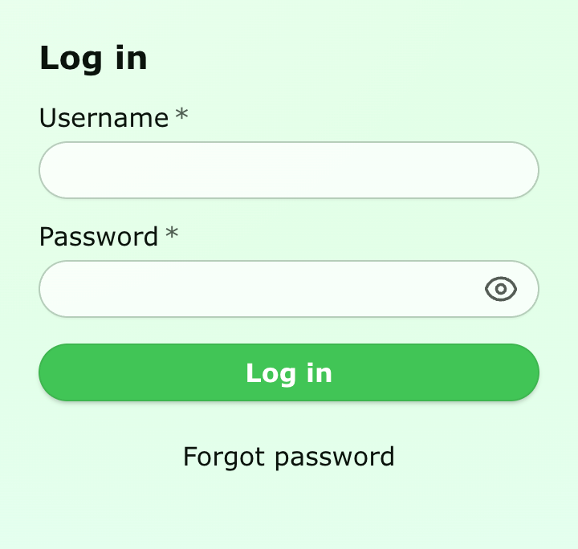
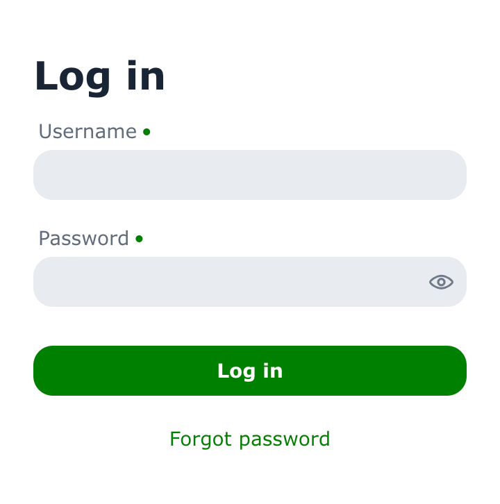

= Themes and Base Styles

By default, Vaadin components are rendered with their minimal _base styles_. These can be a good starting point for creating a custom theme that should look significantly different than either of the two built-in themes.

.Login form using base styles
image::_images/base-styles.png[Login form using base styles, width=50%]

== Aura Theme

Aura is one of the two built-in themes for Vaadin applications. It provides a modern, polished look and feel for all Vaadin components.

.Login form using the Aura theme
image::_images/aura-theme.png[[Login form using the Aura theme, width=50%]

To load the Aura theme in your application, add it with a [annotationname]`@StyleSheet` annotation on your main application class. The [classname]`Aura` class provides a constant for the path to the Aura stylesheet that can be used with the [annotationname]`@StyleSheet` annotation.

[source,java]
----
@StyleSheet(Aura.STYLESHEET)
@StyleSheet("styles.css")
public class Application implements AppShellConfigurator {
 ...
}
----

Note that themes should always be loaded _before_ any other styles in your application.

// TODO: Link "Aura style property reference" when available
Aura includes a comprehensive set of style properties (custom CSS properties) that can be used to customize it without writing complicated CSS selectors. See the Aura style property reference for a complete list.

.Login form using customized Aura theme

[source,css]
----
html {
  --aura-background-color-light: #e3ffe8;
  --aura-font-family: Verdana;
  --aura-base-font-size: 16;
  --aura-base-radius: 10;
}

vaadin-button {
  --aura-accent-color: #42C556;
}
----

== Lumo Theme

Lumo is the original Vaadin theme.

.Login form using the Lumo theme
image::_images/lumo-theme.png[Login form using the Lumo theme, width=50%]

To load the Lumo theme in your application, add it with a [annotationname]`@StyleSheet` annotation on your main application class. The [classname]`Lumo` class provides a constant for the path to the Lumo stylesheet that can be used with the [annotationname]`@StyleSheet` annotation.

[source,java]
----
@StyleSheet(Lumo.STYLESHEET)
@StyleSheet("styles.css")
public class Application implements AppShellConfigurator {
 ...
}
----

Note that themes should always be loaded _before_ any other styles in your application.

// TODO: Link "Lumo style property reference" when available
Lumo includes a comprehensive set of style properties (custom CSS properties) that can be used to customize it without writing complicated CSS selectors. See the Lumo style property reference for a complete list.

.Login form using customized Lumo theme

[source,css]
----
html {
  --lumo-primary-color: green;
  --lumo-primary-text-color: green;
  --lumo-font-family: Verdana;
  --lumo-font-size-m: 14px;
  --lumo-border-radius-m: 1em;
}
----

The <<{articles}/styling/utility-classes#lumo-utility-classes, Lumo Utility Classes>>, when enabled, can be used together with the Lumo theme.

== Color Schemes

Both Aura and Lumo support a light and dark color scheme. By default, the light color scheme is used. You can configure a different color scheme for the application by adding the [annotationname]`ColorScheme` annotation to your main application class.

[source,java]
----
@ColorScheme(ColorScheme.Value.DARK)
public class Application implements AppShellConfigurator {
    ...
}
----

The color scheme enum supports the following values:

* `ColorScheme.Value.LIGHT`: Always use the light color scheme.
* `ColorScheme.Value.DARK`: Always use the dark color scheme.
* `ColorScheme.Value.LIGHT_DARK`: Use the light or dark color scheme based on the user’s OS or browser settings, with a preference for the light color scheme. Only supported by the Aura theme.
* `ColorScheme.Value.DARK_LIGHT`: Use the dark or light color scheme based on the user’s OS or browser settings, with a preference for the dark color scheme. Only supported by the Aura theme.

The color scheme can be changed dynamically at runtime using the [methodname]`Page.setColorScheme(ColorScheme.Value)` method.

[source,java]
----
UI.getCurrentOrThrow().getPage().setColorScheme(ColorScheme.Value.DARK);
----

[discussion-id]`6a974a47-d137-4d97-847c-80be46f011df`
