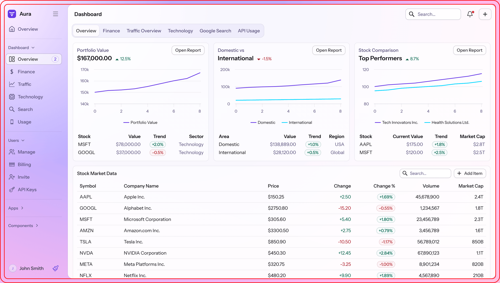
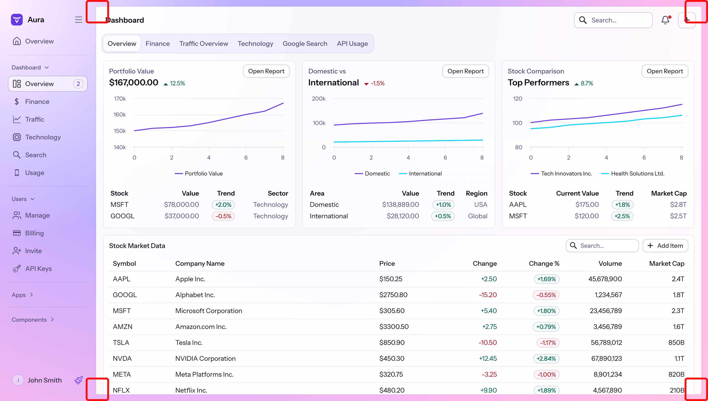

= Aura App Layout

Aura offers customization options how the App Layout component renders the main content area.

.Always use a unit when setting these property values to zero.
[NOTE]
These properties are used in CSS `calc()` functions and require a unit when setting the value to zero, e.g., `0px`.

== Inset

`--aura-app-layout-inset`::
A length value that defines how much the navigation and content areas are inset within the browser viewport. You can set it to zero if you want to maximize the space that is available for the UI.
+
The inset is set to zero automatically once the browser viewport is below 800px width or 600px height.

.Customizing the App Layout inset.
[example]
====
By default, the navigation and content is slightly inset from the edge of the browser viewport (indicated by the red outlines).

[.device]

When the inset is zero, the navigation and content areas take all the space within the browser viewport.

[source,css]
----
html {
  --aura-app-layout-inset: 0px;
}
----

[.device]
image::_images/app-layout-inset2.png[]
====

== Border

`--aura-app-layout-border-radius`::
Sets the border radius of the content area within the App Layout component. Effective only if `--aura-app-layout-inset` is not zero. Default is the <<../base#radius,base style L size border radius>>.

`--aura-app-layout-border-width`::
The border width around the App Layout content area.

.Customizing the App Layout border radius.
[example]
====
[source,css]
----
html {
  --aura-app-layout-radius: 5px;
}
----

[.device]

====
