= Aura Color

Aura defines a set of color properties that define the look and feel of Vaadin components and allow for easy customization of the theme. They can also be used to style custom UI compositions.

As Aura is applied on top of Vaadin base styles, all base style properties (prefixed with `--vaadin-`) can also be used together with Aura.

== Light & Dark Color Schemes

Aura includes two color schemes: light and dark. By default only the light scheme is used. You can configure your application to use the dark scheme or to switch dynamically between light and dark schemes based on user preference.

The `color-scheme` CSS property is used to configure the application to use the light or dark scheme, or to switch automatically based on the operating system's settings as follows:

- `color-scheme: light;` – only the light scheme is used (default).
- `color-scheme: dark;` – only the dark scheme is used.
- `color-scheme: light dark;` – the operating system's settings decide the scheme.

.The global color scheme is either light or dark, depending on the operating system preference.
[example]
====
[source,css]
----
html {
  /* Follow the user's operating system preference, also known as "auto" or "system" */
  color-scheme: light dark;
}
----

[.device]

====

You can also apply this setting <</styling/themes#color-schemes,statically or dynamically in Flow>> through the `@ColorScheme` annotation and the `Page::setColorScheme()` API.

Correct use of Aura color properties ensures that appropriate colors are used for the active color scheme, but any other color values you use should be tested manually in both schemes.

=== Scoped Color Scheme

Typically the same color scheme is applied globally to the entire UI, but Aura also allows you to apply a different color scheme to notifications and to the App Layout's content area, where most of your UI is rendered. This allows, for example, to always use the dark color scheme for the main navigation area while allowing the content/view area to follow the operating system's setting.

[.property-table]
`--aura-content-color-scheme`::
Applies a separate color scheme to the content area of App Layout. The App Layout drawer and navbar use the global color-scheme property. Has no effect if App Layout is not used.

`--aura-notification-color-scheme`::
Applies a separate color scheme to all Notifications.

.Use a different color scheme for the navigation and main content areas.
[example]
====
[source,css]
----
html {
  /* Use the dark color scheme for the global navigation areas */
  color-scheme: dark;
  /* Follow the user's OS preference in the content area */
  --aura-content-color-scheme: light dark;
}
----

[.device]

====

.Changing the color scheme on all components and elements in the application isn't supported.
[CAUTION]
Applying the `color-scheme` property is only supported on a limited set of components and elements. You can view the link:https://github.com/vaadin/web-components/blob/c8681c44ee581fe51958ca1ae306e8f0d55c6353/packages/aura/src/color.css#L57-L93[list of supported CSS selectors].

=== Ensuring Compatibility with Both Light & Dark Schemes

To ensure that any custom styling you apply to the UI works in the applied color scheme:

- Use the `-light` and `-dark` suffixed properties, like `--aura-background-color-light` and `--aura-background-color-dark` to _customize_ that color.
- Use Aura color properties without the `-light` or `-dark` suffix, such as `--aura-background-color`, when _applying_ color values to UI elements.

[source,css]
----
/* Use light/dark-suffixed properties for customization */
html {
  --aura-accent-color-light: #ffd06b;
  --aura-accent-color-dark: #1b0f38;
}

/* Use un-suffixed properties as values */
.some-ui-element {
  background-color: var(--aura-accent-color);
}
----

Any other color values you use won't automatically adapt to the color scheme, unless you provide separate values for each using the `light-dark()` CSS function:

[source,css]
----
.some-ui-element {
  background-color: light-dark(white, black);
}
----

[[light-dark-function]]
.Customizing light-dark() Colors
[IMPORTANT]
====
Aura defines properties marked with the [.badge.light-dark]#light-dark()# badge by using the native CSS `light-dark()` function. That function allows you to define a color that adapts to the active color scheme, by providing one color value for each color scheme. In Aura, the light and dark color values for these properties are calculated based on other color properties.

These properties are considered read-only, similarly as properties marked with the xref:./#read-only-properties[Read-only,role=badge] badge. Technically, you can override these read-only properties, but then it's your responsibility to make sure all color combinations meet contrast requirements in both light and dark color schemes.
====

== Background Color

.Surface Color
[TIP]
In addition to the style properties listed here, Aura defines many background colors with the <<#surface-color,surface color>>.

[.property-table]
`--aura-app-background` xref:#light-dark-function[light-dark(),role="badge light-dark"]::
The main background image, used for the `<html>` element and the App Layout content area. By default this is a computed gradient, based on the `--aura-background-color` property, which becomes more prominent with more saturated background colors. You can set it to a solid color as well.

`--aura-background-color` xref:#light-dark-function[light-dark(),role="badge light-dark"]::
The primary background color that defines the overall tone of the application. This color is used to compute <<#text-color,text>>, <<#border-color,border>>, and <<#surface-color,surface>> colors. Automatically assigned the value of the `-light` or `-dark` suffixed property, depending on the active color scheme.

`--aura-background-color-light`::
The primary background color of the application for the light color scheme.

`--aura-background-color-dark`::
The primary background color of the application for the dark color scheme.

`--vaadin-background-container` xref:#light-dark-function[light-dark(),role="badge light-dark"]::
Background for “containers”, buttons, toolbars, notifications, and other highlighted content areas. By default computed from `--aura-background-color` and `--aura-contrast-level`. Use this color if you want a darker background in the light color scheme and a lighter color in the dark color scheme.

`--vaadin-background-container-strong` xref:#light-dark-function[light-dark(),role="badge light-dark"]::
A more prominent variant of the `--vaadin-background-container` color.

.Using custom and highly saturated background colors, making the gradient background more prominent
[example]
====
In the following example, a dark blue color is used for the dark color scheme in the global/navigation areas and a bright yellow for the light color scheme in the content area.
[source,css]
----
html {
  --aura-background-color-light: khaki;
  --aura-background-color-dark: darkslateblue;

  /* Set the main color scheme to dark */
  color-scheme: dark;

  /* Set the color scheme of the AppLayout content area to light */
  --aura-content-color-scheme: light;
}
----

[.device]

====

[[text-color]]
== Text Color

Aura uses the `--vaadin`-prefixed <<../base#text-color,base style text properties>> by assigning its own computed, color-scheme-adapted values to them. Aura also defines a text color that is tinted with the <<#accent-color,accent color>> as well as text colors for each of the <<#palette,palette colors>>.

[.property-table]
`--vaadin-text-color` xref:#light-dark-function[light-dark(),role="badge light-dark"]::
The main text color used in the UI. Defaults to the <<#neutral-color,neutral color>>.

`--vaadin-text-color-secondary` xref:#light-dark-function[light-dark(),role="badge light-dark"]::
A secondary text color, with at least 4.5:1 contrast ratio with the main background color. Computed from `--vaadin-text-color` by default.

`--vaadin-text-color-disabled` xref:#light-dark-function[light-dark(),role="badge light-dark"]::
Text color for disabled text. Computed from `--vaadin-text-color` by default.

`--aura-accent-text-color` xref:#light-dark-function[light-dark(),role="badge light-dark"]::
A text color derived from the accent color, with at least 4.5:1 contrast ratio with `--aura-background-color`.

`--aura-accent-text-color-light`::
The accent text color for the light color scheme. Computed from `--aura-accent-color-light` by default. If you use a custom color, make sure it has at least 4.5:1 contrast with the background color.

`--aura-accent-text-color-dark`::
The accent text color for the dark color scheme. Computed from `--aura-accent-color-dark` by default. If you use a custom color, make sure it has at least 4.5:1 contrast with the background color.

`--aura-*-text`::
See <<#saturated-palette,saturated palette colors>>.

[[border-color]]
== Border Color

Aura uses the `--vaadin`-prefixed <<../base#border-color,base border properties>> by assigning its own computed, color-scheme-adapted values to them, but also provides its own <<#accent-color,accent>> border color.

Border colors are by default computed based on other color properties and the <<#contrast,contrast>> level. The most common way to customize border colors is to adjust the contrast level.

[.property-table]
`--aura-accent-border-color` xref:#light-dark-function[light-dark(),role="badge light-dark"]::
A border color that is slightly tinted with the <<#accent-color,accent color>>, designed to be paired together with the `--aura-accent-surface` color.

`--vaadin-border-color` xref:#light-dark-function[light-dark(),role="badge light-dark"]::
A high-contrast border color. By default computed from `--aura-background-color` and `--aura-contrast-level` in Aura.

`--vaadin-border-color-secondary` xref:#light-dark-function[light-dark(),role="badge light-dark"]::
A low-contrast border color. By default computed from `--aura-background-color` and `--aura-contrast-level` in Aura.

== Contrast

All text and border colors in Aura are by default computed based on the customizable `--aura-contrast-level` property. This is an efficient way to adjust the overall color contrast in your UI.

[.property-table]
`--aura-contrast-level`::
Increase or decrease the contrast of the computed text and border colors with this property. Reasonable values range between `0` and `5`. The default value is `1`.

.Increase the contrast level to make text and border colors stronger.
[example]
====
[source,css]
----
html {
  --aura-contrast-level: 5;
}
----

.The screenshot on the left uses contrast level 0, while the screenshot on the right uses contrast level 5.

====

.Use caution when using low contrast levels.
[CAUTION]
The default Aura colors are evaluated to meet WCAG 2.1 color contrast requirements. Make sure to evaluate the color contrast manually when using a contrast level lower than the default.

If you explicitly override any text or border color properties the `--aura-contrast-level` property no longer affects them, unless you use it in your own computed colors.

== Palette

Aura offers a palette of seven colors: **neutral**, **red**, **orange**, **yellow**, **green**, **blue**, and **purple**.

[[neutral-color]]
=== Neutral Color (Grayscale)

The neutral color, which is computed from the `--aura-background-color-light` and `--aura-background-color-dark` properties by default, is used for the <<#text-color,text>> and <<#border-color,border>> colors.

[.property-table]
`--aura-neutral` xref:#light-dark-function[light-dark(),role="badge light-dark"]::
Automatically assigned the value of the `-light` or `-dark` suffixed property, depending on the active color scheme.

`--aura-neutral-light`::
A dark gray by default.

`--aura-neutral-dark`::
White by default.

[[saturated-palette]]
=== Saturated Colors

These saturated palette colors are meant to be used as <<#accent-color,accent>> colors, for example, with the <</components/badge#,Badge>> component together with the <<#accent-color-class-names,accent color class names>>. You can override the palette with custom colors, for example, from your brand guidelines.

Each color has a corresponding text color property that provides appropriate <<#contrast,contrast>> against the background.

[%header]
|===
|Generic Color | Text Color
|`--aura-red` | `--aura-red-text` xref:#light-dark-function[light-dark(),role="badge light-dark"]
|`--aura-orange` | `--aura-orange-text` xref:#light-dark-function[light-dark(),role="badge light-dark"]
|`--aura-yellow` | `--aura-yellow-text` xref:#light-dark-function[light-dark(),role="badge light-dark"]
|`--aura-green` | `--aura-green-text` xref:#light-dark-function[light-dark(),role="badge light-dark"]
|`--aura-blue` | `--aura-blue-text` xref:#light-dark-function[light-dark(),role="badge light-dark"]
|`--aura-purple` | `--aura-purple-text` xref:#light-dark-function[light-dark(),role="badge light-dark"]
|===

=== Custom Brightness or Opacity Variants

Aura doesn't offer traditional color scales that many design systems include, where you have 10 to 12 colors per hue ranging from almost white to almost black, commonly named from 50/100 to 900, or as `10pct` to `90pct` in the Lumo theme.

The Aura palette consists of single saturated color values, from which all necessary variations of that color are computed automatically (the text, border, and surface/background variants). If you need more than what Aura and the <<../base#,base styles>> offer out of the box, you can use the native CSS https://developer.mozilla.org/en-US/docs/Web/CSS/Reference/Values/color_value/color-mix[`color-mix()`] and https://developer.mozilla.org/en-US/docs/Web/CSS/Guides/Colors/Using_relative_colors[relative color functions] to compute more color properties.

.Example: Computing color variants based on the `--aura-red` property
[example]
====
[source,css]
----
html {
  /* A variant of --aura-red mixed with 20% --aura-background-color */
  --aura-red-light: color-mix(in srgb, var(--aura-red) 80%, var(--aura-background-color));

  /* A variant of --aura-red with 20% opacity */
  --aura-red-20pct: color-mix(in srgb, var(--aura-red) 20%, transparent);
}
----
====

== Accent Color

The accent color is used to highlight certain UI parts and states, such as buttons, selections, and keyboard focus (similarly to the primary color in the Lumo theme).

[.property-table]
`--aura-accent-color` xref:#light-dark-function[light-dark(),role="badge light-dark"]::
Automatically assigned the value of the `-light` or `-dark` suffixed property, depending on the active color scheme.

`--aura-accent-color-light`::
The accent color for the light color scheme. The default is `var(--aura-blue)`.

`--aura-accent-color-dark`::
The accent color for the dark color scheme. The default is `var(--aura-blue)`.

`--aura-accent-contrast-color` xref:#light-dark-function[light-dark(),role="badge light-dark"]::
A color that provides strong contrast against the `--aura-accent-color`, for example, button label color when the button background uses the accent color. The default contrast color is either white or a semi-transparent black, depending on the lightness of the accent color.

`--aura-accent-contrast-color-light`::
The accent contrast color for the light color scheme.

`--aura-accent-contrast-color-dark`::
The accent contrast color for the dark color scheme.

.Define accent colors for the light and dark color schemes
[example]
====
[source,css]
----
/* You can apply different colors for light and dark color schemes */
html {
  --aura-accent-color-light: var(--aura-orange);
  --aura-accent-color-dark: var(--aura-purple);
}
----

.Using the orange accent color in the light color scheme and the purple accent color in the dark color scheme
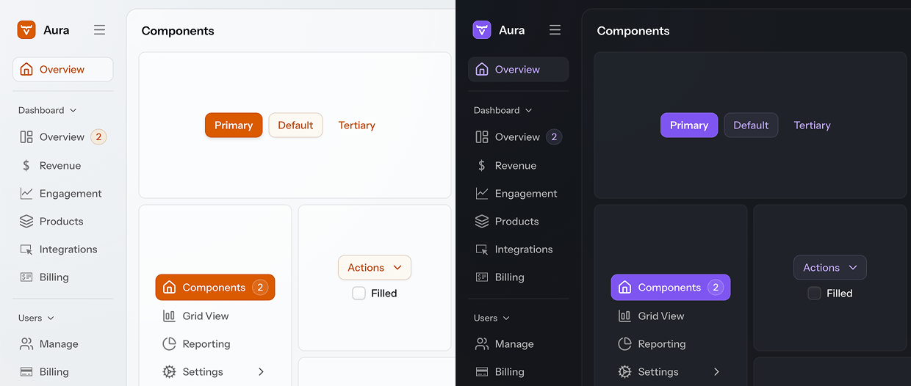
====

=== Accent Color Class Names

The accent color is applied globally to the entire UI, but you can also scope it to individual elements.

Aura provides the following CSS utility classes, based on the <<#saturated-palette,saturated color palette>>, that you can apply to any part of the UI to give it a different accent color:

- `aura-accent-neutral`
- `aura-accent-red`
- `aura-accent-orange`
- `aura-accent-yellow`
- `aura-accent-green`
- `aura-accent-blue`
- `aura-accent-purple`

.Use the purple palette color as the accent color of a button
[example]
====
[.example]
--
[source,java]
----
<source-info group="Java"></source-info>
var button = new Button("Generate with AI");
button.addClassNames("aura-accent-purple");
----
[source,html]
----
<source-info group="HTML"></source-info>
<vaadin-button class="aura-accent-purple">Generate with AI</vaadin-button>
----
--
====

Furthermore, you can use the `aura-accent-color` class name to reset the accent color back to global accent color, for example, if a parent container has applied another accent color.

== Surface Color

The Aura surface color can be used to make UI elements lighter or darker than the <<#background-color, page background color>>. The surface color can be used to make parts of the UI look "elevated" over the background or "recessed" into it. It's based on the `--aura-background-color` property.

You can apply the surface color either with the `aura-surface` class name or with the `--aura-surface-color` style property in CSS:

.Applying the surface color to a component
[example]
====
[.example]
--
[source,java]
----
<source-info group="Java"></source-info>
var box = new Div();
box.setWidth("300px");
box.setHeight("150px");
box.addClassNames("aura-surface");
// Border styles are omitted
----

.styles.css
[source,css]
----
<source-info group="CSS"></source-info>
/* In Java:
var box = new Div();
box.addClassNames("elevated-box");
*/

.elevated-box {
  background-color: var(--aura-surface-color);
  /* Border styles are omitted */
}
----
--

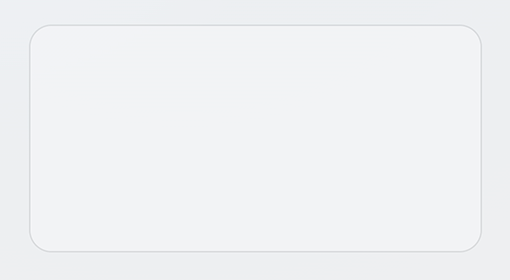
====

=== Surface Level (Brightness)

The brightness of the surface color is controlled by the `--aura-surface-level` property – a number that defaults to 1, which creates a brighter or "elevated" surface. Negative numbers create a darker or "recessed" surface. Level 0 is essentially the same color as `--aura-background-color`.

The surface color turns to pure white (with positive levels) or to pure black (with negative levels) after a certain level, depending on `--aura-background-color`.

.Surface colors for levels from -1 to 4, in both light and dark color schemes.
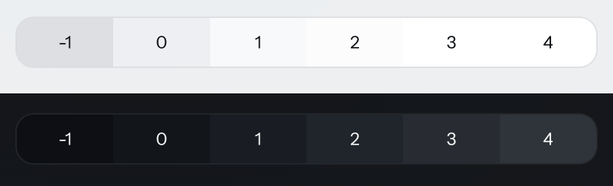

To make the surface look "recessed" (darker), you can set the level, for example, to -1, either in a stylesheet or with an inline style. The number can be any integer or decimal.

.Use the Surface Color Class Names
[IMPORTANT]
You need to use the `aura-surface` or `aura-surface-solid` class name if you want to change the `--aura-surface-level` property. Changing it on other elements doesn't work.

.Setting the surface level on a component
[example]
====
[source,java]
----
var box = new Div();
box.addClassNames("aura-surface", "recessed-box");
----

You can choose to set the surface level with either inline styles in Java, or with CSS in a stylesheet:

[.example]
--
[source,java]
----
<source-info group="Java"></source-info>
box.getStyle().set("--aura-surface-level", "-1");
// Border styles are omitted
----

.styles.css
[source,css]
----
<source-info group="CSS"></source-info>
.recessed-box {
  --aura-surface-level: -1;
  /* Border styles are omitted */
}
----
--

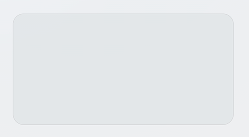
====

.Surface level is inherited by child elements.
[NOTE]
Any child element to which the Aura surface color is applied inherits the surface level of its parent. You can override that by applying a different surface level on the child element.

=== Accent Surface

A more colorful variant of the surface color can be achieved with the `--aura-accent-surface` property, which blends the surface color with the <<#accent-color,accent color>>.

.Applying the accent surface color to a component
[example]
====
[source,java]
----
var box = new Div();
box.addClassNames("aura-surface", "elevated-box");
----

.styles.css
[source,css]
----
.elevated-box {
  background-color: var(--aura-accent-surface);
}
----

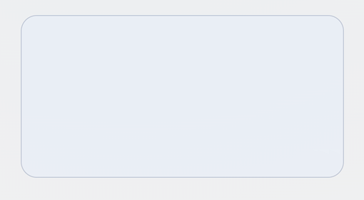
====

You can change the color blended into the surface color by overriding the accent color for the element, either in CSS or using one of the accent color class names.

.Use the Accent Color Class Names
[IMPORTANT]
You need to use one of the <<#accent-color-class-names,accent color class names>> if you want to change the accent color of a surface. Changing it on other elements doesn't work.

.Using a different accent color to tint the surface color
[example]
====
[source,java]
----
var box = new Div();
box.addClassNames("aura-accent-orange", "aura-surface", "elevated-box");
----

.styles.css
[source,css]
----
.elevated-box {
  background-color: var(--aura-accent-surface);
}
----

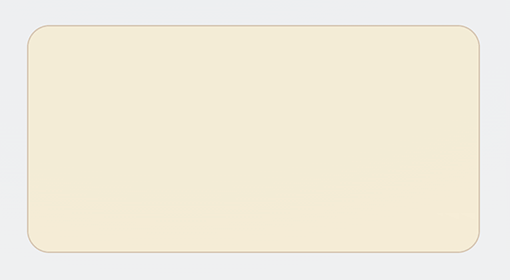
====

The accent surface color can be adjusted with the level and opacity properties the same as the regular surface color.

.Accent surface colors for levels from -1 to 4, in both light and dark color schemes.
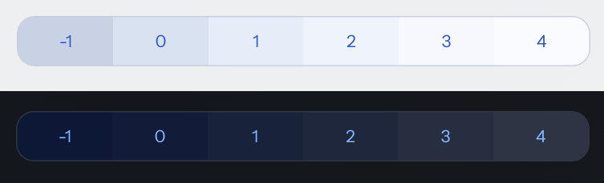

=== Surface Opacity

By default, the Aura surface color is semi-transparent, to achieve a brighter or darker surface on top of _any_ background color.

The surface opacity is controlled by the `--aura-surface-opacity` property, which defaults to 0.5 (i.e., 50% opacity). You can set it to any value between 0 (fully transparent) and 1 (fully opaque).

The surface's opaqueness naturally affects its brightening or darkening effect over the background, and the extent to which it blends with the background color.

.Use the Surface Color Class Names
[IMPORTANT]
You need to use the `aura-surface` or `aura-surface-solid` class name if you want to change the `--aura-surface-opacity` property. Changing it on other elements doesn't work.

.Changing the surface opacity on a container that uses the surface color
[example]
====
[source,java]
----
var box = new Div();
box.addClassNames("aura-surface", "elevated-box");
----

You can choose to set the opacity with either inline styles in Java, or with CSS in a stylesheet:
[.example]
--
[source,java]
----
<source-info group="Java"></source-info>
box.getStyle().set("--aura-surface-opacity", "0.8");
----

.styles.css
[source,css]
----
<source-info group="CSS"></source-info>
.elevated-box {
  --aura-surface-opacity: 0.8;
}
----
--

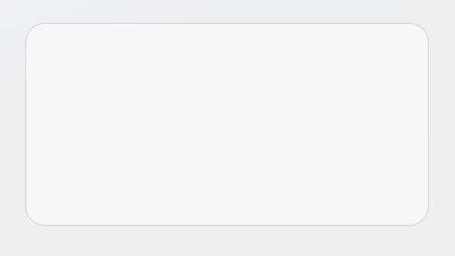
====

A fully opaque surface color can also be applied with the `aura-surface-solid` class name:

.Using the solid surface color on a generic container
[example]
====
[source,java]
----
box.addClassNames("aura-surface-solid");
----

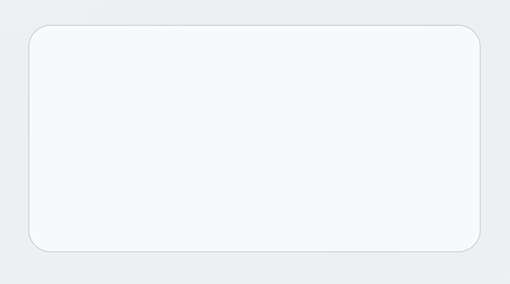
====

=== Surface Colors in Vaadin Components

Many Vaadin components use the surface color by default when using the Aura theme. You can change the brightness and opacity of the surface color used in these components by overriding the `--aura-surface-level` and `--aura-surface-opacity` properties in CSS, using the selectors listed here.

|===
| Component or Part | CSS Selector

| Buttons
| `vaadin-button` +
`vaadin-upload-button` +
`vaadin-menu-bar-button` +
`vaadin-drawer-toggle`
| Text input fields
| `::part(input-field)`
| Checkboxes
| `vaadin-checkbox::part(checkbox)`
| Radio buttons
| `vaadin-radio-button::part(radio)`
| Slider and Range Slider
| `vaadin-slider, vaadin-range-slider`
| Tabs
| `vaadin-tab`
| Cards
| `vaadin-card`
| Dashboard widgets
| `vaadin-dashboard-widget`
| Dialogs and other overlays
| `::part(overlay)`
| Filled Accordion panels
| `vaadin-accordion-panel[theme~='filled']`
| Filled Details
| `vaadin-details[theme~='filled']`
| Message attachments
| `vaadin-message::part(attachment)`
| Upload
| `vaadin-upload`
| Upload thumbnail chips
| `vaadin-upload-file`
| Grid
| `vaadin-grid`
| The detail area in Master-Detail Layout
| `vaadin-master-detail-layout::part(detail)`
| Side Navigation items
| `vaadin-side-nav-item::part(content)`
| App Layout's navbar
| `vaadin-app-layout::part(navbar)`
| App Layout's drawer
| `vaadin-app-layout::part(drawer)`
|===

.Change the surface color of buttons and input fields
[example]
====
[source,css]
----
/* Make buttons dark instead of light: */
vaadin-button {
  --aura-surface-level: 0;
}

/* Make input fields more transparent: */
::part(input-field) {
  --aura-surface-opacity: 0.25;
}
----

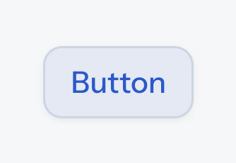
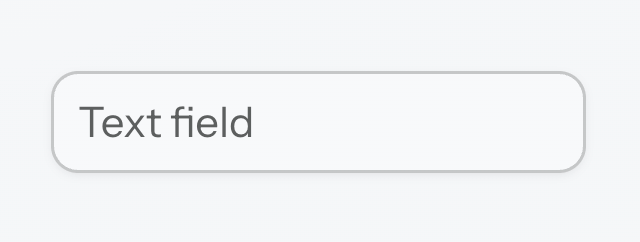
====

=== Surface Style Property Reference

[.property-table]
`--aura-surface-color` xref:./#read-only-properties[Read-only,role=badge]::
A computed color that you can apply to an element to give it elevation. The color is computed based on the `--aura-background-color` property. The final value of the computed color depends on the effective values of the `--aura-surface-level` and `--aura-surface-opacity` properties.

`--aura-surface-color-solid` xref:./#read-only-properties[Read-only,role=badge]::
An opaque version of the effective surface color. Essentially the same as if `--aura-surface-opacity` was `1`. Useful for situations when a semi-transparent color is not suitable (e.g., when a surface needs to fully cover something).

`--aura-accent-surface` xref:./#read-only-properties[Read-only,role=badge]::
A surface color that is tinted with the effective <<#accent-color,accent color>>.

`--aura-surface-level`::
The “elevation level” of the computed surface color. Can be any fractional number, positive, or negative. The default is `1`. The level is inherited by nested surfaces.
+
With the light color scheme, levels 3–4 usually result in a white color, depending on the lightness of `--aura-background-color-light`.
+
With the dark color scheme, level 8 starts to be an upper limit, after which text colors are likely to not have enough <<#contrast,contrast>> (depending on the surface opacity).

`--aura-surface-opacity`::
The transparency of the computed surface color. The default is `0.5`, and each surface resets its opacity to this value unless explicitly overridden. Transparency allows you to nest the same surface color on top of each other to create more sense of elevation.
